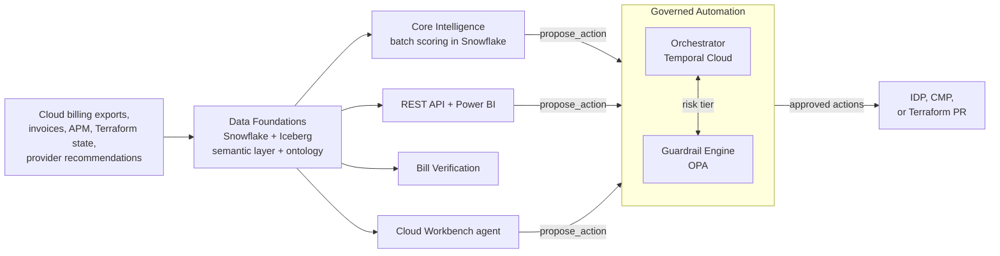

# FinOps Architecture Brief

| | |
|---|---|
| **Status** | Draft, unvalidated |
| **Author** | Matt Nestman |
| **Last updated** | 2026-09-17 |
| **Audience** | Hiring panel, architects, and engineering leads who want the design in a few pages |

This brief summarizes the full design in [FinOps Solution Overview.md](FinOps%20Solution%20Overview.md) and its sub-documents. Everything here was reconstructed from a job posting and an informal conversation, without insider access. Facts that came from that conversation are labeled as known; everything else is an inference to validate.

---

## 1. The problem

The organization runs a mature FinOps practice on thin tooling. What exists today:

- **Strong discipline.** High tagging coverage, an APM ID on nearly all resources that Security and GRC also use, true chargeback, staggered 1- and 3-year commitments, and a top-quartile maturity assessment from a cloud provider.
- **A monthly batch pipeline.** Billing files are pulled by PowerShell into an on-prem SQL Server, reconciled by stored procedures, and reported in Power BI. It can recommend, but not act.
- **A small central team.** The team lead spends about half their time on operational work: stakeholder follow-ups, commitment planning, and PO handling.

Three constraints shape the design:

1. **The team lead retires at the end of the year** (known). The lead built the pipeline, so much of its business logic lives only in that code and in the lead's head. Their operational load falls to whoever remains.
2. **Snowflake is the organization's data platform standard** (known), and the organization is consolidating onto it.
3. **The role is one principal engineer**, expected to cover data engineering, ML, APIs, ontology and graph, and agentic AI. The platform has to be buildable and operable by roughly one person, and survive that person moving on.

## 2. What gets built

Five phases, each built on the one before:

| Phase | Capability | Key choices |
|---|---|---|
| 1. Data Foundations | Multi-cloud billing data conformed into one governed platform | Snowflake on open Iceberg tables; FOCUS exports; four explicit cost columns (billed, effective, list, contracted); billing periods replaced as a whole, never upserted; Semantic Views; a versioned RDFS/OWL ontology |
| 2. Core Intelligence and Self-Serve | Anomaly detection, rightsizing, RI/SP planning; REST API and dashboards | Batch scoring inside Snowflake; rightsizing as rules, not a trained model; RI/SP as forecast-then-optimize; provider-native tools as baselines |
| 3. Governed Automation | Low-risk recommendations execute automatically, higher-risk ones wait for people | Temporal Cloud Orchestrator separate from an OPA Guardrail Engine; LOW/MEDIUM/HIGH tiers; signed contracts; dry-run, kill switch, caps, circuit breaker |
| 4. Bill Verification | Invoice checking becomes exception-based | Invoice lines reconciled against billed cost and contract terms; rules first, model only once labels exist |
| 5. Cloud Workbench | A conversational agent for the FinOps team and verticals, plus push/pull and what-if | pydantic-graph with explicit nodes; MCP tools; grounding against the semantic layer and ontology; LLM provider picked per task by an eval bake-off |

**The core idea is one governed harness.** Every proposed action, from a model, the API, the agent, or a what-if scenario, enters through a single `propose_action` call. The Orchestrator runs the workflow and the Guardrail Engine decides risk, so no component both proposes an action and decides whether it is safe. That separation is what makes it reasonable to let LOW-tier actions run unattended.

## 3. Decisions that matter most

| Decision | Why | Where |
|---|---|---|
| Keep four FOCUS cost columns, not one `cost` column | Billed, amortized, list, and contracted cost answer different questions; mixing them is the most common reason numbers don't reconcile | Data Foundations §4.3 |
| Replace whole billing periods on reload | Providers restate full periods, and CUR line item IDs aren't stable across refreshes, so row upserts produce duplicates | Build Specification §2 |
| Verify invoice lines, not daily usage rows | The invoice is what the organization pays; contract terms are checked for application, not re-priced per SKU | Bill Verification §2.1 |
| Rules first wherever labels don't exist | Rightsizing has no ground truth; bill verification has no labeled history. Rules ship now, models earn their way in | MLOps ADR-003; Bill Verification §3.3 |
| RI/SP planning as an optimization | A forecast says what usage might be, not what to buy; a linear program handles utilization floors, staggered expiries, and cash limits | MLOps ADR-006 |
| Beat the free provider tools or use them | AWS, Azure, and GCP already publish recommendations and (AWS) anomalies by API; custom models must beat that baseline | MLOps ADR-007 |
| Batch triggered by file arrival, not an event stream | AWS refreshes billing exports up to daily, Azure data lands 8 to 24 hours behind usage, and GCP gives no latency guarantee. A stream can't be fresher than its source; events are used where the source emits them (approvals, Terraform applies) | Data Foundations ADR-006 |
| Score in Snowflake, not on Kubernetes | All scoring is batch; keeping it next to the data keeps access policies in force and leaves nothing to operate | MLOps ADR-008 |
| Stage the knowledge graph | Today's cost-only ontology is shallow enough for SQL views. A managed graph database arrives when a named trigger is met: the organization's enterprise graph, cross-domain data, or dependency-aware blast radius | Data Foundations ADR-004 |
| Separate orchestration from policy | Temporal handles durable workflow; OPA decides risk and enforces guardrails; neither can override the other | Governed Automation ADR-001, ADR-002 |
| Cap generation spend per tenant, and cache prompts rather than meanings | Generation is the platform's only unbounded per-request cost. Budgets per persona and vertical refuse politely and predictably; a semantic cache would risk serving one vertical's number to another | Cloud Workbench ADR-010 |
| Enforce personas in the agent's graph, not its prompt | Verticals can't call action tools in chat because the tools aren't bound, not because the model was told not to | Cloud Workbench ADR-007 |
| Provider-agnostic LLM interface with an eval bake-off | Azure OpenAI to start; the final model per task is chosen with the same eval set that gates every change | Cloud Workbench ADR-004 |
| Snowflake with a documented exit | The organization's standard; Iceberg tables and a portability table keep a future platform change to re-implementing services, not migrating data | Data Foundations ADR-003 |

## 4. Operating model

The platform is sized for one engineer:

1. **Managed over self-hosted.** No platform-owned Kubernetes cluster, and no self-hosted database, workflow engine, scheduler, or cache.
2. **One of each kind.** One data platform, one scheduler (Snowflake Tasks), one operational database (managed Postgres), one container host (the organization's container platform, CMP), one observability backend (Datadog).
3. **Introduced when first needed.** Temporal arrives with Phase 3; a graph database only on its trigger.
4. **Everything as code.** Terraform, dbt, policies, the ontology, and eval sets are versioned and reviewed.

What the team operates: three containers on CMP (the API and agent service, the Temporal workers with an OPA sidecar, and a Teams approval bot) and the configuration of managed services. CMP's team runs the cluster; the platform owns its workloads' autoscaling (HPA for the API, KEDA on Temporal queue backlog for the workers), restricted pod security, Entra Workload ID with no stored database passwords, and default-deny network policy.

**Testing** follows the same split as the design. Pipelines, OPA policies, Temporal workflows, and the API get conventional tests that gate every merge; models and the agent get eval gates against a baseline; and every cutover is proven in production conditions first, through parallel runs, shadow mode, or dry-run. The legacy pipeline's captured rules are the first test fixtures.

## 5. Rollout

The rollout is ordered by which operational pain it removes, not by architecture layer.

| Wave | Delivers | Relieves |
|---|---|---|
| 0 (before Dec 2026) | Legacy business rules captured as tests with the retiring lead; provider-native alerts and recommendations turned on; toil baseline measured | Knowledge loss; immediate visibility |
| 1 | Current-period data foundation, semantic layer, ontology | Foundation |
| 2 | Repointed reports, a per-vertical "why did my bill change" report, a commitment expiry view, report generation off the legacy pipeline | Follow-ups, commitment visibility, unmaintained legacy reporting |
| 3 | Historical backfill, RI/SP planner | Commitment planning |
| 4 | API, ontology views, read-only agent pilot for the FinOps team | Team lookups |
| 5 | Anomaly detection, rightsizing | Proactive analysis |
| 6 | Bill verification (rules, then auto-clear) | PO handling |
| 7 | Governed Automation: guardrails, dry-run, LOW-tier pilot, expansion | Recommendations nobody has time to act on |
| 8 | LLM bake-off, full agent, vertical rollout, push/pull, PO drafting | Follow-ups at scale, PO re-keying |
| 9 | Legacy decommission | Retires the old stack |

## 6. What's still open

### Needs more design work

Known gaps in this design, as distinct from things waiting on the organization's input. A design built without insider access will have more of these, and they surface as assumptions get validated and as the documents get traced against each other. Both below are **additive**: they need a table, an endpoint, a scheduled job, or a metric definition, and neither changes an architecture decision, a phase dependency, or the data model. That is the test worth applying to the next one — whether closing it changes a decision, or only adds a piece.

- **Recommendation delivery and tracking.** The path a recommendation takes when it is automated is designed end to end. The path it takes when it isn't is not, although advisory is the default state of every resource and contracts are opt-in, so that is the majority case. Recommendations have no lifecycle, no recorded delivery event, and no disposition capture, which leaves two declared dependencies with no source: the `historical_recommendation_outcome` ML feature and `metric_recommendation_realization_rate`. Proactive delivery to owning teams also arrives at migration step 31, two waves after rightsizing goes live, which is late for the follow-up load the rollout order is meant to relieve first. The Solution Overview's Capability Map has the five items this needs.
- **Unit economics.** Cost per transaction, service, or customer, on top of the existing rollups. Named as an opportunity, not yet designed.

### Needs the organization

These can't be credibly answered from outside, and the Solution Overview lists how each would be produced:

- **Sizing, platform cost, on-call model, and staffing**: need the organization's data volumes, contract rates, incident process, and budget (Implementation Prerequisites).
- **Hosting and approvals**: whether CMP will host the platform's services and supports the workload features the design assumes, whether the organization already has a graph platform, and whether Temporal Cloud and Neo4j AuraDB pass SaaS security review.
- **Unconfirmed systems**: the ERP/procurement system for POs, the CAB calendar, the ITSM tool, Datadog's role as observability platform of record, and whether a CMDB or service map exists.
- **Iceberg validation**: recovery without Fail-safe on a customer-managed volume, and zero-copy cloning support.

## 7. Where to go next

- [FinOps Solution Overview.md](FinOps%20Solution%20Overview.md): full architecture, capability map, operating model, test strategy, all 33 migration steps, master ADRs.
- [FinOps Current State.md](FinOps%20Current%20State.md) and [FinOps Opportunities.md](FinOps%20Opportunities.md): the starting point and the opportunities.
- [Platform_Build_Specification.md](Platform_Build_Specification.md): tables, jobs, function signatures, and policies for every phase.
- [References.md](References.md): the vendor documentation behind the facts these decisions depend on.
