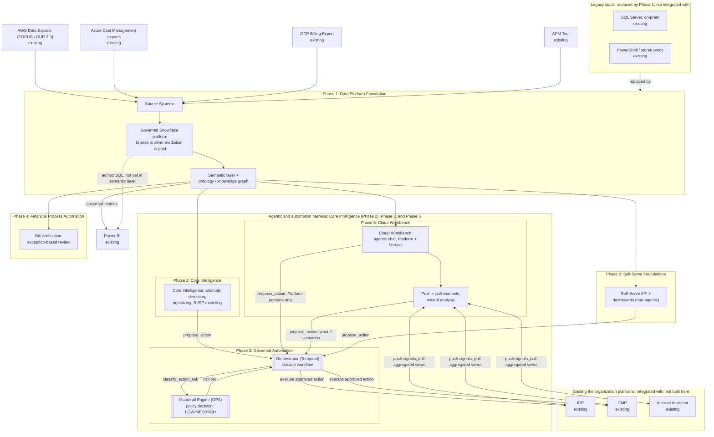

# FinOps Platform: Master Solution Overview

| | |
|---|---|
| **Status** | Draft, unvalidated |
| **Creator** | Matt Nestman |
| **Last updated** | 2026-09-17 |
| **Audience** | Engineering, Product, Architecture stakeholders; hiring/leadership stakeholders evaluating a proposed direction |

## Purpose

This document turns the opportunities in [FinOps Opportunities.md](FinOps%20Opportunities.md) into one solution: what gets built, in what order, and how the pieces fit. It stays high level (components, phasing, architecture at a glance, operating model, and rollout) and leaves detailed design to the sub-documents in the [Sub-Document Index](#sub-document-index).

The same caveat applies as for the rest of the set: it was written from the outside, as an informed synthesis rather than a confirmed plan, and a real timeline and staffing conversation would correct some of it. [FinOps Current State.md](FinOps%20Current%20State.md) explains the method behind the whole set.

For a short version, start with [FinOps Architecture Brief.md](FinOps%20Architecture%20Brief.md). The vendor documentation behind the facts that drive decisions (billing data refresh, provider APIs, Snowflake and Kubernetes capabilities, test tooling) is listed in [References.md](References.md).

---

## Executive Summary

The target state is one governed Snowflake platform (the organization's data platform standard, with data in open Iceberg tables), built in five phases. Every capability (reporting, ML, automation, chat) reads from it as the single source of truth, and it replaces today's SQL Server and PowerShell pipeline instead of integrating with it.

1. **Phase 1, Data Foundations**: conformed multi-cloud billing data, a semantic layer, and an ontology.
2. **Phase 2, Core Intelligence and Self-Serve Foundations**: anomaly detection, rightsizing, and RI/SP planning, which the FinOps team does largely by hand each month today, plus a REST API and Power BI dashboards over the same governed data.
3. **Phase 3, Governed Automation**: the Orchestrator and Guardrail Engine let low-risk recommendations execute automatically within risk tiers and guardrails, instead of waiting in a queue.
4. **Phase 4, Financial Process Automation**: bill verification moves from manual reconciliation to exception-based review.
5. **Phase 5, Cloud Workbench**: a conversational agent over the same data. The FinOps/platform team can ask questions and propose governed actions; business verticals can ask questions ("why did this cost go up") without opening a ticket. Cloud Workbench Expansion adds push (FinOps signals inside IDP, CMP, and Internal Assistant) and pull (a what-if workbench where a vertical models a change before making it, and can submit it as a proposal that Governed Automation handles like any other).

None of this replaces the practice described in [FinOps Current State.md](FinOps%20Current%20State.md). The strong tagging discipline, true chargeback, and the domain knowledge in today's reconciliation logic all carry forward. What changes is the manual work: continuous governed ingestion instead of a monthly batch, models instead of ad hoc analysis, self-serve instead of an inbox, and automatic execution within guardrails instead of recommendations nobody has time to act on.

The platform is designed to be built and run largely by one engineer, because the team lead who built today's pipeline retires in the end of the year (Operating Model). The rollout is ordered by which operational pain it removes first, not by architecture layer (Migration & Cutover Sequence).

---

## Platform-Wide Requirements & Non-Functional Requirements

Requirements that apply to every phase. Phase-specific requirements (query latency, approval SLAs, and so on) are in each sub-document.

### Cross-Cutting Functional Requirements (inferred)

- FR1: Every phase reads from Data Foundations' governed Snowflake platform as the single source of truth; no phase keeps its own copy of conformed cost and usage data.
- FR2: Every automated or AI-generated output (a recommendation, an anomaly flag, a chat answer, an automated action) can be traced to the data it came from.
- FR3: Vertical and account data segregation is enforced the same way on every consumer-facing surface (API, dashboards, Cloud Workbench chat), not reimplemented per surface.

### Cross-Cutting Non-Functional Requirements (inferred)

| Requirement | Target | Rationale |
|---|---|---|
| Data freshness ceiling | Provider billing lag (~24h) | Inherited from Data Foundations; no phase can offer fresher data than its source |
| Auditability | Every output can be reconstructed: what was asked or computed, from what data, by which model or policy version | HITRUST/SOC2-equivalent governance posture across phases |
| Data segregation | Vertical and account isolation enforced at the catalog and query layer and inherited by every consumer | Multi-tenant platform with compliance-sensitive data |
| Platform's own cost | Tracked as rigorously as the cloud spend it analyzes | A FinOps platform that doesn't measure its own cost loses credibility |
| Alerting channels | Every alert (infrastructure, data quality, model quality, execution failure) posts to a Teams channel and opens a ticket or pages on-call in ITSM (believed to be ServiceNow, not confirmed). One shared pair of channels for all phases | Data Foundations §4.5's shared observability baseline; consistent incident response whichever phase raised the alert |

### Cross-Cutting Non-Goals (inferred)

- No real-time (sub-minute) billing reconciliation anywhere, because of the provider billing-lag ceiling.
- No replacing human judgment on high-blast-radius or high-dollar decisions, in infrastructure automation (Phase 3) or financial reconciliation (Phase 4).

---

## Solution Overview

The solution has five phases, each building on the data and governance foundation from the phases before it.

The diagram also shows where the platform meets the organization's **existing systems**. Four data sources feed Phase 1 from outside the platform; three existing the organization platforms (IDP, CMP, and Internal Assistant) are integrated with, not designed here; and the legacy stack being replaced is shown explicitly, because this is a modernization, not a greenfield build.

**Naming: Cloud Workbench.** "Cloud Workbench" is this document set's name for the agentic self-serve product in Phase 5 (chat, plus push/pull channels and what-if analysis). It is intentionally different from the organization's existing "Internal Assistant," shown above; the naming note in [Solution_Architecture_Cloud_Workbench.md](Solution_Architecture_Cloud_Workbench.md) explains why.

**Naming: Orchestrator and Guardrail Engine.** The two double-bordered boxes in Phase 3 are what Governed Automation designs, drawn separately because they are different components. The **Orchestrator** (Temporal) runs the durable workflow: sequencing, the MEDIUM-tier opt-out timer, the HIGH-tier approval wait, retries, and rollback. It decides nothing about risk. The **Guardrail Engine** (OPA) is the policy-decision point the Orchestrator asks for a LOW/MEDIUM/HIGH classification, and it enforces the guardrails. "Governed Automation" is the phase name for both; see [Solution_Architecture_Governed_Automation.md](Solution_Architecture_Governed_Automation.md).

**The harness box.** Core Intelligence (Phase 2), Governed Automation (Phase 3), and Cloud Workbench (Phase 5) sit inside one "harness" box because they work as one system. Every proposed action, whether from Core Intelligence's models, Cloud Workbench's agent, or a what-if scenario, enters the Orchestrator through the same `propose_action` entry point, and nothing in that path treats the sources differently. Self-Serve Foundations (the REST API and dashboards) sits outside the box because it is non-agentic; its accept-recommendation calls enter the Orchestrator from outside. Data Foundations (Phase 1) and bill verification (Phase 4) are separate boxes for the same reason.

| Box | Purpose | Detailed In |
|---|---|---|
| AWS Data Exports, Azure Cost Management exports, GCP Billing Export | The three providers' billing and usage exports. Existing and external; not built here | Data Foundations §4.1 |
| APM Tool | the organization's Application Portfolio Management system, source of the APM ID used as the cross-cloud resource identity key | Data Foundations §4.1 |
| Source Systems | Where the four sources above land before conformance: raw billing and usage exports plus APM metadata, kept as received for audit and replay. §4.1 also lists the other sources (invoices, contract terms, commitment inventory, provider recommendations, Terraform state) | Data Foundations §4.1 |
| SQL Server (on-prem), PowerShell / stored procs | the organization's legacy pipeline: today's scripted ingestion, reconciliation, and reporting. Phase 1 replaces it. Only the domain knowledge in the stored procedures carries forward, captured before the lead retires (migration step 0a) | Data Foundations §1; `FinOps Current State.md` |
| Power BI | the organization's BI tool. Connects to Snowflake Semantic Views for governed metrics and to gold tables only for ad hoc queries not yet modeled as metrics. No separate BI-serving system or export step | Data Foundations §4.3, ADR-002, ADR-003 |
| Governed Snowflake platform | Medallion layers (bronze, silver, gold) as Snowflake schemas over Snowflake-managed Iceberg tables, with ACID transactions and Time Travel, in an open format other engines can read. Bronze holds raw provider data. **Mediation is the bronze-to-silver transform**: it conforms each provider's billing data (different fields, tag semantics, refresh cadences) into one canonical schema, using FOCUS exports where available, then applies the organization's tag and attribution logic and keeps one delivery per billing period. Gold serves BI and ML from one trusted layer | Data Foundations §4.2–4.3, ADR-001, ADR-003; Build Specification §2–3 |
| Semantic layer + ontology / knowledge graph | Business metrics (EC2 spend, burn rate) defined once as Snowflake Semantic Views. Entities and relationships (accounts, resources, tags, the APM ID) defined in a versioned ontology file written in Phase 1, implemented first as governed ontology views in Snowflake and later in a managed graph database (the organization's own graph platform, or Neo4j AuraDB) once a named trigger is met | Data Foundations §4.4, ADR-002, ADR-004; Build Specification §4 |
| Core Intelligence | Anomaly detection, rightsizing rules, and the RI/SP planner, trained and scored as batch jobs in Snowflake (Snowpark ML), reading gold and writing findings back as facts | MLOps Pipeline (entire) |
| Self-Serve API + dashboards | Non-agentic self-serve: a governed REST API for internal teams and tools, plus Power BI dashboards for the FinOps team and verticals. No chat in this phase | Self-Serve Foundations (entire); Build Specification §7 |
| Cloud Workbench | The agentic self-serve interface (Phase 5, after Core Intelligence, the API and dashboards, and Governed Automation; a read-only pilot for the FinOps team runs earlier). It retrieves from gold through Snowflake Cortex Analyst and from the knowledge graph, answers definitional questions by direct lookup against the Semantic View catalog (no vector store), and returns grounded, cited answers | Cloud Workbench §4.1, ADR-001, ADR-006; Build Specification §5 |
| Orchestrator (Temporal) | Runs the durable workflow each proposed action becomes: sequencing, the MEDIUM-tier opt-out timer, the HIGH-tier approval wait, retries, and rollback. Every proposal source (Core Intelligence, the Self-Serve API, Cloud Workbench, the what-if workbench) goes through it with `propose_action`. It asks the Guardrail Engine about risk | Governed Automation §3.3; Build Specification §6 |
| Guardrail Engine (OPA) | The policy-decision point for every proposed action: classifies it as LOW, MEDIUM, or HIGH (action type, target classification, blast radius) with policy-as-code, and enforces the guardrails (kill switch, caps, circuit breaker, exclusions). Neither the proposing system nor the Orchestrator judges risk | Governed Automation §3.1, §3.6; Build Specification §6 |
| IDP, CMP | the organization's existing provisioning and container-management platforms. Governed Automation calls them to execute approved actions; they aren't replaced | Governed Automation §3; Build Specification §6 |
| Bill verification | Reconciles provider invoice lines against the billed cost behind them, the organization's contract terms, and expected usage. High-confidence, low-impact lines auto-clear; everything else goes to a reviewer. Starts on rules and moves to a model once labels exist | Bill Verification (entire); Build Specification §10 |
| Cloud Workbench Expansion | Adds push (signals inside IDP, CMP, and Internal Assistant, staged by value) and pull (a vertical-facing what-if workbench that reuses Core Intelligence's logic for projections) to Cloud Workbench. What-if scenarios submitted as proposals go through Governed Automation's normal pipeline | Cloud Workbench Expansion (entire); Governed Automation §3.5 |
| Internal Assistant | the organization's existing chat tool, named in the job description and separate from Cloud Workbench. Push sends signals into it; pull reads from it. Its API readiness is the least certain of the three existing platforms | Not designed here; existing system |

---

## Capability Map

Every opportunity in `FinOps Opportunities.md`, mapped to the component that addresses it and where that component is detailed. The structure mirrors the Opportunities document: Part 1 (technology stack and architecture) is one table, and Part 2 (process and practice) has four tables, 2a–2d.

### Part 1: Technology Stack & Architecture

| Opportunity | Solution Component | Where It's Detailed | Status |
|---|---|---|---|
| FOCUS-aware native billing ingestion | Mediation (bronze-to-silver transform in Snowflake) | Data Foundations §4.2, ADR-001 | Detailed |
| Managed orchestration | Snowflake Tasks (task graphs) | Data Foundations ADR-005; Build Specification §1 | Detailed |
| Governed data platform | Governed Snowflake platform (bronze/silver/gold over Iceberg tables) | Data Foundations §4.3, ADR-003 | Detailed |
| Canonical data model / governed API | API/service layer | Self-Serve Foundations §4.1; Build Specification §7 | Detailed |
| Governed semantic layer | Semantic layer (Snowflake Semantic Views) | Data Foundations §4.4, ADR-002; Build Specification §4 | Detailed |
| Knowledge graph / entity model | Versioned ontology file (RDFS/OWL), implemented as ontology views in Snowflake, then a managed graph database on trigger | Data Foundations §4.4, ADR-004; Build Specification §4 | Detailed. Alignment with any enterprise ontology the organization is building is open |
| MLOps foundation + explainability | Core Intelligence pipeline | MLOps Pipeline (entire) | Detailed |
| GenAI interface | AI consumption layer (Cloud Workbench) | Cloud Workbench §4.1; Build Specification §5 | Detailed. Phase 5, with a read-only pilot in migration step 15 (ADR-M1) |
| AI evaluation/quality gate | Eval gate | Cloud Workbench §4.2; Build Specification §9 | Detailed |
| Formal data quality framework | DQ checks | Build Specification §2, §4 | Detailed |
| Governance/catalog tooling | Lineage and access control (Snowflake Horizon) | Data Foundations §4.3, §4.5 | Detailed |

### Part 2a: Analysis Enrichment

| Opportunity | Solution Component | Where It's Detailed | Status |
|---|---|---|---|
| Daily cost visibility | Data freshness NFR; batch over event-driven | Data Foundations §2.3, ADR-006 | Detailed (bounded by provider billing lag) |
| Unit economics | Not yet designed | None | **Planned**: add unit-cost metric definitions to the semantic layer |
| ML-assisted analysis (anomaly, rightsizing, RI/SP) | Core Intelligence pipeline | MLOps Pipeline | Detailed |
| Commitment coverage/utilization tracking | `metric_ri_coverage`, `metric_ri_sp_utilization`, commitment expiry view | Data Foundations §4.4; Build Specification §4; migration step 4 | Detailed |
| APM resolution rate as governance KPI | `dq_check_apm_id_present` | Build Specification §4 | Detailed |
| Platform's own cost tracked | Cost-of-platform NFR, per-workload warehouse resource monitors | Cloud Workbench §2.3; Build Specification §8; Cross-Cutting NFRs above | Detailed |

### Part 2b: Self-Serve Channels & Personas

| Opportunity | Solution Component | Where It's Detailed | Status |
|---|---|---|---|
| Standard reports/dashboards | Power BI connected to Snowflake Semantic Views | Self-Serve Foundations §4.2; Data Foundations §4.3, ADR-002, ADR-003 | Detailed. Existing reports are repointed, not rebuilt (migration step 4). The repoint must also audit each report's own DAX measures for logic that duplicates a Semantic View metric (Data Foundations §4.3). A separate sub-document may be needed depending on what that review finds |
| Conversational interface (chatbot) | AI consumption layer (Cloud Workbench) | Cloud Workbench §4.1 | Detailed. Phase 5 (ADR-M1) |
| Published REST APIs | API/service layer | Self-Serve Foundations §4.1 | Detailed. Phase 2, non-agentic |
| Persona-scoped access (Platform vs. Vertical tool sets and data) | Cloud Workbench persona resolution | Cloud Workbench §4.1, ADR-007 | Detailed |
| Anonymized cross-vertical benchmarking, exposed to verticals | Cloud Workbench Expansion FR5 | Cloud Workbench Expansion §3.4 | Detailed. Extends the existing tool to Vertical users in the pull workbench |
| Push: FinOps signals embedded in IDP/CMP/Internal Assistant | Cloud Workbench Expansion FR1 | Cloud Workbench Expansion §3.2 | Detailed. Staged by value: cloud optimization to IDP, Kubernetes to CMP, both to Internal Assistant once its API is confirmed |
| Pull: vertical self-serve workbench + what-if analysis | Cloud Workbench Expansion FR2–FR4 | Cloud Workbench Expansion §3.3 | Detailed. Reuses Core Intelligence's logic for projections; a vertical can submit a scenario as a proposed action from this surface only (ADR-4 there) |

### Part 2c: Automated Optimization Actions

| Opportunity | Solution Component | Where It's Detailed | Status |
|---|---|---|---|
| Risk/blast-radius tiering | Risk classification (Guardrail Engine) | Governed Automation §3; Build Specification §6 | Detailed. Three tiers, with advisory as the default state ([ADR-M2](#master-level-architecture-decisions)) |
| Horizontal/vertical "contract" | Contract entity and `check_contract_exists` gate | Governed Automation Contract doc (entire); Governed Automation §3.3–3.4 | Detailed. CAB/change-window system of record unconfirmed (Contract doc ADR-4) |
| Policy schema & engine | Policy-as-code (OPA), `contracts` table | Build Specification §6 | Detailed |
| Scoped automation identity | Service roles | Build Specification §3 | Partial |
| Guardrails (dry-run, staged rollout, caps, audit trail, kill switch, exception process, change management) | Dry-run mode, kill switch, run caps, circuit breaker, exclusions, staged rollout, audit log | Governed Automation §3.6; Build Specification §6, §8, §9; migration steps 24–27 | Detailed. Change-management/CAB calendar system of record unconfirmed (Contract doc ADR-4) |

### Part 2d: Bill Verification

| Opportunity | Solution Component | Where It's Detailed | Status |
|---|---|---|---|
| Confidence + evidence-scored reconciliation, confidence + impact-based routing | Bill Verification: rules first, then a model on the MLOps pattern (ADR-M4) | Bill Verification (entire); Build Specification §10 | Detailed |
| PO auto-drafting from verified line items | GenAI drafting with deterministic verification, always human-approved | PO Auto-Draft (entire) | Detailed. ERP/procurement posting system unconfirmed (PO Auto-Draft ADR-4) |

---

## Phasing & Sequencing

| Phase | Scope | Rationale for Sequencing |
|---|---|---|
| **1: Data Platform Foundation** | Mediation, Snowflake platform, semantic layer, ontology file, governance and catalog, data quality. Relational questions run on ontology views; a graph database is added only when an ADR-004 trigger in Data Foundations is met (Operating Model) | Every later phase reads from this layer; building it first stops each consumer from inventing its own conformance logic |
| **2: Core Intelligence & Self-Serve Foundations** | Anomaly detection, rightsizing, RI/SP planning; a non-agentic REST API and dashboards | First user-facing value, and the source of the recommendations Phase 3 automates. Simple, deterministic surfaces come first |
| **3: Governed Automation** | The risk-tiered action layer, as two separate components: an **Orchestrator** (Temporal) that runs the durable workflow (sequencing, opt-out timers, approval waits, retries, rollback), and a **Guardrail Engine** (OPA policy-as-code) that the Orchestrator asks for every LOW/MEDIUM/HIGH classification and that enforces the guardrails. Neither decides both what to do and whether it is safe. Plus the horizontal/vertical contract and a disposition-SLA escalation path | Needs Phase 2's recommendations to exist first, and must be proven before Phase 5 adds a second, agent-driven proposal source |
| **4: Financial Process Automation** | Bill verification as exception-based review | Independent of Phases 2–3's infrastructure focus. A different domain (financial reconciliation) using the same scored-routing pattern |
| **5: Cloud Workbench** | The agentic self-serve interface: a typed pydantic-graph state machine with explicit nodes, not an open-ended autonomous loop, and separate from Phase 3's Orchestrator. Plus push/pull and what-if expansion | Last, after the data foundation, ML pipeline, and Governed Automation are proven through simpler surfaces (ADR-M1) |

This table is the architectural order. The rollout order (Migration & Cutover Sequence below) differs on purpose: it brings forward commitment planning, a vertical variance report, bill verification's rules stage, and a read-only Cloud Workbench pilot, because those relieve the most operational load soonest, while still respecting each component's dependencies.

---

## Operating Model

The job description asks one principal engineer to modernize the data layer, apply ML, publish self-serve APIs, build on ontology and graph, and deliver agentic capabilities. Meanwhile the FinOps team lead, who built today's SQL Server/PowerShell pipeline, retires in the end of the year (`FinOps Current State.md`). So the platform is designed to be **built and run largely by one engineer, and to keep working after that engineer moves on**. Today's pipeline, understood fully only by its author, is the situation to avoid repeating.

That shapes the technology choices more than any single feature:

1. **Managed over self-hosted.** No platform-owned Kubernetes cluster, and no self-hosted database, workflow engine, scheduler, or cache.
2. **One of each kind.** One data platform (Snowflake), one scheduler (Snowflake Tasks), one operational database (managed Postgres), one container host (CMP), one tracing and alerting backend (Datadog).
3. **Introduced when first needed.** Each technology arrives in the phase that first uses it, not all in Phase 1.
4. **Everything as code.** Terraform, dbt, Snowpark procedures, OPA policy bundles, the ontology file, and eval sets are versioned and reviewed, so the next engineer inherits a repository, not tribal knowledge.

### Technology inventory

| Technology | Role | Kind | Operated by | First needed |
|---|---|---|---|---|
| Provider-native tools (AWS Cost Optimization Hub and Cost Anomaly Detection, Azure Advisor and anomaly alerts, GCP Recommender) | Interim alerts and recommendations; later, model baselines | Provider-managed | Cloud providers | Step 0b |
| Snowflake: storage (Iceberg tables), dbt, Snowpark, Tasks, Semantic Views, Horizon | Data platform, transformation, scheduling, semantic layer, governance | Managed SaaS | Snowflake; the platform owns its objects through Terraform | Phase 1 |
| Ontology file (RDFS/OWL) | Shared entity and relationship model for grounding | Versioned file | Platform repository | Phase 1 |
| Terraform | Infrastructure as code for everything else | Tool | Platform repository | Phase 1 |
| Datadog | Monitoring, tracing, alerting | Existing the organization SaaS (its role as observability platform of record is assumed) | the organization | Phase 1 |
| Snowpark ML (Feature Store, Model Registry, batch inference), Evidently, OR-Tools/PuLP | Training, scoring, drift checks, RI/SP optimization | Managed SaaS plus libraries | Snowflake | Phase 2 |
| Managed Postgres (Azure Database for PostgreSQL) | The one operational database: dispositions, approvals, contracts, automation controls, reviews, PO drafts, session memory | Managed PaaS | Azure | Phase 2 |
| `cost-intelligence-api` container | REST API; later approval endpoints, MCP tools, and the Cloud Workbench agent | 1 deployable | CMP (the organization's platform team runs the cluster) | Phase 2 |
| Temporal Cloud | Durable workflows for governed actions | Managed SaaS | Temporal | Phase 3 |
| `guardrail-orchestrator` container with OPA sidecar | Temporal workers and the Guardrail Engine's policy decisions | 1 deployable | CMP | Phase 3 |
| Contract approval bot | Dual-approval Adaptive Cards in Teams (or Power Automate approvals, if permitted) | 1 deployable, or none | CMP or Microsoft 365 | Phase 3 |
| Ontology views (Snowflake), then a managed graph database (the organization's graph platform, or Neo4j AuraDB) | Knowledge graph for relational grounding | Views: part of Snowflake. Graph database: managed SaaS or the organization platform | Snowflake; later Neo4j or the organization | Views: Phase 1. Graph database: when a trigger is met (the organization's enterprise graph is available, a cross-domain source is ingested, or a traversal can't be served in SQL; Data Foundations ADR-004) |
| LLM provider (Azure OpenAI initially; final choice per task by bake-off, Cloud Workbench ADR-004), Cortex Analyst, pydantic-graph, MCP, Streamlit-in-Snowflake | Generation, text-to-SQL, agent orchestration, tool protocol, what-if UI | Managed services plus libraries | Azure, Snowflake | Phase 5 (read-only pilot at step 15) |

**What the platform team operates:** three containers on CMP, and the configuration of managed services. No clusters and no self-hosted databases. How those containers scale and are hardened is in Build Specification §8.

### Heavier alternatives not chosen, and why

| Alternative | Chosen instead | Reason |
|---|---|---|
| Airflow on AKS | Snowflake Tasks | Every scheduled step already runs in Snowflake (Data Foundations ADR-005) |
| A graph database in Phase 1 (self-hosted Neo4j) | Ontology file and ontology views in Phase 1; a managed graph database only on a named trigger | Today's cost-only ontology is shallow enough for SQL. A graph earns its place with cross-domain data or dependency traversal, and even then it is managed (Data Foundations ADR-004) |
| Self-hosted Temporal cluster | Temporal Cloud | The Temporal server and its persistence database are a heavy operating load (Governed Automation ADR-002) |
| Standalone OPA service | OPA sidecar | The workflow workers are its only caller (Governed Automation ADR-005) |
| Redis cache and session store | Postgres for session memory; no cache until measured latency needs one | One fewer store, and no cache invalidation problem up front (Cloud Workbench ADR-003, ADR-009) |
| Separate API, MCP server, and agent services | One `cost-intelligence-api` service | Shared query functions, access checks, and audit logging; fewer deployables (Build Specification §7) |
| Platform-owned AKS cluster, including model serving | CMP for three services; models score in Snowflake | the organization already runs a container platform, and scoring is batch (MLOps Pipeline ADR-008). The platform still owns its workload configuration: autoscaling, resource governance, pod security, identity, and network policy (Build Specification §8) |
| Event streaming for billing data (Kafka, Event Hubs, Snowpipe Streaming) | Batches triggered by file arrival; events only where the source emits them | Providers publish billing data in restated daily batches, so a stream adds a broker without making data fresher (Data Foundations ADR-006) |

---

## Test Strategy

This section sets direction, not a full test plan: which kinds of tests exist, where they run, and what each one gates. Coverage targets, the CI platform, and test data rules follow the organization's engineering standards and are settled during implementation. Tooling sources: [References.md](References.md) R18, R21–R25.

### Principles

1. **Catch each failure at the cheapest layer that can.** A dbt unit test on a fixed input is cheaper than a failed reconciliation in staging, which is cheaper than a wrong chargeback in production.
2. **The legacy pipeline is the first source of expected answers.** The business rules captured with the retiring lead (step 0a) become test fixtures with the legacy system's inputs and outputs, and they are the acceptance tests for the new data platform.
3. **Deterministic parts get conventional tests; models and the agent get eval gates.** Pipelines, policies, workflows, and the API have right answers. Anomaly detection, forecasts, and LLM output are judged statistically against a held set and a baseline (MLOps Pipeline §2.4, Cloud Workbench §4.2).
4. **Every gate runs in CI and blocks the merge, promotion, or deploy.** None depends on someone remembering to run it.
5. **Nothing reaches users on test results alone.** Each cutover compares the new output with the old in production conditions first: parallel runs for data and reports, shadow mode for models, dry-run for automation.

### What is tested, and what it gates

| Area | Tests | Gates |
|---|---|---|
| Data pipelines (dbt, Snowpark) | dbt unit tests on fixed inputs for FOCUS mapping, tag reconciliation, and cost basis. Snowpark procedures unit tested with pytest in Snowpark local testing mode. An idempotency test that loads the same billing period twice, then a restated version, and checks gold is correct both times. `job_dq_checks` on every production run (Build Specification §2) | Merge; at runtime, failed rows are quarantined and not promoted |
| Legacy business rules | Characterization tests from step 0a: legacy inputs and outputs as fixtures | Migration steps 2, 5, and 6 |
| Semantic layer and ontology | Each metric checked against a hand-computed fixture. The ontology file parses, and every class maps to a view. Ontology view answers match direct gold queries (step 13) | Merge |
| Models and optimizer | Eval gates per model: injected anomalies, backtests, and the provider-native baseline (MLOps Pipeline §2.4, ADR-007). Rightsizing rules unit tested on utilization fixtures. The RI/SP optimizer property tested with generated inputs so that no plan breaks a constraint (utilization floor, cash limit, expiry stagger) | Model Registry promotion |
| Guardrail Engine (OPA) | `opa test` for every policy, as a table of action and target to expected tier, including every fixed HIGH-tier rule and every guardrail (caps, exclusions, kill switch) | Merge |
| Orchestrator (Temporal) | Workflow tests in Temporal's time-skipping test environment with mocked Activities: opt-out timers expiring, approvals arriving or never arriving, execution failing and rolling back. Replay tests of recorded workflow histories on every workflow code change, to catch non-determinism before it breaks running workflows | Merge and deploy |
| Governed Automation, end to end | Dry-run in staging, then in production for one contract (steps 24–25). Kill-switch and circuit-breaker drills before each tier expansion | Each tier expansion (steps 26–27) |
| API | Unit tests; contract tests generated from the OpenAPI schema; access tests in staging proving a caller scoped to one vertical can't read another's data through any endpoint | Merge and deploy |
| Cloud Workbench | Nodes and edges tested with pydantic-ai's test models, so no LLM is called. Persona tests proving action tools aren't bound for the Vertical persona. The eval set on any prompt, retrieval, or model change, including adversarial cases (prompt injection, requests for another vertical's data, requests to act) | `eval-gate` stage (Build Specification §8) |
| Infrastructure | `terraform validate`, `terraform test`, and a reviewed plan. Helm lint and Conftest policy checks on rendered manifests (Build Specification §8) | Merge |
| Non-functional | Load tests of the API and workers in staging, which set autoscaling maximums and warehouse sizes (Implementation Prerequisite 1). Failure drills: a failed Snowflake task, a lost worker pod, a Postgres failover, each producing the expected alert (Data Foundations §4.5) | First go-live (step 7), then major changes |

### Environments and test data

Two environments: staging and production, each with its own CMP namespace, Snowflake database, Postgres instance, and Temporal Cloud namespace. Staging data is public FOCUS sample data plus synthetic fixtures, and masked production extracts where the organization's data rules allow. Staging Snowflake data is created by zero-copy clone if cloning works for Iceberg tables (Data Foundations §4.3), otherwise by sampled copies. Each pipeline change runs in CI against a short-lived schema, not shared staging.

### How this maps to the migration

The migration's validation steps are this strategy applied at cutover: data and report A/B tests (steps 2, 5, 6, 9) are parallel runs against the legacy pipeline; the RI/SP planner is backtested (step 11) and the anomaly and rightsizing A/B tests (steps 17, 20) are shadow runs against the current process and the provider baseline; Governed Automation starts in dry-run (step 25); and Cloud Workbench reaches verticals in shadow mode first (step 31).

---

## Migration & Cutover Sequence

The phase table groups components by architectural dependency. The rollout is organized differently on purpose: by **the operational pain each wave removes**, while respecting every technical dependency. The FinOps team lead retires in the end of the year (`FinOps Current State.md`), so from the following year the remaining team member inherits the lead's operational load (stakeholder follow-ups, commitment planning, PO handling) and, until report generation moves (step 7), a legacy pipeline with no maintainer. The waves relieve exactly those first.

Each step has an explicit pass/fail validation before the next begins (Test Strategy). Waves run in order; steps within a wave can overlap where they don't depend on each other.

| Wave | Steps | What it delivers | Pain addressed |
|---|---|---|---|
| 0 | 0a–0c | Business rules and run-book captured, provider-native tools on, toil baseline measured | Knowledge loss at retirement; interim alerts and recommendations |
| 1 | 1–3 | Current-period data foundation, semantic layer, ontology | Foundation for everything below |
| 2 | 4–7 | Reports repointed, vertical variance report, commitment coverage and expiry view, report generation off legacy | Follow-ups; commitment visibility; unmaintained legacy reporting |
| 3 | 8–12 | Historical data, then the RI/SP planner | Commitment planning |
| 4 | 13–15 | Ontology views, Self-Serve API, read-only Cloud Workbench pilot for the FinOps team | Team lookups; programmatic self-serve |
| 5 | 16–21 | Anomaly detection, then rightsizing | Proactive analysis |
| 6 | 22–23 | Bill verification, rules first | PO handling (manual line checking) |
| 7 | 24–27 | Governed Automation: guardrails, dry-run, LOW-tier pilot, expansion | Recommendations nobody has time to act on |
| 8 | 28–32 | LLM bake-off, full Cloud Workbench, Vertical rollout, push/pull, PO Auto-Draft | Follow-ups at scale; PO re-keying |
| 9 | 33 | Legacy decommission | Retires the legacy stack |

### Wave 0: Now, before the end of the year

- **0a. Capture the legacy pipeline's business rules and run-book (before the end of the year).** The team lead, who built the SQL Server/PowerShell pipeline, retires in the end of the year. Before then, walk through the stored procedures and scripts with them and write down every business rule (provider file handling, reconciliation to APM ID, tag mapping, anomaly flags, chargeback allocation, known exceptions), along with how they handle the operational work only they do today (commitment laddering decisions, PO handling, recurring stakeholder questions). Record each rule in plain language in the repository and, where possible, as a dbt test with sample inputs and expected outputs taken from the legacy system. These become the acceptance tests for steps 2, 5, and 6. Also write a **run-book for keeping the legacy pipeline running** (schedule, manual steps, common failures and fixes) until report generation moves off it at step 7. Validation: the retiring lead reviews and signs off the rules, tests, and run-book. This is the most time-sensitive step in the plan; after December, the only record of these rules is the code.
- **0b. Turn on provider-native tools (interim value, before any platform work).** Enable AWS Cost Optimization Hub and Cost Anomaly Detection monitors with alert subscriptions, Azure Cost Management anomaly alerts on every subscription, and the GCP Recommender BigQuery export. Route alerts to the FinOps team's Teams channel. Nothing depends on the new platform, so the team gets anomaly alerts and rightsizing and commitment recommendations within weeks. Validation: alerts arrive and recommendations are visible for every AWS account, Azure subscription, and GCP organization in scope.
- **0c. Measure the toil baseline.** For four to six weeks, log every incoming vertical question by type (bill change, specific resource cost, chargeback, other) and the time it took, plus hours spent on commitment planning and PO handling. This is the baseline every later wave is measured against, and the logged questions seed Cloud Workbench's eval set (steps 15 and 28). Validation: a baseline summary the team agrees reflects a normal month.

### Wave 1: Data foundation (current period)

1. **Data pipelines (current period).** Ingest and process current-period data through bronze, silver, and gold (Data Foundations §4.1–4.3), including invoices, the commitment inventory, and the daily provider recommendation and anomaly snapshots (`task_provider_recommendations_ingest`, Build Specification §1), so steps 11, 17, and 20 have history to compare against. Historical backfill waits until step 8 so current-period value arrives sooner.
2. **Data A/B testing.** Validate the new data against the existing store with explicit gates: entity resolution (`dq_check_apm_id_present`) at or above the ~nearly all baseline; `dq_check_single_delivery_per_period`, `dq_check_delivery_total_matches`, `dq_check_currency_valid`, and `dq_check_null_resource_id` (Build Specification §2); billed-cost totals per billing period matching the legacy store; and the step 0a rule tests.
3. **Semantic layer and ontology.** Build and validate the Semantic Views (Data Foundations §4.4), and write the versioned ontology file they and every later consumer follow. Review it against any enterprise ontology the organization is building.

### Wave 2: First value (reports, variance, commitments)

4. **Repoint existing Power BI reports (current period) and add two new ones.** Fork the existing reports and repoint them to the semantic layer and gold. Add:
   1. **A per-vertical "why did my bill change" report**, built on `metric_spend_variance_mom`, which splits month-over-month change into new or removed resources, usage, and price (Data Foundations §4.4). It answers the most common vertical question without AI, and each vertical sees only its own data through the row access policy.
   2. **A commitment coverage and expiry view**: `metric_ri_coverage`, `metric_ri_sp_utilization`, and upcoming expiries from `gold.dim_commitment`, next to the provider purchase recommendations from step 0b. No model; it replaces the spreadsheet-style tracking the lead does today.
5. **Power BI A/B testing.** Compare repointed reports with the existing ones. The two new reports have no legacy equivalent; validate them against hand-computed figures for two or three verticals and the current commitment list.
6. **Report generation A/B testing.** The same comparison for reports produced outside Power BI (automated or manual).
7. **Report generation go-live**, after regression and UAT sign-off. **This is the first hard milestone**: monthly reporting no longer depends on the legacy pipeline, which has no maintainer once the lead retires. The legacy pipeline keeps running in run-book mode (step 0a) for parallel comparison until step 33. Optional at go-live: a monthly variance summary posted to each vertical's Teams channel, linking to its variance report.

### Wave 3: Commitment planning

8. **Historical backfill.** A one-time load of history from the legacy SQL Server store into bronze, silver, and gold, validated with step 2's gates. The RI/SP planner needs at least 6–12 months of usage history; where a provider can re-export historical billing data in FOCUS format, prefer that for the planner.
9. **Extend repointed reports to historical data.** Extend step 4's reports to the backfilled range and re-run Power BI A/B testing on that range specifically.
10. **RI/SP planner.** Build the forecast-then-optimize planner (MLOps Pipeline §2.3, ADR-006) as Snowpark procedures, for the FinOps team. It produces dated purchase plans; nothing is bought automatically.
11. **RI/SP planner A/B test.** Backtest plans against the usage that followed, the purchases the team actually made, and the provider purchase recommendations (MLOps Pipeline §2.4, ADR-007).
12. **RI/SP planner go-live.** The team uses the planner's plans for commitment decisions, with the lead's documented laddering rules (step 0a) as a sanity check.

### Wave 4: Self-serve API and read-only agent pilot

13. **Ontology views.** Build the `ontology` views over gold that implement step 3's ontology file (Build Specification §4). Validation: relational questions answered through the views match direct gold queries. The managed graph database and its sync job aren't part of this sequence; they are added whenever an ADR-004 trigger is met and validated the same way (graph answers match the ontology views).
14. **Self-Serve API (`cost-intelligence-api`).** Build and test the REST API as specified in Self-Serve Foundations and Build Specification §7.
15. **Cloud Workbench read-only pilot (FinOps team only).** The Cloud Workbench agent inside `cost-intelligence-api`, limited to the Platform persona and read-only tools: `get_cost_by_account`, `get_metric_definition`, `query_graph`, and `get_peer_benchmark`. No `propose_action`, no Vertical access, no proactive findings. It uses Azure OpenAI (Cloud Workbench ADR-004's initial target), and its eval set starts from the questions logged in step 0c. Validation: the eval gate passes, and the team checks answers against questions it already knows. The pilot speeds up the team's own lookups and grows the eval set from real use long before Vertical rollout (ADR-M1).

### Wave 5: Proactive analysis

16. **Anomaly detection: build.** Develop the detector and its notification wiring, for the FinOps team only at first.
17. **Anomaly detection: A/B test.** Compare against existing process output and the provider baseline, AWS Cost Anomaly Detection (MLOps Pipeline ADR-007).
18. **Anomaly detection: go-live.** Blue/green go-live, expanding to verticals over time. Once live, `get_anomalies` is added to the step 15 pilot.
19. **Rightsizing: build.** Implement the sizing rules (MLOps Pipeline §2.3, ADR-003).
20. **Rightsizing: A/B test.** Compare against provider rightsizing recommendations and today's process.
21. **Rightsizing: go-live.** Blue/green go-live, as for anomaly detection.

### Wave 6: Bill verification

22. **Bill verification, rules and label collection.** The rules scorer and review queue (Bill Verification §3.3, stage 1). A person still reviews every invoice line, but with the evidence already assembled (invoice-to-billing delta, contract terms applied or missing, usage comparison) instead of checking each line by hand. Each review records a decision and reason code. Validation: reviewers confirm the evidence matches what they would have checked.
23. **Bill verification auto-clear.** Turned on only when stage 2's criterion is met: over at least three billing cycles, no line the rules would have auto-cleared was flagged by a reviewer (Bill Verification §3.3). A trained model replaces the rules once enough flagged lines exist; that is a trigger, not a scheduled step.

### Wave 7: Governed Automation

24. **Guardrails and first contract.** Implement the guardrails (dry-run mode, kill switch, run caps, circuit breaker, exclusions; Governed Automation §3.6) and sign one application team's contract for LOW-tier automation, starting in `dry_run` (Governed Automation Contract doc).
25. **Dry-run.** Rightsizing and idle-resource proposals flow through `propose_action`, `check_contract_exists`, and `classify_action_risk`, and workflows run end to end without executing anything. Validation: the classifications and would-be actions are reviewed against what the team would have done.
26. **LOW-tier pilot.** Execution turned on for the one contracted application, LOW tier only.
27. **Expand.** More applications, then MEDIUM tier, each after a clean period at the previous level, with security and compliance sign-off before any automated execution beyond the pilot.

### Wave 8: Cloud Workbench at scale and PO drafting

28. **LLM provider bake-off.** Run the eval set, grown during the step 15 pilot, against each candidate provider and model, per task (Cloud Workbench ADR-004).
29. **Cloud Workbench, full Platform capability.** Add `propose_action` (through Governed Automation, live since wave 7) and proactive findings for the Platform persona, on the providers chosen in step 28.
30. **Security and compliance sign-off for Vertical rollout.** Required before anyone outside the FinOps team uses Cloud Workbench, tied to the PII-redaction policy and governance NFRs in the Cloud Workbench document.
31. **Vertical rollout and push/pull channels.** Vertical read-only access in shadow mode first, then expanded; Cloud Workbench Expansion's push channels staged by value, then the pull what-if workbench (Cloud Workbench Expansion §3.2–3.3).
32. **PO Auto-Draft.** Drafts from bill verification's cleared lines, always human-approved (PO Auto-Draft doc).

### Wave 9: Decommission

33. **Legacy system decommission.** With an explicit parallel-run duration and decommission trigger, once every consuming surface above (reports, API, models, Cloud Workbench) is live and validated.

---

## Migration Communications

Communication is its own workstream alongside the sequence: general updates throughout the cutover, plus targeted notice whenever a step affects downstream users.

- **Cadence**: general updates at the start of each wave and at each go-live (steps 0b, 7, 12, 18, 21, 23, 26, 31, 33), so affected teams know where the cutover stands without tracking the sequence.
- **Targeted notice, steps 4 and 7 (vertical variance report)**: tell verticals the report exists, what it shows, and that questions it doesn't answer still go to the FinOps team.
- **Targeted notice, step 9 (reports extended to historical data)**: historical values appearing or changing as backfilled data comes online can look like a data quality regression unless users are warned first.
- **Targeted notice, steps 24–26 (Governed Automation pilot)**: the pilot application's team needs direct notice of what will run automatically, when, and how to use the kill switch or opt out.
- **Targeted notice, steps 30–31 (Cloud Workbench Vertical rollout)**: verticals getting a new conversational interface, and the sign-off gating it, warrant direct notice to the verticals affected.
- **Targeted notice, step 33 (legacy decommission)**: announce the parallel-run window and its end date well before decommission, not after cutover is done.

---

## Sub-Document Index

| Document | Phase | Location | Covers |
|---|---|---|---|
| FinOps Architecture Brief | All | [FinOps Architecture Brief.md](FinOps%20Architecture%20Brief.md) | A short version of this document for reviewers: problem, constraints, architecture, key decisions, operating model, and rollout |
| Solution Architecture: Data Foundations | 1 | [Solution_Architecture_Data_Foundations.md](Solution_Architecture_Data_Foundations.md) | Source systems, mediation, the governed Snowflake platform, cost basis, semantic layer, ontology and knowledge graph |
| Solution Architecture: Cost Anomaly Detection, Rightsizing & RI/SP Modeling (MLOps Pipeline) | 2 | [Solution_Architecture_MLOps_Pipeline.md](Solution_Architecture_MLOps_Pipeline.md) | Opportunities 2a's ML-assisted analysis: anomaly detection, rightsizing rules, the RI/SP planner, eval gates, batch scoring, and AI governance |
| Solution Architecture: Self-Serve Foundations | 2 | [Solution_Architecture_Self_Serve_Foundations.md](Solution_Architecture_Self_Serve_Foundations.md) | Non-agentic self-serve: the REST API and dashboards (2b, except the chatbot) |
| Solution Architecture: Governed Automation | 3 | [Solution_Architecture_Governed_Automation.md](Solution_Architecture_Governed_Automation.md) | Risk-tiered automation (2c): the Orchestrator, the Guardrail Engine, and guardrails |
| Solution Architecture: The Horizontal/Vertical Contract (Governed Automation) | 3 (extension) | [Solution_Architecture_Governed_Automation_Contract.md](Solution_Architecture_Governed_Automation_Contract.md) | 2c's contract: schema, lifecycle, dual-approval signing, the `check_contract_exists` gate, and disposition-SLA escalation. CAB/change-window system of record unconfirmed (ADR-4 there) |
| Solution Architecture: Bill Verification as Exception-Based Review | 4 | [Solution_Architecture_Bill_Verification.md](Solution_Architecture_Bill_Verification.md) | 2d: invoice-line reconciliation, features, rules-first staging, routing, and ADRs, on the MLOps pattern |
| Solution Architecture: Cloud Workbench | 5 | [Solution_Architecture_Cloud_Workbench.md](Solution_Architecture_Cloud_Workbench.md) | 2b's chatbot: the agentic, conversational interface, personas, grounding, memory, and the LLM provider decision |
| Solution Architecture: PO Auto-Draft (GenAI-Assisted Purchase Order Generation) | 5 (extension, after Bill Verification) | [Solution_Architecture_PO_Auto_Draft.md](Solution_Architecture_PO_Auto_Draft.md) | Drafts a PO from Bill Verification's cleared lines, verified deterministically and always human-approved; never auto-posts. Build Specification §11 |
| Solution Architecture: Cloud Workbench Expansion (Push/Pull Channels and What-If Analysis) | 5 (extension) | [Solution_Architecture_Cloud_Workbench_Expansion.md](Solution_Architecture_Cloud_Workbench_Expansion.md) | 2b's push embedding, pull workbench, what-if analysis, and benchmarking. Build Specification §12. Internal Assistant's API unconfirmed (ADR-1 there) |
| References | All | [References.md](References.md) | Vendor documentation behind decision-driving claims, where each is used, the date checked, and what couldn't be confirmed |
| Detailed Build Specification: FinOps Intelligence Platform | 1–5 | [Platform_Build_Specification.md](Platform_Build_Specification.md) | Table names, job names, function signatures, and policy names for every document above |

---

## Master-Level Architecture Decisions

**ADR-M1: Build Cloud Workbench in Phase 5, after the data, intelligence, and automation foundation (Phases 1–3), with a read-only pilot earlier**
- *Context*: Cloud Workbench could be built alongside Core Intelligence in Phase 2. Two reasons argue against that. First, an LLM-driven agent is more complex and less predictable than a REST API or a dashboard. Proving the data foundation and Core Intelligence through simple, deterministic surfaces first means a problem found later is more likely in the agent than in the data under it. Second, Cloud Workbench's FR4 proposes actions through Governed Automation (Phase 3). Building that before Governed Automation exists means building against a moving target, or shipping an agent that can't yet do the one thing, safe automation, that makes it more than a chatbot over a dashboard.
- *Decision*: Phase 5 covers Cloud Workbench's full capability and its push/pull/what-if extension, and depends on Phases 1–3 being substantially complete. Self-Serve Foundations (Phase 2) covers only the non-agentic REST API and dashboards. **One exception in the rollout**: a read-only pilot for the FinOps team (migration step 15), limited to the Platform persona and read-only tools, runs once the data foundation and API are validated. It needs neither thing this ADR waits for: it answers from validated data, and it can't call `propose_action`.
- *Alternatives considered*: The base chatbot in Phase 2, with only push/pull/what-if in Phase 5, rejected for the reasons above. The full Cloud Workbench product built in parallel with Phases 1–3, rejected; it would duplicate the data model being built under it or need rework once that foundation lands, and it would build action proposals against a Governed Automation that doesn't exist yet.
- *Consequences*: Verticals get dashboard self-serve (Power BI, scoped to their own data) in Phase 2, and the REST API serves internal teams and tools, but verticals wait until Phase 5 for a conversational interface. That gap is accepted because deflecting the FinOps inbox (Cloud Workbench §2.1) matters but isn't the platform's highest-leverage first investment; the data foundation and ML pipeline are. Governed Automation is proven against one proposal source (Core Intelligence) before a user-driven one is added, a smaller and more testable surface. The read-only pilot narrows the gap for the FinOps team: its own lookups speed up early, the eval set grows from real questions long before the provider bake-off (step 28) and Vertical rollout (step 31), and a problem found in the pilot costs far less to fix than one found after verticals are using it.

**ADR-M2: Use three risk tiers (LOW/MEDIUM/HIGH), with advisory as the default state, not a fourth tier**
- *Context*: Risk tiering could be modeled with a separate "Tier 0" for advisory-only actions, or with three tiers plus advisory as the starting condition. The Build Specification's `classify_action_risk` returns a three-value `RiskTier` enum, and every document needs to use one vocabulary.
- *Decision*: Use LOW, MEDIUM, and HIGH everywhere, matching the enum. "Advisory, as today" is the default state of every resource until a contract exists and an action is classified, not a fourth tier. That matches how `classify_action_risk` works: it classifies proposed actions; it doesn't represent a standing state.
- *Alternatives considered*: A fourth, pre-classification tier, rejected. Every consumer would have to map between two vocabularies.
- *Consequences*: The Opportunities document, the Governed Automation documents, and the Build Specification share one vocabulary. Wherever tiering is described, advisory must be stated clearly as the default state, since it is easy to misread as a missing tier.

**ADR-M3: Model the horizontal/vertical contract as an entity in the existing action layer, not a separate system**
- *Context*: The action layer has `action_approval_requests` and policy-as-code (`policy_blast_radius`, `policy_production_gate`, `policy_reversibility_preference`), but needs somewhere to record each application's consent and notification preferences in advance.
- *Decision*: Add a `contracts` entity keyed on APM ID (Build Specification §6), checked by `check_contract_exists` before `classify_action_risk` runs (Governed Automation Contract doc), instead of building a separate consent system.
- *Alternatives considered*: A standalone contract-management service, rejected as premature. The action layer already has the right shape; it needs one entity and one check.
- *Consequences*: Little new infrastructure. The entity must follow the Build Specification's schema conventions, not be bolted on inconsistently.

**ADR-M4: Treat bill verification (Phase 4) as an application of the MLOps pattern, starting on rules**
- *Context*: Bill verification's scored, evidenced, impact-routed reconciliation has the same shape as anomaly detection and rightsizing: a score, and a hard rule that sends low-confidence or high-impact cases to a person.
- *Decision*: Extend the MLOps Pipeline pattern (feature store, eval gate, versioned scorer) to reconciliation scoring instead of creating a separate pipeline architecture.
- *Alternatives considered*: Rules only, with no path to a model, rejected; fixed tolerances can't adapt as billing patterns change. A model from day one, rejected; no labeled verification history exists to train it on (Bill Verification §3.3).
- *Consequences*: Bill verification launches on deterministic rules with every invoice line reviewed, which builds the label set. A model replaces the rules only once enough flagged lines exist and it beats the rules on false auto-clears. That adds one model family to the MLOps pipeline and no new operating discipline.

---

## Implementation Prerequisites

Four things must be settled before or during implementation that can't be credibly produced from outside the organization. Putting numbers on them without the organization's data would be guessing, the same reason this document set claims no dollar ROI. What can be stated is why each matters, which inputs only the organization has, and how each would be produced once those inputs exist.

| # | Prerequisite | Why it matters | Inputs only the organization has | How it would be produced | Needed before |
|---|---|---|---|---|---|
| 1 | **Data volume and sizing** | Warehouse sizes, storage, task schedules, and graph database tier all depend on how much billing data exists | Monthly billing export rows per provider; number of AWS accounts, Azure subscriptions, and GCP projects; history depth to backfill (step 8); utilization telemetry volume | Load one representative month of FOCUS exports per provider into a trial Snowflake account, measure row counts, storage, and dbt/Snowpark run times, then scale by account count and history depth | Phase 1 build |
| 2 | **Platform cost estimate** | A FinOps platform must know its own cost (Cross-Cutting NFRs), and the budget request depends on it | the organization's Snowflake contract rates and existing commitment; pricing tiers for Temporal Cloud, the graph database, and Azure OpenAI; CMP chargeback rates; expected Cloud Workbench query volume | Credits per workload from item 1's measurements (each workload has its own warehouse and resource monitor, Build Specification §8), plus SaaS subscription tiers, plus token volume from expected queries per vertical. Tracked against actuals after go-live with the same monitors | Budget approval, before Phase 1 |
| 3 | **Support and on-call model** | Someone has to respond when a scheduled job, workflow, or sync fails, and the platform is designed to be run largely by one engineer (Operating Model) | the organization's incident management process; whether CMP's platform team and existing Datadog on-call rotations can cover this platform's alerts; support hours verticals expect | Start from the failure paths already designed (DQ check failures, scoring job failures, Governed Automation execution failures and rollback, graph sync failures, all routed to Teams and ITSM, Data Foundations §4.5), give each an owner and a response expectation, and decide which page outside business hours. Most of the platform is batch, so few should | First go-live (step 7) |
| 4 | **Staffing and timeline** | The rollout order is set by dependencies and operational pain; how fast it lands depends on who builds it and what the business prioritizes | Budget; who takes over the team lead's operational work after the end of the year; whether the principal engineer works alone or with support; business priority across waves | Estimate each migration step once step 0a shows how much legacy logic exists and item 1 confirms data volume, then map steps to people. Re-plan at each wave boundary instead of committing to every wave up front | Phase 1 kickoff, refined after step 0a |

Approvals that also have to happen early (CMP tenancy, an existing the organization graph platform, SaaS security review for Temporal Cloud and the graph database) are listed under Open Items to Validate.

---

## Open Items to Validate

- The phasing and rollout order reflect technical dependencies and the known operational pain, not an actual timeline or business priorities, which aren't known here. The one known resourcing constraint (the the end of the year retirement, Operating Model) is reflected in step 0a.
- Hosting and service approvals the Operating Model depends on: whether CMP accepts Cloud Platform Services' own workloads (fallback: Azure Container Apps) and offers what Build Specification §8 assumes (KEDA, NetworkPolicy, Pod Security admission, Entra Workload ID), whether the organization already has a graph platform from its ontology and graph work, and whether Temporal Cloud and Neo4j AuraDB pass the organization's SaaS security review.
- Iceberg table validation items (Data Foundations §4.3, ADR-003): recovery design without Fail-safe on a customer-managed external volume, and whether zero-copy cloning works for Snowflake-managed Iceberg tables.
- Whether Datadog is the organization's observability platform of record (`FinOps Current State.md`: the organization uses it; its role is assumed). If not, the shared alerting and tracing baseline (Data Foundations §4.5) moves to whatever is.
- Whether a service-dependency source (CMDB or service map) exists and can be ingested. It is the prerequisite for dependency-aware blast radius and one of the triggers for adding a graph database (Data Foundations ADR-004).
- Dashboards (2b): what the review of existing Power BI reports finds, including duplicated DAX measures, and whether a separate sub-document is needed.
- Data retention (Data Foundations §4.3): whether the 36-month silver/gold archive period counts from ingestion or comes on top of the first 18 months live. This document assumes the former.

---

## Glossary (terms introduced at this level)

**Cloud Workbench**: The agentic, conversational self-serve product this document set designs, in Phase 5 (ADR-M1), with a read-only pilot for the FinOps team earlier. Chat first, extended with push (signals inside tools verticals already use) and pull (a vertical-facing what-if workbench). Separate from Self-Serve Foundations' Phase 2 REST API and dashboards, which are non-agentic. Intentionally not named "Internal Assistant," which is the organization's existing tool.

**Contract (automation consent)**: The per-application record, keyed on the APM ID, of which automated actions are pre-approved. `check_contract_exists` looks it up before any automation acts beyond the advisory default.

**Front door**: A product surface (push or pull) built for one interaction pattern, backed by the same platform as the others.

**Guardrail Engine**: The policy-decision half of Governed Automation (Phase 3): OPA policy-as-code that classifies every proposed action as LOW, MEDIUM, or HIGH risk and enforces the guardrails (caps, kill switch, exclusions). It decides nothing about sequencing or execution; that is the Orchestrator's job. Every proposal source reaches both through `propose_action`. See [Solution_Architecture_Governed_Automation.md](Solution_Architecture_Governed_Automation.md).

**Orchestrator**: The workflow half of Governed Automation: one durable Temporal workflow per proposed action, handling sequencing, the MEDIUM-tier opt-out timer, the HIGH-tier approval wait, retries, execution, and rollback. It never decides risk; it asks the Guardrail Engine.

**Phase**: A group of solution components ordered by technical dependency. Not a delivery timeline; the rollout order is in Migration & Cutover Sequence.

**Wave**: A group of migration steps ordered by the operational pain it removes, while respecting phase dependencies.
