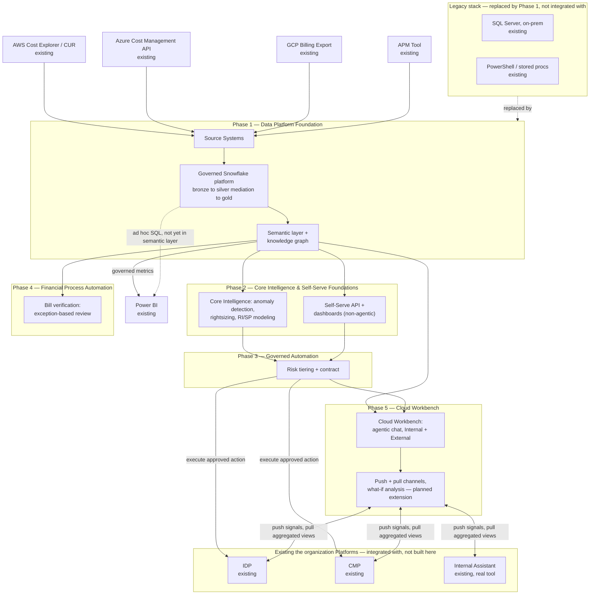

# FinOps Platform — Master Solution Overview

| | |
|---|---|
| **Status** | Draft — unvalidated |
| **Creator** | Matt Nestman |
| **Last updated** | 2026-09-15 |
| **Audience** | Engineering, Product, Architecture stakeholders; hiring/leadership stakeholders evaluating a proposed direction |

## Purpose

This document sequences the full set of opportunities identified in [FinOps Opportunities.md](FinOps%20Opportunities.md) into one coherent solution: what gets built, in what order, and how the pieces fit together. It stays at a high level by design — enumeration, phasing, and architecture-at-a-glance — and defers detailed component design to the sub-documents indexed in [Sub-Document Index](#sub-document-index) below, some of which already exist and are reused as-is here, and some of which are identified as still needed.

It carries the same caveat as the rest of this document set: written from an outside-in vantage point, an educated synthesis rather than a confirmed plan, likely to contain gaps or sequencing calls a validated timeline/resourcing conversation would correct. See [FinOps Current State.md](FinOps%20Current%20State.md) for the full methodology note that applies across this whole document set.

---

## Executive Summary

The target state is one governed Snowflake platform, built in five phases, that every downstream capability — reporting, ML, automation, chat — reads from as a single source of truth, replacing today's SQL-Server-and-PowerShell pipeline outright rather than integrating with it (Phase 1). On top of that foundation: Core Intelligence trains and serves the anomaly-detection, rightsizing, and RI/SP models that the FinOps team currently runs by somewhat manually on a monthly cycle, while Self-Serve Foundations exposes the same governed data through a REST API and native Power BI dashboards (Phase 2); Governed Automation lets validated recommendations execute automatically within risk-tiered guardrails instead of sitting in a queue for someone to action manually (Phase 3); Financial Process Automation moves bill verification from manual reconciliation to exception-based review (Phase 4); and Cloud Workbench, sequenced last and only once the foundation beneath it is proven, gives both the FinOps/platform team (natural-language Q&A plus the ability to propose governed actions) and business verticals (Q&A only — "why did this cost go up" — without opening a ticket) a conversational interface over the same governed data (Phase 5). Planned beyond that base: Cloud Workbench Expansion turns this into an actual workbench by pushing FinOps signals into the tools teams already use — IDP, CMP, Internal Assistant — and pulling from them into a vertical-facing what-if surface, so a vertical can model a change to its footprint before making it, not just ask why a past one cost what it did.

None of this replaces the practice described in [FinOps Current State.md](FinOps%20Current%20State.md) — the strong tagging discipline, the true chargeback model, and the domain knowledge encoded in the existing reconciliation logic all carry forward, per [FinOps Opportunities.md](FinOps%20Opportunities.md)'s own framing: this is an addition to a strong foundation, not a fix for something broken. What changes is what's manual or semi-manual today — continuous governed ingestion instead of a monthly batch, models instead of ad hoc analysis, self-serve instead of an inbox, and automatic execution within guardrails instead of recommendations nobody has time to action.

---

## Platform-Wide Requirements & Non-Functional Requirements

Requirements that span every phase. Phase-specific requirements (query latency, approval SLAs, and the like) live in each phase's own sub-document — this section covers only what's genuinely cross-cutting.

### Cross-Cutting Functional Requirements (inferred)

- FR1: Every phase reads from Data Foundations' governed Snowflake platform as the single source of truth; no phase maintains its own parallel copy of conformed cost/usage data.
- FR2: Every automated or AI-generated output (a recommendation, an anomaly flag, a chat answer, an automated action) must be traceable to the specific data it was derived from.
- FR3: Vertical/account data segregation is enforced consistently across every consumer-facing surface (API, dashboards, Phase 5's Cloud Workbench chat), not independently reimplemented per surface.

### Cross-Cutting Non-Functional Requirements (inferred)

| Requirement | Target | Rationale |
|---|---|---|
| Data freshness ceiling | Provider billing lag (~24h) | Inherited from Data Foundations; no downstream phase can promise fresher data than its source |
| Auditability | Every phase's outputs reconstructable — what was asked or computed, from what data, by what model or policy version | HITRUST/SOC2-equivalent governance posture, consistent across phases |
| Data segregation | Vertical/account isolation enforced at the catalog/query layer, inherited by every consumer rather than reimplemented | Multi-tenant horizontal platform, compliance-sensitive |
| Platform's own cost | Tracked with the same rigor applied to the cloud spend it analyzes | A FinOps platform with an unmeasured cost of its own undercuts its own credibility |

### Cross-Cutting Non-Goals (inferred)

- Not attempting real-time (sub-minute) billing reconciliation anywhere in the platform — inherited from the provider billing-lag ceiling.
- Not replacing human judgment for high-blast-radius or high-dollar-impact decisions, whether in infrastructure automation (Phase 3) or financial reconciliation (Phase 4).

---

## Solution Overview

The solution is organized into five phases, each building on the data and governance foundation established by the ones before it. Phase 1 through Phase 3 already have detailed sub-documents; Phase 4 has a problem statement but no dedicated architecture yet; Phase 5 is scoped here for the first time.

This is also where the platform actually touches the organization's **real, existing systems** — not everything below is something this document set proposes building. Four data sources feed Phase 1 from outside the platform entirely, three existing the organization platforms (IDP, CMP, and the real Internal Assistant) are integrated with rather than designed here, and the legacy stack this platform modernizes (rather than greenfield-builds) is shown explicitly too, since "modernization, not greenfield" is stated as a framing principle throughout this document set but wasn't previously visible in this diagram.

**A naming note**: "Cloud Workbench" is the name used throughout this document set for the agentic, conversational self-serve product designed in Phase 5 (chat, and — planned — push/pull channels and what-if analysis). It is a deliberately different name from the organization's existing "Internal Assistant" tool shown above — see the naming note at the top of [Solution_Architecture_Cloud_Workbench.md](Solution_Architecture_Cloud_Workbench.md) for why. 

| Box | Purpose | Detailed In |
|---|---|---|
| AWS Cost Explorer / CUR, Azure Cost Management API, GCP Billing Export | The three cloud providers' native billing/usage export mechanisms — existing, external to this platform, not built here | Data Foundations §4.1 |
| APM Tool | the organization's existing Application Portfolio Management system — the source of the APM ID used as a cross-cloud resource identity key throughout the platform | Data Foundations §4.1 |
| Source Systems | The aggregation point where the four sources above land before conformance begins — raw AWS/Azure/GCP billing and usage exports, plus APM tool metadata, pulled in as-received and preserved for audit/replay | Data Foundations §4.1 |
| SQL Server (on-prem), PowerShell / stored procs | the organization's real, existing legacy pipeline — today's manual/scripted ingestion, reconciliation, and reporting logic. Phase 1 replaces this outright rather than integrating with it; nothing here is pulled forward except the domain knowledge encoded in the existing sprocs | Data Foundations, Executive Summary; `FinOps Current State.md` |
| Power BI | the organization's existing BI tool. Connects natively to the Snowflake platform's Semantic Views for governed metrics, falling back to gold-schema tables directly only for ad hoc queries not yet modeled as a metric (Data Foundations ADR-002, ADR-003) — no separate BI-serving system, no export step | Data Foundations §4.3, ADR-002, ADR-003 |
| Governed Snowflake platform | A medallion-layered (bronze/silver/gold) structure implemented as Snowflake schemas, with native ACID guarantees and Time Travel — not a separate lakehouse product. Bronze holds raw, provider-native data; **mediation is the bronze-to-silver transform** — conforming provider-native billing data (different field names, tag semantics, refresh cadences per cloud) into one canonical schema, ingesting FOCUS-formatted exports where available, then layering organization-specific tag/attribution logic and deduplication on top — not a separate system ahead of the platform; gold serves both existing BI reporting and ML/AI consumption from one trusted layer, all on the same platform (Data Foundations ADR-003) | Data Foundations §4.2–4.3, ADR-003; Build Specification §2–3 |
| Semantic layer + knowledge graph | Defines business metrics once (e.g., EC2 spend, burn rate) via Snowflake Semantic Views, and models entities/relationships — accounts, resources, tags, the APM ID — as a graph in **Neo4j**, a dedicated graph database synced from Snowflake's gold schema (Data Foundations ADR-004), so every consumer reasons about cost data the same way | Data Foundations §4.4; Build Specification §4 |
| Core Intelligence | Trains, versions, and serves the anomaly-detection, rightsizing, and RI/savings-plan models (via Snowpark ML) that read from the gold-layer tables and write findings back as facts | MLOps Pipeline document (entire) |
| Self-Serve API + dashboards | Non-agentic, programmatic self-serve: a governed REST API for other internal teams/tools, plus native Power BI dashboards — no chat interface at this phase | Self-Serve Foundations (entire); Build Specification §7 |
| Cloud Workbench (chatbot) | Natural-language, agentic self-serve interface — Phase 5, after Core Intelligence, the API/dashboards layer, and Governed Automation are established — retrieving from the Neo4j knowledge graph and gold-layer tables (via Snowflake Cortex Analyst), with definitional questions answered by direct lookup against the Semantic View metric catalog rather than a vector store (Cloud Workbench ADR-001, ADR-006), to generate grounded, cited answers | Cloud Workbench §4.1; Build Specification §5 |
| Governed Automation (risk tiering + contract) | Classifies a proposed optimization action into LOW/MEDIUM/HIGH risk and routes it to automatic execution, delayed execution with opt-out, or mandatory human approval — enforced in code via policy-as-code, not the proposing system's own judgment | Governed Automation §3; Build Specification §6 |
| IDP, CMP | the organization's existing infrastructure-provisioning and container-management platforms — Governed Automation calls these to actually execute an approved action; they aren't being replaced or rebuilt | Governed Automation §3; Build Specification §6 |
| Bill verification | Reconciles invoiced line items against contracted rates and expected usage, producing a confidence score that routes high-confidence/low-impact items to auto-clear and everything else to a human reviewer | MLOps Pipeline §1.1 — problem statement only, no dedicated design yet |
| Cloud Workbench Expansion | Adds push (signals embedded in IDP/CMP/the real Internal Assistant) and pull (a vertical-facing what-if/scenario surface aggregating those same tools plus cost/APM/reference data) to Phase 5's Cloud Workbench, submitting what-if results into Governed Automation | Planned — no sub-document yet |
| Internal Assistant | the organization's real, existing chat/tooling product referenced in the job description — distinct from Cloud Workbench (see naming note above). Cloud Workbench Expansion's push channel surfaces signals into it; the pull channel aggregates from it. Its API readiness is the least certain of the three existing platforms — see the Solution Overview's Sub-Document Index | Not designed here — real, existing system |

---

## Capability Map

Every item from the Opportunities document, traced to the solution component that addresses it and where that component is (or isn't yet) detailed. Structure and numbering mirror `FinOps Opportunities.md` directly: its Part 1 (technology stack & architecture) is one undivided set of opportunities, below; its Part 2 (FinOps process & practice) is split there into four sub-areas, 2a–2d, kept as separate tables below so each traces cleanly back to its source section.

### Part 1 — Technology Stack & Architecture

| Opportunity | Solution Component | Where It's Detailed | Status |
|---|---|---|---|
| FOCUS-aware native billing ingestion | Mediation (bronze-to-silver transform, within Snowflake) | Data Foundations §4.2, ADR-001 | Detailed |
| Managed orchestration | Ingestion DAGs | Build Specification §1 | Detailed |
| Governed data platform | Governed Snowflake platform (bronze/silver/gold schemas) | Data Foundations §4.3, ADR-003 | Detailed |
| Canonical data model / governed API | API/service layer | Self-Serve Foundations §4.2; Build Specification §7 | Detailed |
| Governed semantic layer | Semantic layer (Snowflake Semantic Views) | Data Foundations §4.4, ADR-002; Build Specification §4 | Detailed |
| Knowledge graph / entity model | Ontology, implemented in Neo4j, synced from Snowflake's gold schema | Data Foundations §4.4, ADR-004; Build Specification §4 | Detailed — implementation only; the ontology itself isn't yet a standalone artifact (OWL/RDFS candidates), see Data Foundations §4.4 |
| MLOps foundation + explainability | Core Intelligence pipeline | MLOps Pipeline document (entire) | Detailed |
| GenAI/RAG interface | AI consumption layer (Cloud Workbench) | Cloud Workbench §4.1; Build Specification §5 | Detailed — Phase 5, not Phase 2 (see ADR-M1) |
| AI evaluation/quality gate | Eval gate | Cloud Workbench §4.2; Build Specification §9 | Detailed — Phase 5 |
| Formal data quality framework | DQ checks | Build Specification §2 | Detailed |
| Governance/catalog tooling | Lineage/RBAC | Data Foundations §4.3, §4.5 | Detailed |

### Part 2a — Analysis Enrichment

| Opportunity | Solution Component | Where It's Detailed | Status |
|---|---|---|---|
| Near-real-time cost visibility | Data freshness NFR | Data Foundations §2.3 | Detailed (bounded by provider billing lag) |
| Unit economics | — | — | **Planned** — extend semantic layer with unit-cost metric definitions |
| ML-assisted analysis (anomaly, rightsizing, RI/SP) | Core Intelligence pipeline | MLOps Pipeline document | Detailed |
| Commitment coverage/utilization tracking | `metric_ri_coverage` | MLOps Pipeline §2.3; Build Specification §4 | Detailed |
| APM resolution rate as governance KPI | `dq_check_apm_id_present` | Build Specification §4 | Detailed |
| Platform's own cost tracked | Cost-of-platform NFR | Cloud Workbench §2.3 (token/infra cost); Cross-Cutting NFR table above (platform-wide) | Detailed |

### Part 2b — Self-Serve Channels & Personas

| Opportunity | Solution Component | Where It's Detailed | Status |
|---|---|---|---|
| Standard reports/dashboards | API/service layer (thin view), or Power BI connected to Snowflake Semantic Views | Self-Serve Foundations §4.2; Data Foundations ADR-002, ADR-003 | **Treated as a thin view for now** — review existing Power BI reports for reuse. Repointing them at Semantic Views (or gold directly, as a fallback for metrics not yet modeled) is native (Data Foundations ADR-002, ADR-003, no separate serving path to build), likely less rework than a net-new API/service-layer integration per report if the existing reports are largely SQL-shaped already, but this is unconfirmed. That review must also audit each report's own DAX measures for logic duplicating a Semantic View metric (Data Foundations §4.3) — repointing the query source doesn't by itself remove a local, independently-computed version of the same metric. A dedicated sub-document may be needed depending on what that review finds |
| Conversational interface (chatbot) | AI consumption layer (Cloud Workbench) | Cloud Workbench §4.1 | Detailed — Phase 5, not Phase 2 (see ADR-M1) |
| Published REST APIs | API/service layer | Self-Serve Foundations §4.1 | Detailed — Phase 2, non-agentic |
| Persona-scoped access (Internal vs. External tool sets and data exposure) | Cloud Workbench persona resolution | Cloud Workbench §4.1, ADR-007 | Detailed |
| Anonymized cross-vertical benchmarking, exposed to verticals | Cloud Workbench Expansion | — | **Planned** — the underlying rate-based metric (`metric_peer_percentile_rank`, Data Foundations §4.4) exists and is queryable by the Internal persona today (Cloud Workbench `get_peer_benchmark`), but not yet exposed to External/vertical sessions — a deliberate scope boundary (Cloud Workbench §2.4), not a missing metric |
| Push: FinOps signals embedded in IDP/CMP/Internal Assistant | Cloud Workbench Expansion | — | **Planned** — extension of Governed Automation plus a new embedding spec, building on top of Phase 5's now-designed Cloud Workbench base. "Internal Assistant" here is the real, existing the organization tool, distinct from Cloud Workbench |
| Pull: vertical self-serve workbench + what-if analysis | Cloud Workbench Expansion | — | **Planned** — new sub-document needed, extending Cloud Workbench (Phase 5) |

### Part 2c — Automated Optimization Actions

| Opportunity | Solution Component | Where It's Detailed | Status |
|---|---|---|---|
| Risk/blast-radius tiering | Action layer risk classification | Governed Automation §3; Build Specification §6 | Detailed — aligned to the existing three-tier model, see [ADR-M2](#adr-m2) |
| Horizontal/vertical "contract" | — | Governed Automation §3 (flagged as not yet designed) | **Planned** — extension to the action layer |
| Policy schema & engine | Policy-as-code | Build Specification §6 | Partial — consent/contract fields not yet modeled |
| Scoped automation identity | RBAC roles | Build Specification §3 | Partial |
| Guardrails (dry-run, canary, caps, audit trail, kill switch, exception process, change management) | Canary rollout, audit log | Build Specification §8, §9 | Partial — canary rollout and audit logging exist; dry-run mode, kill switch, hard caps/circuit breaker, and exception process are not yet modeled |

### Part 2d — Bill Verification

| Opportunity | Solution Component | Where It's Detailed | Status |
|---|---|---|---|
| Confidence + evidence-scored reconciliation, confidence + impact-based routing | Problem statement only | MLOps Pipeline §1.1 | Partial — needs its own architectural treatment (schema, pipeline, ADR), currently scoped as a requirement but not designed |

---

## Phasing & Sequencing

| Phase | Scope | Rationale for Sequencing |
|---|---|---|
| **1 — Data Platform Foundation** | Mediation, Snowflake platform, semantic layer, knowledge graph, governance/catalog, data quality | Every later phase reads from this layer; building it first avoids every downstream consumer inventing its own conformance logic |
| **2 — Core Intelligence & Self-Serve Foundations** | MLOps (anomaly/rightsizing/RI-SP), a non-agentic REST API + dashboards | The first user-facing value, and the source of the recommendations Phase 3 automates — deliberately simple, deterministic surfaces first |
| **3 — Governed Automation** | Risk-tiered action layer, extended with the horizontal/vertical contract and remaining guardrails | Depends on Phase 2's recommendations existing before there's anything to automate; also needs to be proven and mature before Phase 5 adds a second, agent-driven proposal source on top of it |
| **4 — Financial Process Automation** | Bill verification as exception-based review | Independent of Phases 2–3's infrastructure-action focus; sequenced after the core platform is stable since it's a different domain (financial reconciliation, not infrastructure) sharing the same confidence-scored-routing pattern |
| **5 — Cloud Workbench** | The agentic, conversational self-serve interface (chatbot), plus its planned push/pull/what-if expansion | Deliberately last, not alongside Phase 2: prove the data foundation, ML pipeline, and Governed Automation through simpler surfaces first, before investing in the more complex agentic layer — see ADR-M1 |

---

## Sub-Document Index

| Document                                                                                                         | Phase  | Location                                                                                                     | Covers                                                                                                                                       |
| ---------------------------------------------------------------------------------------------------------------- | ------ | ------------------------------------------------------------------------------------------------------------ | -------------------------------------------------------------------------------------------------------------------------------------------- |
| Solution Architecture: Data Foundations                                                                          | 1      | [Solution_Architecture_Data_Foundations.md](Solution_Architecture_Data_Foundations.md)             | Source systems, mediation, governed Snowflake platform, semantic layer + knowledge graph                                                     |
| Solution Architecture: Cost Anomaly Detection, Rightsizing & RI/SP Modeling — MLOps Pipeline (Core Intelligence) | 2      | [Solution_Architecture_MLOps_Pipeline.md](Solution_Architecture_MLOps_Pipeline.md)                 | 2a's ML-assisted analysis in full; also carries bill verification's (2d) problem statement only, scoped explicitly as not-yet-designed there |
| Solution Architecture: Self-Serve Foundations                                                                    | 2      | [Solution_Architecture_Self_Serve_Foundations.md](Solution_Architecture_Self_Serve_Foundations.md) | Non-agentic self-serve: REST API + dashboards (2b, minus the chatbot)                                                                        |
| Solution Architecture: Governed Automation                                                                       | 3      | [Solution_Architecture_Governed_Automation.md](Solution_Architecture_Governed_Automation.md)       | The action layer's risk-tiered automation (2c) — the contract artifact itself flagged as not yet designed                                    |
| Solution Architecture: Cloud Workbench                                                                           | 5      | [Solution_Architecture_Cloud_Workbench.md](Solution_Architecture_Cloud_Workbench.md)               | The agentic, conversational self-serve interface (2b's chatbot item) — deliberately sequenced as Phase 5, not Phase 2 (ADR-M1)               |
| Detailed Build Specification: FinOps Intelligence Platform                                                       | 1–3, 5 | [Platform_Build_Specification.md](Platform_Build_Specification.md)                                 | Companion to the five docs above — table names, job names, function signatures, policy names at build-ready specificity                      |
| Bill Verification as Exception-Based Review | 4 | Not yet created | Dedicated architectural treatment of 2d — schema, pipeline, confidence/routing logic, ADR — extending the MLOps pattern rather than inventing a new one |
| Cloud Workbench Expansion: Push/Pull Channels & What-If Analysis | 5 (extension) | Not yet created | 2b's dashboard, push-embedding, pull-workbench, what-if analysis, and benchmarking items, extending the now-existing Cloud Workbench doc rather than a wholly separate document. **Assumption adopted**: IDP and CMP are treated as API-reachable (Governed Automation already calls them directly); the real Internal Assistant tool's API surface is not assumed — chat tools don't always expose a clean integration surface — and is the higher-risk item in this doc's eventual scope, worth validating before committing to the push channel's design |
| Governed Automation: The Horizontal/Vertical Contract | 3 (extension) | Not yet created | 2c's contract artifact, consent schema, and the guardrails not yet modeled (dry-run, kill switch, hard caps, exception process) — extends the existing Governed Automation doc rather than a wholly separate document |

Data Foundations, Self-Serve Foundations, and Governed Automation were originally one combined "Internal Assistant" solution architecture document; it was split along phase boundaries once it became clear one document was standing in as the source for four different phases in the Capability Map below. Cloud Workbench (the agentic chat interface) was later split out of Self-Serve Foundations a second time and moved to Phase 5 — see [ADR-M1](#master-level-architecture-decisions) and the naming note at the top of [Solution_Architecture_Cloud_Workbench.md](Solution_Architecture_Cloud_Workbench.md) for why "Cloud Workbench," not "Internal Assistant," names the self-serve product designed there.

---

## Master-Level Architecture Decisions

**ADR-M1: Sequence Cloud Workbench itself — not just its push/pull expansion — as Phase 5, after the core data/intelligence/automation foundation (Phases 1–3), not alongside Phase 2**
- *Context*: An earlier version of this document set placed the agentic, conversational interface in Phase 2, alongside Core Intelligence, with only its push/pull/what-if *expansion* deferred to Phase 5. Direction received since then: keep the agent out of Phase 2 entirely, leaving Self-Serve Foundations to the ML-facing API and dashboards only. Two reasons this holds up on its own merits, not just as a directive: first, an LLM-driven agent is materially more complex and less predictable than a REST API or a BI dashboard — proving the data foundation and Core Intelligence's models are trustworthy through simple, deterministic surfaces first means any problem surfacing later is more likely to be the agent, not the data underneath it. Second, Cloud Workbench's own FR4 lets it propose actions through Governed Automation (Phase 3) — building that capability before Governed Automation exists, or while it's still new and unproven, means either building against a moving target or shipping an agent that can't yet do the one thing (safe automation) that makes it more than a chatbot wrapped around a dashboard.
- *Decision*: Treat Phase 5 as covering Cloud Workbench's full base capability (not just an expansion of an existing Phase 2 chatbot) plus its planned push/pull/what-if extension, both dependent on Phases 1–3 being substantially complete. Self-Serve Foundations (Phase 2) covers only the non-agentic REST API and dashboards.
- *Alternatives considered*: Ship the base chatbot in Phase 2 as originally scoped, deferring only push/pull/what-if to Phase 5 — rejected per the reasoning above, not merely reverted on request. Build the full Cloud Workbench product (base plus expansion) in parallel with the Phase 1–3 foundation — rejected, same reasoning as the original ADR: it would either duplicate the data model being built underneath it or be re-architected once that foundation lands, and now additionally risks building action-proposal capability against a Governed Automation that doesn't exist yet.
- *Consequences*: Verticals get programmatic/dashboard self-serve at Phase 2 but wait until Phase 5 for a conversational interface — a real UX gap for that period, accepted because the deflect-the-FinOps-inbox use case (Cloud Workbench §2.1) is valuable but not the platform's first, highest-leverage investment; the data foundation and ML pipeline are. This also means Governed Automation (Phase 3) is built and proven against a single proposal source (Core Intelligence) before a second, user-driven one is added — a smaller, more testable surface at the point it matters most.

**ADR-M2: Align the Opportunities document's risk tiering directly to the Build Specification's three-value `RiskTier` enum (LOW/MEDIUM/HIGH), rather than maintaining two vocabularies**
- *Context*: The Opportunities document originally described a four-tier model (Tiers 0–3); the Build Specification's `classify_action_risk` already defines a three-value enum. Maintaining both meant reconciling them every time the two documents were read together.
- *Decision*: Update the Opportunities document's tiering table to use LOW/MEDIUM/HIGH directly, matching the existing enum. "Advisory-only, same as today" is described as the default starting condition every resource is in until explicitly classified, not a fourth tier — consistent with `classify_action_risk` only ever classifying an action once one is proposed, not representing a standing state itself.
- *Alternatives considered*: Introduce a fourth pre-classification tier and require every downstream consumer to reconcile against it — the original approach taken in this document, since revised — rejected because it kept two competing vocabularies alive rather than resolving to one, leaving a mapping to remember instead of removing it.
- *Consequences*: The Opportunities document and Build Specification now share one vocabulary. The "advisory-only by default" framing still needs to be stated clearly wherever tiering is discussed, since it's easy to misread as a missing tier rather than a starting condition.

**ADR-M3: Model the horizontal/vertical "contract" as a new entity extending the existing action layer, not a parallel system**
- *Context*: The Build Specification already has `action_approval_requests` and policy-as-code (`policy_blast_radius`, `policy_production_gate`, `policy_reversibility_preference`), but nothing capturing per-application, per-vertical consent and notification preferences ahead of time.
- *Decision*: Add a contract entity (e.g., `automation_consent_contract`, keyed on APM ID) that `classify_action_risk` and the approval queue consult, rather than building a separate consent system.
- *Alternatives considered*: A standalone contract-management service, rejected as premature — the existing action layer already has the right shape; it's missing one entity and the join to it.
- *Consequences*: Minimal net-new infrastructure, but requires care that this entity is designed as an extension, not bolted on inconsistently with the schema conventions already established in the Build Specification.

**ADR-M4: Treat bill verification (Phase 4) as an application of the same MLOps pattern (feature store, eval gate, versioned model), not a separate architectural paradigm**
- *Context*: Bill verification's confidence-scored, evidence-attached, impact-routed reconciliation is structurally the same shape as anomaly detection and rightsizing — a model produces a score, a hard rule routes low-confidence/high-impact cases to a human.
- *Decision*: Extend the MLOps Pipeline document's pattern to a fourth model type (reconciliation confidence scoring) rather than inventing a separate pipeline architecture for it.
- *Alternatives considered*: A rules-engine-only approach without a model in the loop, rejected — a purely deterministic rules engine can't produce the graded confidence score the routing logic depends on; a lighter-weight model still needs the same versioning/drift/eval discipline as the others to be trustworthy in a financial context.
- *Consequences*: One more model family in the MLOps pipeline's scope, but no new operational discipline to build — it reuses what Phase 2 already established.

---

## Open Items to Validate

- The five-phase sequencing above is a proposed default reflecting technical dependency order only — it doesn't account for any actual resourcing, timeline, or business-priority constraint, none of which are known here.
- Dashboards (2b): the outcome of the reuse review against the API/service layer, and whether it in fact requires a semantic-layer refactor, is unresolved — a dedicated sub-document depends on what that review finds.

---

## Glossary (terms introduced at this level)

**Front door** — A distinct product surface (push or pull) serving a given interaction pattern, both backed by the same underlying platform rather than separate systems.

**Phase** — A sequenced grouping of solution components in this document, ordered by technical dependency, not a committed delivery timeline.

**Cloud Workbench** — The agentic, conversational self-serve product this document set designs, scoped to Phase 5 (not Phase 2, see ADR-M1) — chat today, planned to expand with push (signals embedded in tools verticals already use) and pull (a vertical-facing what-if surface for scenario planning) channels. Distinct from Self-Serve Foundations' Phase 2 REST API and dashboards, which are non-agentic and exist earlier. Deliberately not named "Internal Assistant," which refers to the organization's real, existing tool — see the naming note under Solution Overview above.

**Contract (automation consent)** — The per-application, per-vertical record of what automated actions are pre-approved, keyed on the APM ID, that the action layer consults before acting on anything beyond the advisory-only default.
