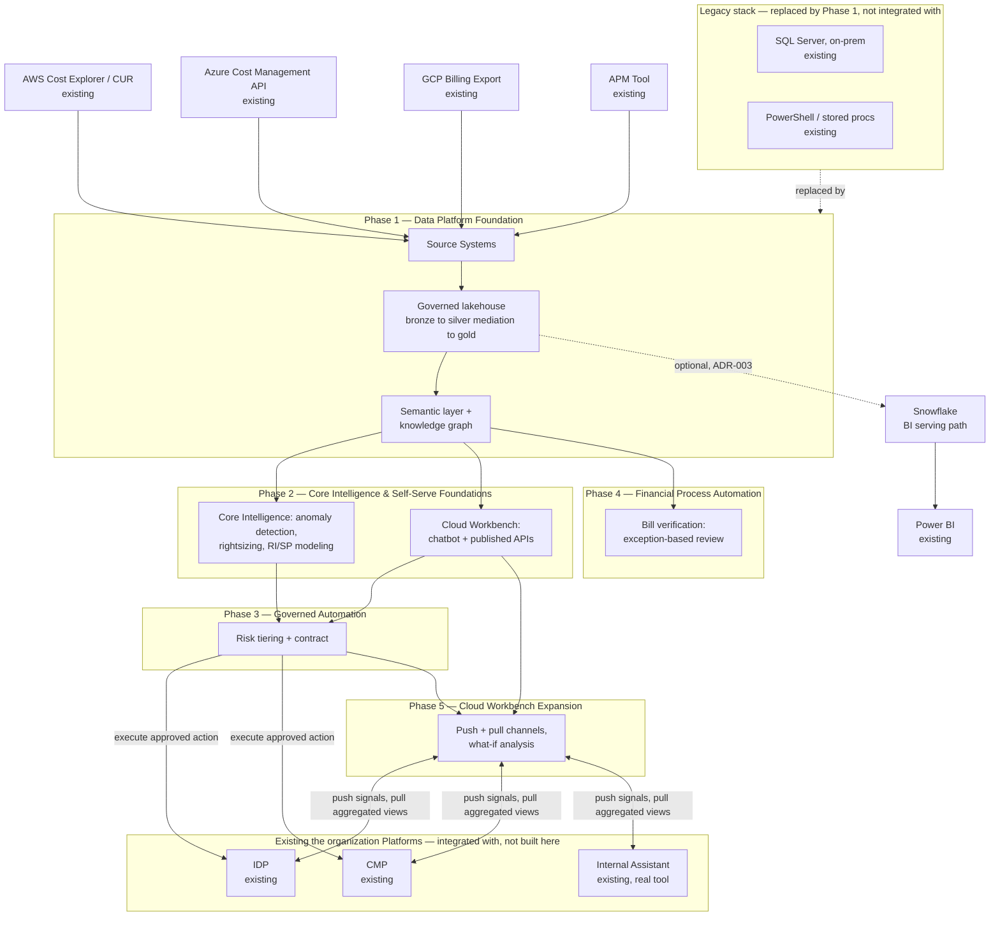

# FinOps Platform — Master Solution Overview

| | |
|---|---|
| **Status** | Draft — unvalidated |
| **Creator** | Matt Nestman |
| **Last updated** | 2026-09-15 |
| **Audience** | Engineering, Product, Architecture stakeholders; hiring/leadership stakeholders evaluating a proposed direction |

## Purpose

This document sequences the full set of opportunities identified in [FinOps Opportunities.md](FinOps%20Opportunities.md) into one coherent solution: what gets built, in what order, and how the pieces fit together. It stays at a high level by design — enumeration, phasing, and architecture-at-a-glance — and defers detailed component design to the sub-documents indexed in [Sub-Document Index](#sub-document-index) below, some of which already exist and are reused as-is here, and some of which are identified as still needed.

It carries the same caveat as the rest of this document set: written from an outside-in vantage point, an educated synthesis rather than a confirmed plan, likely to contain gaps or sequencing calls a validated timeline/resourcing conversation would correct. See [FinOps Current State.md](FinOps%20Current%20State.md) for the full methodology note that applies across this whole document set.

---

## Platform-Wide Requirements & Non-Functional Requirements

Requirements that span every phase. Phase-specific requirements (query latency, approval SLAs, and the like) live in each phase's own sub-document — this section covers only what's genuinely cross-cutting.

### Cross-Cutting Functional Requirements (inferred)

- FR1: Every phase reads from Data Foundations' governed lakehouse as the single source of truth; no phase maintains its own parallel copy of conformed cost/usage data.
- FR2: Every automated or AI-generated output (a recommendation, an anomaly flag, a chat answer, an automated action) must be traceable to the specific data it was derived from.
- FR3: Vertical/account data segregation is enforced consistently across every consumer-facing surface (API, chat, dashboards, the Phase 5 workbench), not independently reimplemented per surface.

### Cross-Cutting Non-Functional Requirements (inferred)

| Requirement | Target | Rationale |
|---|---|---|
| Data freshness ceiling | Provider billing lag (~24h) | Inherited from Data Foundations; no downstream phase can promise fresher data than its source |
| Auditability | Every phase's outputs reconstructable — what was asked or computed, from what data, by what model or policy version | HITRUST/SOC2-equivalent governance posture, consistent across phases |
| Data segregation | Vertical/account isolation enforced at the catalog/query layer, inherited by every consumer rather than reimplemented | Multi-tenant horizontal platform, compliance-sensitive |
| Platform's own cost | Tracked with the same rigor applied to the cloud spend it analyzes | A FinOps platform with an unmeasured cost of its own undercuts its own credibility |

### Cross-Cutting Non-Goals (inferred)

- Not attempting real-time (sub-minute) billing reconciliation anywhere in the platform — inherited from the provider billing-lag ceiling.
- Not replacing human judgment for high-blast-radius or high-dollar-impact decisions, whether in infrastructure automation (Phase 3) or financial reconciliation (Phase 4).

---

## Solution Overview

The solution is organized into five phases, each building on the data and governance foundation established by the ones before it. Phase 1 through Phase 3 already have detailed sub-documents; Phase 4 has a problem statement but no dedicated architecture yet; Phase 5 is scoped here for the first time.

This is also where the platform actually touches the organization's **real, existing systems** — not everything below is something this document set proposes building. Four data sources feed Phase 1 from outside the platform entirely, three existing the organization platforms (IDP, CMP, and the real Internal Assistant) are integrated with rather than designed here, and the legacy stack this platform modernizes (rather than greenfield-builds) is shown explicitly too, since "modernization, not greenfield" is stated as a framing principle throughout this document set but wasn't previously visible in this diagram.

**A naming note**: "Cloud Workbench" is the name used throughout this document set for the self-serve product designed here (chat, API, and — in Phase 5 — push/pull channels and what-if analysis). It is a deliberately different name from the organization's real, existing "Internal Assistant" tool shown above — see the naming note at the top of the Self-Serve Foundations doc for why. The "Internal Assistant" box in the diagram is that real, existing tool, not Cloud Workbench.

| Box | Purpose | Detailed In |
|---|---|---|
| AWS Cost Explorer / CUR, Azure Cost Management API, GCP Billing Export | The three cloud providers' native billing/usage export mechanisms — existing, external to this platform, not built here | Data Foundations §4.1 |
| APM Tool | the organization's existing Application Portfolio Management system — the source of the APM ID used as a cross-cloud resource identity key throughout the platform | Data Foundations §4.1 |
| Source Systems | The aggregation point where the four sources above land before conformance begins — raw AWS/Azure/GCP billing and usage exports, plus APM tool metadata, pulled in as-received and preserved for audit/replay | Data Foundations §4.1 |
| SQL Server (on-prem), PowerShell / stored procs | the organization's real, existing legacy pipeline — today's manual/scripted ingestion, reconciliation, and reporting logic. Phase 1 replaces this outright rather than integrating with it; nothing here is pulled forward except the domain knowledge encoded in the existing sprocs | Data Foundations, Executive Summary; `FinOps Current State.md` |
| Snowflake, Power BI | An optional read-only BI serving path over gold, and the organization's existing BI tool. Snowflake is new infrastructure this platform introduces (not an existing the organization system); Power BI is existing and could repoint at this path instead of the current on-prem SQL Server | Data Foundations §4.3, ADR-003 |
| Governed lakehouse | A Medallion-architected (bronze/silver/gold) lakehouse with ACID guarantees and time travel. Bronze holds raw, provider-native data; **mediation is the bronze-to-silver transform** — conforming provider-native billing data (different field names, tag semantics, refresh cadences per cloud) into one canonical schema, ingesting FOCUS-formatted exports where available, then layering organization-specific tag/attribution logic and deduplication on top — not a separate system ahead of the lakehouse; gold serves both existing BI reporting (optionally via a read-only Snowflake serving path, ADR-003) and ML/AI consumption from one trusted layer | Data Foundations §4.2–4.3, ADR-003; Build Specification §2–3 |
| Semantic layer + knowledge graph | Defines business metrics once (e.g., EC2 spend, burn rate) and models entities/relationships — accounts, resources, tags, the APM ID — as a queryable graph, so every consumer reasons about cost data the same way | Data Foundations §4.4; Build Specification §4 |
| Core Intelligence | Trains, versions, and serves the anomaly-detection, rightsizing, and RI/savings-plan models that read from the gold lakehouse layer and write findings back as graph facts | MLOps Pipeline document (entire) |
| Cloud Workbench (chatbot + APIs) | Natural-language and programmatic self-serve interface, retrieving from the semantic layer, knowledge graph, and lakehouse to generate grounded, cited answers | Self-Serve Foundations §4.1–4.2; Build Specification §5, §7 |
| Governed Automation (risk tiering + contract) | Classifies a proposed optimization action into LOW/MEDIUM/HIGH risk and routes it to automatic execution, delayed execution with opt-out, or mandatory human approval — enforced in code via policy-as-code, not the proposing system's own judgment | Governed Automation §3; Build Specification §6 |
| IDP, CMP | the organization's existing infrastructure-provisioning and container-management platforms — Governed Automation calls these to actually execute an approved action; they aren't being replaced or rebuilt | Governed Automation §3; Build Specification §6 |
| Bill verification | Reconciles invoiced line items against contracted rates and expected usage, producing a confidence score that routes high-confidence/low-impact items to auto-clear and everything else to a human reviewer | MLOps Pipeline §1.1 — problem statement only, no dedicated design yet |
| Cloud Workbench Expansion | Adds push (signals embedded in IDP/CMP/the real Internal Assistant) and pull (a vertical-facing what-if/scenario surface aggregating those same tools plus cost/APM/reference data) to the Phase 2 chat/API product, submitting what-if results into Governed Automation | Planned — no sub-document yet |
| Internal Assistant | the organization's real, existing chat/tooling product referenced in the job description — distinct from Cloud Workbench (see naming note above). Cloud Workbench Expansion's push channel surfaces signals into it; the pull channel aggregates from it. Its API readiness is the least certain of the three existing platforms — see the Solution Overview's Sub-Document Index | Not designed here — real, existing system |

---

## Capability Map

Every item from the Opportunities document, traced to the solution component that addresses it and where that component is (or isn't yet) detailed.

### Part 1 — Technology Stack & Architecture

| Opportunity | Solution Component | Where It's Detailed | Status |
|---|---|---|---|
| FOCUS-aware native billing ingestion | Mediation (bronze-to-silver transform, within the lakehouse) | Data Foundations §4.2, ADR-001 | Detailed |
| Managed orchestration | Ingestion DAGs | Build Specification §1 | Detailed |
| Lakehouse (Iceberg/Delta) | Governed lakehouse (bronze/silver/gold) | Data Foundations §4.3 | Detailed |
| Canonical data model / governed API | API/service layer | Self-Serve Foundations §4.2; Build Specification §7 | Detailed |
| Governed semantic layer | Semantic layer | Data Foundations §4.4, ADR-002; Build Specification §4 | Detailed |
| Knowledge graph / entity model | Ontology + graph store | Data Foundations §4.4; Build Specification §4 | Detailed |
| MLOps foundation + explainability | Core Intelligence pipeline | MLOps Pipeline document (entire) | Detailed |
| GenAI/RAG interface | AI consumption layer (Cloud Workbench) | Self-Serve Foundations §4.1; Build Specification §5 | Detailed |
| AI evaluation/quality gate | Eval gate | Self-Serve Foundations §4.3; Build Specification §9 | Detailed |
| Formal data quality framework | DQ checks | Build Specification §2 | Detailed |
| Governance/catalog tooling | Lineage/RBAC | Data Foundations §4.3, §4.5 | Detailed |

### Part 2a — Analysis Enrichment

| Opportunity | Solution Component | Where It's Detailed | Status |
|---|---|---|---|
| Near-real-time cost visibility | Data freshness NFR | Data Foundations §2.3 | Detailed (bounded by provider billing lag) |
| Unit economics | — | — | **Planned** — extend semantic layer with unit-cost metric definitions |
| ML-assisted analysis (anomaly, rightsizing, RI/SP) | Core Intelligence pipeline | MLOps Pipeline document | Detailed |
| Commitment coverage/utilization tracking | `metric_ri_coverage` | MLOps Pipeline §2.2; Build Specification §4 | Detailed |
| APM resolution rate as governance KPI | `dq_check_apm_id_present` | Build Specification §4 | Detailed |
| Platform's own cost tracked | Cost-of-platform NFR | Self-Serve Foundations §2.3 | Detailed |

### Part 2b — Self-Serve Channels & Personas

| Opportunity | Solution Component | Where It's Detailed | Status |
|---|---|---|---|
| Standard reports/dashboards | API/service layer (thin view), or the Snowflake BI serving path | Self-Serve Foundations §4.2; Data Foundations ADR-003 | **Treated as a thin view for now** — review existing Power BI reports for reuse. Two candidate mechanisms, not yet chosen between: the API/service layer (net-new integration work per report), or repointing existing Power BI reports at the Snowflake read-only path over gold (Data Foundations ADR-003, potentially less rework if reports are largely SQL-shaped already). A dedicated sub-document may be needed depending on what that review finds |
| Conversational interface (chatbot) | AI consumption layer (Cloud Workbench) | Self-Serve Foundations §4.1 | Detailed |
| Published REST APIs | API/service layer | Self-Serve Foundations §4.2 | Detailed |
| Push: FinOps signals embedded in IDP/CMP/Internal Assistant | Cloud Workbench Expansion | — | **Planned** — extension of Governed Automation plus a new embedding spec. "Internal Assistant" here is the real, existing the organization tool, distinct from Cloud Workbench |
| Pull: vertical self-serve workbench + what-if analysis | Cloud Workbench Expansion | — | **Planned** — new sub-document needed |
| Persona-scoped access + anonymized cross-vertical benchmarking | Cloud Workbench Expansion | — | **Planned** — extend semantic layer with peer-benchmark metrics and vertical-scoped RBAC |

### Part 2c — Automated Optimization Actions

| Opportunity | Solution Component | Where It's Detailed | Status |
|---|---|---|---|
| Risk/blast-radius tiering | Action layer risk classification | Governed Automation §3; Build Specification §6 | Detailed — aligned to the existing three-tier model, see [ADR-M2](#adr-m2) |
| Horizontal/vertical "contract" | — | Governed Automation §3 (flagged as not yet designed) | **Planned** — extension to the action layer |
| Policy schema & engine | Policy-as-code | Build Specification §6 | Partial — consent/contract fields not yet modeled |
| Scoped automation identity | RBAC roles | Build Specification §3 | Partial |
| Guardrails (dry-run, canary, caps, audit trail, kill switch, exception process, change management) | Canary rollout, audit log | Build Specification §8, §9 | Partial — canary rollout and audit logging exist; dry-run mode, kill switch, hard caps/circuit breaker, and exception process are not yet modeled |

### Part 2d — Bill Verification

| Opportunity | Solution Component | Where It's Detailed | Status |
|---|---|---|---|
| Confidence + evidence-scored reconciliation, confidence + impact-based routing | Problem statement only | MLOps Pipeline §1.1 | Partial — needs its own architectural treatment (schema, pipeline, ADR), currently scoped as a requirement but not designed |

---

## Phasing & Sequencing

| Phase | Scope | Rationale for Sequencing |
|---|---|---|
| **1 — Data Platform Foundation** | Mediation, lakehouse, semantic layer, knowledge graph, governance/catalog, data quality | Every later phase reads from this layer; building it first avoids every downstream consumer inventing its own conformance logic |
| **2 — Core Intelligence & Self-Serve Foundations** | MLOps (anomaly/rightsizing/RI-SP), Cloud Workbench chatbot + APIs, AI eval gate | The first user-facing value, and the source of the recommendations Phase 3 automates |
| **3 — Governed Automation** | Risk-tiered action layer, extended with the horizontal/vertical contract and remaining guardrails | Depends on Phase 2's recommendations existing before there's anything to automate |
| **4 — Financial Process Automation** | Bill verification as exception-based review | Independent of Phases 2–3's infrastructure-action focus; sequenced after the core platform is stable since it's a different domain (financial reconciliation, not infrastructure) sharing the same confidence-scored-routing pattern |
| **5 — Cloud Workbench Expansion** | Push (embedded signals) and pull (what-if analysis, benchmarking) channels added to the Phase 2 Cloud Workbench product | Deliberately last: the what-if capability depends on Phase 1's data foundation and Phase 3's contract/automation framework to turn a simulation into a governed action, so building it earlier would mean building against a moving target |

---

## Sub-Document Index

### Existing (reused as-is)

| Document | Phase | Location | Covers |
|---|---|---|---|
| Solution Architecture: Data Foundations | 1 | [Solution_Architecture_Data_Foundations.md](Solution_Architecture_Data_Foundations.md) | Source systems, mediation, governed lakehouse, semantic layer + knowledge graph |
| Solution Architecture: Cost Anomaly Detection, Rightsizing & RI/SP Modeling — MLOps Pipeline (Core Intelligence) | 2 | [Solution_Architecture_MLOps_Pipeline.md](Solution_Architecture_MLOps_Pipeline.md) | 2a's ML-assisted analysis in full; also carries bill verification's (2d) problem statement only, scoped explicitly as not-yet-designed there |
| Solution Architecture: Self-Serve Foundations — Cloud Workbench | 2 | [Solution_Architecture_Self_Serve_Foundations.md](Solution_Architecture_Self_Serve_Foundations.md) | Self-serve chatbot/API channels (2b) |
| Solution Architecture: Governed Automation | 3 | [Solution_Architecture_Governed_Automation.md](Solution_Architecture_Governed_Automation.md) | The action layer's risk-tiered automation (2c) — the contract artifact itself flagged as not yet designed |
| Detailed Build Specification: FinOps Intelligence Platform | 1–3 | [Platform_Build_Specification.md](Platform_Build_Specification.md) | Companion to the four docs above — table names, job names, function signatures, policy names at build-ready specificity |

Data Foundations, Self-Serve Foundations, and Governed Automation were originally one combined "Internal Assistant" solution architecture document; it was split along phase boundaries once it became clear one document was standing in as the source for four different phases in the Capability Map below. See the naming note at the top of the Self-Serve Foundations doc for why "Cloud Workbench," not "Internal Assistant," names the self-serve product designed there.

### Planned (not yet written)

| Document | Phase | Would Cover |
|---|---|---|
| Bill Verification as Exception-Based Review | 4 | Dedicated architectural treatment of 2d — schema, pipeline, confidence/routing logic, ADR — extending the MLOps pattern rather than inventing a new one |
| Cloud Workbench Expansion: Push/Pull Channels & What-If Analysis | 5 | 2b's dashboard, push-embedding, pull-workbench, what-if analysis, and benchmarking items. **Assumption adopted**: IDP and CMP are treated as API-reachable (Governed Automation already calls them directly); the real Internal Assistant tool's API surface is not assumed — chat tools don't always expose a clean integration surface — and is the higher-risk item in this doc's eventual scope, worth validating before committing to the push channel's design |
| Governed Automation: The Horizontal/Vertical Contract | 3 (extension) | 2c's contract artifact, consent schema, and the guardrails not yet modeled (dry-run, kill switch, hard caps, exception process) — extends the existing Governed Automation doc rather than a wholly separate document |

---

## Master-Level Architecture Decisions

**ADR-M1: Sequence Cloud Workbench Expansion (Phase 5) after the core data/intelligence/automation foundation (Phases 1–3), not concurrently**
- *Context*: The what-if capability needs a stable semantic layer, knowledge graph, and automation contract to bridge a simulation into a governed action.
- *Decision*: Treat Phase 5 as dependent on Phases 1–3 being substantially complete.
- *Alternatives considered*: Build the expansion in parallel with the foundation, rejected — it would either duplicate the data model being built underneath it or be re-architected once that foundation lands.
- *Consequences*: Verticals wait longer for the pull-based what-if capability than for push-based signals, an acceptable tradeoff against building on unstable foundations.

**ADR-M2: Align the Opportunities document's risk tiering directly to the Build Specification's three-value `RiskTier` enum (LOW/MEDIUM/HIGH), rather than maintaining two vocabularies**
- *Context*: The Opportunities document originally described a four-tier model (Tiers 0–3); the Build Specification's `classify_action_risk` already defines a three-value enum. Maintaining both meant reconciling them every time the two documents were read together.
- *Decision*: Update the Opportunities document's tiering table to use LOW/MEDIUM/HIGH directly, matching the existing enum. "Advisory-only, same as today" is described as the default starting condition every resource is in until explicitly classified, not a fourth tier — consistent with `classify_action_risk` only ever classifying an action once one is proposed, not representing a standing state itself.
- *Alternatives considered*: Introduce a fourth pre-classification tier and require every downstream consumer to reconcile against it — the original approach taken in this document, since revised — rejected because it kept two competing vocabularies alive rather than resolving to one, leaving a mapping to remember instead of removing it.
- *Consequences*: The Opportunities document and Build Specification now share one vocabulary. The "advisory-only by default" framing still needs to be stated clearly wherever tiering is discussed, since it's easy to misread as a missing tier rather than a starting condition.

**ADR-M3: Model the horizontal/vertical "contract" as a new entity extending the existing action layer, not a parallel system**
- *Context*: The Build Specification already has `action_approval_requests` and policy-as-code (`policy_blast_radius`, `policy_production_gate`, `policy_reversibility_preference`), but nothing capturing per-application, per-vertical consent and notification preferences ahead of time.
- *Decision*: Add a contract entity (e.g., `automation_consent_contract`, keyed on APM ID) that `classify_action_risk` and the approval queue consult, rather than building a separate consent system.
- *Alternatives considered*: A standalone contract-management service, rejected as premature — the existing action layer already has the right shape; it's missing one entity and the join to it.
- *Consequences*: Minimal net-new infrastructure, but requires care that this entity is designed as an extension, not bolted on inconsistently with the schema conventions already established in the Build Specification.

**ADR-M4: Treat bill verification (Phase 4) as an application of the same MLOps pattern (feature store, eval gate, versioned model), not a separate architectural paradigm**
- *Context*: Bill verification's confidence-scored, evidence-attached, impact-routed reconciliation is structurally the same shape as anomaly detection and rightsizing — a model produces a score, a hard rule routes low-confidence/high-impact cases to a human.
- *Decision*: Extend the MLOps Pipeline document's pattern to a fourth model type (reconciliation confidence scoring) rather than inventing a separate pipeline architecture for it.
- *Alternatives considered*: A rules-engine-only approach without a model in the loop, rejected — a purely deterministic rules engine can't produce the graded confidence score the routing logic depends on; a lighter-weight model still needs the same versioning/drift/eval discipline as the others to be trustworthy in a financial context.
- *Consequences*: One more model family in the MLOps pipeline's scope, but no new operational discipline to build — it reuses what Phase 2 already established.

---

## Open Items to Validate

- The five-phase sequencing above is a proposed default reflecting technical dependency order only — it doesn't account for any actual resourcing, timeline, or business-priority constraint, none of which are known here.
- Dashboards (2b): the outcome of the reuse review against the API/service layer, and whether it in fact requires a semantic-layer refactor, is unresolved — a dedicated sub-document depends on what that review finds.

---

## Glossary (terms introduced at this level)

**Front door** — A distinct product surface (push or pull) serving a given interaction pattern, both backed by the same underlying platform rather than separate systems.

**Phase** — A sequenced grouping of solution components in this document, ordered by technical dependency, not a committed delivery timeline.

**Cloud Workbench** — The self-serve product this document set designs: chat and published APIs in Phase 2, expanded in Phase 5 with push (signals embedded in tools verticals already use) and pull (a vertical-facing what-if surface for scenario planning) channels. Deliberately not named "Internal Assistant," which refers to the organization's real, existing tool — see the naming note under Solution Overview above.

**Contract (automation consent)** — The per-application, per-vertical record of what automated actions are pre-approved, keyed on the APM ID, that the action layer consults before acting on anything beyond the advisory-only default.
