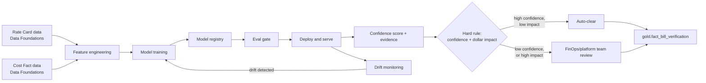

# Solution Architecture: Bill Verification as Exception-Based Review

Phase 4 of the platform sequenced in [FinOps Solution Overview.md](FinOps%20Solution%20Overview.md). Bill verification originated as a problem statement in [Solution_Architecture_MLOps_Pipeline.md](Solution_Architecture_MLOps_Pipeline.md) §1.1 — this document gives it the dedicated architectural treatment that document deliberately deferred, per the Solution Overview's Sub-Document Index and ADR-M4 there: extend the MLOps pattern (feature store, eval gate, versioned model) rather than invent a separate one.

Requirements and specifics below are **inferred** from `FinOps Current State.md`'s description of today's manual reconciliation process and `FinOps Opportunities.md` §2d, not confirmed the organization fact. Companion: [Platform_Build_Specification.md](Platform_Build_Specification.md) §3 (gold-layer schema only — a dedicated build section, matching §5/§6's pattern for Cloud Workbench/Governed Automation, is not yet added).

---

## 1. Executive Summary

Today, bill verification is a fully manual step: a reviewer checks that cloud vendor billing looks accurate before it flows into PO creation and chargeback (`FinOps Current State.md`'s Payment & Chargeback process). This document converts that into **exception-based review**: a model reconciles every invoiced line item against contracted rates and expected usage, producing a confidence score and supporting evidence per line item, and a hard rule routes high-confidence/low-impact items to auto-clear while everything else — low-confidence or high-dollar-impact, regardless of confidence — always goes to a human. This doesn't remove the human from bill verification; it shifts their time from 100% line-by-line confirmation to the genuinely ambiguous or high-value exceptions.

This is deliberately **not** automation replacing the human, and deliberately **not** the same thing as PO auto-drafting. A confidence-scored, evidence-attached verification result is what would make auto-drafting a PO from that data defensible later — but that's a separate, downstream, GenAI-based capability (see §2.4's non-goals and the Solution Overview's Sub-Document Index), out of scope here.

## 2. Business Context & Requirements

### 2.1 Problem statement (inferred)

Following bill verification and contract association, POs are entered into the relevant system and cloud vendors are paid, with owning departments charged back one month in arrears (`FinOps Current State.md`). Today's verification step is a true pass/fail (or fully manual) check — Current State describes no existing confidence-scoring behavior, so this model is genuinely net-new, not a productionization of something the stored procedures already approximate. Reconciliation compares an invoiced line item against two things: the **contracted rate** for that provider/service (not the same as the provider's list price), and **expected usage** (derived from the same gold-layer usage data every other phase reads from). A mismatch on either axis is a candidate exception.

### 2.2 Functional requirements (inferred)

- FR1: Reconcile every invoiced cost line item against its applicable contracted rate (Data Foundations' `RATE_CARD` entity, §4.1/§4.3/§4.4 there) and expected usage, producing a confidence score plus supporting evidence (matching rate-card entry, historical rate comparison, delta explanation) per line item.
- FR2: Route by a hard rule combining confidence and dollar impact — high-confidence **and** low-dollar-impact items auto-clear; low-confidence **or** high-dollar-impact items always route to a human, regardless of model confidence. Not a tunable threshold, the same pattern Governed Automation uses for HIGH-risk actions (Governed Automation FR2).
- FR3: The human review queue routes to the **FinOps/platform team** — the same team that performs this reconciliation manually today (`FinOps Current State.md`); this is a continuation of existing ownership, not a new team introduced by this design.
- FR4: Every verification result (auto-cleared or human-reviewed) is written back to `gold.fact_bill_verification` (Data Foundations §4.3) with its confidence score, evidence, and final status — queryable by Cloud Workbench and reportable through the same BI path as every other gold fact.
- FR5: A verified line item is what a future PO-drafting capability would consume as input (see §2.4) — this document's output has to be trustworthy and evidenced enough to defensibly support that later, even though drafting itself is out of scope here.

### 2.3 Non-functional requirements (inferred)

| Requirement | Target (inferred) | Rationale |
|---|---|---|
| Explainability | Every confidence score accompanied by structured evidence (rate-card match, historical comparison, delta), not a bare number | A financial reconciliation a reviewer can't verify is one they won't trust enough to act on the auto-clear boundary |
| Auditability | Every verification result, human or automatic, logged with before-state (invoiced) and reference-state (contracted), reviewer identity where applicable, and model version | Same HITRUST/SOC2-equivalent posture as the rest of the platform |
| Data freshness | Bounded by provider billing lag (~24h), same ceiling as Data Foundations | No downstream phase can promise fresher data than its source |
| Review latency | Queued for FinOps/platform team review, no fixed SLA assumed | Human review time isn't this platform's to promise, same reasoning as Governed Automation's Approval latency NFR |

### 2.4 Non-goals (inferred)

- **Not PO auto-drafting.** Bill Verification's confidence-scored output is a prerequisite input for a future PO-drafting capability, not part of the same pipeline. That capability — sketched components: a drafting template/skill, the verified line-item data, GenAI to produce a proposed PO, a verifier of the produced output, a human approval step, a database for output/approvals/verifications, and (if possible) a means to post the approved PO to the relevant system — is scoped separately (Solution Overview's Sub-Document Index, "PO Auto-Draft," not yet designed) and most naturally built as a Cloud Workbench-adjacent tool once that agentic infrastructure exists.
- Not a contract-management system. This document consumes contracted rate data (Data Foundations §4.1); it doesn't manage, author, or negotiate contracts.
- Not a replacement for human judgment on ambiguous or high-dollar-impact items — FR2's hard rule guarantees a human sees those regardless of model confidence.

---

## 3. Architecture

### 3.1 Technology stack

Per ADR-1 below, this reuses MLOps Pipeline's stack directly rather than standing up a parallel one — see MLOps Pipeline §2.1 for the full rationale of each choice.

| Component | Choice | Rationale |
|---|---|---|
| Training/experimentation compute | Snowpark ML | Same as MLOps Pipeline §2.1 — co-located with gold-layer tables, no cross-cloud data egress |
| Feature store | Snowflake Feature Store (Snowpark ML) | Same instance MLOps Pipeline uses — no second, parallel feature store for a fourth model family |
| Experiment tracking & model registry | Snowflake Model Registry (Snowpark ML) | Same registry, one more model family in its scope (ADR-M4) |
| Model serving | Docker containers on AKS | Same runtime as every other model, MLOps Pipeline §2.5 |
| Drift detection | Evidently AI, scheduled Snowpark job | Same tooling as MLOps Pipeline §2.1 |
| Observability/alerting | Datadog (Teams channel + ITSM ticket/page) | The platform-wide shared baseline, Data Foundations §4.5 — no bill-verification-specific alerting path |

### 3.2 Feature engineering

Features are computed from Snowflake's gold-layer tables (Data Foundations §4.3), specifically `gold.dim_rate_card` and `gold.fact_cost_daily`, following the same discipline MLOps Pipeline §2.2 established: a feature that duplicates a named semantic-layer metric is a second, driftable copy of it, regardless of which layer computes the duplicate.

| Feature | Captures | Source |
|---|---|---|
| `rate_delta_pct` | % difference between invoiced unit rate and the applicable `RATE_CARD` entry | Gold (rate-card join, ML-specific transform) |
| `historical_rate_stability` | How much this provider/service's contracted rate has moved over recent periods — a line item priced consistently with recent history is lower-risk than one that isn't | Gold (ML-specific transform) |
| `usage_qty_variance` | Deviation between invoiced usage quantity and expected usage from `fact_cost_daily`'s own historical pattern | Gold (ML-specific transform) |
| `rate_card_coverage` | Whether this line item's provider/service/date range has a matching `RATE_CARD` entry at all, or falls in a gap | Gold (rate-card join) — a genuine coverage gap is itself evidence, not a missing feature |
| `dollar_impact` | Absolute $ value of the line item — not a model input to the confidence score itself, but the second axis FR2's hard rule routes on | Gold (`fact_cost_daily`) |

### 3.3 Model selection and training

A classification/regression model producing a confidence score per line item, chosen for explainability over black-box approaches — same reasoning as MLOps Pipeline §2.3's anomaly detection choice, and more important here given the governance stakes of a financial reconciliation: every score must show its contributing factors (§3.2's features), not just a number. This is deliberately **not** an LLM/GenAI approach — reconciliation here is a structured, feature-based scoring problem with a known-correct answer to train against (historical human verification outcomes), not a generative task. GenAI enters this workflow later, in the separate PO Auto-Draft capability (§2.4), not here.

### 3.4 MLOps lifecycle, serving, and observability

Identical to MLOps Pipeline §2.4–§2.6 — versioning in the Snowflake Model Registry, an eval gate against a held-out validation set before promotion, data/model drift monitoring on the same cadence, model serving on AKS, and Datadog-based observability routed through the platform's shared Teams + ITSM channels (Data Foundations §4.5). Not re-derived here; see those sections for the mechanics.

### 3.5 Routing and human review

`route_verification_result` (the hard rule, FR2): high-confidence and low-dollar-impact → auto-clear, written to `gold.fact_bill_verification` with `status = 'auto_cleared'`. Anything else → queued for the **FinOps/platform team** (FR3), the same reviewers who perform this manually today. A reviewed item is written back with `status = 'reviewed_cleared'` or `'reviewed_flagged'`, the reviewer's identity, and a timestamp — the same audit shape Governed Automation's approval queue uses for its own human-review step, applied here to a financial rather than an infrastructure decision.

---

## 4. AI Governance

This model trains and scores on cloud cost, usage, and vendor rate data — not personal data, and it doesn't drive a consequential decision about a person. The same reasoning MLOps Pipeline §3 applies in full: no DPIA is triggered on current understanding, the affected parties for fairness purposes are business verticals and vendors rather than demographic groups, every output is a proposal a human can override (human-on-the-loop for auto-cleared items, human-in-the-loop for everything FR2 routes to review), and the same NIST AI RMF / ISO 42001-style documentation habits (model card, versioned everything) apply — see MLOps Pipeline §3.1–§3.5 for the full treatment, not repeated here.

One wrinkle specific to this domain, worth naming rather than silently inheriting: this model's outputs directly gate a **financial** transaction (a vendor gets paid, or doesn't, on the strength of an auto-clear decision) in a way anomaly detection and rightsizing don't — a false auto-clear has a more direct dollar consequence than a missed anomaly flag. FR2's hard rule (dollar-impact as a mandatory second axis, not just confidence) is the design response to that; it isn't a governance gap, but it's the reason that rule exists rather than a confidence threshold alone.

---

## 5. Architecture Decision Records

**ADR-1: Extend the MLOps Pipeline pattern rather than build a separate reconciliation pipeline**
- *Context*: Bill verification's confidence-scored, evidence-attached, impact-routed shape is structurally the same as anomaly detection and rightsizing (Solution Overview ADR-M4).
- *Decision*: Reuse MLOps Pipeline's feature store, model registry, eval gate, and observability stack directly (§3.1–§3.4), rather than standing up parallel infrastructure.
- *Alternatives considered*: A separate reconciliation-specific pipeline, rejected — no operational discipline is genuinely different here, only the feature set and the routing rule's second axis (dollar impact vs. blast radius).
- *Consequences*: One more model family in an already-established pipeline; no new infrastructure to operate.

**ADR-2: Route on confidence *and* dollar impact, as a hard rule, not confidence alone**
- *Context*: A confidence-only threshold would auto-clear a high-confidence but high-dollar-impact item — a wrong call there is materially more expensive than a wrong call on a small one.
- *Decision*: FR2's hard rule requires both high confidence **and** low dollar impact for auto-clear; either condition failing routes to a human, regardless of the other. Same pattern as Governed Automation's HIGH-risk hard rule (never a scored threshold for the highest-stakes case).
- *Alternatives considered*: A single confidence threshold, rejected for the reason above. A single dollar-impact threshold with no confidence component, rejected — would auto-clear plausible-looking but genuinely wrong low-dollar items at volume, eroding trust in the auto-clear path generally.
- *Consequences*: More items route to human review than a confidence-only design would produce, a deliberate tradeoff of reviewer time against auto-clear risk on the items that matter most.

**ADR-3: Route human review to the FinOps/platform team, not a separate function**
- *Context*: `FinOps Current State.md` flags reconciliation-verification ownership as an unconfirmed RACI gap today, but bill verification currently happens somewhere within FinOps's existing process.
- *Decision*: The exception queue routes to the FinOps/platform team — continuing existing ownership rather than introducing Accounts Payable, Finance, or Procurement as a new reviewing function.
- *Alternatives considered*: Routing to AP/Finance, rejected for this design — no evidence those teams currently touch this step, and introducing a new team's tooling/access needs is a bigger change than this document's scope. Revisit if the organization's actual process differs.
- *Consequences*: No new team's RBAC/notification integration to design; FR3's queue reuses whatever access the FinOps/platform team already has elsewhere in this platform.

**ADR-4: Treat vendor rate data as net-new ingested data, not an assumed-existing integration**
- *Context*: Reconciliation has nothing to check against without contracted rates in queryable form; no existing the organization system is known to expose this.
- *Decision*: Model vendor rate data as a new Data Foundations source (§4.1's `RATE_CARD` addition) — functional data required for this model to work, not a reference/lookup table treated as an afterthought.
- *Alternatives considered*: Assuming an existing procurement/contract-management system already exposes this in integrable form, rejected — no such system is confirmed, and assuming one invites building against a system that may not exist as imagined. Deferring the whole document until that source is confirmed, rejected — the architecture around it (feature engineering, model, routing) doesn't depend on exactly which system it comes from, only that it exists in gold.
- *Consequences*: Ingestion pipeline/source-system specifics for rate data remain an open item pending the organization confirmation (see Data Foundations §4.1's note); the model architecture itself isn't blocked on that answer.

---

## 6. Glossary

**Auto-clear** — A bill-verification result routed to automatic acceptance without human review, per FR2's hard rule.

**Bill verification** — Reconciling invoiced cost line items against contracted rates and expected usage; the subject of this document.

**Confidence + evidence-scored reconciliation** — Producing both a confidence score and structured supporting evidence (rate-card match, historical comparison, delta explanation) per line item, rather than a bare pass/fail or a bare number.

**PO Auto-Draft** — A separate, downstream, GenAI-based capability that would consume Bill Verification's output to propose purchase orders; not designed in this document — see the Solution Overview's Sub-Document Index.

**Rate Card** — The contracted unit rate for a provider/service over an effective date range; the reference this document reconciles invoiced line items against. Implemented as `gold.dim_rate_card` (Data Foundations §4.3) and the `RateCard` ontology entity (Data Foundations §4.4, Build Specification §4).
