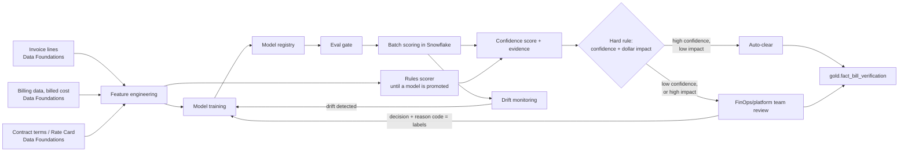

# Solution Architecture: Bill Verification as Exception-Based Review

Phase 4 of the platform sequenced in [FinOps Solution Overview.md](FinOps%20Solution%20Overview.md). The bill verification problem is introduced in [Solution_Architecture_MLOps_Pipeline.md](Solution_Architecture_MLOps_Pipeline.md) §1.1; this document designs it. Following ADR-M4 in the Solution Overview, it extends the MLOps pattern (feature store, eval gate, versioned model) instead of creating a separate one.

Requirements below are **inferred** from `FinOps Current State.md`'s description of today's manual reconciliation and from `FinOps Opportunities.md` §2d. They are not confirmed the organization facts. Companion: [Platform_Build_Specification.md](Platform_Build_Specification.md) §3 (gold-layer schema) and §10 (jobs, function signatures, review-queue table).

---

## 1. Executive Summary

Today, bill verification is manual: a reviewer checks that cloud vendor billing looks right before it moves on to PO creation and chargeback (`FinOps Current State.md`, Payment & Chargeback). This document turns that into **exception-based review**. Every provider invoice line is reconciled against the billing data behind it, the organization's contract terms, and expected usage, and gets a confidence score with supporting evidence. A hard rule then routes it: high confidence and low dollar impact auto-clears, and anything with low confidence or high dollar impact goes to a person. Reviewers stop confirming every line and spend their time on the ambiguous or high-value exceptions.

A person stays in the process, and this is not PO auto-drafting. A scored, evidenced verification result is what later makes drafting a PO from this data defensible, but drafting is a separate GenAI capability (§2.4, [Solution_Architecture_PO_Auto_Draft.md](Solution_Architecture_PO_Auto_Draft.md)).

## 2. Business Context & Requirements

### 2.1 Problem statement (inferred)

After bill verification and contract association, POs are entered, vendors are paid, and owning departments are charged back one month in arrears (`FinOps Current State.md`). Today's verification is manual or pass/fail. Current State describes no confidence scoring, so this capability is new, not a rebuild of something the stored procedures already do.

The unit being verified is an **invoice line** from the provider's actual invoice, not a row of daily usage data. Each invoice line is compared against three things:

1. **The billing data behind it.** The invoiced amount should equal `SUM(billed_cost)` of the `gold.fact_cost_daily` rows with the same `invoice_id` and charge type. The comparison uses billed cost, not amortized cost, because billed cost is what the invoice charges (Data Foundations §4.3, cost basis).
2. **The organization's contract terms.** Negotiated pricing, enterprise discounts (AWS EDP, Azure MACC/EA, GCP commitments), private pricing, and credits owed should all be applied. FOCUS exports already carry `ContractedUnitPrice` per row where the provider supports it. `RATE_CARD` holds the terms the export doesn't carry, so the check is whether each term was applied, not a re-pricing of every SKU.
3. **Expected usage.** Consumed quantity compared with that account's and service's own history.

A mismatch on any of the three is a candidate exception. Tax, support, marketplace, and commitment purchase lines are verified the same way; they appear on the invoice even though most have no resource attached.

### 2.2 Functional requirements (inferred)

- FR1: Reconcile every provider invoice line (`gold.fact_invoice_line`, Data Foundations §4.1, §4.3) against the billed cost behind it, the applicable contract terms (`RATE_CARD`), and expected usage. Produce a confidence score and evidence per line: the invoice-to-billing delta, contract terms applied or missing, and the usage comparison.
- FR2: Route with a hard rule on confidence and dollar impact. High confidence **and** low dollar impact auto-clears. Low confidence **or** high dollar impact always goes to a person. This is a fixed rule, not a tunable threshold, the same pattern Governed Automation uses for HIGH-risk actions (Governed Automation FR2).
- FR3: Send the review queue to the **FinOps/platform team**, the team that does this reconciliation today (`FinOps Current State.md`). Ownership doesn't change.
- FR4: Write every result, auto-cleared or reviewed, to `gold.fact_bill_verification` (Data Foundations §4.3) with its score, evidence, and final status, so Cloud Workbench and BI can use it like any other gold fact.
- FR5: Produce verified lines that are evidenced well enough for PO Auto-Draft to consume later (§2.4).

### 2.3 Non-functional requirements (inferred)

| Requirement | Target (inferred) | Rationale |
|---|---|---|
| Explainability | Every confidence score comes with structured evidence (billing delta, contract terms, usage comparison) | Reviewers won't trust auto-clear on a reconciliation they can't check |
| Auditability | Every result, human or automatic, logged with the invoiced amount, the billed cost it was compared against, the contract terms checked, reviewer identity where applicable, and scorer version | Same HITRUST/SOC2-equivalent posture as the rest of the platform |
| Data freshness | Bounded by provider billing lag (~24h) | No phase can offer fresher data than its source |
| Review latency | Queued for FinOps/platform team review, no fixed SLA assumed | Human review time isn't the platform's to promise, as with Governed Automation's approval latency |

### 2.4 Non-goals (inferred)

- **Not PO auto-drafting.** Bill Verification's output is an input to PO drafting, which is designed separately in [Solution_Architecture_PO_Auto_Draft.md](Solution_Architecture_PO_Auto_Draft.md).
- Not a contract-management system. This document reads contract terms (Data Foundations §4.1); it doesn't author, manage, or negotiate contracts.
- Not a replacement for human judgment on ambiguous or high-dollar items. FR2 guarantees a person sees those.

---

## 3. Architecture

### 3.1 Technology stack

Reuses MLOps Pipeline's stack (ADR-1). MLOps Pipeline §2.1 explains each choice.

| Component | Choice | Rationale |
|---|---|---|
| Training/experimentation compute | Snowpark ML | Same as MLOps Pipeline §2.1: next to the gold-layer tables, no data movement |
| Feature store | Snowflake Feature Store (Snowpark ML) | The same feature store MLOps Pipeline uses |
| Experiment tracking & model registry | Snowflake Model Registry (Snowpark ML) | The same registry, with one more model family (ADR-M4) |
| Scoring compute | Snowpark stored procedure (rules), then Snowflake Model Registry inference once a model is promoted | Verification runs when invoice lines arrive or a billing period is restated, a batch workload with no latency requirement. Scoring in Snowflake keeps invoice and contract data under the same access policies as the rest of gold (MLOps Pipeline §2.5, ADR-008) |
| Drift detection | Evidently AI, scheduled Snowpark job | Same tooling as MLOps Pipeline §2.1 |
| Observability/alerting | Datadog, Teams channel, ITSM ticket or page | The platform's shared baseline (Data Foundations §4.5) |

### 3.2 Feature engineering

Features come from gold-layer tables (Data Foundations §4.3): `gold.fact_invoice_line`, `gold.fact_cost_daily` (billed cost), and `gold.dim_rate_card`. As in MLOps Pipeline §2.2, a feature that duplicates a semantic-layer metric reads that metric instead of recomputing it.

| Feature | Captures | Source |
|---|---|---|
| `invoice_to_billing_delta_pct` | % difference between the invoice line's amount and `SUM(billed_cost)` of the billing rows with the same `invoice_id` and charge type | Gold (invoice-to-billing join) |
| `rate_delta_pct` | % difference between the `contracted_unit_price` on the underlying billing rows and the price the applicable `RATE_CARD` terms imply | Gold (rate-card join, ML-specific transform) |
| `expected_term_missing` | Whether a discount, private price, or credit that `RATE_CARD` says applies to this billing account and period is missing from the invoice | Gold (rate-card join) |
| `historical_rate_stability` | How much this provider and service's contracted rate has moved recently. A line priced like recent history is lower risk | Gold (ML-specific transform) |
| `usage_qty_variance` | How far the `consumed_quantity` behind the invoice line is from that account and service's own history in `fact_cost_daily` | Gold (ML-specific transform) |
| `rate_card_coverage` | Whether any `RATE_CARD` terms exist for this line's billing account, service, and dates. A gap is evidence in its own right | Gold (rate-card join) |
| `dollar_impact` | Absolute $ value of the invoice line. Not an input to the confidence score; it is the second axis FR2 routes on | Gold (`gold.fact_invoice_line.invoiced_amount`) |

### 3.3 Model selection and training

**No labeled history exists at launch.** Today's check is manual and unscored (§2.1), so there are no recorded "cleared" or "flagged" outcomes to train on. The design starts with rules and moves to a model in three stages:

1. **Rules only, everything reviewed (label collection).** A deterministic scorer turns §3.2's checks into a confidence score: invoice total within tolerance of billed cost, no expected contract term missing, contract terms on file, usage within its historical band. Scores are shown, but every invoice line still goes to a person for at least three full billing cycles across all three providers. Each review records a decision (`reviewed_cleared` or `reviewed_flagged`) and a reason code (`rate_mismatch`, `missing_discount`, `missing_credit`, `usage_spike`, `billing_data_mismatch`, `other`). These reviews are the label set.
2. **Rules with auto-clear.** Auto-clear under FR2 turns on only if, during label collection, no line the rules would have auto-cleared was flagged by a reviewer. Otherwise tolerances are tightened and the period is extended.
3. **Model, once labels support one.** Discrepancies are rare, so the trigger is the number of flagged lines, not total reviews (default: at least 100 `reviewed_flagged` lines). The model is an explainable classifier (for example, gradient-boosted trees with per-feature attributions) trained on the reviewed lines. It is promoted only if, on held-out reviewed lines, it produces no more false auto-clears than the rules at the same auto-clear rate. Past provider billing disputes, support cases, and credits received can serve as extra flagged examples if records exist (an assumption to validate).

The model family is chosen for explainability, for the same reason as MLOps Pipeline §2.3, and it matters more for a financial reconciliation: every score must show its contributing factors (§3.2). This is not an LLM or GenAI problem; reconciliation is structured, feature-based scoring. GenAI appears later in the workflow, in PO Auto-Draft (§2.4).

### 3.4 MLOps lifecycle, serving, and observability

The same as MLOps Pipeline §2.4–§2.6: versioning in the Snowflake Model Registry; an eval gate before promotion (for this model, no more false auto-clears than the rules it replaces, §3.3); data and model drift monitoring on the same cadence; batch scoring inside Snowflake (MLOps Pipeline ADR-008); and Datadog observability through the shared Teams and ITSM channels (Data Foundations §4.5).

### 3.5 Routing and human review

`route_verification_result` applies FR2's hard rule. High confidence and low dollar impact auto-clears and is written to `gold.fact_bill_verification` with `status = 'auto_cleared'`. Everything else is queued for the **FinOps/platform team** (FR3). A reviewed line is written with `status = 'reviewed_cleared'` or `'reviewed_flagged'`, the reviewer's identity, and a timestamp. This is the same audit shape as Governed Automation's approval queue, applied to a financial decision.

---

## 4. AI Governance

The scorer works on cloud cost, usage, and contract data, not personal data, and makes no consequential decision about a person. MLOps Pipeline §3 applies in full: no DPIA is triggered on current understanding; the parties affected for fairness purposes are verticals and vendors, not demographic groups; every output can be overridden by a person (human-on-the-loop for auto-cleared lines, human-in-the-loop for everything routed to review); and the same NIST AI RMF and ISO 42001-style documentation applies (model cards, versioning). See MLOps Pipeline §3.1–§3.5.

One point specific to this domain: the output gates a **financial** step. A vendor gets paid, or not, partly on the strength of an auto-clear, so a false auto-clear costs money more directly than a missed anomaly. FR2's hard rule, which makes dollar impact a mandatory second axis, is the design response to that.

---

## 5. Architecture Decision Records

**ADR-1: Extend the MLOps Pipeline pattern, not a separate reconciliation pipeline**
- *Context*: Bill verification's shape (a score, evidence, and a hard routing rule) matches anomaly detection and rightsizing (Solution Overview ADR-M4).
- *Decision*: Reuse MLOps Pipeline's feature store, model registry, eval gate, and observability (§3.1–§3.4).
- *Alternatives considered*: A separate reconciliation pipeline, rejected. Only the features and the routing rule's second axis (dollar impact instead of blast radius) differ.
- *Consequences*: One more model family in an existing pipeline, and no new infrastructure.

**ADR-2: Route on confidence *and* dollar impact as a hard rule**
- *Context*: A confidence-only threshold would auto-clear a confident but high-dollar line, where a wrong call is much more expensive.
- *Decision*: FR2 requires both high confidence **and** low dollar impact to auto-clear. Failing either sends the line to a person. This matches Governed Automation's HIGH-risk rule.
- *Alternatives considered*: A single confidence threshold, rejected for the reason above. A single dollar threshold with no confidence check, rejected; it would auto-clear low-dollar lines that look plausible but are wrong, at volume, and erode trust in auto-clear.
- *Consequences*: More lines go to review than a confidence-only design would send. That is an intentional trade of reviewer time for lower risk on the lines that matter most.

**ADR-3: Send reviews to the FinOps/platform team**
- *Context*: `FinOps Current State.md` notes that ownership of reconciliation verification is unclear, but the work happens within FinOps today.
- *Decision*: The exception queue goes to the FinOps/platform team, keeping existing ownership. Accounts Payable, Finance, and Procurement are not added as reviewers.
- *Alternatives considered*: Routing to AP or Finance, rejected for this design. Nothing shows those teams touch this step today, and bringing in a new team's tooling and access is outside this document's scope. Revisit if the organization's process differs.
- *Consequences*: No new team's access or notifications to design. The queue uses access the FinOps/platform team already has on the platform.

**ADR-4: Treat invoices and contract terms as new ingested data**
- *Context*: Reconciliation needs two inputs the billing exports don't provide: the provider's invoice lines (what is verified) and the organization's contract terms in queryable form (what they're checked against). FOCUS `ContractedUnitPrice` covers most per-SKU contracted prices, so the contract data needed is narrower than a full rate card: discounts, private pricing, commitment programs, and credits.
- *Decision*: Add invoice lines (`gold.fact_invoice_line`) and contract terms (`RATE_CARD`) as two Data Foundations sources (§4.1), ingested into gold and the ontology like any other source.
- *Alternatives considered*: Waiting to design this until a specific source system is named, rejected. The features, scoring, and routing depend only on the data existing in gold, not on which system supplies it.
- *Consequences*: The data is required either way. Which upstream system feeds the ingestion job is an implementation detail.

---

## 6. Glossary

**Auto-clear**: A verification result accepted without human review under FR2's hard rule.

**Bill verification**: Reconciling provider invoice lines against the billed cost behind them, the organization's contract terms, and expected usage. The subject of this document.

**Confidence + evidence-scored reconciliation**: Producing both a confidence score and structured evidence (billing delta, contract terms, usage comparison) for each line, instead of a bare pass/fail or a bare number.

**Invoice line**: One line of a provider's invoice (usage, tax, support, marketplace, commitment purchase, credit). The unit this document verifies, stored in `gold.fact_invoice_line` (Data Foundations §4.3).

**PO Auto-Draft**: A separate GenAI capability that drafts purchase orders from Bill Verification's cleared lines. Designed in [Solution_Architecture_PO_Auto_Draft.md](Solution_Architecture_PO_Auto_Draft.md).

**Rate Card**: the organization's contract terms per provider and billing account over an effective date range: enterprise discounts, private pricing, commitment programs, and credits owed. It covers what the FOCUS export's `ContractedUnitPrice` doesn't. Stored in `gold.dim_rate_card` (Data Foundations §4.3) and modeled as the `RateCard` ontology entity (Data Foundations §4.4, Build Specification §4).
