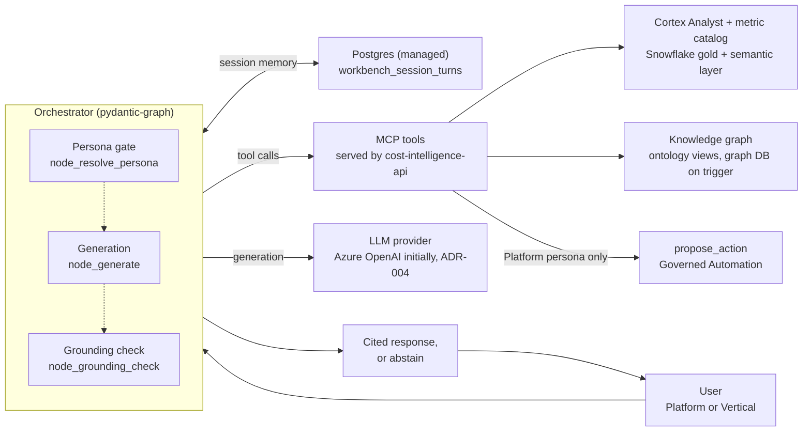
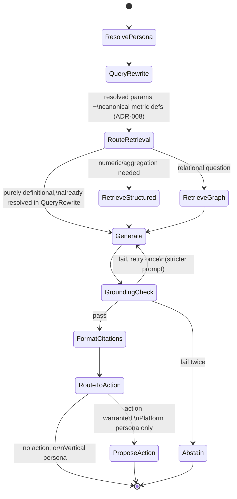
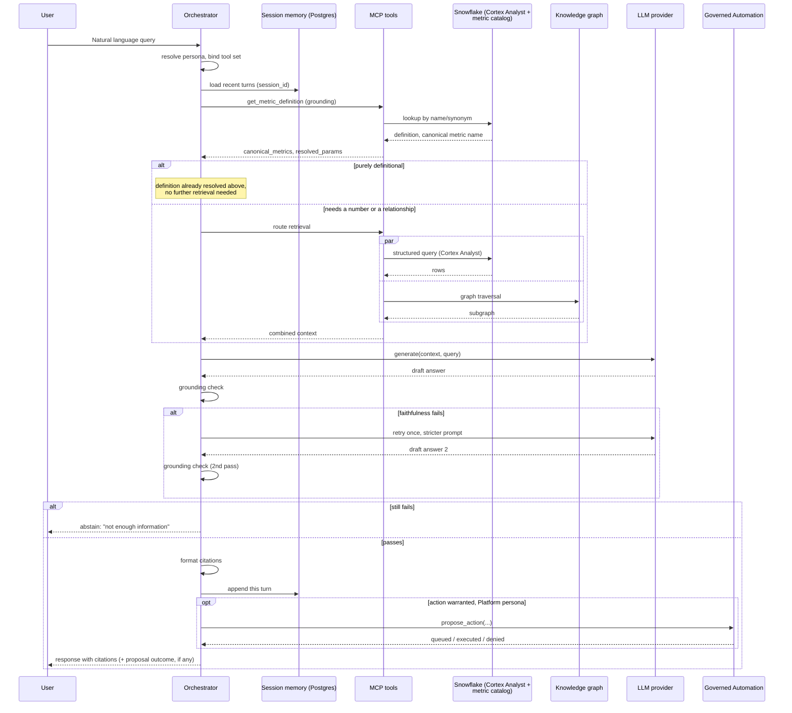

# Solution Architecture: Cloud Workbench

Phase 5 of the platform sequenced in [FinOps Solution Overview.md](FinOps%20Solution%20Overview.md), built after Core Intelligence and the API/dashboards layer (Phase 2, [Solution_Architecture_Self_Serve_Foundations.md](Solution_Architecture_Self_Serve_Foundations.md)) and Governed Automation (Phase 3). The data foundation, ML pipeline, and automation layer are proven through simpler, deterministic surfaces (an API, dashboards) before the agentic layer is added. ADR-M1 in [FinOps Solution Overview.md](FinOps%20Solution%20Overview.md#master-level-architecture-decisions) gives the full reasoning.

**Rollout note.** A read-only pilot of this agent for the FinOps team (Platform persona, read-only tools, no `propose_action`) runs earlier, at migration step 15, once the data foundation and API are validated. Everything else in this document follows Phase 5 (Solution Overview: Migration & Cutover Sequence, ADR-M1).

**A naming note.** This document says **Cloud Workbench**, not the job description's **Internal Assistant**. There is no visibility into how that existing tool is built, and naming this design after it would suggest it describes the real product. Elsewhere in this document set, "Internal Assistant" means the organization's existing tool.

Requirements, org details, and tool choices below are **inferred** from the job description and common enterprise FinOps practice. They are not confirmed the organization facts. Companion: [Platform_Build_Specification.md](Platform_Build_Specification.md) §5.

---

## 1. Executive Summary

**Cloud Workbench** is a natural-language, agentic interface over Data Foundations' conformed cost, usage, and APM data. It serves two personas with different capabilities, resolved from the user's identity before a request is served (§4.1): a business vertical asking about its own spend, and the FinOps/platform team that runs the platform.

For a **Vertical** session, the purpose is specific: let a business vertical ask why its bill looks the way it does ("why did this go up," "why is this resource so expensive") without emailing or calling the FinOps team. It takes over the reactive question load the FinOps team handles by hand today; it doesn't replace the team's reporting or recommendations. In chat, a vertical gets read-only answers about its own data, with no action proposals and no proactive findings (§2.2 FR4, FR5; §4.1). The one place a vertical can propose an action is the separate what-if workbench, by submitting a modeled scenario ([Cloud Workbench Expansion](Solution_Architecture_Cloud_Workbench_Expansion.md) ADR-4), and that proposal goes through the same Governed Automation checks as any other.

For a **Platform** session, it does more: the same Q&A, plus proposing governed actions through Governed Automation's Orchestrator (which asks the Guardrail Engine for a risk classification; see the naming note in `Solution_Architecture_Governed_Automation.md`), plus Core Intelligence's findings surfaced proactively (§2.2 FR4, FR5). This split is a standing rule for the chat surface. It isn't a workaround for an immature automation layer; Governed Automation is live by the time this phase ships.

At its core this is a horizontal platform serving verticals: Cloud Platform Services builds and runs the system, and business verticals use it with the reliability expectations an external API's customers would have.

## 2. Business Context & Requirements

### 2.1 Problem statement (inferred)

Business verticals regularly ask the FinOps team to explain their bills ("why did this go up," "why is this so expensive"), today by email or phone, and each one is a manual lookup for whoever picks it up. By Phase 5, Self-Serve Foundations' API and dashboards give programmatic and BI access to the same data, but a vertical still has to know where to look. Cloud Workbench answers those questions directly, in natural language, without a person handling each one. In chat, action proposals stay Platform-only; verticals can propose only by submitting a what-if scenario from the pull workbench (Cloud Workbench Expansion ADR-4). The FinOps team still decides which recommendations reach a vertical and when, through its existing reports and tools, not through the agent acting for a vertical.

### 2.2 Functional requirements (inferred)

- FR1: Answer natural-language questions over current and historical multi-cloud cost and usage data, scoped correctly to the requesting vertical and accounts.
- FR2: Cite source data in every answer and explain it on request.
- FR3: Handle simple lookups (one metric) and multi-hop questions (a cost trend tied to a specific deployment).
- FR4: Let the agent propose actions (for example, a rightsizing opportunity or opening a ticket), routed through Governed Automation's risk-tiered approval. This document raises the proposal; it doesn't decide whether it executes. **Platform persona only in chat**: a Vertical chat session can ask about a finding but can't propose acting on it (§4.1, ADR-007). Verticals' only proposal path is the what-if workbench (Cloud Workbench Expansion ADR-4).
- FR5: Surface Core Intelligence's anomaly and rightsizing findings proactively, not only on request. **Platform persona only**: this helps the FinOps team spot findings while preparing its standard reports. The agent doesn't push findings to verticals unprompted.
- FR6: Resolve the requester's persona (Platform [FinOps/platform team] or Vertical [business vertical], `FinOps Opportunities.md` §2b) before serving a query, and scope the tool set to match. That covers both which rows each tool returns and which tools (such as cross-vertical benchmarking or action proposals) can be called at all.

### 2.3 Non-functional requirements (inferred)

| Requirement | Target (inferred) | Rationale |
|---|---|---|
| Availability | 99.9% for the query path | Internal verticals are treated as real customers |
| Query latency | p95 under ~4s for a simple query | Conversational UX expectation |
| Data segregation | Hard isolation between verticals' data at query time | Multi-tenant platform with compliance-sensitive data |
| Auditability | Full reconstructable request lifecycle, retained per policy | HITRUST/SOC2-equivalent governance posture |
| Cost of the platform itself | Token and infrastructure cost tracked per request | A FinOps tool should measure its own cost |

### 2.4 Non-goals (inferred)

- Not a general enterprise chatbot. Scope is cloud cost, usage, and operations data.
- Not a replacement for human approval of high-blast-radius infrastructure changes. That authority belongs to Governed Automation.
- No real-time (sub-minute) billing reconciliation, because of Data Foundations' provider billing-lag ceiling.
- **No action-taking or proactive delivery for verticals in chat.** Vertical chat sessions are reactive, read-only Q&A about their own data: no `propose_action`, no unsolicited findings, no cross-vertical benchmarking (§2.2 FR4, FR5; §4.1). This is a standing rule for the chat surface, because a free-form conversation is the wrong place for a vertical to trigger infrastructure changes. Verticals can propose an action, and see anonymized benchmarks, only in the what-if workbench, where a proposal is a specific modeled scenario (Cloud Workbench Expansion ADR-4, FR5).
- **No charts.** The agent returns text, citations, and structured data (tables, numbers), not rendered charts or chart specifications. Charts would require choosing between a declarative chart spec rendered by the client and deferring to Power BI (Data Foundations §4.3), and that isn't decided. For anything beyond a simple number or table, the agent points the user to the relevant Power BI report.
- **Not a second API.** Programmatic access to cost, anomaly, and recommendation data comes from the Phase 2 REST API ([Solution_Architecture_Self_Serve_Foundations.md](Solution_Architecture_Self_Serve_Foundations.md) §4.1). This document adds a conversational surface over the same data.
- **No dedicated long-term memory store.** Long-term recall uses the existing audit log (§4.1), not a memory database, vector store, or summarization pipeline. That is the simplest design that lets a user come back days later and pick up context.

---

## 3. Architecture Overview

### 3.1 Component architecture (the harness)

Everything the orchestrator depends on to answer a query, not only the model call.

The persona gate, grounding check, and Platform-only path to `propose_action` are the guardrails. The dotted lines show where the node flow passes through them; §3.2 shows the actual decision points. The orchestrator and MCP tools run in the same deployable as the Self-Serve REST API (`cost-intelligence-api`, Build Specification §7-8), so the agent's tools and the programmatic API share one governed backend. Session memory lives in the platform's single managed Postgres instance, and there is no retrieval cache at launch (ADR-003, ADR-009). There is no vector index either: definitional questions are answered by a direct Snowflake lookup against the metric catalog (ADR-006).

### 3.2 Orchestrator state flow (pydantic-graph nodes)

The decision points inside the orchestrator box above.

Three details the diagram compresses:

1. The grounding retry is bounded: one retry, then abstain.
2. `RouteToAction` is where FR4's persona gate lives in the graph, not a separate check added afterward.
3. A purely definitional question ("what does RI coverage mean") never reaches a retrieve node. `QueryRewrite`'s grounding step (ADR-008) already looked up the definition while resolving the metric, so `RouteRetrieval` passes it straight to generation.

There is no `Rerank` node, because structured and graph queries return exact results, not a candidate list to re-rank (ADR-001, ADR-006). There is no cache node (ADR-003).

### 3.3 Representative request sequence

The grounding call at the start pays for itself: a definitional question is answered from that one Snowflake lookup, with no further retrieval. Repeat questions re-query Snowflake and the graph, which is accepted until measured latency says otherwise (ADR-003).

### 3.4 State object threaded through the graph

The fields pydantic-graph carries from node to node for one request:

| Field | Set by | Used by |
|---|---|---|
| `persona`, `tool_set`, `prompt_variant` | `ResolvePersona` | Every later node; controls which MCP tools can be called and which system prompt `Generate` uses |
| `conversation_history` (last few turns, from Postgres `workbench_session_turns`) | Loaded at the start of `QueryRewrite` | `QueryRewrite` (resolving references like "it") |
| `resolved_params` (vertical, account, time range) | `QueryRewrite`, grounded against the ontology's entity resolution (ADR-008) | `RouteRetrieval`, and the MCP tool calls it makes |
| `canonical_metrics` (Semantic View metric names and definitions the query references) | `QueryRewrite`, grounded against Data Foundations' Semantic Views through `get_metric_definition` (ADR-008) | `RouteRetrieval` (decides whether more retrieval is needed), `Generate` |
| `retrieved_context` (per source: structured or graph; absent for a purely definitional question) | `RetrieveStructured` / `RetrieveGraph` | `Generate` |
| `grounding_attempts` (int, starts at 0) | `GroundingCheck` | Bounds the retry loop in §3.2: incremented on each failure, forces `Abstain` once it exceeds 1 |
| `citations` | `FormatCitations` | Final response payload |

Long-term recall isn't part of this per-request state. It is a separate, on-demand query against the audit log (§4.1).

---

## 4. Layer-by-Layer Design

### 4.1 AI consumption layer (Cloud Workbench: RAG + agentic orchestration)

- **Persona resolution (FR6).** The first node (`node_resolve_persona`, Build Specification §5) resolves the requester's persona, **Platform** (FinOps/platform team) or **Vertical** (a business vertical, `FinOps Opportunities.md` §2b), from identity, before any retrieval. It sets two things for the rest of the request: the MCP tool set the agent may call, and the system prompt (the Vertical prompt tells the model not to speculate about or reveal another vertical's figures, even if asked).
  - **Vertical** gets read-only Q&A about its own data: `get_cost_by_account`, `get_anomalies`, `query_graph`, and `get_metric_definition`, each limited by row access policy to its own vertical and accounts (Data Foundations §4.3). These are the tools that answer "why did this go up" or "why is this so expensive." Vertical does **not** get `propose_action` (FR4), `get_peer_benchmark` (cross-vertical comparison, beyond explaining its own bill), or proactive findings (FR5). Those aren't filtered versions of tools Vertical has; they are withheld entirely.
  - **Platform** gets everything Vertical has, plus `propose_action`, `get_peer_benchmark`, and FR5's proactive findings.

  ADR-007 explains why this is a graph step and not a prompt instruction.
- **Query understanding and grounding (`node_query_rewrite`).** Resolves references ("it," "that instance") and *grounds* the query against the same governed sources the rest of the platform uses, so retrieval never receives loosely interpreted text:
  - **Metric canonicalization**: "our EC2 bill" resolves to `metric_ec2_spend` and its definition (Data Foundations §4.4) through `get_metric_definition`, a direct SQL/`SEARCH` lookup against Semantic View metadata by name or synonym. Cortex Analyst doesn't have to interpret the phrase on its own, and no embedding search is involved. This applies the same one-definition rule as BI (Data Foundations ADR-002) and the knowledge graph (ADR-004) at the first node, where a silent mismatch would be hardest to catch later. A purely definitional question ("what does RI coverage mean") is answered from this lookup alone (§3.2).
  - **Entity resolution**: "this vertical" or "the payment service" resolves to a `vertical_id` or APM ID using Data Foundations' entity resolution (`resolve_resource_identity()`, §4.4), not a separate guess inside this node.
  - **Time-range resolution**: relative expressions ("last month," "this quarter") resolve to a concrete `DateRange`, which every structured and graph query uses. A wrong resolution here retrieves the wrong period for the whole request.

  ADR-008 explains why grounding happens here instead of being left to Cortex Analyst or the retrieval layer.
- **Session and long-term memory** (ADR-009). Two tiers, both on infrastructure already in the stack:
  - **Session memory (short-term)**: the last few turns of the conversation, in the platform's managed **Postgres** instance (`workbench_session_turns`, keyed on `session_id`, deleted after the session ends). This lets `node_query_rewrite` handle "what about last month instead" without the user restating the vertical or metric. It is read at the start of `node_query_rewrite` and appended to after `node_format_citations`.
  - **Long-term memory**: when a user returns days later and asks "what did we discuss about the payment service last week," the agent queries the existing audit log (`audit.workbench_query_log`, Build Specification §9, Snowflake), which already records every query, retrieved reference, and response with a timestamp. Reusing it avoids a second durable store to secure, scope by role, and keep consistent with the audit trail FR2 already requires.
- **Retrieval.** Two methods: structured queries through **Snowflake Cortex Analyst** (natural language to SQL against gold tables, exposed as an MCP tool, with hand-written queries for cases Cortex Analyst doesn't handle well), and graph traversal over the knowledge graph (ontology views in Snowflake, then a managed graph database once a trigger is met, both behind `query_graph`, Data Foundations ADR-004) for relational questions. There is no embedding-based retrieval. ADR-001 and ADR-006 explain why the small, curated metric catalog doesn't need it, and how definitional questions are answered instead (grounding, above).
- **Orchestration.** A **pydantic-graph** state machine with typed dataclass nodes and edges, chosen for debuggability and a clear audit trail (ADR-002). **MCP** exposes the Data Foundations query tools, the graph traversal tool, and Governed Automation's proposal tool to the agent in a standard, discoverable way.
- **Generation and guardrails.** A grounding (faithfulness) check before any answer reaches a user; citations to the specific gold rows or graph nodes behind each claim; and abstention before generation when a needed metric or entity couldn't be grounded or a needed retrieval returned nothing (`check_retrieval_sufficiency`, Build Specification §5). Model provider: Azure OpenAI initially, behind a provider-agnostic interface, with the final choice per task made by an eval-driven bake-off before Phase 5 (ADR-004). Models are used for generation only; there is no embedding model (ADR-001, ADR-006).

### 4.2 Observability, evaluation, and governance (specific to this phase)

- **Observability**: per-stage tracing (retrieval, generation, action proposal) with OpenTelemetry, exported to Datadog APM, the same backbone as Data Foundations (§4.5) and MLOps Pipeline (§2.6). Token and cost tracking, retrieval quality metrics, and user feedback, which feeds the eval set. Alerts (spikes in grounding failures, eval gate regressions, cost or token thresholds) use the platform's shared channels: a Teams channel plus an ITSM ticket or page (Data Foundations §4.5).
- **Evaluation**: a curated, domain-specific eval set (real cost questions, not generic benchmarks) scored for faithfulness, relevance, and correctness. It must pass before any prompt, retrieval, or model change ships. The FinOps/platform team writes and reviews it from real query patterns, not only synthetic ones. It is version-controlled (`eval_set_cost_queries.yaml`, Build Specification §9) next to the prompt and retrieval configuration it gates, so a change to either shows up in the same diff. It grows from the user-feedback loop above as new query patterns appear.
- **Governance**: full audit logging of every query and proposed action (what was asked, what was retrieved, what was sent to the model, what came back, and any action proposed), with access enforced at the graph and query layer along vertical and account boundaries. Builds on Data Foundations' shared infrastructure and lineage.

### 4.3 AI governance

The full governance treatment (impact screening, human oversight, standards alignment) is in [Solution_Architecture_MLOps_Pipeline.md](Solution_Architecture_MLOps_Pipeline.md) §3 and applies here for the same reason: inputs are cost and usage data and resource and account identifiers, not data about individuals, so nothing here is framed as a legal requirement. Two points are specific to an agentic layer:

- **Faithfulness instead of drift.** A classical model's health is tracked through drift (MLOps Pipeline §2.6). Here, the equivalent is the eval set's faithfulness, relevance, and correctness scores (§4.2), checked on every prompt, retrieval, or model change.
- **AI disclosure.** Users are told they are talking to an AI system, a transparency obligation that applies to a conversational interface and not to a scoring model.

---

## 5. Architecture Decision Records

**ADR-001: Retrieve with structured queries, graph traversal, and a direct catalog lookup, not embedding-based search**
- *Context*: Cost questions come in three shapes: numeric (aggregation), relational (resource-to-account-to-vertical hierarchies), and definitional (metric names and business terms). The definitional material is Data Foundations §4.4's Semantic View metric catalog: a small (about 20 metrics), curated set addressable by name and synonym, not a large or fuzzy free-text corpus where embedding search helps.
- *Decision*: Cortex Analyst for numeric aggregation; graph traversal over the ontology (Snowflake views first, a managed graph database once Data Foundations ADR-004's trigger is met, through the same `query_graph` tool) for relational questions; and a direct lookup against the Semantic View catalog (`get_metric_definition`, ADR-008) for definitional questions. They combine for multi-hop questions: a question that is both definitional and numeric gets its definition in `node_query_rewrite` and its number from a structured query.
- *Alternatives considered*: Hybrid dense-plus-keyword vector search over the catalog, rejected. The catalog is small and structured enough that a direct lookup is simpler and cheaper, and `node_query_rewrite` needs that lookup anyway (ADR-008), so a vector index would be a second mechanism answering the same question. It stays an option if a real free-text corpus (ITSM ticket history, runbooks; placeholder sources in `FinOps Opportunities.md`) is ever scoped, most likely in Cloud Workbench Expansion.
- *Consequences*: One fewer retrieval method, no re-ranking step, lower latency, and no embedding model. The trade-off: a definitional question phrased in a way that matches no metric name or synonym has no semantic-similarity fallback. `get_metric_definition`'s fuzzy matching (ADR-008) has to cover that, and its match quality should be watched as the catalog grows.

**ADR-002: Use pydantic-graph for explicit orchestration, not LangGraph or a higher-level agent framework (such as CrewAI)**
- *Context*: This domain needs debuggable, auditable agent behavior, especially where proposals reach Governed Automation, which rules out looser, more autonomous frameworks. Among explicit-graph options, LangGraph is more established, but this design doesn't use LangChain's abstractions anywhere (tools come through MCP, retrieval goes directly to Cortex Analyst and `query_graph`), so LangGraph's main benefit, LangChain integration, wouldn't be used. The rest of the stack relies on typed, Pydantic-style contracts (MCP tool signatures, the FastAPI-style API). The workflow also doesn't need LangGraph's built-in checkpointing: `propose_action` returns synchronously, and Governed Automation's later outcome reaches the user through a separate notification, not a resumed chat.
- *Decision*: Model the agent's workflow as an explicit graph (state, nodes, edges) with **pydantic-graph**, using typed dataclass nodes and edges consistent with the rest of the stack.
- *Alternatives considered*: CrewAI-style role-based orchestration, rejected for this system; faster to prototype, but harder to audit and debug in production, and better suited to less regulated uses. LangGraph, rejected as the default; its main value goes unused, it brings in LangChain for what is really typed nodes and conditional routing, and its checkpointing solves a persistence problem this workflow doesn't have.
- *Consequences*: More design work per workflow, and every decision path is traceable. A lighter dependency footprint and consistency with the platform's typed contracts, at the cost of a smaller ecosystem: fewer pre-built integrations, a smaller community, and no built-in persistence. If a future requirement (such as resuming a paused conversation after an asynchronous action outcome) needs persistence, it would be built on Postgres, which is already in the stack.

**ADR-003: No retrieval cache at launch; add one only when measured latency requires it**
- *Context*: Repeat questions from the same vertical about the same period re-run the same Snowflake and graph queries. A cache would cut latency and cost, but it is another system to run, and a stale entry can outlive the data it came from after a gold refresh. The platform is expected to be built and run largely by one engineer (Solution Overview, Operating Model).
- *Decision*: Ship without a retrieval cache. Measure p95 latency against the §2.3 target (~4s) and Snowflake query cost per request from the audit log and traces. If either misses, add a cache then, keyed on resolved parameters (vertical, account, time range), never the raw question, so one vertical can never receive another's cached data. Use the managed Postgres instance first, and a managed Redis (Azure Cache for Redis) only if Postgres can't meet the latency.
- *Alternatives considered*: A self-hosted Redis cache from day one, rejected; it adds a system and an invalidation problem before there's evidence repeat-query latency matters at this volume. Caching final answers, rejected in any case; that cache would need flushing on every prompt or model change.
- *Consequences*: Each repeat question costs a Snowflake query. Snowflake's own result cache already returns identical repeated queries without recomputing, which covers part of the benefit at no operating cost.

**ADR-004: Start on Azure OpenAI, keep the model provider behind one interface, and pick the final provider per task through an eval-driven bake-off before Phase 5**
- *Context*: The job description lists four LLM APIs the organization evaluates (Azure OpenAI, OpenAI, Google Gemini, AWS Bedrock). the organization's collaboration and identity footprint is Microsoft (Teams, Power BI, and, assumed, Azure-anchored identity), so Azure OpenAI keeps generation inside the organization's Azure tenant and network boundary under enterprise data-handling terms. But models and pricing change faster than this platform will take to reach Phase 5, so a provider chosen today probably won't be the best choice when Cloud Workbench is built. Models are used only for generation; there is no embedding model (ADR-001, ADR-006).
- *Decision*:
  1. **Initial target: Azure OpenAI**, for development and early evaluation, because it stays inside the Azure boundary.
  2. **One provider interface.** pydantic-graph runs on pydantic-ai, which supports multiple providers. Each node that calls a model (`node_query_rewrite`, `node_generate`, and PO Auto-Draft's `node_draft_po`) reads its provider and model from configuration, so changing either is a configuration change plus an eval run, never a code change.
  3. **Bake-off before the full Phase 5 build (migration step 28).** Run the existing eval set (`eval_set_cost_queries.yaml`, §4.2), which already gates every prompt and model change, against each candidate. Score each on:
     1. Answer faithfulness and correctness.
     2. Tool-calling reliability: correct `query_graph`, `get_metric_definition`, and `propose_action` calls with valid arguments. For an agent this matters as much as answer quality.
     3. p95 latency against the ~4s target (§2.3).
     4. Cost per query at expected volume.
     5. Data-handling terms, residency, and network boundary.
  4. **Choose per task, not one winner.** Query rewriting, answer generation, and PO drafting have different needs; a smaller, cheaper model may win rewriting while a stronger one wins generation.
  5. **Candidates.** Azure OpenAI; other providers' models in Azure AI Foundry's catalog (more choice without leaving the Azure boundary); models hosted in Snowflake Cortex (query data never leaves Snowflake, and Cortex Analyst is already in this design); and, if Azure-hosted options fall short, OpenAI, Google Gemini, and AWS Bedrock directly.
  6. **Re-run on change.** The same gate runs whenever a provider releases a model worth considering, so the choice stays evidence-based after launch.
- *Alternatives considered*: Committing to Azure OpenAI permanently now, rejected; it locks in a choice a year or more early, in the fastest-moving part of the stack. Picking a provider from public benchmarks, rejected; generic benchmarks don't measure grounded answers over the organization's cost data or tool calls against this platform's MCP tools, and the domain eval set does. A separate, one-off bake-off harness, rejected; the eval gate already exists and runs on every model change.
- *Consequences*: The bake-off needs a mature eval set, including tool-calling cases and not only question-answer pairs, before migration step 28; the step 15 read-only pilot is where it grows. Per-task model choice means more than one model configuration to monitor for cost and quality (§4.2 tracks both per request). A provider outside Azure would need its own security and data-handling review before it could win, and that is one of the bake-off criteria.

**ADR-005: Generate structured queries with Snowflake Cortex Analyst, not hand-built text-to-SQL**
- *Context*: ADR-001 requires structured query generation for precise aggregation over gold tables. The data lives in Snowflake, and Cortex Analyst generates SQL from natural language grounded in a defined semantic model (Data Foundations Semantic Views, §4.4).
- *Decision*: Use Cortex Analyst for structured aggregation queries over gold, exposed to the agent as an MCP tool, with a hand-written MCP query tool for cases the semantic model doesn't yet cover.
- *Alternatives considered*: Having the LLM write SQL directly against gold tables, rejected as the default. Cortex Analyst's grounding in the semantic model lowers the risk of malformed or semantically wrong queries more than an ungrounded prompt-to-SQL approach.
- *Consequences*: Query accuracy depends on Cortex Analyst's capability and maturity instead of a custom pipeline. That is acceptable because it is built for exactly this pattern (natural language to SQL over a modeled schema), and the data is already in Snowflake.

**ADR-006: Answer definitional questions with a direct Snowflake catalog lookup, not a vector index**
- *Context*: Definitional questions ("what does RI coverage mean") need the metric catalog in Data Foundations §4.4. The catalog is small, curated, and addressable by name and synonym, and `node_query_rewrite`'s grounding step (ADR-008) already looks up the same catalog directly.
- *Decision*: Answer definitional questions with `get_metric_definition`, a direct SQL/`SEARCH` lookup against Snowflake's Semantic View metadata. It is the same tool `node_query_rewrite` uses to ground metric references (ADR-008). No documentation vector index, embedding model, or index sync job.
- *Alternatives considered*: A Postgres `pgvector` index with keyword search over the catalog (a `docs.semantic_doc_chunks` table populated by an embedding job), rejected. It would duplicate the grounding lookup instead of complementing it, and it adds an index, a sync job, and an embedding model to operate. Provisioning `pgvector` now for a future free-text corpus, rejected as premature; nothing would populate it, and adding it later is cheap compared with running and securing an idle index.
- *Consequences*: No embedding model anywhere in Cloud Workbench. Postgres in this platform holds operational state (Governed Automation ADR-003) and session memory (ADR-009), not a vector index. If a real free-text corpus (ITSM ticket history, runbooks) is scoped later, likely in Cloud Workbench Expansion, revisit this for that corpus specifically.

**ADR-007: Resolve persona and scope the MCP tool set in the orchestration graph, not in a prompt instruction**
- *Context*: `FinOps Opportunities.md` §2b defines two personas, and this document limits Vertical beyond data segregation: Vertical can't call certain tools at all. `propose_action` (FR4), `get_peer_benchmark` (cross-vertical comparison), and proactive findings (FR5) are withheld, not row-filtered. Row access policies (Data Foundations §4.3) control which rows a tool call returns; they don't control which tools can be called.
- *Decision*: Add `node_resolve_persona` as the first step of the pydantic-graph workflow. It resolves persona from identity and binds a persona-specific MCP tool set and system prompt for the rest of the request. The boundary is enforced in the graph, like every other guardrail in this document set (ADR-001's retrieval routing, Governed Automation ADR-001's risk classification), not left to the model to follow a prompt.
- *Alternatives considered*: Telling the model its persona in the prompt while leaving all tools and data available, rejected; it makes the model's judgment the enforcement mechanism for a capability boundary, which this document set rejects everywhere (this document's ADR-001, Governed Automation ADR-001). Relying on row access policy alone, rejected as incomplete; it limits rows within a call but doesn't stop a Vertical request from calling `propose_action` or `get_peer_benchmark` if those tools were in its tool set.
- *Consequences*: One more node and one more piece of request state (the resolved persona), in exchange for a capability boundary enforced the same way as every other guardrail on the platform.

**ADR-008: Ground query rewriting against the semantic layer's metric names and the ontology's entity resolution**
- *Context*: `node_query_rewrite` is the first substantive node after persona resolution, so every later node (retrieval, generation) inherits its output. "Rewrite the query" could mean anything from light reference resolution to nothing, and a naive version would pass the user's phrasing straight to Cortex Analyst and the graph, each interpreting terms like "EC2 bill" or "this vertical" on its own.
- *Decision*: `node_query_rewrite` grounds three things against sources the platform already governs: metric references against Data Foundations' Semantic Views (§4.4), entity references against the ontology's entity resolution (`resolve_resource_identity()`), and relative time expressions into a concrete `DateRange`. §4.1 describes each.
- *Alternatives considered*: Light text cleanup only, leaving interpretation to Cortex Analyst's semantic model, rejected. Cortex Analyst grounds *SQL generation*, but the graph path has no equivalent, so the two retrieval paths could resolve the same term to different entities or metrics. Grounding separately inside each retrieval path, rejected; it recreates the "same term, computed several ways" risk the platform avoids elsewhere (BI, the knowledge graph, ML features), one node earlier.
- *Consequences*: `node_query_rewrite` is heavier: it calls the semantic layer and entity resolution before retrieval, adding latency to every request. That is accepted because a wrong resolution here is wrong for the whole request and can't be fixed by a later node. The same grounding call lets a definitional question be answered without any retrieve node (§3.2, §3.3), which recovers that latency for those questions.

**ADR-009: Two-tier memory: Postgres for session memory, the existing audit log for long-term recall**
- *Context*: FR3's conversational, multi-hop questions ("what about last month instead") need continuity within a session. A user returning days later to ask about a past conversation needs some long-term recall. A naive design would build a dedicated agent-memory database, possibly with embedding search over past conversations, for both.
- *Decision*: Short-term memory is the last few turns of the session, stored in the platform's managed Postgres instance (already used for Governed Automation's operational state) in `workbench_session_turns`, keyed on `session_id` and deleted when the session ends. Long-term recall queries the existing audit log (`audit.workbench_query_log`, Build Specification §9), a durable, timestamped, access-controlled record of every query and response, on demand. Nothing is summarized or re-indexed.
- *Alternatives considered*: A dedicated long-term memory store (a summarization pipeline, or a vector index over past conversations), rejected; the audit log already lets a user get context back days later at this platform's scale, and a purpose-built memory system would be built ahead of a proven need. A flat-file conversation log, rejected; every other durable record on the platform is a governed table with access control and auditing, and a file would be the exception.
- *Consequences*: No new durable store. The audit log's retention and access controls also govern long-term recall, which may need revisiting if recall needs diverge from audit (for example, a different retention period than compliance requires). Session memory is intentionally short-lived: after a session expires, the user restates context, which isn't a governance or correctness problem.

---

## 6. Glossary

**Cortex Analyst**: Snowflake's natural-language-to-SQL capability, grounded in a defined semantic model. Used here for structured aggregation over gold tables (ADR-005).

**GraphRAG**: Retrieval-augmented generation that queries a knowledge graph instead of, or alongside, vector similarity search.

**MCP**: The tool-calling protocol that exposes Data Foundations' query tools and Governed Automation's proposal tool to the Cloud Workbench agent in a standard, discoverable way.

**pydantic-graph**: A typed, dataclass-based graph and state-machine library from the Pydantic team. It runs this document's agent workflow as explicit nodes and edges (ADR-002).

**Session memory**: The last few turns of an active conversation, kept in Postgres (`workbench_session_turns`) so a follow-up question can refer back to them (§4.1, ADR-009).
