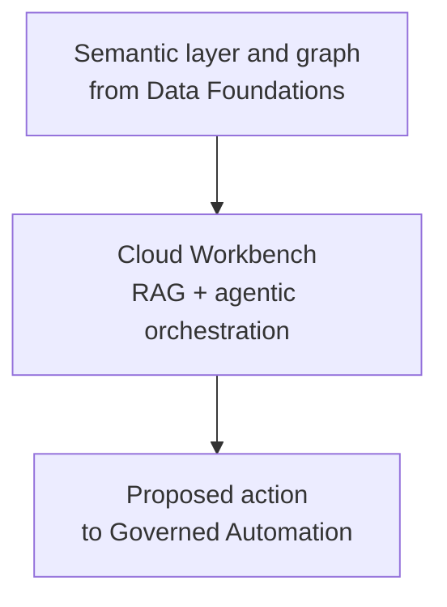
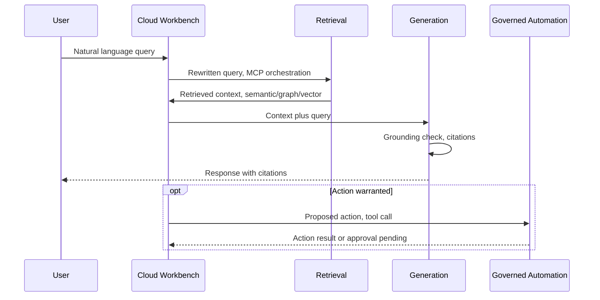

# Solution Architecture: Cloud Workbench

Phase 5 of the platform sequenced in `FinOps Solution Overview.md` — deliberately sequenced *after* Core Intelligence and the API/dashboards layer (Phase 2, `Solution_Architecture_Self_Serve_Foundations.md`) and Governed Automation (Phase 3), not alongside them. An earlier version of this document set placed the conversational/agentic capability in Phase 2; it was moved here per explicit direction to prove the data foundation, ML pipeline, and governed-automation layer through simpler, deterministic surfaces (an API, a dashboard) before investing in the more complex agentic layer. See `FinOps Solution Overview.md` ADR-M1 for the full reasoning.

**A naming note.** The job description this work is grounded in references the organization's actual, existing **Internal Assistant** tool and asks for GenAI capability to be integrated into it. This document deliberately uses a different name, **Cloud Workbench**, for the self-serve product designed here — not because the two are unrelated, but because this document has no real visibility into the existing tool's actual implementation, and naming a hypothetical design "Internal Assistant" would risk reading as a claim to know how the real one works. Read Cloud Workbench as a credible design for what that integration could look like, not a description of the real thing. Elsewhere in this document set (the Opportunities document's push/pull self-serve channels), "Internal Assistant" still refers to the real, existing tool — the two names are deliberately kept distinct.

Requirements, org details, and specific tool choices below are **inferred** from JD language and reasonable enterprise-FinOps practice, not confirmed the organization fact. Companion: `Platform_Build_Specification.md` §5.

---

## 1. Executive Summary

**Cloud Workbench** is a natural-language, agentic interface over the Data Foundations layer's conformed cost, usage, and APM data. Its primary purpose is narrower than "self-serve everything": let a business vertical ask why their bill looks the way it does ("why did this go up," "why is this resource so expensive") without emailing or calling the FinOps team — deflecting the reactive Q&A load the FinOps team currently absorbs manually, not replacing the FinOps team's own reporting and recommendation work. Internal (FinOps/platform team) sessions get a wider capability set, including proposing governed actions that route through Governed Automation — External (vertical) sessions do not, by design; see §2.2's FR4/FR6 and §4.1's persona resolution. This is a deliberate, standing product boundary, not a placeholder for Governed Automation's immaturity — Governed Automation is already live and mature by the time this phase ships.

This is fundamentally a **horizontal-platform-serving-verticals** problem: Cloud Platform Services builds and operates the system; the organization's business verticals are its consumers, treated with the same reliability expectations as an external API's customers would demand.

## 2. Business Context & Requirements

### 2.1 Problem statement (inferred)

Business verticals routinely ask the FinOps team to explain their own bill — "why did this go up," "why is this thing so expensive" — today by email or phone, each one a manual, one-off lookup for whoever on the FinOps team picks it up. By Phase 5, Self-Serve Foundations' API and dashboards (Phase 2) already give programmatic and BI access to the same underlying data, but a vertical still has to know what to look for. Cloud Workbench's scope is answering that class of question directly, in natural language, without a human in the loop for every ask. Governed automated remediation and self-serve action-taking remain Internal-only — the FinOps team continues to be the one deciding what recommendation reaches a vertical and when, via the standardized reports and tools it already uses, not via the agent acting on a vertical's behalf.

### 2.2 Functional requirements (inferred)

- FR1: Natural-language query over current and historical multi-cloud cost/usage data, scoped correctly per requesting vertical/account.
- FR2: Query answers must cite their source data and be explainable on demand.
- FR3: Support both simple lookups (single metric) and multi-hop questions (cost trend correlated with a specific deployment event).
- FR4: Support agent-initiated action proposals (e.g., flagging a rightsizing opportunity, opening a ticket), routed through Governed Automation's risk-tiered approval — this document raises the proposal, it does not decide whether it executes. **Internal persona only** — External sessions can ask about a finding but have no path to propose acting on it (§4.1, ADR-007).
- FR5: Surface Core Intelligence's anomaly/rightsizing findings proactively, not only on-demand. **Internal persona only** — this helps the FinOps team spot findings faster while compiling their own standardized reports; it is not the agent pushing findings to a vertical unprompted.
- FR6: Resolve the requestor's persona (Internal platform team vs. External vertical, `FinOps Opportunities.md` §2b) before serving a query, and scope the available tool set accordingly — not just the row-level data each tool can see, but which tools (e.g., cross-vertical benchmarking, action proposals) are callable at all for that persona.

### 2.3 Non-functional requirements (inferred)

| Requirement | Target (inferred, reasonable for this domain) | Rationale |
|---|---|---|
| Availability | 99.9% for the query path | Internal verticals are treated as real customers |
| Query latency | p95 under ~4s for a simple query | Conversational UX expectation |
| Data segregation | Hard isolation between verticals' data at query time | Multi-tenant horizontal platform, compliance-sensitive |
| Auditability | Full reconstructable request lifecycle, retained per policy | HITRUST/SOC2-equivalent governance posture |
| Cost of the platform itself | Token/infra cost tracked per request | A FinOps team building a FinOps tool must practice what it preaches |

### 2.4 Non-goals (inferred)

- Not a general-purpose enterprise chatbot; scope is cloud cost/usage/ops data.
- Not replacing human approval for high-blast-radius infrastructure changes — that authority lives in Governed Automation, not here.
- Not attempting real-time (sub-minute) billing reconciliation; inherited from Data Foundations' provider-billing-lag ceiling.
- **Not opening action-taking or proactive delivery to verticals.** External sessions are reactive, read-only Q&A about their own data — no `propose_action`, no unsolicited findings, no cross-vertical benchmarking (§2.2 FR4/FR5, §4.1). This is a deliberate, standing product boundary: verticals get self-serve *answers*, not self-serve *action-taking*, even though the underlying automation (Governed Automation) is already mature by this phase.
- **Not generating visualizations/charts.** The agent's output is text, citations, and structured data (tables, numbers) — not rendered charts or a chart specification. Explicitly deferred, not designed here: covering this would mean deciding whether the agent emits a declarative chart spec for client-side rendering, or defers entirely to the existing Power BI path (Data Foundations §4.3), and neither is settled. Anything beyond a simple inline number/table today points the user at the relevant Power BI report.
- **Not replacing Self-Serve Foundations' API.** Programmatic, non-conversational access to cost/anomaly/recommendation data is already served by the Phase 2 REST API (`Solution_Architecture_Self_Serve_Foundations.md` §4.1); this document adds a conversational surface on top of the same underlying data, not a second API.

---

## 3. Architecture Overview

---

## 4. Layer-by-Layer Design

### 4.1 AI consumption layer (Cloud Workbench: RAG + agentic orchestration)

- **Persona resolution (FR6)**: the first node in the workflow (`node_resolve_persona`, Build Specification §5) resolves the requestor's persona — **Internal** (FinOps/platform team) or **External** (a business vertical, `FinOps Opportunities.md` §2b) — from auth/identity context, before any retrieval happens. This sets two things for the rest of the request, not one: the MCP tool set the agent is allowed to call, and the system-prompt variant (External's prompt explicitly instructs the model not to speculate about or reveal another vertical's raw figures even if asked). Concretely:
  - **External** gets read-only Q&A about its own data: `get_cost_by_account`, `get_anomalies`, `query_graph`, and `search_semantic_docs`, all RLS-scoped to its own vertical/accounts (Data Foundations §4.3) — this is what actually answers "why did this go up" or "why is this thing so expensive," so it stays in the tool set. External does **not** get `propose_action` (FR4), `get_peer_benchmark` (cross-vertical comparison, an enrichment beyond explaining one's own bill, deferred), or proactive surfacing (FR5) — none of those are a filtered version of a tool External already has, they're capabilities withheld entirely for this persona.
  - **Internal** gets everything External has, unrestricted by persona, plus `propose_action`, `get_peer_benchmark`, and FR5's proactive surfacing.

  See ADR-007 for why this is enforced as a distinct orchestration step rather than a prompt instruction alone.
- **Retrieval**: hybrid — dense (vector/embedding) search via **Postgres with the pgvector extension**, combined with sparse (keyword/BM25-equivalent) search via Postgres's native full-text search (`tsvector`/GIN index), merged by the cross-encoder rerank step below — deliberately not Snowflake for this leg, see ADR-006; graph traversal over the knowledge graph (Neo4j, per Data Foundations ADR-004) for relational questions; and direct structured query — via **Snowflake Cortex Analyst** for natural-language-to-SQL, exposed as an MCP tool alongside hand-written queries for cases Cortex Analyst doesn't cover well — against gold-layer tables for precise numeric aggregation.
- **Orchestration**: **LangGraph**-style explicit state machine, not a looser framework, chosen for the debuggability and audit-trail requirements this domain demands (see ADR-002). **MCP** exposes the Data Foundations query tools, the graph traversal tool, and the Governed Automation action-proposal tools to the agent in a standardized, discoverable way.
- **Generation & guardrails**: grounding/faithfulness check before any answer reaches a user, citations back to the specific gold-table rows or graph nodes that support each claim, confidence-threshold abstention when retrieval is weak. Model provider: Azure OpenAI (see ADR-004); embedding model: **Azure OpenAI `text-embedding-3-small`**, kept on the same provider as generation to avoid a second vendor integration for no material benefit. Chosen over `text-embedding-3-large` as the default — this indexes a bounded, internal documentation corpus (semantic layer definitions, not open-web scale), and the hybrid design's sparse leg (see above) already covers dense embeddings' weak spot on exact-match terms — with the eval set (§4.2) as the gate that would justify upgrading to `-large` if retrieval quality actually falls short in practice.

### 4.2 Observability, evaluation, and governance (specific to this phase)

- **Observability**: per-stage distributed tracing (retrieval, generation, action-proposal), token/cost tracking, retrieval quality metrics, user feedback capture feeding back into the eval set.
- **Evaluation**: a curated eval set specific to this domain (real cost-querying scenarios, not generic benchmarks), faithfulness/relevance/correctness scoring, required to pass before any prompt, retrieval config, or model change ships.
- **Governance**: full audit logging of every query and proposed action (what was asked, retrieved, sent to the model, returned, and any action proposed), RBAC enforced at the graph/query layer matching vertical/account boundaries — builds on Data Foundations' shared infrastructure and lineage baseline rather than duplicating it.

### 4.3 AI governance

The full model-governance treatment — impact-assessment screening, human oversight mapping, standards alignment — is written once, in `Solution_Architecture_MLOps_Pipeline.md` §3, and applies here by the same reasoning: this system's inputs (cost/usage data, resource and account identifiers) don't concern individuals, so nothing here is framed as a legal requirement, only as adopted governance practice. Two things are specific to this RAG/agentic layer rather than the MLOps document's classical models:

- **Faithfulness as the quality-monitoring analog.** Where a classical model's health is tracked via drift (MLOps Pipeline §2.6), this layer's equivalent is the eval set's faithfulness/relevance/correctness scoring (§4.2) — reviewed on the same change-gating basis (must pass before any prompt, retrieval, or model change ships), not on a separate schedule.
- **AI-interaction disclosure.** A user talking to Cloud Workbench is told they're talking to an AI system, not a human — a transparency obligation specific to a conversational interface that a classical scoring model doesn't have.

---

## 5. Architecture Decision Records

**ADR-001: Use hybrid retrieval (dense vector, sparse keyword, graph, structured query) rather than a single retrieval method**
- *Context*: Cost-querying data is simultaneously numerical/precise (aggregation), relational (resource-to-account-to-vertical hierarchies), and prose-adjacent (documentation, definitions) — and within that prose-adjacent surface, pure embedding search alone tends to miss exact-match needs: specific resource/APM IDs, ticket numbers, or organization-specific terminology that's rare or ambiguous in embedding space.
- *Decision*: Route queries to the appropriate retrieval method — structured query for precise aggregation, graph traversal for relational questions, and a combined dense (vector) + sparse (keyword/BM25) search, fused via the existing cross-encoder rerank step (Build Specification §5's `node_rerank`), for definitional/documentation questions — combined as needed for multi-hop questions.
- *Alternatives considered*: Vector-only retrieval for the documentation leg, rejected — a purely dense approach reliably underperforms on exact-match/rare-term queries this domain will see often, and the existing rerank node is already positioned to merge more than one candidate set with no new orchestration node required. A separate keyword-only search tool exposed to the agent, rejected as unnecessary complexity — hybrid search is implemented inside `search_semantic_docs` (Build Specification §5) rather than adding a tool the agent has to learn to choose between.
- *Consequences*: Slightly more retrieval-side implementation complexity (two indexes — dense and sparse — feeding one reranker) but no new orchestration nodes or agent-facing complexity, and materially better recall on exact-match queries, especially once free-text sources like ITSM ticket history (a plausible future reference data source per `FinOps Opportunities.md`) get indexed.

**ADR-002: Use LangGraph-style explicit orchestration rather than a higher-level agent framework (e.g., CrewAI)**
- *Context*: This domain requires debuggable, auditable agent behavior, especially where action proposals reach Governed Automation.
- *Decision*: Model the agent's workflow as an explicit graph (state, nodes, edges) rather than a more autonomous, less traceable framework.
- *Alternatives considered*: CrewAI-style role-based orchestration, rejected for this specific system — faster to prototype but harder to audit and debug in production, better suited to less regulated use cases.
- *Consequences*: More upfront design work per workflow, but every decision path is traceable for audit and troubleshooting.

**ADR-003: Cache at the resolved-query-parameter level, not the raw question text**
- *Context*: The platform is horizontal, serving multiple verticals with structurally similar but data-scoped-differently questions.
- *Decision*: Cache keys include resolved parameters (vertical, account, time range), never the raw natural-language question alone.
- *Alternatives considered*: Cache on raw query text for simplicity, rejected — risks a cache hit serving one vertical's data to another.
- *Consequences*: Slightly more complex caching logic, eliminates a real cross-tenant data leakage risk.

**ADR-004: Use Azure OpenAI as the primary LLM provider**
- *Context*: The JD lists four viable LLM APIs (Azure OpenAI, OpenAI, Google Gemini, AWS Bedrock) and two agentic frameworks (LangChain, AutoGen) as tooling the organization evaluates.
- *Decision*: Azure OpenAI as the primary generation and embedding provider — the same underlying models as the direct OpenAI API, but under the organization's own tenant/network boundary and enterprise data-handling terms (no training on customer data by default, private networking), which matters more here than model choice alone given the query surface touches cost/usage data across every vertical.
- *Alternatives considered*: Direct OpenAI API, rejected — no material capability gain over Azure OpenAI for this workload, at the cost of the enterprise networking/data-handling boundary. AWS Bedrock and GCP Vertex (Gemini), rejected as *primary*, not on model quality but on the inferred (unconfirmed) assumption that the organization's identity and networking are Azure-anchored, consistent with the rest of this platform's Azure-leaning inferences — worth confirming directly, since a wrong assumption here is a config change, not a redesign, given the orchestration layer stays provider-agnostic (see below).
- *Consequences*: Some vendor lock-in to Azure OpenAI's model family and regional availability; bounded by keeping orchestration (LangGraph/MCP) provider-agnostic, so swapping the underlying model is a configuration change rather than an architecture change.

**ADR-005: Generate structured queries via Snowflake Cortex Analyst rather than hand-rolled text-to-SQL**
- *Context*: ADR-001 already decided this system needs structured query generation for precise numeric aggregation against gold-layer tables. Data Foundations consolidated storage onto Snowflake, and Snowflake's native Cortex Analyst does natural-language-to-SQL grounded in a defined semantic model (the Data Foundations Semantic Views, §4.4).
- *Decision*: Use Cortex Analyst for structured aggregation queries against gold-layer tables, exposed to the agent as an MCP tool, with a hand-written MCP query tool available for cases Cortex Analyst's semantic model doesn't yet cover.
- *Alternatives considered*: Hand-rolled text-to-SQL via the LLM directly against gold tables, rejected as the default — Cortex Analyst's semantic-model-grounded approach reduces the risk of a malformed or semantically-wrong query more than an ungrounded prompt-to-SQL approach would.
- *Consequences*: Query-generation accuracy is bounded by Cortex Analyst's own capability and maturity rather than a fully custom-built pipeline — acceptable since it's purpose-built for exactly this pattern (NL-to-SQL over a modeled schema) and the gold data it queries already lives in Snowflake.

**ADR-006: Use Postgres with pgvector (plus native full-text search) for hybrid retrieval, not Snowflake Cortex Search or a standalone vector database**
- *Context*: ADR-001 needs combined dense+sparse retrieval over the semantic layer's documentation. Snowflake Cortex Search would cover this natively, and was the default in an earlier version of this document, but the explicit direction for this platform is to keep the vector store off Snowflake and off the knowledge graph's database (Neo4j, Data Foundations ADR-004) as well.
- *Decision*: Index the semantic layer's documentation in Postgres: `pgvector` for dense embedding search, native full-text search (`tsvector`, GIN index) for sparse/keyword search — one system covering both retrieval types rather than two. A scheduled job (Build Specification §4/§5) syncs documentation content and embeddings from the Snowflake-sourced semantic layer into Postgres, the same "gold is the source of truth, this store is a resynced derivative" pattern Data Foundations ADR-004 uses for Neo4j.
- *Alternatives considered*: Snowflake Cortex Search, rejected per the platform-wide direction to keep vector search off Snowflake — technically capable, but not the chosen path here. A managed standalone vector database (e.g., Pinecone), rejected as an added operated service and vendor when Postgres already covers both retrieval legs and is a well-understood, commonly self-hosted or managed (e.g., Azure Database for PostgreSQL) piece of infrastructure.
- *Consequences*: One more system to operate and keep synced from the semantic layer, and retrieval quality is now whatever `pgvector`/Postgres full-text search deliver rather than a purpose-built managed search product — an accepted tradeoff given the explicit platform-wide direction driving this choice, and Postgres's maturity for both search modes at this corpus size.

**ADR-007: Resolve persona and scope the MCP tool set in the orchestration graph, not via a prompt instruction**
- *Context*: `FinOps Opportunities.md` §2b defines two personas, and this document deliberately narrows what External can do beyond data segregation alone: it's not just "External sees less data," it's "External cannot call certain tools at all" — `propose_action` (action-taking, FR4), `get_peer_benchmark` (cross-vertical comparison), and proactive surfacing (FR5) are withheld entirely for this persona, not merely row-filtered. Row access policies (Data Foundations §4.3) already handle data segregation within a tool call (which rows a query returns); they say nothing about which tools are callable in the first place.
- *Decision*: Add `node_resolve_persona` as the first step in the LangGraph workflow, resolving persona from auth context and binding a persona-specific MCP tool set and system-prompt variant for the rest of that request — enforced in the orchestration graph, the same place every other guardrail in this document set lives (ADR-001's retrieval routing, Governed Automation ADR-001's risk classification), not left to the model to infer from a prompt and decide whether to comply.
- *Alternatives considered*: A prompt-only distinction (tell the model which persona it's serving, same tools and data available either way), rejected — this asks the model's own judgment to be the enforcement mechanism for a capability boundary, the exact pattern this document set rejects everywhere else (this document's ADR-001, Governed Automation ADR-001). Relying on row access policy alone without tool-set scoping, rejected as incomplete — RLS restricts row-level data within a tool call, but doesn't stop an External request from calling `propose_action` or `get_peer_benchmark` at all if those tools existed in its tool set without their own persona check.
- *Consequences*: One more node and one more piece of request-scoped state (the resolved persona) threaded through the workflow, in exchange for a capability boundary that's enforced the same way as every other guardrail in this platform rather than being the one place prompt compliance is trusted.

---

## 6. Glossary

**Cortex Analyst** — A Snowflake-native natural-language-to-SQL capability, grounded in a defined semantic model; used here for structured aggregation queries against gold-layer tables (ADR-005).

**GraphRAG** — Retrieval-augmented generation that queries a knowledge graph instead of, or alongside, vector similarity search.

**MCP** — The tool-calling protocol exposing Data Foundations' query tools and Governed Automation's action-proposal tools to the Cloud Workbench agent in a standardized, discoverable way.

**pgvector** — A Postgres extension adding vector similarity search; hosts the dense-retrieval leg of this document's hybrid search (ADR-006), alongside Postgres's native full-text search for the sparse leg.
