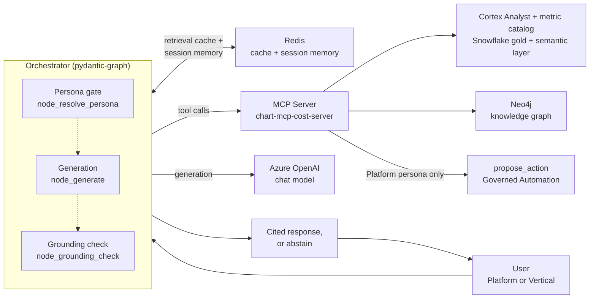
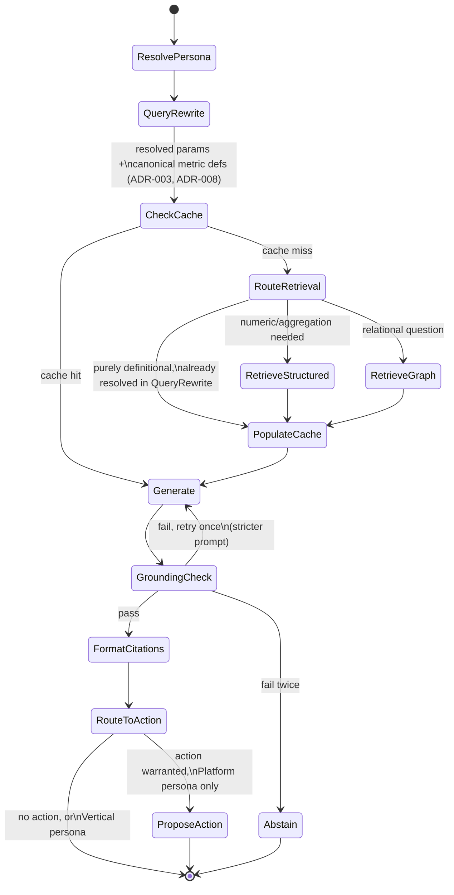
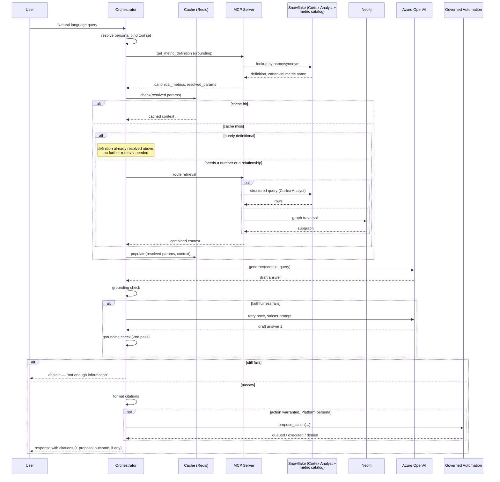

# Solution Architecture: Cloud Workbench

Phase 5 of the platform sequenced in [FinOps Solution Overview.md](FinOps%20Solution%20Overview.md) — deliberately sequenced *after* Core Intelligence and the API/dashboards layer (Phase 2, [Solution_Architecture_Self_Serve_Foundations.md](Solution_Architecture_Self_Serve_Foundations.md)) and Governed Automation (Phase 3), not alongside them. An earlier version of this document set placed the conversational/agentic capability in Phase 2; it was moved here per explicit direction to prove the data foundation, ML pipeline, and governed-automation layer through simpler, deterministic surfaces (an API, a dashboard) before investing in the more complex agentic layer. See [FinOps Solution Overview.md](FinOps%20Solution%20Overview.md#master-level-architecture-decisions)'s ADR-M1 for the full reasoning.

**A naming note.** This document uses **Cloud Workbench**, not the job description's **Internal Assistant**, because this design has no real visibility into that existing tool's actual implementation — naming a hypothetical design after it would misrepresent it as a description of the real thing. Elsewhere in this document set, "Internal Assistant" still refers to the organization's real, existing tool.

Requirements, org details, and specific tool choices below are **inferred** from JD language and reasonable enterprise-FinOps practice, not confirmed the organization fact. Companion: [Platform_Build_Specification.md](Platform_Build_Specification.md) §5.

---

## 1. Executive Summary

**Cloud Workbench** is a natural-language, agentic interface over the Data Foundations layer's conformed cost, usage, and APM data. It serves two personas with different capability sets, resolved from auth/identity context before any request is served (§4.1's persona resolution): a business vertical asking about its own spend, and the FinOps/platform team operating the platform itself.

For a **Vertical** session, Cloud Workbench's purpose is narrower than "self-serve everything": let a business vertical ask why their bill looks the way it does ("why did this go up," "why is this resource so expensive") without emailing or calling the FinOps team — deflecting the reactive Q&A load the FinOps team currently absorbs manually, not replacing the FinOps team's own reporting and recommendation work. It's read-only Q&A about the vertical's own data; it does not get action-proposal or proactive-surfacing capability (§2.2's FR4/FR5, §4.1).

For a **Platform** session, Cloud Workbench gets a wider capability set: the same Q&A, plus proposing governed actions that route through Governed Automation's Orchestrator (which in turn calls the Guardrail Engine for a risk classification — see the naming note at the top of `Solution_Architecture_Governed_Automation.md`), and Core Intelligence's findings surfaced proactively rather than only on-demand (§2.2's FR4/FR5). This is a deliberate, standing product boundary, not a placeholder for Governed Automation's immaturity — Governed Automation is already live and mature by the time this phase ships.

This is fundamentally a **horizontal-platform-serving-verticals** problem: Cloud Platform Services builds and operates the system; the organization's business verticals are its consumers, treated with the same reliability expectations as an external API's customers would demand.

## 2. Business Context & Requirements

### 2.1 Problem statement (inferred)

Business verticals routinely ask the FinOps team to explain their own bill — "why did this go up," "why is this thing so expensive" — today by email or phone, each one a manual, one-off lookup for whoever on the FinOps team picks it up. By Phase 5, Self-Serve Foundations' API and dashboards (Phase 2) already give programmatic and BI access to the same underlying data, but a vertical still has to know what to look for. Cloud Workbench's scope is answering that class of question directly, in natural language, without a human in the loop for every ask. Governed automated remediation and self-serve action-taking remain Platform-only — the FinOps team continues to be the one deciding what recommendation reaches a vertical and when, via the standardized reports and tools it already uses, not via the agent acting on a vertical's behalf.

### 2.2 Functional requirements (inferred)

- FR1: Natural-language query over current and historical multi-cloud cost/usage data, scoped correctly per requesting vertical/account.
- FR2: Query answers must cite their source data and be explainable on demand.
- FR3: Support both simple lookups (single metric) and multi-hop questions (cost trend correlated with a specific deployment event).
- FR4: Support agent-initiated action proposals (e.g., flagging a rightsizing opportunity, opening a ticket), routed through Governed Automation's risk-tiered approval — this document raises the proposal, it does not decide whether it executes. **Platform persona only** — Vertical sessions can ask about a finding but have no path to propose acting on it (§4.1, ADR-007).
- FR5: Surface Core Intelligence's anomaly/rightsizing findings proactively, not only on-demand. **Platform persona only** — this helps the FinOps team spot findings faster while compiling their own standardized reports; it is not the agent pushing findings to a vertical unprompted.
- FR6: Resolve the requestor's persona (Platform persona [FinOps/platform team] vs. Vertical persona [business vertical], `FinOps Opportunities.md` §2b) before serving a query, and scope the available tool set accordingly — not just the row-level data each tool can see, but which tools (e.g., cross-vertical benchmarking, action proposals) are callable at all for that persona.

### 2.3 Non-functional requirements (inferred)

| Requirement | Target (inferred, reasonable for this domain) | Rationale |
|---|---|---|
| Availability | 99.9% for the query path | Internal verticals are treated as real customers |
| Query latency | p95 under ~4s for a simple query | Conversational UX expectation |
| Data segregation | Hard isolation between verticals' data at query time | Multi-tenant horizontal platform, compliance-sensitive |
| Auditability | Full reconstructable request lifecycle, retained per policy | HITRUST/SOC2-equivalent governance posture |
| Cost of the platform itself | Token/infra cost tracked per request | A FinOps team building a FinOps tool must practice what it preaches |

### 2.4 Non-goals (inferred)

- Not a general-purpose enterprise chatbot; scope is cloud cost/usage/ops data.
- Not replacing human approval for high-blast-radius infrastructure changes — that authority lives in Governed Automation, not here.
- Not attempting real-time (sub-minute) billing reconciliation; inherited from Data Foundations' provider-billing-lag ceiling.
- **Not opening action-taking or proactive delivery to verticals.** Vertical sessions are reactive, read-only Q&A about their own data — no `propose_action`, no unsolicited findings, no cross-vertical benchmarking (§2.2 FR4/FR5, §4.1). This is a deliberate, standing product boundary: verticals get self-serve *answers*, not self-serve *action-taking*, even though the underlying automation (Governed Automation) is already mature by this phase.
- **Not generating visualizations/charts.** The agent's output is text, citations, and structured data (tables, numbers) — not rendered charts or a chart specification. Explicitly deferred, not designed here: covering this would mean deciding whether the agent emits a declarative chart spec for client-side rendering, or defers entirely to the existing Power BI path (Data Foundations §4.3), and neither is settled. Anything beyond a simple inline number/table today points the user at the relevant Power BI report.
- **Not replacing Self-Serve Foundations' API.** Programmatic, non-conversational access to cost/anomaly/recommendation data is already served by the Phase 2 REST API ([Solution_Architecture_Self_Serve_Foundations.md](Solution_Architecture_Self_Serve_Foundations.md) §4.1); this document adds a conversational surface on top of the same underlying data, not a second API.
- **Not building a second, purpose-built long-term memory store.** Long-term recall reuses the existing audit log (§4.1's session memory design) rather than a dedicated memory database, vector store, or summarization pipeline — deliberately the simplest thing that satisfies "a user can come back days later and get relevant context back," not a general-purpose agent-memory system.

---

## 3. Architecture Overview

### 3.1 Component architecture (the harness)

Every piece the orchestrator actually depends on to answer a query — not just the model call.

The persona gate, grounding check, and the Platform-only path to `propose_action` are this diagram's guardrails — dotted lines inside the orchestrator box mark where the node flow *passes through* them, not where the real branching logic lives; §3.2 has the actual decision points. Redis is new here relative to §4.1's prose: ADR-003 already decided to cache at the resolved-parameter level, but never named a technology — see ADR-003 for why Redis, not Postgres, hosts it. Postgres/pgvector is gone from this diagram entirely relative to an earlier version — see ADR-006 for why: the corpus it indexed turned out to be a small, curated metric catalog, better served by a direct Snowflake lookup than a separate vector index.

### 3.2 Orchestrator state flow (pydantic-graph nodes)

The actual decision points inside the orchestrator box above — this is what a plain component diagram can't show.

Three things worth naming explicitly since the diagram compresses them: the retry-on-grounding-failure loop is bounded (one retry, then abstain — never an unbounded loop); `RouteToAction` is where FR4's persona gate actually lives in the node graph, not a separate check bolted on afterward; and a purely definitional question ("what does RI coverage mean") never reaches a retrieve node at all — `QueryRewrite`'s grounding step (ADR-008) already looked up the definition while canonicalizing the metric reference, so `RouteRetrieval` just passes that straight through. There's no `Rerank` node in this design, relative to an earlier version — reranking existed to merge dense+sparse vector-search candidates, and that retrieval method no longer exists (ADR-001, ADR-006); structured and graph results are precise query results, not a candidate set that benefits from relevance reranking.

### 3.3 Representative request sequence

This is what actually justifies §3.1's cache box: without it, every repeat question from the same vertical about the same time range re-hits Snowflake and Neo4j and re-generates, for no reason. It's also what makes the grounding call up front pay for itself — a purely definitional question is answered from that single Snowflake lookup, no retrieval fan-out at all.

### 3.4 State object threaded through the graph

Not previously specified — the fields pydantic-graph actually carries node-to-node for one request:

| Field | Set by | Used by |
|---|---|---|
| `persona`, `tool_set`, `prompt_variant` | `ResolvePersona` | Every downstream node — gates which MCP tools are callable and which system-prompt variant `Generate` uses |
| `conversation_history` (last few turns, from Redis `session:{session_id}`) | Loaded at the start of `QueryRewrite` | `QueryRewrite` (coreference resolution) |
| `resolved_params` (vertical, account, time range) | `QueryRewrite` — grounded against the ontology's entity resolution (ADR-008) | `CheckCache` / `PopulateCache` (the cache key), `RouteRetrieval` |
| `canonical_metrics` (Semantic View metric names + definitions referenced by the query) | `QueryRewrite` — grounded against Data Foundations' Semantic Views via `get_metric_definition` (ADR-008) | `RouteRetrieval` (decides whether further retrieval is even needed), `Generate` |
| `retrieved_context` (per source: structured/graph, or absent if the question was purely definitional) | `RetrieveStructured`/`RetrieveGraph`, or `CheckCache` on a hit | `PopulateCache`, `Generate` |
| `grounding_attempts` (int, starts at 0) | `GroundingCheck` | Bounds the retry loop in §3.2 — incremented on each failure, forces `Abstain` once it exceeds 1 |
| `citations` | `FormatCitations` | Final response payload |

Long-term recall is deliberately not part of this per-request state object — it's a separate, on-demand query against the existing audit log (§4.1), not something threaded through every turn.

---

## 4. Layer-by-Layer Design

### 4.1 AI consumption layer (Cloud Workbench: RAG + agentic orchestration)

- **Persona resolution (FR6)**: the first node in the workflow (`node_resolve_persona`, Build Specification §5) resolves the requestor's persona — **Platform** (FinOps/platform team) or **Vertical** (a business vertical, `FinOps Opportunities.md` §2b) — from auth/identity context, before any retrieval happens. This sets two things for the rest of the request, not one: the MCP tool set the agent is allowed to call, and the system-prompt variant (Vertical's prompt explicitly instructs the model not to speculate about or reveal another vertical's raw figures even if asked). Concretely:
  - **Vertical** gets read-only Q&A about its own data: `get_cost_by_account`, `get_anomalies`, `query_graph`, and `get_metric_definition`, all RLS-scoped to its own vertical/accounts (Data Foundations §4.3) — this is what actually answers "why did this go up" or "why is this thing so expensive," so it stays in the tool set. Vertical does **not** get `propose_action` (FR4), `get_peer_benchmark` (cross-vertical comparison, an enrichment beyond explaining one's own bill, deferred), or proactive surfacing (FR5) — none of those are a filtered version of a tool Vertical already has, they're capabilities withheld entirely for this persona.
  - **Platform** gets everything Vertical has, unrestricted by persona, plus `propose_action`, `get_peer_benchmark`, and FR5's proactive surfacing.

  See ADR-007 for why this is enforced as a distinct orchestration step rather than a prompt instruction alone.
- **Query understanding & grounding (`node_query_rewrite`)**: resolves conversational references (coreference — "it," "that instance") and, more importantly, *grounds* the query against the same governed sources everything else in this platform reads from, rather than passing raw or loosely-rewritten text to retrieval:
  - **Metric canonicalization** — "our EC2 bill" resolves to `metric_ec2_spend` and its definition (Data Foundations §4.4's Semantic Views), via `get_metric_definition` — a direct SQL/`SEARCH` lookup against Semantic View metadata by name or synonym, not a free-text phrase Cortex Analyst has to interpret on its own and not an embedding-similarity search. This is the same "one governed definition, reused" discipline applied to BI (Data Foundations ADR-002) and the knowledge graph (ADR-004), extended to the first node in this pipeline — the node most upstream of everything else, and so the one place a silent divergence would be hardest to catch downstream. A purely definitional question ("what does RI coverage mean") is answered from this lookup alone — see §3.2, no further retrieval needed.
  - **Entity resolution** — "this vertical," "the payment service" resolve to an actual `vertical_id` or APM ID using Data Foundations' existing entity-resolution logic (`resolve_resource_identity()`, §4.4), not a second, independent guess at identity living inside this node.
  - **Time-range resolution** — relative expressions ("last month," "this quarter") resolve to a concrete `DateRange`. This one is load-bearing twice over: it feeds the structured query *and* it's the freshness-determining part of the cache key (§3.4) — a wrong resolution here doesn't just retrieve the wrong window, it caches the wrong window under a key that looks correct.

  See ADR-008 for why this grounding happens here rather than being left to Cortex Analyst's or the retrieval layer's own judgment.
- **Session and long-term memory** (ADR-009): two tiers, both reusing infrastructure already in the stack — no flat files anywhere, consistent with this platform's audit/governance posture everywhere else.
  - **Session memory (short-term)**: the last few turns of the active conversation, in **Redis** (§3.1) under a `session:{session_id}` key, separate from the retrieval-context cache's own keys (ADR-003) and TTL'd to the session's lifetime. This is what lets `node_query_rewrite` resolve "what about last month instead" without re-stating the vertical or metric — it's read at the start of `node_query_rewrite` and appended to after `node_format_citations`.
  - **Long-term memory**: not a dedicated memory store — a user returning days later and asking "what did we discuss about the payment service last week" is served by querying the existing audit log (`audit.workbench_query_log`, Build Specification §9, Snowflake), which already captures every query, retrieved references, and response with a timestamp. Reusing it means no second durable store to secure, RBAC-scope, or keep consistent with the audit trail already required for FR2 — the audit log already has the retention policy and access controls this needs, since it's built for exactly that governance purpose.
- **Retrieval**: two methods, not a general-purpose search layer — direct structured query via **Snowflake Cortex Analyst** for natural-language-to-SQL against gold-layer tables (exposed as an MCP tool, alongside hand-written queries for cases Cortex Analyst doesn't cover well), and graph traversal over the knowledge graph (Neo4j, per Data Foundations ADR-004) for relational questions. No vector/embedding-based retrieval leg exists in this design — see ADR-001 and ADR-006 for why a small, curated documentation corpus didn't justify one, and how definitional questions are answered instead (grounding, above).
- **Orchestration**: **pydantic-graph** explicit state machine — typed dataclass nodes and edges, not a looser framework — chosen for the debuggability and audit-trail requirements this domain demands (see ADR-002). **MCP** exposes the Data Foundations query tools, the graph traversal tool, and the Governed Automation action-proposal tools to the agent in a standardized, discoverable way.
- **Generation & guardrails**: grounding/faithfulness check before any answer reaches a user, citations back to the specific gold-table rows or graph nodes that support each claim, confidence-threshold abstention when retrieval is weak. Model provider: Azure OpenAI (see ADR-004) — generation only; this design has no embedding model, since nothing here does embedding-based retrieval (ADR-001, ADR-006).

### 4.2 Observability, evaluation, and governance (specific to this phase)

- **Observability**: per-stage distributed tracing (retrieval, generation, action-proposal) via OpenTelemetry, exported to Datadog APM — the same platform-wide backbone Data Foundations (§4.5) and MLOps Pipeline (§2.6) use; token/cost tracking, retrieval quality metrics, user feedback capture feeding back into the eval set. Alerts (grounding-check failures spiking, eval gate regressions, cost/token thresholds) route through the same shared channels as every other phase — a Teams channel plus ITSM ticket/page (Data Foundations §4.5) — not a Cloud Workbench-specific alerting path.
- **Evaluation**: a curated eval set specific to this domain (real cost-querying scenarios, not generic benchmarks), faithfulness/relevance/correctness scoring, required to pass before any prompt, retrieval config, or model change ships. **Generation, tracking, and management**: authored/reviewed by the FinOps/platform team from representative real query patterns, not synthetic-only; version-controlled as code (`eval_set_cost_queries.yaml`, Build Specification §9) alongside the prompt/retrieval config it gates, so a change to either is reviewable in the same diff; grown over time from the Observability bullet's user-feedback loop (above) as real query patterns emerge, rather than left static after initial authorship.
- **Governance**: full audit logging of every query and proposed action (what was asked, retrieved, sent to the model, returned, and any action proposed), RBAC enforced at the graph/query layer matching vertical/account boundaries — builds on Data Foundations' shared infrastructure and lineage baseline rather than duplicating it.

### 4.3 AI governance

The full model-governance treatment — impact-assessment screening, human oversight mapping, standards alignment — is written once, in [Solution_Architecture_MLOps_Pipeline.md](Solution_Architecture_MLOps_Pipeline.md) §3, and applies here by the same reasoning: this system's inputs (cost/usage data, resource and account identifiers) don't concern individuals, so nothing here is framed as a legal requirement, only as adopted governance practice. Two things are specific to this RAG/agentic layer rather than the MLOps document's classical models:

- **Faithfulness as the quality-monitoring analog.** Where a classical model's health is tracked via drift (MLOps Pipeline §2.6), this layer's equivalent is the eval set's faithfulness/relevance/correctness scoring (§4.2) — reviewed on the same change-gating basis (must pass before any prompt, retrieval, or model change ships), not on a separate schedule.
- **AI-interaction disclosure.** A user talking to Cloud Workbench is told they're talking to an AI system, not a human — a transparency obligation specific to a conversational interface that a classical scoring model doesn't have.

---

## 5. Architecture Decision Records

**ADR-001: Use structured query, graph traversal, and direct grounded lookup — not embedding-based search — as this system's retrieval methods**
- *Context*: Cost-querying data is simultaneously numerical/precise (aggregation), relational (resource-to-account-to-vertical hierarchies), and definitional (metric names, business glossary terms) — three different question shapes. An earlier version of this design routed definitional questions through hybrid dense (vector) + sparse (keyword) search over a Postgres-hosted documentation index (ADR-006). Reconsidered once it became clear what that index actually held: Data Foundations §4.4's Semantic View metric catalog — a small (~17 metrics), curated, name-and-synonym-addressable set, not the kind of large or fuzzy free-text corpus embedding-based search earns its keep on.
- *Decision*: Structured query (Cortex Analyst) for precise aggregation, graph traversal (Neo4j) for relational questions, and direct grounded lookup against the Semantic View catalog (`get_metric_definition`, ADR-008) for definitional questions — combined as needed for multi-hop questions (a question that's both definitional and numeric resolves its definition in `node_query_rewrite` and its number via structured query).
- *Alternatives considered*: Hybrid dense+sparse vector search over the documentation corpus — this design's own earlier decision — rejected on reconsideration, not because it doesn't work, but because the corpus it targets is small and structured enough that a direct catalog lookup is simpler, cheaper, and already required anyway for `node_query_rewrite`'s grounding step (ADR-008); running both would mean two mechanisms answering the same question. Not rejected permanently — reserved for if/when a genuinely free-text corpus (ITSM ticket history, runbooks, per `FinOps Opportunities.md`'s placeholder future sources) gets scoped, most likely as part of Cloud Workbench Expansion.
- *Consequences*: One fewer retrieval method and no reranking step (nothing to rerank once there's no dense+sparse candidate set to merge) — simpler, with lower latency and no embedding-model dependency. The tradeoff: a definitional question phrased in a way that matches no metric's name or synonym has no semantic-similarity fallback to catch it; `get_metric_definition`'s fuzzy-match tolerance (ADR-008) has to carry what embedding similarity would have caught, and its match quality should be watched as the metric catalog grows.

**ADR-002: Use pydantic-graph for explicit orchestration rather than LangGraph or a higher-level agent framework (e.g., CrewAI)**
- *Context*: This domain requires debuggable, auditable agent behavior, especially where action proposals reach Governed Automation — ruling out a looser, more autonomous framework. Between the explicit-graph options, LangGraph is the more established choice, but this design already bypasses LangChain's own abstractions everywhere it could use them (tools via MCP, not LangChain tool wrappers; retrieval via Cortex Analyst/Neo4j directly, not LangChain retrievers) — LangGraph's main practical benefit, deep LangChain ecosystem integration, isn't actually used here. The rest of the stack also leans on typed, Pydantic-style contracts throughout (MCP tool signatures, the FastAPI-style API layer), and this workflow doesn't need LangGraph's built-in checkpointing/persistence: `propose_action` returns synchronously, and Governed Automation's later outcome reaches the user through a separate notification path, not a resumed chat session.
- *Decision*: Model the agent's workflow as an explicit graph (state, nodes, edges) using **pydantic-graph** — typed dataclass nodes and edges, consistent with the typing discipline used everywhere else in this stack — rather than LangGraph or a more autonomous framework.
- *Alternatives considered*: CrewAI-style role-based orchestration, rejected for this specific system — faster to prototype but harder to audit and debug in production, better suited to less regulated use cases. LangGraph, rejected as the default despite being the more established choice — its main value isn't used here, it pulls in LangChain as a dependency for a graph-executor need that's really just typed nodes and conditional routing, and its built-in checkpointing solves a persistence problem this workflow doesn't have.
- *Consequences*: More upfront design work per workflow, but every decision path is traceable for audit and troubleshooting. A lighter dependency footprint and better stylistic consistency with the rest of the platform's typed contracts than LangGraph would have given, at the cost of a less mature ecosystem — fewer pre-built integrations, smaller community, no inherited persistence layer if a future requirement (e.g., resuming a paused conversation across an async action outcome) ever needs one; that would have to be hand-built on Postgres (already in the stack) rather than inherited for free.

**ADR-003: Cache in Redis, keyed at the resolved-query-parameter level, not the raw question text**
- *Context*: The platform is horizontal, serving multiple verticals with structurally similar but data-scoped-differently questions — the same retrieval fan-out (structured + graph + vector, §3.1) run repeatedly for near-identical requests is wasted latency and cost. An earlier version of this document decided the cache-key shape but never named a technology.
- *Decision*: Redis (self-hosted on AKS, alongside the platform's other AKS-hosted services) as the cache store. Cache keys include resolved parameters (vertical, account, time range), never the raw natural-language question alone; values are the reranked retrieval context (§3.2's `PopulateCache` step), not the final generated answer, so a change in generation prompt/model doesn't require a cache flush.
- *Alternatives considered*: Cache on raw query text for simplicity, rejected — risks a cache hit serving one vertical's data to another. Cache the final generated answer rather than retrieval context, rejected — couples cache validity to the generation step, invalidating on every prompt/model change instead of only when underlying data changes. Postgres for the cache (already in the stack, §4.1) instead of a separate technology, rejected — caching is a different access pattern (short-lived, high-churn key-value) than the durable relational data Postgres already holds here (the vector store); Redis is a purpose-built, standard fit, not a new category of complexity for this stack.
- *Consequences*: One more piece of infrastructure to operate, sized and TTL'd separately from the vector store. A cache invalidation path is now needed when the semantic layer or gold tables refresh (Data Foundations' refresh cadence) — a stale cache entry outliving the data it was computed from is a real risk this ADR doesn't fully close, worth a TTL short enough to bound it rather than relying on explicit invalidation alone.

**ADR-004: Use Azure OpenAI as the primary LLM provider**
- *Context*: The JD lists four viable LLM APIs (Azure OpenAI, OpenAI, Google Gemini, AWS Bedrock) and two agentic frameworks (LangChain, AutoGen) as tooling the organization evaluates. An earlier version of this document also used Azure OpenAI as an embedding provider for the now-removed documentation vector store (ADR-001, ADR-006) — this ADR covers generation only, since nothing in this design does embedding-based retrieval anymore.
- *Decision*: Azure OpenAI as the primary generation provider — the same underlying models as the direct OpenAI API, but under the organization's own tenant/network boundary and enterprise data-handling terms (no training on customer data by default, private networking), which matters more here than model choice alone given the query surface touches cost/usage data across every vertical.
- *Alternatives considered*: Direct OpenAI API, rejected — no material capability gain over Azure OpenAI for this workload, at the cost of the enterprise networking/data-handling boundary. AWS Bedrock and GCP Vertex (Gemini), rejected as *primary*, not on model quality but on the inferred (unconfirmed) assumption that the organization's identity and networking are Azure-anchored, consistent with the rest of this platform's Azure-leaning inferences — worth confirming directly, since a wrong assumption here is a config change, not a redesign, given the orchestration layer stays provider-agnostic (see below).
- *Consequences*: Some vendor lock-in to Azure OpenAI's model family and regional availability; bounded by keeping orchestration (pydantic-graph/MCP) provider-agnostic, so swapping the underlying model is a configuration change rather than an architecture change.

**ADR-005: Generate structured queries via Snowflake Cortex Analyst rather than hand-rolled text-to-SQL**
- *Context*: ADR-001 already decided this system needs structured query generation for precise numeric aggregation against gold-layer tables. Data Foundations consolidated storage onto Snowflake, and Snowflake's native Cortex Analyst does natural-language-to-SQL grounded in a defined semantic model (the Data Foundations Semantic Views, §4.4).
- *Decision*: Use Cortex Analyst for structured aggregation queries against gold-layer tables, exposed to the agent as an MCP tool, with a hand-written MCP query tool available for cases Cortex Analyst's semantic model doesn't yet cover.
- *Alternatives considered*: Hand-rolled text-to-SQL via the LLM directly against gold tables, rejected as the default — Cortex Analyst's semantic-model-grounded approach reduces the risk of a malformed or semantically-wrong query more than an ungrounded prompt-to-SQL approach would.
- *Consequences*: Query-generation accuracy is bounded by Cortex Analyst's own capability and maturity rather than a fully custom-built pipeline — acceptable since it's purpose-built for exactly this pattern (NL-to-SQL over a modeled schema) and the gold data it queries already lives in Snowflake.

**ADR-006: Do not use Postgres/pgvector for documentation retrieval — direct Snowflake lookup instead**
- *Context*: An earlier version of this design chose Postgres with `pgvector` (dense) plus native full-text search (sparse) as a hybrid retrieval mechanism for definitional questions, deliberately kept off Snowflake per platform-wide direction on where vector/graph workloads should live (the same reasoning behind keeping the knowledge graph off Snowflake, Data Foundations ADR-004). Reconsidered once it became clear the corpus being indexed — Data Foundations §4.4's Semantic View metric catalog — is small, curated, and name/synonym-addressable, not the kind of free-text corpus embedding-based search earns its keep on; and that `node_query_rewrite`'s grounding step (ADR-008) already needs to look the same catalog up directly, making a parallel vector index redundant with the grounding mechanism rather than complementary to it.
- *Decision*: Remove the Postgres/pgvector documentation index, the `docs.semantic_doc_chunks` table, its sync job, and the embedding-model call that populated it (ADR-004). Definitional questions are answered via `get_metric_definition` — a direct SQL/`SEARCH` lookup against Snowflake's Semantic View metadata — the same tool `node_query_rewrite` already calls to ground metric references (ADR-008).
- *Alternatives considered*: Keep `pgvector` provisioned but unused, ready for a future free-text corpus, rejected as premature infrastructure — nothing currently populates it, and re-provisioning the module later (Build Specification §8) is cheap relative to operating and securing an idle vector store now. Keep the hybrid mechanism specifically for future extensibility, rejected for the same reason ADR-001 rejects it today: the current corpus doesn't need it, and building for a corpus that doesn't exist yet is speculative.
- *Consequences*: Postgres remains in this platform's stack, but only for Governed Automation's approval-queue state (Governed Automation ADR-003) — no longer a shared, two-logical-database instance (Build Specification §8's `modules/postgres`). No embedding model is called anywhere in Cloud Workbench anymore. If a genuinely free-text corpus (ITSM ticket history, runbooks) gets scoped later — plausibly as part of Cloud Workbench Expansion — this decision should be revisited for that corpus specifically, not reflexively reapplied to whatever gets added.

**ADR-007: Resolve persona and scope the MCP tool set in the orchestration graph, not via a prompt instruction**
- *Context*: `FinOps Opportunities.md` §2b defines two personas, and this document deliberately narrows what Vertical can do beyond data segregation alone: it's not just "Vertical sees less data," it's "Vertical cannot call certain tools at all" — `propose_action` (action-taking, FR4), `get_peer_benchmark` (cross-vertical comparison), and proactive surfacing (FR5) are withheld entirely for this persona, not merely row-filtered. Row access policies (Data Foundations §4.3) already handle data segregation within a tool call (which rows a query returns); they say nothing about which tools are callable in the first place.
- *Decision*: Add `node_resolve_persona` as the first step in the pydantic-graph workflow, resolving persona from auth context and binding a persona-specific MCP tool set and system-prompt variant for the rest of that request — enforced in the orchestration graph, the same place every other guardrail in this document set lives (ADR-001's retrieval routing, Governed Automation ADR-001's risk classification), not left to the model to infer from a prompt and decide whether to comply.
- *Alternatives considered*: A prompt-only distinction (tell the model which persona it's serving, same tools and data available either way), rejected — this asks the model's own judgment to be the enforcement mechanism for a capability boundary, the exact pattern this document set rejects everywhere else (this document's ADR-001, Governed Automation ADR-001). Relying on row access policy alone without tool-set scoping, rejected as incomplete — RLS restricts row-level data within a tool call, but doesn't stop a Vertical request from calling `propose_action` or `get_peer_benchmark` at all if those tools existed in its tool set without their own persona check.
- *Consequences*: One more node and one more piece of request-scoped state (the resolved persona) threaded through the workflow, in exchange for a capability boundary that's enforced the same way as every other guardrail in this platform rather than being the one place prompt compliance is trusted.

**ADR-008: Ground query rewriting against the semantic layer's metric vocabulary and the ontology's entity resolution, rather than passing free text to retrieval**
- *Context*: `node_query_rewrite` is the first substantive node after persona resolution — every downstream node (retrieval, the cache, generation) inherits whatever it produces. Left unspecified, "rewrite the query" could mean anything from light coreference resolution to nothing at all, and a naive implementation would pass user phrasing straight to Cortex Analyst and the retrieval layer, each interpreting terms like "EC2 bill" or "this vertical" independently.
- *Decision*: `node_query_rewrite` grounds three things against sources this platform already governs, rather than deriving them itself: metric references against Data Foundations' Semantic Views (§4.4), entity references against the same entity-resolution logic the ontology uses (`resolve_resource_identity()`), and relative time expressions into a concrete `DateRange`. See §4.1 for what each grounding step resolves.
- *Alternatives considered*: Leave rewriting to light text cleanup (coreference resolution only) and let Cortex Analyst's semantic-model grounding handle metric/entity interpretation on its own, rejected — Cortex Analyst grounds *SQL generation* against the semantic model, but the graph retrieval leg has no equivalent grounding of its own, so an ungrounded rewrite would leave the two retrieval paths interpreting the same terms independently, with no guarantee they'd resolve to the same entity or metric. Have each retrieval path (structured/graph) do its own grounding independently, rejected — recreates the same "same term, computed three different ways" risk this document set has closed everywhere else (BI, the knowledge graph, §4.1's ML features), just moved one node earlier.
- *Consequences*: `node_query_rewrite` becomes a heavier node — it calls the semantic layer and entity-resolution logic before retrieval even starts, adding latency to every request, not just ones that need it. Accepted because a wrong or ungrounded resolution here is wrong for the entire request, not recoverable by a later node, and the alternative (independent interpretations per retrieval path) is a worse failure mode than added latency. This grounding call is also what makes a purely definitional question resolvable without ever reaching a retrieve node (§3.2, §3.3) — the "heavier node" cost buys back its own latency for that case.

**ADR-009: Two-tier memory — Redis for session-scoped short-term memory, the existing audit log for long-term recall — rather than a dedicated memory store**
- *Context*: FR3's multi-hop, conversational questions ("what about last month instead") need short-term continuity within a session. Separately, a user returning days later and asking about a past conversation needs some form of long-term recall. Neither was designed; a naive approach would build a dedicated agent-memory database (possibly with its own embedding-based semantic search over past conversations) for both.
- *Decision*: Short-term memory is the last few turns of the active session, stored in Redis (already in the stack, ADR-003) under a `session:{session_id}` key, separate from the retrieval-context cache's key space and TTL'd to the session's lifetime. Long-term recall reuses the existing audit log (`audit.workbench_query_log`, Build Specification §9) — already a durable, timestamped, RBAC-scoped record of every query and response — queried on demand rather than proactively summarized or re-indexed anywhere.
- *Alternatives considered*: A dedicated long-term memory store (a summarization pipeline, a second vector index over past conversations), rejected as solving a problem that isn't yet demonstrated — the audit log already satisfies "get relevant context back days later" for the scale this platform operates at, and building a purpose-built memory system ahead of a proven need repeats the same misstep ADR-001/ADR-006 already reversed once. A flat-file conversation log, rejected outright — every other durable, queryable record in this platform is a governed database table with RBAC and audit controls (gold facts, the approval-queue audit trail, the metric catalog); a flat file would be the one exception, with none of those guarantees.
- *Consequences*: No new durable store to operate — the audit log's existing retention policy and access controls now double as the long-term-memory retention policy, which may need revisiting if long-term recall's needs diverge from audit's (e.g., a longer or shorter retention window than compliance requires). Short-term memory in Redis is lost if the cache is flushed or the session TTL expires — acceptable, since a lost session just means the next question needs restating, not a governance or correctness problem.

---

## 6. Glossary

**Cortex Analyst** — A Snowflake-native natural-language-to-SQL capability, grounded in a defined semantic model; used here for structured aggregation queries against gold-layer tables (ADR-005).

**GraphRAG** — Retrieval-augmented generation that queries a knowledge graph instead of, or alongside, vector similarity search.

**MCP** — The tool-calling protocol exposing Data Foundations' query tools and Governed Automation's action-proposal tools to the Cloud Workbench agent in a standardized, discoverable way.

**pydantic-graph** — A typed, dataclass-based graph/state-machine library from the Pydantic team; orchestrates this document's agent workflow as explicit nodes and edges (ADR-002), rather than LangGraph or a looser agent framework.

**Redis** — An in-memory key-value store; hosts this document's retrieval-context cache (§3.1, ADR-003), keyed on resolved query parameters rather than raw question text.
