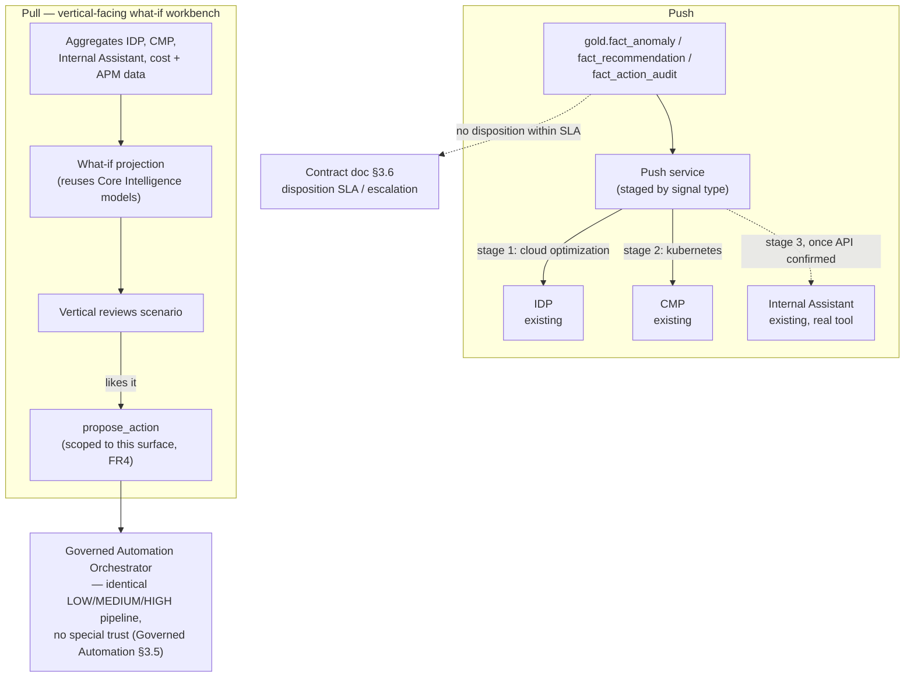

# Solution Architecture: Cloud Workbench Expansion — Push/Pull Channels & What-If Analysis

Phase 5 extension of the platform sequenced in [FinOps Solution Overview.md](FinOps%20Solution%20Overview.md), sequenced after the base [Solution_Architecture_Cloud_Workbench.md](Solution_Architecture_Cloud_Workbench.md) product is proven — this document does not restate Cloud Workbench's persona resolution or orchestration design, only what's genuinely new: the push and pull channels `FinOps Opportunities.md` §2b scoped and the Sub-Document Index flagged as still needed. Also extends [Solution_Architecture_Governed_Automation_Contract.md](Solution_Architecture_Governed_Automation_Contract.md) §3.6's disposition SLA to a new source of findings, rather than designing a second escalation mechanism.

Requirements and specifics below are **inferred** from `FinOps Opportunities.md` §2b and conversation with the document's author, not confirmed the organization fact. Companion: [Platform_Build_Specification.md](Platform_Build_Specification.md) §12 (push jobs, the `run_what_if_projection` tool, the pull workbench's persona-to-tool-set addition).

---

## 1. Executive Summary

Base Cloud Workbench answers a vertical's reactive question — "why did this cost go up" — but doesn't meet verticals where they already work, and doesn't let them model a change before making it. This document adds two channels, each solving a different half of that gap.

**Push** embeds cost, anomaly, and recommendation signals directly into IDP, CMP, and Internal Assistant — the tools verticals already use — rather than requiring a trip to a separate FinOps destination. It's staged by business value, not launched uniformly: cloud-optimization signals into IDP first, Kubernetes signals into CMP second, both into Internal Assistant last, once its API surface is confirmed. A signal pushed here that goes unactioned follows the Governed Automation Contract's disposition SLA (§3.6 there) — not a new escalation mechanism.

**Pull** gives verticals a dedicated what-if workbench that aggregates those same tools plus cost and APM data, reusing Core Intelligence's existing models to project a hypothetical change's impact before it's made. A vertical who likes a what-if scenario can submit it themselves as a proposed action, directly from this surface — a real expansion of what a vertical can do, fully gated by Governed Automation's existing risk-tiering and contract requirements, with no special trust extended just because a human ran the simulation.

## 2. Business Context & Requirements

### 2.1 Problem statement (inferred)

Two gaps base Cloud Workbench doesn't address: it's a destination a vertical has to go to, not a signal embedded where they already work (push); and it only explains the past, it doesn't let a vertical model a future change before committing to it (pull). Both are scoped in `FinOps Opportunities.md` §2b and were deliberately deferred out of the base Cloud Workbench document (Cloud Workbench's own Sub-Document Index entry) so that document could ship against a proven foundation first.

### 2.2 Functional requirements (inferred)

- FR1: Push cost, anomaly, recommendation, and automated-action-outcome signals (`gold.fact_cost_daily`, `gold.fact_anomaly`, `gold.fact_recommendation`, `gold.fact_action_audit`) into IDP, CMP, and Internal Assistant — staged, not launched uniformly (§3.2, ADR-1):
  1. Cloud-optimization signals (rightsizing, RI/SP) → **IDP**
  2. Kubernetes/container-specific signals → **CMP**
  3. Both signal types → **Internal Assistant**, once its API surface is confirmed (the already-flagged higher-risk item, staged last regardless of signal value since the blocker is technical access, not business value)
- FR2: Provide a vertical-facing **pull** workbench aggregating IDP, CMP, Internal Assistant, current/historical cost data, and APM data into one surface for scenario planning ("what if I resize/add/remove this").
- FR3: What-if projections reuse Core Intelligence's existing rightsizing and RI/SP models, parameterized against hypothetical inputs — not a new prediction engine (§3.3, ADR-3).
- FR4: A vertical can submit a what-if scenario as a proposed action directly from the pull workbench, via a `propose_action` binding scoped to this surface specifically — this does **not** change base Cloud Workbench's chat persona rules; a Vertical session in chat still cannot call `propose_action` (Cloud Workbench §2.2 FR4/§4.1, unchanged). Every such proposal is classified and routed through Governed Automation's identical LOW/MEDIUM/HIGH pipeline, with no special trust for a what-if origin (Governed Automation §3.5's existing assumption).
- FR5: Extend anonymized cross-vertical benchmarking (`get_peer_benchmark`) to Vertical sessions within the pull workbench — already built and Platform-persona-only today (Cloud Workbench Build Specification §5); this document exposes it, it doesn't redesign it.
- FR6: A significant finding surfaced via push, or a what-if scenario a vertical doesn't act on, follows the Governed Automation Contract's disposition SLA (§3.6 there) without modification — no second escalation mechanism designed here (ADR-5).

### 2.3 Non-functional requirements (inferred)

| Requirement | Target (inferred) | Rationale |
|---|---|---|
| Push freshness | Bounded by the same provider billing-lag ceiling as everything else (~24h) | No downstream phase, including this one, can promise fresher data than Data Foundations' source |
| Pull workbench responsiveness | Interactive — a what-if scenario's projection returns fast enough for exploratory back-and-forth, not a batch job | The point of "what if" is iterative exploration, not a single query-and-wait |
| Alerting | Push failures and pull-workbench errors route through the platform's shared Teams + ITSM channels | Data Foundations §4.5 — no capability-specific alerting path |

### 2.4 Non-goals (inferred)

- **Not a redesign of Cloud Workbench's base persona rules.** FR4's `propose_action` grant is scoped to the pull workbench surface specifically; a Vertical session in Cloud Workbench's chat interface is unchanged and still cannot propose actions.
- **Not a new escalation mechanism.** FR6 reuses the Governed Automation Contract's disposition SLA (§3.6 there) as-is.
- **Not a new ML model family.** What-if projections reuse Core Intelligence's existing rightsizing/RI/SP models; this document doesn't train anything new.
- **Not a general contract-management or ticketing platform's replacement.** Escalation, where it happens, still lands in the CAB/ITSM system (Contract doc §3.4/§3.6), not a bespoke system here.

---

## 3. Architecture

### 3.1 Technology stack

| Component                               | Choice                                                                       | Rationale                                                                                                                                                                                                                                                                       |
| --------------------------------------- | ---------------------------------------------------------------------------- | ------------------------------------------------------------------------------------------------------------------------------------------------------------------------------------------------------------------------------------------------------------------------------- |
| Pull workbench UI                       | Streamlit-in-Snowflake                                                       | Code-first, arbitrary interactive simulation rather than slicer-based reporting — Power BI's native visual model isn't built for this; runs natively inside Snowflake's compute/RBAC perimeter, consistent with Data Foundations ADR-003's single-platform principle. See ADR-2 |
| What-if projection compute              | Snowpark ML, reusing Core Intelligence's existing models                     | Same training/serving infrastructure as MLOps Pipeline §2.1, parameterized differently rather than retrained. See ADR-3                                                                                                                                                         |
| Push delivery                           | A lightweight sync job per target tool (IDP, CMP, Internal Assistant), staged | Not a single integration — each target's API shape and readiness differ (§2.2 FR1)                                                                                                                                                                                              |
| `propose_action` binding (pull surface) | Same MCP tool Cloud Workbench's Platform persona already calls               | No new action-proposal mechanism — the surface exposing it is new, the mechanism isn't                                                                                                                                                                                          |

### 3.2 Push: staged by signal value, not launched uniformly

Stage 1 pushes cloud-optimization signals (rightsizing, RI/SP — Core Intelligence's most mature model family, MLOps Pipeline §2.3) into IDP, which Governed Automation already calls directly for execution, making it the lowest-risk integration point available. Stage 2 pushes Kubernetes/container-specific findings into CMP. Stage 3 extends both signal types into Internal Assistant once its API surface is confirmed — carried forward as the same already-flagged risk (Solution Overview's Sub-Document Index), staged last because the blocker there is technical access, not signal value.

### 3.3 Pull: what-if workbench

Aggregates read access to IDP, CMP, and Internal Assistant alongside Data Foundations' cost, usage, and APM data, so a vertical can model a hypothetical change ("resize this fleet," "add N instances") without leaving one surface. The projection itself reuses Core Intelligence's existing rightsizing and RI/SP models (MLOps Pipeline §2.3), called with hypothetical parameters instead of observed ones — not a new model family (ADR-3). If a vertical likes a scenario, FR4's `propose_action` binding lets them submit it directly; it enters Governed Automation's Orchestrator exactly as any other proposal would (`check_contract_exists`, `classify_action_risk`, LOW/MEDIUM/HIGH routing) — a what-if origin carries no special trust (Governed Automation §3.5).

### 3.4 Benchmarking extension

`get_peer_benchmark` (Cloud Workbench Build Specification §5) already exists and already returns anonymized, aggregated cross-vertical rate metrics — today it's callable only by the Platform persona. This document extends that same tool to Vertical sessions within the pull workbench (FR5); no change to the metric or its anonymization, only to which persona can call it.

### 3.5 Escalation

A push signal or an unacted what-if scenario is a "finding" in the same sense the Governed Automation Contract's disposition SLA already covers (§3.6, FR7 there) — this document doesn't design a second mechanism. A significant finding surfaced through either channel that receives no disposition within the SLA window routes to FinOps/platform team review exactly as any other finding would.

---

## 4. AI Governance

Same reasoning as Cloud Workbench §4.3 and MLOps Pipeline §3 applies in full: this system processes cost, usage, and APM data, not personal data, and drives no consequential decision about a person without a human in the loop. Worth naming once, specific to this document: FR4 is the first place in this platform where a Vertical persona gets any path to `propose_action` at all — but it's not a new trust boundary, since every such proposal still passes through the identical risk-tiering and contract-gating every other proposal does (Governed Automation §3.5). The human-oversight posture doesn't weaken; the set of people who can initiate a proposal widens.

---

## 5. Architecture Decision Records

**ADR-1: Stage push by signal value (cloud optimization, then Kubernetes, then Internal Assistant), not a uniform simultaneous rollout**
- *Context*: Three target tools, three different integration-readiness profiles, and two different signal domains with different maturity levels behind them.
- *Decision*: Stage 1 = cloud-optimization signals into IDP (Core Intelligence's most mature model family, into an already-proven integration point). Stage 2 = Kubernetes signals into CMP. Stage 3 = both signal types into Internal Assistant, once its API surface is confirmed.
- *Alternatives considered*: A single simultaneous launch across all three tools and both signal types, rejected — bundles the platform's most mature, lowest-risk capability with its least-confirmed integration point, delaying real value for no technical reason. Kubernetes first, rejected — general cloud-infrastructure optimization is inferred to represent the larger dollar opportunity for most estates, though this isn't confirmed against the organization's actual AWS/Azure/GCP-vs-container spend mix.
- *Consequences*: Real business value ships before the riskiest integration is resolved, at the cost of a phased rollout rather than one coordinated launch.

**ADR-2: Streamlit-in-Snowflake for the pull/what-if UI, not Power BI**
- *Context*: The pull workbench is arbitrary interactive simulation ("what if I change X"), not slicer-based reporting over fixed dimensions.
- *Decision*: Build it in Streamlit-in-Snowflake — code-first, runs natively inside Snowflake's compute/RBAC perimeter.
- *Alternatives considered*: Power BI, rejected for this specific surface — its native visual/DAX model isn't built for open-ended simulation, though it remains correct for Self-Serve Foundations' existing reporting (Data Foundations §4.3, unchanged). A bespoke web app outside Snowflake, rejected — would need its own compute/governance perimeter for something Snowflake's own app hosting already covers.
- *Consequences*: One more Snowflake-native app to operate, no new platform introduced; consistent with Data Foundations ADR-003's single-platform principle. Headroom if the what-if UI's needs grow past basic widgets/charts: Streamlit supports custom components (wrapping arbitrary React/JS), rich interactive charting (Plotly, Altair, deck.gl), multi-page apps with query-param routing, and periodic auto-refresh — enough for most "modern web app" asks without leaving the platform. Two real limits worth flagging now rather than discovering later: it's a server-rendered, rerun-on-interaction model, not a full SPA framework, so heavily animated, real-time multi-user, or deeply custom-routed UI would strain it; and Streamlit-in-Snowflake specifically restricts outbound network calls by default, so a custom component pulling from an external CDN would need an explicit External Access Integration configured, not just a pip install.

**ADR-3: Reuse Core Intelligence's existing models for what-if projections rather than a new prediction engine**
- *Context*: A what-if scenario needs the same kind of projection (utilization, rightsizing fit, commitment payoff) Core Intelligence's models already produce for observed data.
- *Decision*: Call the same rightsizing/RI/SP models (MLOps Pipeline §2.3) with hypothetical parameters instead of training a separate what-if-specific model.
- *Alternatives considered*: A dedicated simulation model, rejected — would duplicate modeling logic that already exists and already has an eval gate/drift-monitoring discipline behind it (MLOps Pipeline §2.4).
- *Consequences*: What-if projection quality is bounded by the same models' own accuracy and explainability — a genuine benefit (same governance already applies) and a genuine limit (a what-if scenario outside those models' trained scope projects less reliably).

**ADR-4: Scope the `propose_action` grant to the pull workbench surface, not a general Vertical-persona expansion**
- *Context*: Base Cloud Workbench's Vertical persona deliberately cannot call `propose_action` from chat (Cloud Workbench ADR-007); this document's own FR4 needs to grant a path to it without silently loosening that boundary everywhere.
- *Decision*: The grant is specific to the pull workbench's own tool binding, not a change to `node_resolve_persona`'s chat tool-set rules.
- *Alternatives considered*: Loosening the Vertical persona globally, rejected — would let a Vertical session in ordinary chat propose actions too, which was a deliberate, standing product boundary in Cloud Workbench (§2.2 FR4), not something this document should quietly undo.
- *Consequences*: Two different tool-set resolution paths for the same persona depending on surface (chat vs. pull workbench) — more moving parts than one uniform rule, accepted because the alternative silently expands what "Vertical" can do everywhere Cloud Workbench appears.

**ADR-5: Reuse the Governed Automation Contract's disposition SLA rather than designing a second escalation mechanism**
- *Context*: Push and pull both surface findings that can go unactioned, the same underlying problem the Contract document's §3.6 already exists to solve.
- *Decision*: Route unactioned findings from this document's channels through that same mechanism (FR6) — same threshold logic, same human-review-before-CR gate, same `finding_escalations` table (Build Specification).
- *Alternatives considered*: A separate escalation path specific to push/pull findings, rejected — would mean two SLA mechanisms with two sets of thresholds to keep consistent for no benefit, since the underlying problem (a finding sits without disposition) is identical regardless of source.
- *Consequences*: This document adds no new escalation infrastructure; `finding_source` on `finding_escalations` (Build Specification) just gains two more values (`cloud_workbench_expansion_push`, `what_if_proposal`) alongside `core_intelligence`.

---

## 6. Glossary

**Push** — Embedding cost/anomaly/recommendation/action-outcome signals directly into the tools verticals already use (IDP, CMP, Internal Assistant), staged by signal value rather than launched uniformly. Distinct from this platform's operational alerting (Teams + ITSM, Data Foundations §4.5), which serves the platform team's own incident visibility, not vertical-facing product signals.

**Pull** — The vertical-facing what-if workbench: aggregates existing tools and platform data into one surface for scenario planning, letting a vertical model a change before making it.

**What-if proposal** — A proposed action originating from the pull workbench rather than Core Intelligence or Cloud Workbench chat. Carries no special trust (Governed Automation §3.5) — classified and routed identically to any other proposal.
