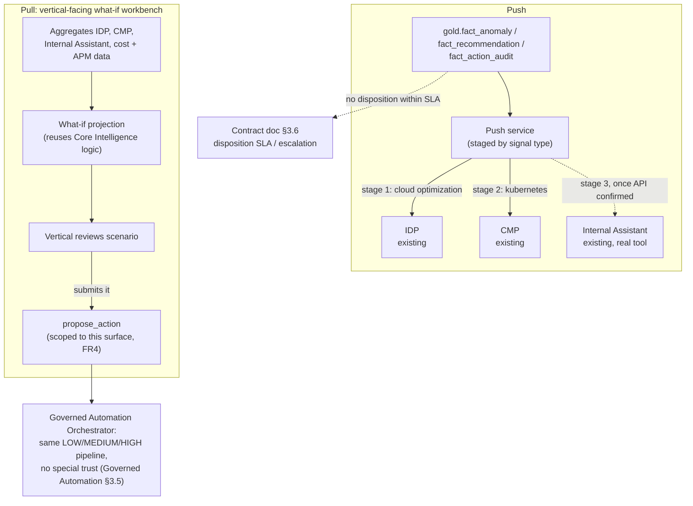

# Solution Architecture: Cloud Workbench Expansion (Push/Pull Channels and What-If Analysis)

Phase 5 extension of the platform sequenced in [FinOps Solution Overview.md](FinOps%20Solution%20Overview.md), built after the base [Solution_Architecture_Cloud_Workbench.md](Solution_Architecture_Cloud_Workbench.md) product is proven. This document doesn't restate Cloud Workbench's persona resolution or orchestration. It covers the push and pull channels scoped in `FinOps Opportunities.md` §2b, and extends the disposition SLA in [Solution_Architecture_Governed_Automation_Contract.md](Solution_Architecture_Governed_Automation_Contract.md) §3.6 to these new sources of findings.

Requirements below are **inferred** from `FinOps Opportunities.md` §2b and from conversation. They are not confirmed the organization facts. Companion: [Platform_Build_Specification.md](Platform_Build_Specification.md) §12 (push jobs, the `run_what_if_projection` tool, the pull workbench's tool set).

---

## 1. Executive Summary

Base Cloud Workbench answers a vertical's questions about the past ("why did this cost go up"). It doesn't reach verticals in the tools they already use, and it doesn't let them model a change before making it. This document adds one channel for each gap.

**Push** puts cost, anomaly, and recommendation signals into IDP, CMP, and Internal Assistant, the tools verticals already work in. It rolls out in stages by value: cloud-optimization signals into IDP first, Kubernetes signals into CMP second, and both into Internal Assistant last, once its API is confirmed. A pushed signal that goes unactioned follows the Governed Automation Contract's disposition SLA (§3.6 there).

**Pull** is a what-if workbench for verticals. It brings those same tools together with cost and APM data, and reuses Core Intelligence's rightsizing and RI/SP logic to project the effect of a hypothetical change. A vertical can submit a scenario it likes as a proposed action from this surface. That proposal goes through Governed Automation's normal risk tiers and contract checks, with no extra trust because a person ran the simulation.

## 2. Business Context & Requirements

### 2.1 Problem statement (inferred)

Base Cloud Workbench leaves two gaps. It is a destination a vertical has to visit, not a signal where they already work (push). And it explains the past without letting a vertical model a future change (pull). Both are scoped in `FinOps Opportunities.md` §2b and are kept out of the base Cloud Workbench document so it can ship on a proven foundation first.

### 2.2 Functional requirements (inferred)

- FR1: Push cost, anomaly, recommendation, and automated-action-outcome signals (`gold.fact_cost_daily`, `gold.fact_anomaly`, `gold.fact_recommendation`, `gold.fact_action_audit`) into IDP, CMP, and Internal Assistant in stages (§3.2, ADR-1):
  1. Cloud-optimization signals (rightsizing, RI/SP) into **IDP**
  2. Kubernetes/container-specific signals into **CMP**
  3. Both signal types into **Internal Assistant**, once its API is confirmed. This is the riskiest integration and goes last because the blocker is technical access, not value.
- FR2: Provide a vertical-facing **pull** workbench that brings IDP, CMP, Internal Assistant, current and historical cost data, and APM data into one surface for scenario planning ("what if I resize, add, or remove this").
- FR3: What-if projections reuse Core Intelligence's rightsizing and RI/SP logic with hypothetical inputs. No new prediction engine (§3.3, ADR-3).
- FR4: A vertical can submit a what-if scenario as a proposed action from the pull workbench, through a `propose_action` binding specific to this surface (`origin = "what_if_workbench"`). Cloud Workbench's chat rules don't change: a Vertical chat session still can't call `propose_action` (Cloud Workbench §2.2 FR4, §4.1). Every such proposal is classified and routed through Governed Automation's LOW/MEDIUM/HIGH pipeline with no special trust (Governed Automation §3.5).
- FR5: Make anonymized cross-vertical benchmarking (`get_peer_benchmark`) available to Vertical users inside the pull workbench. The tool already exists for the Platform persona (Build Specification §5); this document only extends who can call it.
- FR6: A significant finding surfaced through push, or a what-if scenario a vertical doesn't act on, follows the Governed Automation Contract's disposition SLA (§3.6 there) unchanged (ADR-5).

### 2.3 Non-functional requirements (inferred)

| Requirement | Target (inferred) | Rationale |
|---|---|---|
| Push freshness | Bounded by the provider billing-lag ceiling (~24h) | No phase can offer fresher data than Data Foundations' sources |
| Pull workbench responsiveness | Interactive: a projection returns within a few seconds | What-if analysis is iterative exploration |
| Alerting | Push failures and pull-workbench errors route through the platform's shared Teams and ITSM channels | Data Foundations §4.5; no capability-specific alerting path |

### 2.4 Non-goals (inferred)

- **Not a change to Cloud Workbench's chat persona rules.** FR4's `propose_action` binding applies to the pull workbench only.
- **Not a new escalation mechanism.** FR6 reuses the Governed Automation Contract's disposition SLA (§3.6 there).
- **Not a new ML model family.** What-if projections reuse Core Intelligence's rightsizing and RI/SP logic.
- **Not a replacement for contract-management or ticketing systems.** Escalations still land in the CAB/ITSM system (Contract doc §3.4, §3.6).

---

## 3. Architecture

### 3.1 Technology stack

| Component | Choice | Rationale |
|---|---|---|
| Pull workbench UI | Streamlit-in-Snowflake | Code-first interactive simulation, which Power BI's slicer-and-visual model isn't built for. Runs inside Snowflake's compute and access-control boundary (Data Foundations ADR-003). See ADR-2 |
| What-if projection compute | Snowpark, reusing Core Intelligence's scoring procedures | The same Snowflake-native procedures as MLOps Pipeline §2.5, called on demand with hypothetical parameters. A what-if needs an answer in seconds, not milliseconds, so no serving endpoint is needed (MLOps Pipeline ADR-008). See ADR-3 |
| Push delivery | A small sync job per target tool (IDP, CMP, Internal Assistant), staged | Each target's API and readiness differ (§2.2 FR1) |
| `propose_action` binding (pull surface) | The same MCP tool Cloud Workbench's Platform persona calls | The surface is new; the proposal mechanism isn't |

### 3.2 Push: staged by signal value

Stage 1 pushes cloud-optimization signals (rightsizing and RI/SP, MLOps Pipeline §2.3) into IDP. Governed Automation already integrates with IDP for execution, so it's the lowest-risk target. Stage 2 pushes Kubernetes and container findings into CMP. Stage 3 adds both signal types to Internal Assistant once its API is confirmed; that uncertainty is already tracked as an open item (Solution Overview), and it goes last because the blocker is access, not value.

### 3.3 Pull: what-if workbench

The workbench combines read access to IDP, CMP, and Internal Assistant with Data Foundations' cost, usage, and APM data, so a vertical can model a change ("resize this fleet," "add N instances") in one place. Projections reuse Core Intelligence's rightsizing and RI/SP logic (MLOps Pipeline §2.3) with hypothetical parameters instead of observed ones (ADR-3). If a vertical wants to act on a scenario, FR4's `propose_action` binding submits it, and it enters Governed Automation's Orchestrator like any other proposal (`check_contract_exists`, `classify_action_risk`, LOW/MEDIUM/HIGH routing), with no special trust for a what-if origin (Governed Automation §3.5).

### 3.4 Benchmarking extension

`get_peer_benchmark` (Build Specification §5) already returns anonymized, aggregated cross-vertical rate metrics to the Platform persona. This document makes the same tool available to Vertical users inside the pull workbench (FR5). The metric and its anonymization don't change.

### 3.5 Escalation

A push signal or an unacted what-if scenario is a "finding" under the Governed Automation Contract's disposition SLA (§3.6 and FR7 there). A significant finding from either channel that gets no disposition within the SLA window goes to FinOps/platform team review, like any other finding.

---

## 4. AI Governance

The reasoning in Cloud Workbench §4.3 and MLOps Pipeline §3 applies here: this system processes cost, usage, and APM data, not personal data, and makes no consequential decision about a person without human review. One point specific to this document: FR4 is the only place a Vertical user can call `propose_action`. It doesn't create a new trust boundary, because each of those proposals goes through the same risk tiering and contract checks as every other proposal (Governed Automation §3.5). More people can start a proposal; the oversight on what happens to it stays the same.

---

## 5. Architecture Decision Records

**ADR-1: Stage push by signal value (cloud optimization, then Kubernetes, then Internal Assistant)**
- *Context*: Three target tools with different integration readiness, and two signal domains with different maturity.
- *Decision*: Stage 1: cloud-optimization signals into IDP (the most mature signals, into an integration already used by Governed Automation). Stage 2: Kubernetes signals into CMP. Stage 3: both into Internal Assistant, once its API is confirmed.
- *Alternatives considered*: One launch across all three tools and both signal types, rejected. It ties the lowest-risk capability to the least-confirmed integration and delays value. Kubernetes first, rejected. General cloud optimization is assumed to be the larger dollar opportunity, though the organization's split between VM and container spend isn't confirmed.
- *Consequences*: Value ships before the riskiest integration is resolved, in exchange for a phased rollout.

**ADR-2: Streamlit-in-Snowflake for the what-if UI, not Power BI**
- *Context*: The pull workbench is open-ended interactive simulation ("what if I change X"), not reporting over fixed dimensions.
- *Decision*: Build it in Streamlit-in-Snowflake, which is code-first and runs inside Snowflake's compute and access-control boundary.
- *Alternatives considered*: Power BI, rejected for this surface; its visual and DAX model isn't designed for open-ended simulation, though it remains the reporting tool (Data Foundations §4.3). A standalone web app outside Snowflake, rejected; it would need its own hosting and governance.
- *Consequences*: One more Snowflake-native app and no new platform. Streamlit supports custom components, interactive charting (Plotly, Altair, deck.gl), and multi-page apps, which covers most workbench needs. Two limits to plan for: it re-runs the script on each interaction, so heavily animated or real-time multi-user UIs would strain it; and Streamlit-in-Snowflake blocks outbound network calls by default, so a component loading from an external CDN needs an External Access Integration.

**ADR-3: Reuse Core Intelligence's logic for what-if projections, not a new prediction engine**
- *Context*: A what-if scenario needs the same projections (utilization fit, rightsizing, commitment payoff) that Core Intelligence already produces for observed data.
- *Decision*: Call the same rightsizing and RI/SP procedures (MLOps Pipeline §2.3) with hypothetical parameters.
- *Alternatives considered*: A dedicated simulation model, rejected. It would duplicate logic that already has an eval gate and monitoring (MLOps Pipeline §2.4).
- *Consequences*: Projection quality is bounded by those procedures' accuracy. The same governance applies automatically, and scenarios far outside the data they were built on project less reliably.

**ADR-4: Scope the `propose_action` grant to the pull workbench, not to the Vertical persona everywhere**
- *Context*: Cloud Workbench's Vertical persona can't call `propose_action` from chat (Cloud Workbench ADR-007). FR4 needs a proposal path for verticals without opening that up everywhere.
- *Decision*: Grant `propose_action` only through the pull workbench's own tool binding. `node_resolve_persona`'s chat rules don't change.
- *Alternatives considered*: Granting it to the Vertical persona globally, rejected. It would let a Vertical chat session propose actions, and chat stays read-only for verticals (Cloud Workbench §2.2 FR4, §2.4). This ADR is the one intentional extension, and it applies only to a structured what-if scenario, never a chat message.
- *Consequences*: The same persona has two tool sets depending on surface (chat vs. pull workbench). That is more to maintain than one rule, and it keeps Vertical capabilities from expanding silently across every surface.

**ADR-5: Reuse the Governed Automation Contract's disposition SLA for escalation**
- *Context*: Push and pull both produce findings that can go unactioned, which the Contract document's §3.6 already handles.
- *Decision*: Route unactioned findings from these channels through that mechanism (FR6): same thresholds, same human review before a change request, same `finding_escalations` table (Build Specification §6).
- *Alternatives considered*: A separate escalation path for push and pull findings, rejected. Two SLA mechanisms would need to be kept consistent for no benefit, since the problem is the same regardless of source.
- *Consequences*: No new escalation infrastructure. `finding_source` on `finding_escalations` gains two values, `cloud_workbench_expansion_push` and `what_if_proposal`, alongside `core_intelligence`.

---

## 6. Glossary

**Push**: Putting cost, anomaly, recommendation, and action-outcome signals into the tools verticals already use (IDP, CMP, Internal Assistant), in stages by value. Separate from the platform's operational alerting (Teams and ITSM, Data Foundations §4.5), which is for the platform team's own incidents.

**Pull**: The vertical-facing what-if workbench, which brings existing tools and platform data into one place so a vertical can model a change before making it.

**What-if proposal**: A proposed action submitted from the pull workbench (`origin = "what_if_workbench"`). It gets no special trust (Governed Automation §3.5) and is classified and routed like any other proposal.
