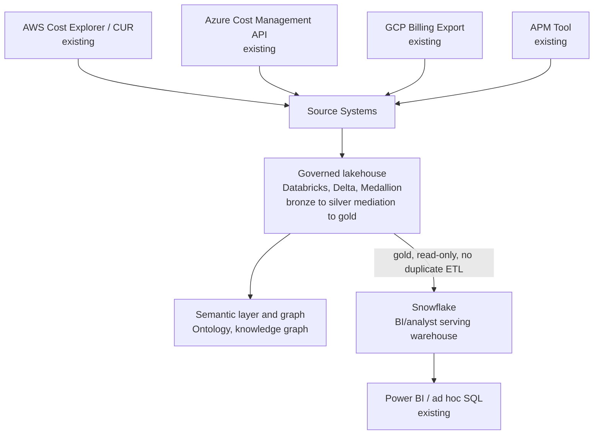
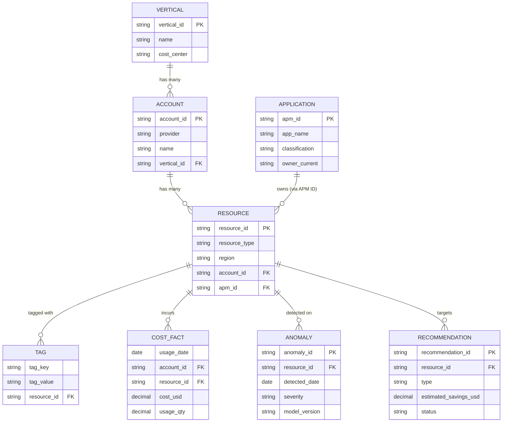

# Solution Architecture: Data Foundations

Phase 1 of the platform sequenced in `FinOps Solution Overview.md`. Split out from what was originally a single combined "Internal Assistant" solution architecture document — that document tried to be the top-level narrative for four different phases at once (data foundation, self-serve, governed automation, and parts of intelligence), which made it hard to tell which section belonged to which phase. This document covers only the data foundation: everything downstream (Core Intelligence, Self-Serve Foundations / Cloud Workbench, Governed Automation) is built on top of it, not part of it.

Requirements, org details, and specific tool choices below are **inferred** from JD language and reasonable enterprise-FinOps practice, not confirmed the organization fact. Companion: `Platform_Build_Specification.md` §1–4.

---

## 1. Executive Summary

This is the multi-cloud data platform that conforms AWS, Azure, and GCP billing/usage data — plus Application Portfolio Management (APM) metadata — into one governed, queryable foundation. Every other phase (ML models, the self-serve chat/API product, governed automation, bill verification) reads from this layer rather than reasoning about provider-native schemas or raw source data directly.

> **This is modernization, not greenfield.** Consumption-based pricing analysis, anomaly detection, and operational chargeback reportedly already exist today at the organization, running on PowerShell scripts, an on-prem SQL database, and SQL functions. This document is a governed, scalable replacement for that legacy data pipeline, not a net-new capability invented from nothing.

## 2. Business Context & Requirements

### 2.1 Problem statement (inferred)

Cloud cost and usage data across AWS, Azure, and GCP is fragmented, inconsistently tagged, and requires specialist knowledge to query. Everything built on top of this data — reporting, ML models, a self-serve interface, automated actions — inherits whatever inconsistency exists at this layer, so getting conformance, tagging, and entity resolution right here is the highest-leverage investment in the whole platform.

### 2.2 Requirements (inferred)

- FR1: Ingest billing/usage data from all three providers on a schedule aligned to each provider's own export cadence, landing raw and unmodified.
- FR2: Conform provider-native schemas into one canonical, cross-provider schema, reconciled against the organization's own tag taxonomy.
- FR3: Resolve resources to a single, authoritative entity — preferring the APM ID where present, falling back to tag-based matching only for the unresolved gap — and track that resolution rate as a governance KPI.
- FR4: Make conformed data available to downstream consumers (BI, ML, self-serve, automation) from one trusted layer, not from parallel, independently-maintained copies.

### 2.3 Non-functional requirements (inferred)

| Requirement | Target (inferred) | Rationale |
|---|---|---|
| Data freshness | Reflects provider billing lag (typically ~24h) | Provider billing APIs are not real-time by nature — this is a hard ceiling every downstream phase inherits |
| Auditability | Full lineage from raw to gold, retained per policy | HITRUST/SOC2-equivalent governance posture |
| Idempotency | Every pipeline stage safely re-runnable without producing duplicate or drifted state | Becomes a hard governance requirement once ML models and an LLM depend on this data being trustworthy |
| Data segregation | Vertical/account-scoped access enforceable at the catalog/query layer | Foundation for every downstream consumer's own multi-tenancy requirement |

### 2.4 Non-goals (inferred)

- Not attempting real-time (sub-minute) billing reconciliation; provider billing APIs don't support it.
- Not a general-purpose enterprise data platform; scope is cloud cost, usage, and APM/ownership metadata.

---

## 3. Architecture Overview

The four boxes feeding Source Systems are the organization's real, existing systems — nothing about them is designed in this document; Section 4.1 covers what's actually pulled from each.

The sections below detail each layer. This is where the platform's diagram in `FinOps Solution Overview.md` gets its detail for Phase 1.

---

## 4. Layer-by-Layer Design

### 4.1 Source systems

AWS Cost Explorer/CUR, Azure Cost Management API, GCP Billing Export, plus each provider's usage/telemetry APIs. These three sources have materially different schemas, tag semantics, and refresh cadences — this heterogeneity is the reason the lakehouse's silver stage exists to conform them, rather than exposing provider-native schemas to anything downstream.

> **Additional source: Application Portfolio Management (APM) tool.** the organization reportedly maintains an APM tool holding application metadata (owner, technical contact, classification), with its APM ID tagged onto roughly nearly all of cloud resources and already used by security/compliance for their checks. This is a materially stronger entity-resolution signal than cloud-native tags alone — it's an authoritative, organization-level master key, not something derived per-cloud. See Section 4.4 for how this feeds the ontology, and the Build Specification for the ingestion and data-quality treatment.

### 4.2 Mediation (implemented as the lakehouse's bronze-to-silver transform)

**Purpose**: conform billing data into one canonical, business-meaningful schema before anything downstream has to reason about provider-specific quirks. This is **not a separate system ahead of the lakehouse** — a standalone pre-lakehouse staging step would end up duplicating exactly what a silver layer already exists to do. Mediation is the Spark logic that turns bronze (raw, provider-native, landed as-received) into silver (conformed, cross-provider, deduplicated); see Section 4.3 for where bronze and silver sit in the lakehouse itself.

> **FOCUS reduces this stage's scope — once enabled.** AWS, Azure, and GCP all now support exporting billing data in **FOCUS** (FinOps Open Cost and Usage Specification) format, a FinOps Foundation-maintained, vendor-neutral schema already adopted broadly across providers. **Assumption adopted**: nothing in the Current State document's description of a multi-year PowerShell/SQL pipeline suggests FOCUS is in use today, so this is treated as *not yet enabled* — turning it on per provider (a configuration change on each provider's billing-export settings, not a data-engineering effort) is a discrete Phase 1 prerequisite task, not something assumed already in place. Once enabled, ingest in that format directly rather than hand-building cross-provider schema normalization — the heavy "reconcile AWS's field names against Azure's against GCP's" work becomes largely unnecessary. Effort here should be redirected to what FOCUS doesn't cover: organization-specific tag taxonomy mapping, vertical/account attribution logic, and data quality checks, not basic schema conformance. See ADR-001.

- **Spark** (declarative pipelines, dataframe transformations), running against bronze, performs: FOCUS-to-canonical mapping (a lighter step than full normalization would have been), organization-specific tag taxonomy reconciliation, and deduplication — writing the result to silver.
- This transform is idempotent and replayable: a failed or corrected run should be safely rerunnable without producing duplicate or drifted state, standard data-engineering discipline that becomes a governance requirement once ML models and an LLM depend on this data being trustworthy.

### 4.3 Governed lakehouse (Databricks, Delta Lake, Medallion architecture)

Data lands in a **Medallion-architected** lakehouse: **bronze** (raw, provider-native, landed as-received and immutable — preserved for audit/replay), **silver** (conformed to the canonical schema, deduplicated, business rules applied — the mediation transform from Section 4.2), **gold** (aggregated, consumption-ready). **Delta Lake** provides ACID guarantees and time travel (useful for both audit and for reconstructing "what did we know at the time" during incident investigation). **Unity Catalog**-equivalent governance provides lineage, access control, and a data catalog spanning this layer.

This is also where the **feature store** for Core Intelligence's ML models lives — gold-layer tables feed both the semantic/graph layer below and the MLOps pipeline in parallel.

**Optional serving path: Snowflake for BI/analyst consumption.** Gold-layer tables can also be exposed read-only to Snowflake — via Delta Sharing or Snowflake's native external-table/Iceberg-catalog support reading Delta Lake directly — with no duplicate ETL and no independently-maintained copy of the data. This is distinct from ADR-001's rejected role for Snowflake (a pre-lakehouse mediation/staging system, which duplicated transformation work); here Snowflake is only a query engine over the same governed gold tables, feeding existing Power BI reports and ad hoc analyst SQL. See ADR-003.

#### Conceptual gold-layer model

This is the conceptual counterpart to the literal gold-layer table list in Build Specification §3 — a star schema centered on `COST_FACT`, with `RESOURCE` as the hub every other entity (ownership via `APPLICATION`/APM ID, classification via `TAG`, and both ML outputs) hangs off of. Owner/Technical Contact volatility (Section 4.4's SCD Type 2 treatment) is a change-tracking detail on `APPLICATION`, omitted here to keep the conceptual model at entity/relationship grain rather than physical-table grain.

### 4.4 Semantic layer, ontology, and knowledge graph

This is the layer that turns "rows in a gold table" into "concepts every downstream consumer — an AI system, a business user, a dashboard — understands the same way."

- **Semantic layer**: defines business metrics ("EC2 spend," "monthly burn rate," "reserved instance coverage") as governed, reusable definitions computed consistently from the gold lakehouse tables, rather than every consumer re-deriving them ad hoc and potentially inconsistently.
- **Ontology**: defines the entities and relationships that structure this domain — Account, Vertical, Resource, Tag, Cost Line Item, Anomaly, Recommendation — and how they relate (a Resource belongs to an Account, an Account rolls up to a Vertical, a Cost Line Item references a Resource and a time period). This is the schema for the graph below. **The `Resource` entity carries the APM ID as its primary cross-cloud key** where available (~nearly all of resources), with Owner, Technical Contact, and Classification modeled as attributes sourced from APM, not re-derived from cloud tags.
- **Knowledge graph**: the ontology, populated and kept current, implemented as an actual graph store. This is what enables **GraphRAG**-style retrieval for Self-Serve Foundations — questions that are fundamentally relational ("show me all resources tagged to this vertical that had a cost anomaly and a recent deployment") are graph traversals, not vector similarity lookups.
- **Entity resolution** happens here: resolve on APM ID first where present — a stronger, organizationally-authoritative signal than cross-cloud tag matching — falling back to fuzzy tag-based matching only for the small unresolved gap. That gap itself is worth tracking as a governance metric: an untagged resource is both a FinOps chargeback blind spot and a security/compliance blind spot, since the same APM ID drives both.
- **Attribute volatility, handled via Slowly Changing Dimension (SCD Type 2).** The resource-to-application boundary (which resources belong to which app) is structurally stable; the Owner/Technical Contact attributes on top of it are volatile (role changes, departures) and can go stale independent of the boundary itself. Model Owner/Technical Contact as an SCD Type 2 attribute, tracked with effective start/end dates, rather than overwritten in place, so staleness is visible and reconfirmable rather than silently trusted indefinitely.

### 4.5 Infrastructure & observability (shared across every phase)

- **Infrastructure**: containerized services (Docker) deployed on **AKS**, with **Terraform**/**Bicep** managing infrastructure as versioned, reviewed code. Resource governance (namespace-scoped quotas, RBAC) isolates verticals' workloads from each other on shared infrastructure.
- **Observability**: per-stage distributed tracing (mediation job, downstream retrieval/generation/action where applicable), token/cost tracking, data-quality and lineage dashboards.
- **Governance**: lineage from raw provider data through bronze/silver (mediation)/gold, full audit logging, RBAC enforced at the catalog/query layer matching vertical/account boundaries, ontology change management (versioning the ontology itself, since it's a shared contract every downstream phase depends on).

Self-Serve Foundations and Governed Automation add their own phase-specific observability (eval gates, action audit logs) on top of this shared baseline rather than duplicating it.

---

## 5. Architecture Decision Records

**ADR-001: Implement mediation as the lakehouse's bronze-to-silver transform, not a separate pre-lakehouse system, scoped around FOCUS where available**
- *Context*: AWS, Azure, and GCP billing exports historically had materially different schemas and tag semantics. As of FOCUS's broad adoption across providers, much of that normalization is now available pre-built. An earlier version of this design ran mediation as a distinct Spark + Snowflake staging step ahead of the lakehouse, landing already-conformed data into bronze — which duplicated the conform/deduplicate/business-rule work a medallion silver layer already exists to do, and left bronze holding conformed rather than raw data.
- *Decision*: Ingest raw, provider-native data straight into bronze. Perform FOCUS-to-canonical mapping and organization-specific conformance (tag taxonomy, attribution logic, deduplication) as the bronze-to-silver transform, entirely within the lakehouse. No separate staging system.
- *Alternatives considered*: Keep the separate pre-lakehouse mediation system (Spark + Snowflake), rejected — it added an extra hop and technology (Snowflake) without a distinct purpose once bronze correctly holds raw data and silver correctly does the conforming. Build full custom normalization ignoring FOCUS, rejected, duplicates work a widely-adopted open standard already solves. Skip conformance entirely and rely on FOCUS alone, rejected, FOCUS standardizes provider billing schema, it doesn't know the organization's vertical structure or tag taxonomy.
- *Consequences*: One fewer technology in the stack, and bronze now holds genuinely raw data consistent with standard medallion semantics. The conformance work itself (FOCUS mapping, tag reconciliation, dedup) is unchanged in substance, just relocated to where medallion architecture already expects it.

**ADR-002: Build a semantic layer and ontology rather than letting every downstream consumer derive metric definitions ad hoc**
- *Context*: "EC2 spend" or "monthly burn" could be computed multiple inconsistent ways from raw billing data, and this platform has multiple downstream consumers (BI, an LLM, ML features) that all need the same answer.
- *Decision*: Define metrics once, centrally, in a governed semantic layer; every downstream consumer retrieves and applies these definitions rather than deriving them itself.
- *Alternatives considered*: Let each consumer compute metrics directly from gold tables via its own generated queries, rejected — risks inconsistent results across consumers and is harder to govern/audit.
- *Consequences*: Upfront modeling investment, but consistent, explainable, auditable answers everywhere the data is consumed.

**ADR-003: Add Snowflake as an optional gold-layer serving warehouse — additive to ADR-001, not a reversal of it**
- *Context*: ADR-001 rejected Snowflake as a separate pre-lakehouse mediation/staging system, because it duplicated transformation work the lakehouse's own silver layer already does. That's a different question from whether Snowflake has any role at all. Current State describes the organization's existing BI practice running on Power BI, and Power BI's native Snowflake connector is generally more mature — and more familiar to existing business-analyst workflows — than driving everything through Databricks SQL warehouses directly. **Assumption adopted**: the organization's actual BI/analyst tooling preference isn't confirmed here; this ADR assumes Power BI's existing prevalence (Current State) is a reasonable signal, not a confirmed requirement.
- *Decision*: Optionally expose gold-layer tables to Snowflake as a read-only serving layer — via Delta Sharing or Snowflake's native external-table/Iceberg-catalog integration reading Delta Lake directly — with no duplicate ETL and no independent copy of the data maintained. Snowflake here is a query engine over the same governed gold tables, not a second place data gets transformed or reconciled.
- *Alternatives considered*: Route all BI/analyst consumption through Databricks SQL warehouses only, rejected — plausible if the organization's analyst tooling already centers on Databricks, but this preserves analysts' existing Power BI/SQL workflow rather than forcing a tool change alongside everything else changing in this platform. Re-introduce Snowflake as a transformation layer (ADR-001's rejected approach), explicitly rejected again here — this ADR is additive, not a reversal.
- *Consequences*: One additional technology in the serving path, but zero duplicate transformation logic and zero additional data-quality surface — Snowflake can only be as correct as the gold tables it reads, it can't drift from them independently. This also gives the "dashboards" capability (flagged as a thin view pending review in `FinOps Opportunities.md` and the Solution Overview) a concrete mechanism: existing Power BI reports could point at this read path instead of the current on-prem SQL Server.

---

## 6. Glossary

**Conformance / conformed schema** — Normalizing structurally different source data into one consistent schema.

**Delta Sharing (or equivalent)** — An open protocol for sharing Delta Lake tables read-only across platforms (e.g., into Snowflake) without copying or re-exporting the data.

**Entity resolution** — Identifying that records from different sources refer to the same real-world entity and merging them.

**Feature store** — A governed repository of ML-ready features derived from curated data, shared across models.

**Gold/silver/bronze (Medallion architecture)** — Progressive data refinement stages: raw (bronze), cleaned (silver), aggregated/consumption-ready (gold).

**Idempotent (pipeline)** — A pipeline that produces the same result if rerun, safe to retry without side effects like duplication.

**Knowledge graph** — A populated, queryable implementation of an ontology, entities and their relationships as an actual graph structure.

**Mediation** — The conformance transform (bronze-to-silver) that normalizes heterogeneous provider-native source data into one canonical schema; implemented as part of the lakehouse's medallion pipeline, not a separate system ahead of it.

**Ontology** — The defined set of entities, relationships, and hierarchies that structure a domain, the schema a knowledge graph implements.

**Semantic layer** — A governed layer defining business metrics consistently, computed once and reused, rather than re-derived ad hoc by each consumer.

**Unity Catalog (or equivalent)** — A governance layer providing lineage, access control, and cataloging across a lakehouse.
