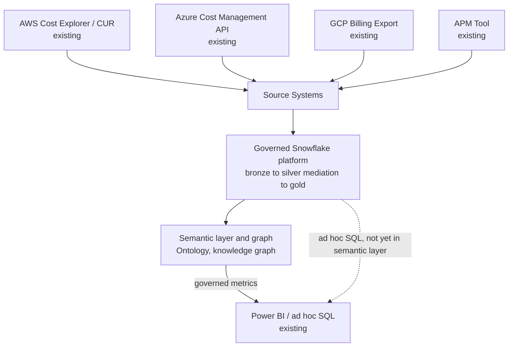
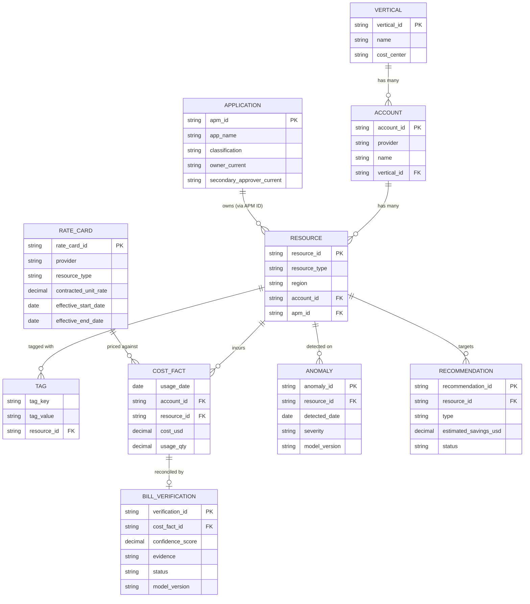

# Solution Architecture: Data Foundations

Phase 1 of the platform sequenced in [FinOps Solution Overview.md](FinOps%20Solution%20Overview.md). Split out from what was originally a single combined "Internal Assistant" solution architecture document — that document tried to be the top-level narrative for four different phases at once (data foundation, self-serve, governed automation, and parts of intelligence), which made it hard to tell which section belonged to which phase. This document covers only the data foundation: everything downstream (Core Intelligence, [Self-Serve Foundations](Solution_Architecture_Self_Serve_Foundations.md), [Governed Automation](Solution_Architecture_Governed_Automation.md), [Cloud Workbench](Solution_Architecture_Cloud_Workbench.md)) is built on top of it, not part of it.

Requirements, org details, and specific tool choices below are **inferred** from JD language and reasonable enterprise-FinOps practice, not confirmed the organization fact. Companion: [Platform_Build_Specification.md](Platform_Build_Specification.md) §1–4.

---

## 1. Executive Summary

This is the multi-cloud data platform that conforms AWS, Azure, and GCP billing/usage data — plus Application Portfolio Management (APM) metadata — into one governed, queryable foundation. Every other phase (ML models, the self-serve chat/API product, governed automation, bill verification) reads from this layer rather than reasoning about provider-native schemas or raw source data directly. This is modernization, not greenfield: consumption-based pricing analysis, anomaly detection, and operational chargeback reportedly already exist today at the organization, running on PowerShell scripts, an on-prem SQL database, and SQL functions — this document is a governed, scalable replacement for that legacy pipeline, not a net-new capability invented from nothing.

## 2. Business Context & Requirements

### 2.1 Problem statement (inferred)

AWS, Azure, and GCP each export billing/usage data in a different provider-native schema, and today all of it runs through an on-prem SQL Server database, reconciled by PowerShell scripts and stored procedures on a monthly batch cycle. That pipeline already achieves strong tagging coverage and true chargeback (`FinOps Current State.md`) — it just can't support what's needed next: continuous ingestion, ML-driven analysis, enhanced self-serve interfaces, or automated action, all of which need a governed, queryable platform underneath them, not a monthly script run. Conforming the three providers' schemas onto that platform — carrying forward the reconciliation and tagging logic that already works, not rebuilding it — is the highest-leverage investment in the whole platform, since everything downstream inherits whatever this layer can or can't support.

### 2.2 Requirements (inferred)

- FR1: Ingest billing/usage data from all three providers on a schedule aligned to each provider's own export cadence, landing raw and unmodified.
- FR2: Conform provider-native schemas into one canonical, cross-provider schema, reconciled against the organization's own tag taxonomy.
- FR3: Resolve resources to a single, authoritative entity — preferring the APM ID where present, falling back to tag-based matching only for the unresolved gap — and track that resolution rate as a governance KPI.
- FR4: Make conformed data available to downstream consumers (BI, ML, self-serve, automation) from one trusted layer, not from parallel, independently-maintained copies.

### 2.3 Non-functional requirements (inferred)

| Requirement      | Target (inferred)                                                                    | Rationale                                                                                                  |
| ---------------- | ------------------------------------------------------------------------------------ | ---------------------------------------------------------------------------------------------------------- |
| Data freshness   | Reflects provider billing lag (typically ~24h)                                       | Provider billing APIs are not real-time by nature — this is a hard ceiling every downstream phase inherits |
| Auditability     | Full lineage from raw to gold, retained per policy                                   | SOC2-equivalent governance posture                                                                         |
| Idempotency      | Every pipeline stage safely re-runnable without producing duplicate or drifted state | Becomes a hard governance requirement once ML models and an LLM depend on this data being trustworthy      |
| Data segregation | Vertical/account-scoped access enforceable at the catalog/query layer                | Foundation for every downstream consumer's own multi-tenancy requirement                                   |

### 2.4 Non-goals (inferred)

- Not attempting real-time (sub-minute) billing reconciliation; provider billing APIs don't support it.
- Not a general-purpose enterprise data platform; scope is cloud cost, usage, and APM/ownership metadata.

---

## 3. Architecture Overview

The four boxes feeding Source Systems are the organization's real, existing systems — nothing about them is designed in this document; Section 4.1 covers what's actually pulled from each.

The sections below detail each layer. This is where the platform's diagram in [FinOps Solution Overview.md](FinOps%20Solution%20Overview.md) gets its detail for Phase 1.

### 3.1 Technology stack

| Component | Choice | Rationale |
|---|---|---|
| Data platform (storage, transform, serving) | Snowflake | Single platform for bronze/silver/gold, ML, and BI serving, rather than a lakehouse split from a separate warehouse. See ADR-003. |
| Transformation | dbt (SQL) + Snowpark (Python) | dbt for the set-based FOCUS-mapping/tag-reconciliation work; Snowpark for the dedup/reconciliation logic that's awkward to express as pure SQL. See ADR-001 and §4.2. |
| Feature store | Snowflake Feature Store (Snowpark ML) | Reuses Snowflake's own RBAC/lineage rather than standing up a parallel governed store. |
| Semantic layer | Snowflake Semantic Views | Governed metric definitions computed once and reused everywhere. See ADR-002. |
| Governance | Snowflake Horizon (RBAC, row access policies, dynamic data masking, object tagging, Access History) | Native governance surface, no separate catalog product. |
| Versioning / ACID | Snowflake Time Travel + zero-copy cloning | Audit and "what did we know at the time" incident reconstruction without a lakehouse table format. |
| Knowledge graph | Neo4j | A dedicated property-graph database — not implemented in Snowflake. See ADR-004. |
| Session memory / retrieval cache | Redis | Backs Cloud Workbench's session memory and retrieval cache (Cloud Workbench ADR-003, ADR-009) — not part of this platform's own storage, listed here for a complete picture. No vector store: Cloud Workbench's definitional questions are answered via a direct Snowflake lookup against the Semantic View metric catalog (below), not embedding-based search (Cloud Workbench ADR-001, ADR-006). |
| Orchestration | Airflow (or Azure Data Factory) | Named in the JD; schedules ingestion and the dbt/Snowpark transform chain. See Build Specification §1–2. |
| Infrastructure | AKS, Terraform | Shared platform-wide compute and IaC, not specific to this phase. See §4.5. |
| Observability | Datadog (APM, infrastructure monitoring, log management, dashboards, monitors/alerting), instrumented via OpenTelemetry | the organization's existing observability platform, reused rather than standing up a separate open-source stack. Shared platform-wide, not specific to this phase. See §4.5. |

---

## 4. Layer-by-Layer Design

### 4.1 Source systems

| Source | Description | Why Needed |
|---|---|---|
| AWS Cost Explorer / CUR | AWS's native billing/usage export, plus its usage-telemetry APIs | Primary billing/usage source for the AWS portion of the estate |
| Azure Cost Management API | Azure's native billing/usage export, plus its usage-telemetry APIs | Primary billing/usage source for the Azure portion of the estate |
| GCP Billing Export | GCP's native billing/usage export, plus its usage-telemetry APIs | Primary billing/usage source for the GCP portion of the estate |
| Application Portfolio Management (APM) tool | the organization's existing application metadata system — owner, technical contact, classification — with its APM ID tagged onto roughly nearly all of cloud resources and already used by security/compliance for their checks | A materially stronger entity-resolution signal than cloud-native tags alone — an authoritative, organization-level master key, not something derived per-cloud. Feeds the ontology (§4.4); see Build Specification for ingestion and data-quality treatment |
| Terraform state (read-only, via the organization's state backend — Terraform Cloud/Enterprise API, or a state file in a cloud storage backend) | Resolved infrastructure-as-code state, not the raw `.tf` source — already carries resolved values, directly comparable to a live resource's observed configuration without evaluating variables or modules. Two fields matter downstream: `managed_by_iac`, and a drift flag (live config vs. last-declared) | A rightsizing recommendation or an automated action that only looks at observed utilization can't tell an accidentally over-provisioned resource from a deliberately, approvedly over-provisioned one — that distinction lives in whatever declared the resource. See MLOps Pipeline §2.2 for how this shapes recommendation context, and Governed Automation §3.3 for why this gates direct execution |
| Vendor rate data (contracted unit rates per provider/service, keyed to contract terms) | The negotiated rate the organization actually pays per service/SKU, with an effective date range — **functional data required for reconciliation, not a lookup/reference table**: without it, there is nothing to compare an invoiced line item against | Bill Verification (Phase 4) reconciles invoiced line items against these contracted rates; ingested into the gold layer (and the knowledge graph, §4.4) as a first-class source, same as any other source in this table |

The three cloud sources have materially different schemas, tag semantics, and refresh cadences — this heterogeneity is the reason the platform's silver stage exists to conform them, rather than exposing provider-native schemas to anything downstream.

### 4.2 Mediation (implemented as the platform's bronze-to-silver transform)

**Purpose**: conform billing data into one canonical, business-meaningful schema before anything downstream has to reason about provider-specific quirks. This is **not a separate system ahead of the platform** — a standalone pre-ingestion staging step would end up duplicating exactly what a silver layer already exists to do. Mediation is the transformation logic that turns bronze (raw, provider-native, landed as-received) into silver (conformed, cross-provider, deduplicated); see Section 4.3 for where bronze and silver sit in the platform itself.

> **FOCUS reduces this stage's scope — once enabled.** AWS, Azure, and GCP all now support exporting billing data in **FOCUS** (FinOps Open Cost and Usage Specification) format, a FinOps Foundation-maintained, vendor-neutral schema already adopted broadly across providers. **Assumption adopted**: nothing in the Current State document's description of a multi-year PowerShell/SQL pipeline suggests FOCUS is in use today, so this is treated as *not yet enabled* — turning it on per provider (a configuration change on each provider's billing-export settings, not a data-engineering effort) is a discrete Phase 1 prerequisite task, not something assumed already in place. Once enabled, ingest in that format directly rather than hand-building cross-provider schema normalization — the heavy "reconcile AWS's field names against Azure's against GCP's" work becomes largely unnecessary. Effort here should be redirected to what FOCUS doesn't cover: organization-specific tag taxonomy mapping, vertical/account attribution logic, and data quality checks, not basic schema conformance. See ADR-001.

- **dbt** models (SQL, tested and documented) perform the bulk of the bronze-to-silver transform: FOCUS-to-canonical mapping (a lighter step than full normalization would have been) and organization-specific tag taxonomy reconciliation, running as Snowflake queries rather than a separate compute engine.
- **Snowpark** (Python, running as Snowflake-native compute) handles the parts of this transform that are awkward to express in SQL alone — the dedup/reconciliation logic where a row-by-row or stateful pass is clearer in code than in a set-based query — writing the result to silver. This is the JD's "Apache Spark or equivalent" requirement met inside Snowflake's own compute, rather than by running a separate Spark cluster.
- This transform is idempotent and replayable: a failed or corrected run should be safely rerunnable without producing duplicate or drifted state, standard data-engineering discipline that becomes a governance requirement once ML models and an LLM depend on this data being trustworthy.

### 4.3 Governed Snowflake platform (medallion-layered schemas)

Data lands in a **Medallion-layered** structure, implemented as three Snowflake schemas rather than a separate lakehouse product: **bronze** (raw, provider-native, landed as-received and immutable — preserved for audit/replay), **silver** (conformed to the canonical schema, deduplicated, business rules applied — the mediation transform from Section 4.2), **gold** (aggregated, consumption-ready). Bronze/silver/gold here is a naming convention for progressive refinement, not a claim about any specific vendor's table format. Snowflake's native transactional tables provide ACID guarantees; **Time Travel** and **zero-copy cloning** provide the audit and "what did we know at the time" incident-reconstruction capability that a lakehouse's versioned table format would otherwise be relied on for. Governance — lineage, access control, and cataloging across this layer — is provided by Snowflake's own **Horizon** governance features: role-based access control, row access policies, dynamic data masking, and object tagging, with lineage available through Access History and object dependency tracking. See ADR-003 for why this consolidates onto one platform rather than splitting storage/compute from BI serving.

This is also where the **feature store** for Core Intelligence's ML models lives — the **Snowflake Feature Store** (part of Snowpark ML), reading directly from gold-layer tables and feeding both the semantic/graph layer below and the MLOps pipeline in parallel, with no data movement to a separate ML platform.

**BI serving is native, not a separate path — and routes through the semantic layer, not raw gold.** Power BI connects to Snowflake Semantic Views (Section 4.4) for anything with a governed metric definition — spend, burn rate, RI coverage — the same definitions Cloud Workbench and the knowledge graph use, so a dashboard's number can't quietly diverge from what any other consumer reports (the same discipline ADR-002 established, applied here rather than carved out as an exception for BI). Gold-schema tables remain directly queryable for ad hoc analyst SQL that isn't yet expressible as a named metric, but that is the fallback path, not the default one. Either way, there's no data-sharing protocol, no export step, and no second platform to keep in sync, since both gold and the semantic layer already live here. This replaces what an earlier version of this design handled as an "optional Snowflake serving path" layered on top of a Databricks lakehouse; with Snowflake as the platform itself, that extra hop no longer exists.

**Connecting to the right source doesn't by itself stop a second semantic layer from growing inside Power BI.** A report can query a Semantic View and still define its own local DAX measure that recomputes "EC2 spend" independently over the same underlying columns — same table, but a second, competing definition, exactly the inconsistency ADR-002 exists to prevent, one layer higher than a query source can fix by itself. Existing Power BI reports being redirected here (per [FinOps Solution Overview.md](FinOps%20Solution%20Overview.md)'s dashboards review item) must be audited for this specifically: any local measure duplicating a Semantic View metric gets replaced by referencing that metric field directly, not ported over as-is just because the query source changed. Preferring **DirectQuery** over Import mode where performance allows helps structurally (it discourages building out a large local data model to attach measures to), but it isn't sufficient on its own — a DirectQuery report can still define a local measure — so this has to be a reporting/governance standard (dataset certification, peer review), not just a connection-mode choice.

#### Conceptual gold-layer model

This is the conceptual counterpart to the literal gold-layer table list in Build Specification §3 — a star schema centered on `COST_FACT`, with `RESOURCE` as the hub every other entity (ownership via `APPLICATION`/APM ID, classification via `TAG`, and both ML outputs) hangs off of. Owner/Technical Contact volatility (Section 4.4's SCD Type 2 treatment) is a change-tracking detail on `APPLICATION`, omitted here to keep the conceptual model at entity/relationship grain rather than physical-table grain. `RATE_CARD` and `BILL_VERIFICATION` (Bill Verification, Phase 4) follow the same pattern already established for `ANOMALY`/`RECOMMENDATION`: input data and model output both land in gold, not held separately by the phase that produces or consumes them.

#### Data retention & archival

A governance policy on top of the bronze/silver/gold layering above, not a separate mechanism:

- **Bronze**: 7-year retention, for now — subject to change pending legal/compliance guidance.
- **Silver/Gold**: 18 months live retention, then soft-archived to historical tables, after which the data is deleted from those historical tables. **Unconfirmed**: whether the archive tier's lifespan is 36 months *total from original ingestion* (i.e., the archive tier covers months 19–36) or 36 months *added on top of* the initial 18 (54 months total before deletion) — this document assumes the former; flag if the intent was the latter.
- **Reconstituting expired (deleted) data**: rather than a bespoke "period tables" mechanism, bronze's 7-year retention already covers this — re-running the mediation transform (Section 4.2) against the relevant historical slice of bronze reconstitutes silver/gold for that period on demand, provided the requested period still falls within bronze's retention window.

### 4.4 Semantic layer, ontology, and knowledge graph

This is the layer that turns "rows in a gold table" into "concepts every downstream consumer — an AI system, a business user, a dashboard — understands the same way."

- **Semantic layer**: defines business metrics ("EC2 spend," "monthly burn rate," "reserved instance coverage") as governed, reusable definitions computed consistently from Snowflake's gold-layer tables, rather than every consumer re-deriving them ad hoc and potentially inconsistently — expressed as **Snowflake Semantic Views** where that native capability covers the need, rather than a separate semantic-layer product.

#### Illustrative semantic layer metrics

A starting set, anchored to the questions a business vertical would actually ask to understand its own spend — not exhaustive, and expected to grow as verticals request more. Build Specification §4 carries the literal Semantic View definitions for these.

| Theme | A vertical's question | Metric | Computed from |
|---|---|---|---|
| Visibility & trend | "How much are we spending, and is it trending up or down?" | `metric_total_spend` | `SUM(cost_usd)` from `gold.fact_cost_daily`, by vertical/account/period |
| Visibility & trend | "What changed since last month, and why?" | `metric_spend_variance_mom` | Period-over-period delta on `metric_total_spend`, decomposed into new/terminated resources vs. usage change vs. price change |
| Visibility & trend | "Which services or resource types make up our bill?" | `metric_spend_by_resource_type` | `SUM(cost_usd) GROUP BY resource_type` |
| Visibility & trend | "How much of our spend is production vs. non-production?" | `metric_spend_by_environment` | `SUM(cost_usd) GROUP BY environment` tag |
| Visibility & trend | "How much of our spend can't be attributed to a specific application?" | `metric_unattributed_spend_pct` | `SUM(cost_usd)` where APM ID is unresolved, as a % of total spend — dollar-weighted, distinct from `dq_check_apm_id_present`'s resource-count-weighted version (Build Specification §4) |
| Efficiency & waste | "Are we paying for capacity we're not using?" | `metric_utilization_rate` | Consumed vs. allocated compute/memory/storage, per resource |
| Efficiency & waste | "How much are we spending on resources nobody's using?" | `metric_idle_resource_spend` | `SUM(cost_usd)` where `metric_utilization_rate` is below a configurable near-zero threshold |
| Efficiency & waste | "What would we save if we acted on every open recommendation?" | `metric_open_recommendation_savings` | `SUM(estimated_savings_usd)` from `gold.fact_recommendation` where `status = 'open'` |
| Efficiency & waste | "Are we actually acting on recommendations, or just generating them?" | `metric_recommendation_realization_rate` | % of recommendations moved to an "implemented" status within N days of being raised |
| Commitments | "How much of our spend is covered by a commitment vs. on-demand rates?" | `metric_ri_coverage` | `fact_cost_daily` joined against RI/SP commitment reference data |
| Commitments | "Are we using the reserved capacity we've already bought?" | `metric_ri_sp_utilization` | Committed capacity actually consumed, vs. purchased |
| Anomalies & risk | "Did anything unusual happen with our spend this period?" | `metric_anomaly_rate` | `COUNT(fact_anomaly) / COUNT(DISTINCT resource_id)` per period |
| Anomalies & risk | "How much did anomalies cost us this period?" | `metric_anomaly_dollar_impact` | `SUM(cost_usd)` attributable to line items flagged by `fact_anomaly` |
| Forecast & budget | "What's our current run-rate?" | `metric_monthly_burn_rate` | `SUM(cost_usd) GROUP BY MONTH(date), account_id` |
| Forecast & budget | "Are we on track against budget?" | `metric_forecast_vs_budget_variance` | Projected month-end spend (run-rate extrapolation) vs. budget reference data |
| Chargeback | "What's my vertical's chargeback amount this month?" | `metric_chargeback_amount` | `metric_total_spend` rolled up to vertical, one month in arrears (Current State's existing chargeback cadence) |
| Benchmarking | "How do we compare to peer verticals on efficiency, not raw dollars?" | `metric_peer_percentile_rank` | Percentile rank of a rate metric (e.g. `metric_utilization_rate`, `metric_ri_sp_utilization`) against an anonymized peer set — rate-based only, per `FinOps Opportunities.md` §2b's benchmarking design |

#### Ontology and knowledge graph

The entities and relationships that structure this domain, how they're implemented as a queryable graph, and how identity/staleness are handled within it.

- **Ontology**: defines the entities and relationships that structure this domain — Account, Vertical, Resource, Tag, Cost Line Item, Anomaly, Recommendation, Rate Card, Bill Verification — and how they relate (a Resource belongs to an Account, an Account rolls up to a Vertical, a Cost Line Item references a Resource and a time period, a Cost Line Item is priced against a Rate Card and reconciled by a Bill Verification record). This is the schema for the graph below. **The `Resource` entity carries the APM ID as its primary cross-cloud key** where available (~nearly all of resources), with Owner, Technical Contact, and Classification modeled as attributes sourced from APM, not re-derived from cloud tags.
- **Ontology artifact — not yet formalized.** The entity/relationship table above (mirrored in Build Specification §4) is documentation, not a governed artifact in its own right. Neo4j's node labels and relationship types are one *implementation* of the ontology, conflated here with the ontology itself because nothing independent of that implementation exists yet. Given §4.5 already treats the ontology as "a shared contract every downstream phase depends on," it should be authored as a standalone, versioned artifact — OWL or RDFS are the candidate formalisms — with the Neo4j schema and any other consumer required to conform to it, rather than being the definition. Not done here; no target phase assigned.
- **Knowledge graph**: the ontology, populated and kept current in **Neo4j**, a dedicated property-graph database — not implemented relationally in Snowflake (see ADR-004). Gold-schema tables remain the system of record; a sync job (Build Specification §4) upserts nodes and relationships into Neo4j whenever gold refreshes, sourced from two layers, not one: a node's **static attributes** (resource type, region, tag values) come straight from the relevant gold table, but any **computed property** placed on a node (e.g., a running spend total) is pulled from the semantic layer's governed metric definition (Snowflake Semantic Views, above), never recomputed independently inside the sync job. This is the same discipline ADR-002 established for every other consumer — one governed definition, reused, not re-derived — applied to the graph instead of waived for it. This is what enables **GraphRAG**-style retrieval for Cloud Workbench — questions that are fundamentally relational ("show me all resources tagged to this vertical that had a cost anomaly and a recent deployment") are Cypher graph traversals, not vector similarity lookups and not a join against the gold schema directly.
- **Entity resolution** happens here: resolve on APM ID first where present — a stronger, organizationally-authoritative signal than cross-cloud tag matching — falling back to fuzzy tag-based matching only for the small unresolved gap. That gap itself is worth tracking as a governance metric: an untagged resource is both a FinOps chargeback blind spot and a security/compliance blind spot, since the same APM ID drives both.
- **Attribute volatility, handled via Slowly Changing Dimension (SCD Type 2).** The resource-to-application boundary (which resources belong to which app) is structurally stable; the Owner/Technical Contact/Secondary Approver attributes on top of it are volatile (role changes, departures) and can go stale independent of the boundary itself. Model all three as SCD Type 2 attributes, tracked with effective start/end dates, rather than overwritten in place, so staleness is visible and reconfirmable rather than silently trusted indefinitely.
- **Secondary Approver — assumed to already exist in APM, alongside Owner and Technical Contact.** Given Security/GRC already rely on this same APM ID for their own reviews (§4.1), it's a reasonable assumption that APM tracks a designated secondary approver role for exactly this kind of dual-control need, not just an Owner and a Technical Contact. This is what Governed Automation's Contract document requires for its dual-signature approval (both Owner and Secondary Approver must sign, not either as a backup for the other) — audit, security, and GRC all have the same reason to want two independent sign-offs on something that grants automation authority over an application's resources, not one person's unilateral say-so.

### 4.5 Infrastructure & observability (shared across every phase)

- **Infrastructure**: AKS hosts this platform's non-Snowflake compute — the orchestrator (**Airflow**, if chosen over native Snowflake Tasks; §3.1), **Neo4j** (the knowledge graph database, §4.4), and the gold-to-Neo4j sync job (Build Specification §4) — as containerized (Docker) services, with **Terraform** managing all of it as versioned, reviewed code. Resource governance (namespace-scoped quotas, RBAC) isolates verticals' workloads from each other on this shared infrastructure. Everything else in this document (dbt, Snowpark, Semantic Views, Horizon, Time Travel) runs natively inside Snowflake, not on AKS.
- **Observability**: **Datadog** is the organization's existing observability platform and is reused here rather than standing up a separate stack — infrastructure/AKS workload metrics, log management, and monitors/alerting for the orchestrator, Neo4j, and the sync job — alerts post to a Teams channel for visibility and open a ticket/page via ITSM (believed to be ServiceNow, not confirmed) when action is needed, the same two channels every phase's alerting routes through, not a per-phase choice. Per-stage tracing (the mediation job, the gold→Neo4j sync) is instrumented via **OpenTelemetry** and exported to Datadog APM, the same tracing backbone Cloud Workbench (§4.2) and MLOps Pipeline (§2.6) use for their own stages — one backbone for the platform, not a separate one per phase. Data-quality results (Build Specification §2's `job_dq_checks`) and lineage (Snowflake Horizon Access History, §4.3) are queried from Snowflake directly, not duplicated into a second dashboard product.
- **Governance**: lineage from raw provider data through bronze/silver (mediation)/gold, full audit logging, RBAC enforced at the catalog/query layer matching vertical/account boundaries, ontology change management (versioning the ontology itself, since it's a shared contract every downstream phase depends on).

Cloud Workbench and Governed Automation add their own phase-specific observability (eval gates, action audit logs) on top of this shared baseline rather than duplicating it.

---

## 5. Architecture Decision Records

**ADR-001: Implement mediation as the platform's bronze-to-silver transform, not a separate pre-platform system, scoped around FOCUS where available**
- *Context*: AWS, Azure, and GCP billing exports historically had materially different schemas and tag semantics. As of FOCUS's broad adoption across providers, much of that normalization is now available pre-built. An earlier version of this design ran mediation as a distinct staging step ahead of the main platform, landing already-conformed data into bronze — which duplicated the conform/deduplicate/business-rule work a medallion silver layer already exists to do, and left bronze holding conformed rather than raw data.
- *Decision*: Ingest raw, provider-native data straight into bronze. Perform FOCUS-to-canonical mapping and organization-specific conformance (tag taxonomy, attribution logic, deduplication) as the bronze-to-silver transform, entirely within Snowflake via dbt and Snowpark. No separate staging system.
- *Alternatives considered*: Keep a separate pre-platform mediation system, rejected — it added an extra hop and technology without a distinct purpose once bronze correctly holds raw data and silver correctly does the conforming. Build full custom normalization ignoring FOCUS, rejected, duplicates work a widely-adopted open standard already solves. Skip conformance entirely and rely on FOCUS alone, rejected, FOCUS standardizes provider billing schema, it doesn't know the organization's vertical structure or tag taxonomy.
- *Consequences*: One fewer technology in the stack, and bronze now holds genuinely raw data consistent with standard medallion semantics. The conformance work itself (FOCUS mapping, tag reconciliation, dedup) is unchanged in substance, just relocated to where medallion-layered structure already expects it.

**ADR-002: Build a semantic layer and ontology rather than letting every downstream consumer derive metric definitions ad hoc**
- *Context*: "EC2 spend" or "monthly burn" could be computed multiple inconsistent ways from raw billing data, and this platform has multiple downstream consumers (BI, an LLM, ML features) that all need the same answer.
- *Decision*: Define metrics once, centrally, in a governed semantic layer (Snowflake Semantic Views); every downstream consumer — BI dashboards included, not just the AI/ML consumers — retrieves and applies these definitions rather than deriving them itself.
- *Alternatives considered*: Let each consumer compute metrics directly from gold tables via its own generated queries, rejected — risks inconsistent results across consumers and is harder to govern/audit. Exempting BI dashboards specifically and letting them query gold directly, rejected — it would recreate exactly the inconsistency risk this ADR exists to close, just for one consumer instead of all of them. Treating "point Power BI at the Semantic View" as sufficient on its own, rejected as incomplete — a report can still define a local DAX measure recomputing the same metric independently over those same columns, which is this ADR's failure mode recurring one layer higher; closing that requires a reporting-governance standard (§4.3), not just a query-source change.
- *Consequences*: Upfront modeling investment, but consistent, explainable, auditable answers everywhere the data is consumed.

**ADR-003: Use Snowflake as the single data platform — storage, transformation, ML, and BI serving — rather than a Databricks lakehouse split from a separate serving warehouse**
- *Context*: An earlier version of this design ran the medallion pipeline on Databricks/Delta Lake, with Snowflake layered on top only as an optional read-only BI-serving path (via Delta Sharing). the organization has explicitly directed that Databricks not be used anywhere in this solution. Separately, the JD names dbt as an expected transformation tool alongside Spark, and Snowflake's own current feature set (Snowpark for Python/dataframe transforms, a native Feature Store and Model Registry, Semantic Views, and Cortex for embeddings/search/LLM functions) covers the same ground the two-platform design needed two products for.
- *Decision*: Consolidate storage, transformation, ML training/serving, and BI serving onto Snowflake. Bronze/silver/gold remain as a schema-naming convention (ADR-001), transformation runs as dbt models plus Snowpark, ACID/versioning comes from Snowflake's native transactional tables and Time Travel, and BI tools connect to Snowflake Semantic Views for governed metrics (gold-schema tables directly only as a fallback for ad hoc queries not yet modeled as a metric, per ADR-002) — no export step, no data-sharing protocol, no second platform to keep in sync.
- *Alternatives considered*: Keep the Databricks lakehouse + Snowflake BI-serving split — rejected outright per explicit direction not to use Databricks in this solution, and even setting that aside, the split added a technology (Delta Sharing) and a synchronization surface that a single-platform choice doesn't need. A Databricks-only design with no Snowflake — also rejected for the same reason; not evaluated further since it's excluded by the same constraint.
- *Consequences*: Fewer moving parts and no cross-platform sync surface. The tradeoffs are real, though: Snowflake's compute model (virtual warehouses) has a different scaling/cost profile than a Spark cluster's, and heavier custom Python ML work (deep learning, GPU-bound training) is less native here than on a Spark/GPU-cluster-centric platform. This is an accepted tradeoff given MLOps Pipeline ADR-002 already scopes this domain's models as explainable/statistical rather than deep learning — if that scope ever changes, this consequence should be revisited, not assumed away.

**ADR-004: Implement the knowledge graph in Neo4j, a dedicated graph database, rather than relationally in Snowflake**
- *Context*: GraphRAG-style retrieval (Cloud Workbench §4.1) needs multi-hop traversal over the ontology in Section 4.4. Snowflake has no native graph-traversal query language; a relational implementation (gold-schema tables plus recursive CTEs) can express this ontology's traversal at its current shallow depth (roughly nine entity types, 2-3 hops, Section 4.3's ER model), but that shallowness is also this platform's earliest and least mature phase — the ontology is realistically going to grow, and a dedicated graph database is the standard, purpose-built tool for this pattern.
- *Decision*: Populate and query the knowledge graph in Neo4j. Gold-schema tables in Snowflake remain the system of record; a sync job (Build Specification §4) upserts nodes and relationships into Neo4j whenever gold refreshes, so Neo4j is a derived, resyncable view, not a second copy that can drift authoritatively from the source. Within that sync job, static node attributes come from gold tables directly, but any computed property comes from the semantic layer's metric definitions (§4.4), not a second, independently-written calculation — the same "one governed definition, reused everywhere" rule ADR-002 established, applied to the graph rather than carved out as an exception to it.
- *Alternatives considered*: Recursive CTEs against the gold schema directly, viable at today's shallow ontology depth and evaluated as the default in an earlier version of this document, but rejected here — Cypher's traversal ergonomics and headroom for graph-native operations (centrality, community detection, variable-length path search) are worth the added system now rather than migrating under pressure once the ontology outgrows what SQL joins express comfortably.
- *Consequences*: One more database to operate and keep in sync (the graph-sync job, Build Specification §4), and query logic split across two systems (Snowflake for aggregation, Neo4j for traversal) rather than one — accepted for the traversal ergonomics and room to grow, given gold remains the single source of truth Neo4j is resynced from.

---

## 6. Glossary

**Conformance / conformed schema** — Normalizing structurally different source data into one consistent schema.

**Datadog** — the organization's existing observability platform (APM, infrastructure monitoring, log management, dashboards, monitors/alerting); used here as the platform-wide backend for metrics, tracing, and alerting rather than standing up a separate open-source stack (Prometheus/Grafana). Fed by OpenTelemetry-instrumented tracing spans. See §4.5.

**dbt** — A SQL-based transformation tool (with built-in testing and documentation) used here to implement most of the bronze-to-silver mediation transform as Snowflake queries.

**Entity resolution** — Identifying that records from different sources refer to the same real-world entity and merging them.

**Feature store** — A governed repository of ML-ready features derived from curated data, shared across models; implemented here as the Snowflake Feature Store (Snowpark ML), reading directly from gold tables.

**Gold/silver/bronze (medallion layering)** — Progressive data refinement stages: raw (bronze), cleaned (silver), aggregated/consumption-ready (gold). A naming convention implemented here as Snowflake schemas, not tied to any specific vendor's table format.

**Idempotent (pipeline)** — A pipeline that produces the same result if rerun, safe to retry without side effects like duplication.

**Knowledge graph** — A populated, queryable implementation of an ontology: entities and their relationships. Implemented here in Neo4j, synced from Snowflake's gold-schema tables — see ADR-004.

**Mediation** — The conformance transform (bronze-to-silver) that normalizes heterogeneous provider-native source data into one canonical schema; implemented as dbt models and Snowpark logic within Snowflake, not a separate system ahead of it.

**Neo4j** — A property-graph database (nodes, relationships, Cypher query language); hosts the knowledge graph here, resynced from Snowflake's gold schema (ADR-004).

**Ontology** — The defined set of entities, relationships, and hierarchies that structure a domain, the schema a knowledge graph implements.

**Semantic layer** — A governed layer defining business metrics consistently, computed once and reused, rather than re-derived ad hoc by each consumer; implemented here as Snowflake Semantic Views.

**Snowflake Horizon** — Snowflake's built-in governance surface (RBAC, row access policies, dynamic data masking, object tagging, and lineage via Access History) — the governance layer for this platform, referenced throughout Section 4.3 and 4.5.

**Snowpark** — Snowflake's native framework for running Python (and other language) dataframe-style transformations as in-warehouse compute, used here for mediation logic that's awkward to express in plain SQL, and for feature engineering/ML training in the MLOps Pipeline document.

**Time Travel / zero-copy cloning** — Snowflake's native support for querying or restoring prior table states and for cloning tables without duplicating storage; provides the audit/versioning guarantee a lakehouse's ACID table format would otherwise supply.
