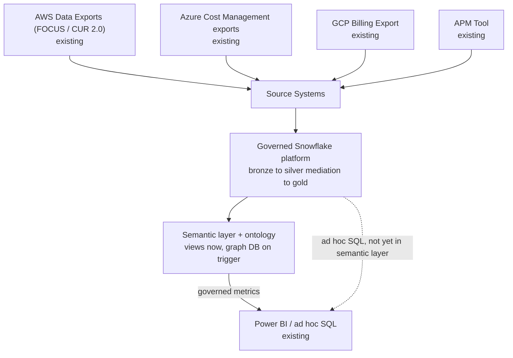
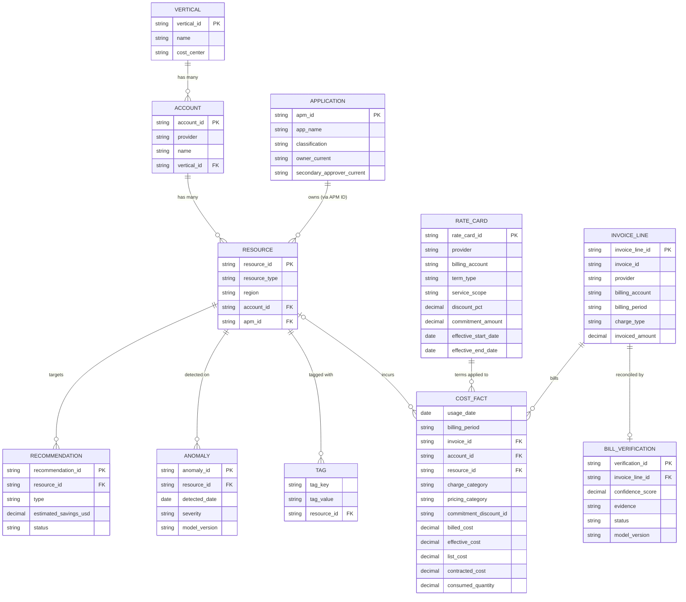

# Solution Architecture: Data Foundations

Phase 1 of the platform sequenced in [FinOps Solution Overview.md](FinOps%20Solution%20Overview.md). This document covers the data foundation only. Everything downstream is built on it: Core Intelligence, [Self-Serve Foundations](Solution_Architecture_Self_Serve_Foundations.md), [Governed Automation](Solution_Architecture_Governed_Automation.md), and [Cloud Workbench](Solution_Architecture_Cloud_Workbench.md).

Requirements, org details, and tool choices below are **inferred** from the job description and common enterprise FinOps practice. They are not confirmed the organization facts. Companion: [Platform_Build_Specification.md](Platform_Build_Specification.md) §1–4.

---

## 1. Executive Summary

This is the multi-cloud data platform that conforms AWS, Azure, and GCP billing and usage data, plus Application Portfolio Management (APM) metadata, into one governed, queryable foundation. Every other phase (ML models, self-serve API and chat, governed automation, bill verification) reads from this layer instead of working with provider-native schemas or raw data. It modernizes an existing capability: consumption-based pricing analysis, anomaly detection, and chargeback already run at the organization on PowerShell scripts, an on-prem SQL Server database, and stored procedures. This document designs a governed, scalable replacement for that pipeline.

## 2. Business Context & Requirements

### 2.1 Problem statement (inferred)

AWS, Azure, and GCP each export billing and usage data in their own schema. Today all of it runs through an on-prem SQL Server database, reconciled by PowerShell scripts and stored procedures on a monthly cycle. That pipeline achieves strong tagging coverage and true chargeback (`FinOps Current State.md`), but it can't support what comes next: continuous ingestion, ML analysis, richer self-serve, or automated action. Those all need a governed, queryable platform, not a monthly script run. Conforming the three providers onto that platform, while carrying forward the reconciliation and tagging logic that works, is the highest-leverage investment in the whole design, because everything downstream inherits what this layer can and can't do.

### 2.2 Requirements (inferred)

- FR1: Ingest billing and usage data from all three providers as each provider publishes it (file-arrival triggered, ADR-006), landing it raw and unmodified.
- FR2: Conform provider schemas into one canonical cross-provider schema, reconciled against the organization's tag taxonomy.
- FR3: Resolve each resource to one authoritative entity, preferring the APM ID and falling back to tag matching only for what the APM ID doesn't cover, and track that resolution rate as a governance KPI.
- FR4: Serve conformed data to every consumer (BI, ML, self-serve, automation) from one trusted layer, never from separately maintained copies.

### 2.3 Non-functional requirements (inferred)

| Requirement | Target (inferred) | Rationale |
|---|---|---|
| Data freshness | Reflects provider billing lag (typically ~24h) | Provider billing data isn't real-time; this ceiling applies to every later phase. Batches start on file arrival (ADR-006) |
| Auditability | Full lineage from raw to gold, retained per policy | SOC2-equivalent governance posture |
| Idempotency | Every pipeline stage can be re-run without duplicate or inconsistent results | Required once ML models and an LLM depend on this data |
| Data segregation | Vertical- and account-scoped access enforced at the catalog and query layer | The basis for every consumer's multi-tenancy |

### 2.4 Non-goals (inferred)

- No real-time (sub-minute) billing reconciliation; provider billing data doesn't support it.
- Not a general enterprise data platform. Scope is cloud cost, usage, and APM ownership metadata.

---

## 3. Architecture Overview

The four boxes feeding Source Systems are the organization's existing systems and aren't designed here; §4.1 lists what is pulled from each, along with the other sources.

### 3.1 Technology stack

| Component | Choice | Rationale |
|---|---|---|
| Data platform (storage, transform, serving) | Snowflake | the organization's data platform standard, which the organization is consolidating onto (`FinOps Current State.md`). One platform for bronze/silver/gold, ML, and BI serving. ADR-003 shows what would change on another platform |
| Transformation | dbt (SQL) + Snowpark (Python) | dbt for set-based work (FOCUS mapping, tag reconciliation); Snowpark for logic that is awkward in SQL (selecting the latest delivery per billing period, entity resolution). See ADR-001 and §4.2 |
| Feature store | Snowflake Feature Store (Snowpark ML) | Uses Snowflake's existing access control and lineage |
| Semantic layer | Snowflake Semantic Views | Metric definitions written once and reused everywhere. See ADR-002 |
| Governance | Snowflake Horizon (access control, row access policies, dynamic data masking, object tagging, Access History) | Built into the platform; no separate catalog product |
| Table format, versioning / ACID | Snowflake-managed **Apache Iceberg** tables on a organization-owned Azure storage external volume, with Snowflake Time Travel | An open table format: other engines can read the same files, so a future platform change means repointing engines, not migrating data. It also meets the job description's Iceberg/Delta requirement directly. Snowflake still manages writes, ACID transactions, and governance. See ADR-003 |
| Ontology | Versioned RDFS/OWL artifact (`ontology/finops-ontology.ttl`) in the platform repository | The shared definition of entities and relationships every consumer follows. Written in Phase 1; a reviewed file, not a system to run. See §4.4 |
| Knowledge graph | Stage 1: ontology views in Snowflake. Stage 2, when a named trigger is met: a managed graph database (the organization's own graph platform, or Neo4j AuraDB) | Governed views over gold answer relational questions over today's cost-only ontology. A graph database is added only when an ADR-004 trigger is met, most likely the organization's enterprise graph or dependency-aware blast radius. See ADR-004 |
| Operational database | Managed Postgres (Azure Database for PostgreSQL) | Not part of this phase; listed for completeness. The platform's one OLTP store: Governed Automation's approval queue and contracts, review queues, and Cloud Workbench session memory (Cloud Workbench ADR-009). No separate cache or vector store (Cloud Workbench ADR-003, ADR-006) |
| Orchestration | Snowflake Tasks | The job description names Airflow or ADF "or equivalent." Every scheduled step is already a Snowpark procedure or dbt model in Snowflake, so Snowflake's scheduler covers it with nothing extra to run. Billing loads start on file arrival, not a clock. See ADR-005, ADR-006, and Build Specification §1–2 |
| Infrastructure | CMP (the organization's container platform) for the platform's few long-running services; Terraform for everything | Shared across the platform. No platform-owned Kubernetes cluster. See §4.5 |
| Observability | Datadog (APM, infrastructure monitoring, log management, dashboards, monitors and alerting), instrumented with OpenTelemetry | the organization uses Datadog (known); that it is the observability platform of record is assumed, not confirmed (`FinOps Current State.md`). Reused instead of a separate open-source stack. Shared across the platform. See §4.5 |

---

## 4. Layer-by-Layer Design

### 4.1 Source systems

| Source | Description | Why Needed |
|---|---|---|
| AWS Data Exports (FOCUS / CUR 2.0) | AWS's billing and usage export, plus its usage-telemetry APIs | Primary billing and usage source for the AWS estate |
| Azure Cost Management exports | Azure's billing and usage export, plus its usage-telemetry APIs | Primary billing and usage source for the Azure estate |
| GCP Billing Export | GCP's billing and usage export, plus its usage-telemetry APIs | Primary billing and usage source for the GCP estate |
| Application Portfolio Management (APM) tool | the organization's application metadata system (owner, technical contact, classification). Its APM ID is tagged on roughly nearly all of cloud resources and is already used by Security and GRC | A much stronger entity-resolution signal than cloud tags alone: an authoritative, organization-level key. Feeds the ontology (§4.4). Ingestion and data-quality checks are in the Build Specification |
| Provider optimization recommendations and anomalies (native, free, already running) | Retrievable by API or scheduled export, not only in each console. **AWS**: the Data Exports cost optimization recommendations table (Cost Optimization Hub: rightsizing, idle resources, Savings Plans, Reserved Instances), delivered to S3, and Cost Anomaly Detection anomalies through the Cost Explorer `GetAnomalies` API (kept only 90 days, so saved daily). **Azure**: Advisor cost recommendations through the Advisor REST API (per subscription), savings plan purchase recommendations through the Cost Management Benefit Recommendations API (billing account scope), and reservation purchase recommendations through the Consumption API. Azure's detected anomalies have no documented read API (they are subscription-scoped and delivered as alert emails), so they aren't ingested. **GCP**: Recommender (machine type, idle resource, committed use) through the Recommender API or its scheduled organization-level BigQuery export. Whether GCP exposes detected cost anomalies programmatically isn't confirmed. Sources: [References.md](References.md) R7–R13 | These APIs return current state only, so the platform saves a daily snapshot. The snapshots are the baseline every custom model must beat (MLOps Pipeline ADR-007), an input to rightsizing and RI/SP planning, and early value before Core Intelligence ships (Solution Overview, migration step 0b). Lands in `gold.fact_provider_recommendation` and `gold.fact_provider_anomaly` (Build Specification §3) |
| Terraform state (read-only, from the organization's state backend: the Terraform Cloud/Enterprise API, or a state file in cloud storage) | Resolved infrastructure-as-code state, not raw `.tf` source. Resolved values can be compared directly with a resource's live configuration without evaluating variables or modules. Two fields matter downstream: `managed_by_iac` and a drift flag (live config vs. last declared) | Utilization alone can't tell an accidentally over-provisioned resource from one sized on purpose; that difference lives in whatever declared the resource. MLOps Pipeline §2.2 covers how it shapes recommendations, and Governed Automation §3.3 covers why it gates direct execution |
| Commitment inventory (AWS Reserved Instances and Savings Plans, Azure reservations and savings plans, GCP committed use discounts, from each provider's API) | Every commitment the organization owns: type, scope, term, hourly amount, start and end dates. Billing exports show a commitment being used, not when it expires | RI/SP planning (MLOps Pipeline ADR-006) needs expiry dates to stagger purchases against what's already owned. Lands in `gold.dim_commitment` (Build Specification §3) |
| Provider invoices (AWS invoices, Azure EA/MCA invoices, GCP invoices, from each provider's invoice API or export) | The invoice lines the organization is asked to pay, keyed by `invoice_id`: usage, tax, support, marketplace, commitment purchases, and credits | What Bill Verification (Phase 4) verifies. Billing exports describe usage; only the invoice says what is charged. Each invoice line is reconciled against the `billed_cost` rows with the same `invoice_id` (§4.3, cost basis) |
| Contract terms (the rate card: negotiated discounts, private pricing, commitment programs such as AWS EDP and Azure MACC, and credits owed, keyed to billing account and effective dates) | The negotiated terms the billing export doesn't carry. FOCUS exports include `ContractedUnitPrice` per row where the provider supports it, so this source is narrower than a per-SKU price list. It is **functional data, not a lookup table**: without it, nothing can check whether a discount or credit was applied | Bill Verification (Phase 4) checks each invoice line against these terms. Ingested into gold and the ontology (§4.4) like any other source |

The three cloud sources differ in schema, tag semantics, and refresh cadence. That is why a silver stage conforms them, so nothing downstream sees provider-native schemas.

### 4.2 Mediation (implemented as the platform's bronze-to-silver transform)

**Purpose**: conform billing data into one canonical schema before anything downstream has to deal with provider quirks. Mediation is **not a separate system ahead of the platform**; a standalone staging step would duplicate what a silver layer does. It is the transform from bronze (raw, provider-native, as received) to silver (conformed, cross-provider, one delivery per billing period). §4.3 describes the layers themselves.

> **FOCUS shrinks this stage, once enabled.** AWS, Azure, and GCP all offer billing exports in **FOCUS** (FinOps Open Cost and Usage Specification), a vendor-neutral schema maintained by the FinOps Foundation. GCP's FOCUS export to BigQuery is still in preview with documented conformance gaps, so GCP may start on its detailed usage export, mapped to the canonical schema in dbt, and move to FOCUS once that export is generally available. **Assumption adopted**: nothing in the Current State description of the PowerShell/SQL pipeline suggests FOCUS is in use, so enabling it for each provider is treated as a Phase 1 setup task. It is a configuration change in each provider's export settings, not an engineering effort. With FOCUS, most of the work of mapping AWS fields to Azure fields to GCP fields goes away. The effort goes instead to what FOCUS doesn't cover: the organization's tag taxonomy, vertical and account attribution, and data quality checks. See ADR-001.

- **dbt** models (SQL, tested and documented) do most of the bronze-to-silver transform: mapping FOCUS to the canonical schema and reconciling the organization's tag taxonomy, as Snowflake queries with no separate compute engine.
- **Snowpark** (Python running on Snowflake compute) handles the parts that are awkward in SQL: keeping only the latest complete delivery for each billing period, and entity resolution. This is where the job description's "Apache Spark or equivalent" requirement is met, inside Snowflake instead of on a separate Spark cluster.
- The transform is idempotent and replayable: a failed or corrected run can be re-run without duplicate or inconsistent results. Build Specification §2 describes how (replace a billing period as a whole, never upsert individual rows).

### 4.3 Governed Snowflake platform (medallion-layered schemas)

Data lands in a **medallion** structure of three Snowflake schemas:

1. **Bronze**: raw, provider-native, landed as received, immutable, and kept for audit and replay.
2. **Silver**: conformed to the canonical schema, one delivery per billing period, business rules applied (the mediation transform, §4.2).
3. **Gold**: aggregated and ready to consume.

All three layers are **Snowflake-managed Apache Iceberg tables**. Snowflake writes and manages them (ACID transactions, compaction, governance), while the data and metadata files sit on an Iceberg external volume in organization-owned Azure storage that other engines can read. **Time Travel** supports audit and "what did we know at the time" reconstruction. Two differences from standard Snowflake tables need designing around:

1. Fail-safe isn't available on a customer-managed external volume, so recovery beyond Time Travel relies on bronze's own retention (see Data retention below) plus soft delete and versioning on the storage account.
2. Whether zero-copy cloning works for these tables is a validation item; if not, test environments need another copy method.

Governance (lineage, access control, and cataloging) comes from Snowflake **Horizon**: role-based access control, row access policies, dynamic data masking, and object tagging, with lineage through Access History and object dependencies. ADR-003 explains the choice of one platform.

The **feature store** for Core Intelligence also lives here: the **Snowflake Feature Store** (part of Snowpark ML) reads directly from gold and serves the MLOps pipeline, with no data moved to a separate ML platform.

**BI reads from the semantic layer, not raw gold.** Power BI connects to Snowflake Semantic Views (§4.4) for anything with a governed metric definition, such as spend, burn rate, and RI coverage. Those are the same definitions Cloud Workbench and the knowledge graph use, so a dashboard's number can't drift from what any other consumer reports (ADR-002). Gold tables stay directly queryable for ad hoc SQL that isn't yet a named metric, as a fallback. Either way there is no export, no data-sharing protocol, and no second platform to keep in sync.

**Pointing Power BI at the right source doesn't stop a second semantic layer from growing inside Power BI.** A report can query a Semantic View and still define its own DAX measure that recomputes "EC2 spend" from the same columns: a competing definition, which is exactly what ADR-002 prevents, one layer higher. Existing Power BI reports being repointed here (the dashboards review item in [FinOps Solution Overview.md](FinOps%20Solution%20Overview.md)) must be audited for this: any local measure that duplicates a Semantic View metric is replaced with a reference to that metric, not carried over because the source changed. Preferring **DirectQuery** over Import mode where performance allows helps, because it discourages building a large local model to hang measures on, but it isn't enough; a DirectQuery report can still define a local measure. This needs a reporting standard (dataset certification, peer review), not only a connection-mode choice.

#### Conceptual gold-layer model

This is the conceptual version of the gold table list in Build Specification §3: a star schema centered on `COST_FACT`, with `RESOURCE` as the hub that ownership (`APPLICATION`, through the APM ID), classification (`TAG`), and ML outputs attach to. Owner and Technical Contact change tracking (the SCD Type 2 treatment in §4.4) is a detail on `APPLICATION`, left out to keep the model at entity level. `INVOICE_LINE`, `RATE_CARD`, and `BILL_VERIFICATION` (Bill Verification, Phase 4) follow the same pattern as `ANOMALY` and `RECOMMENDATION`: inputs and outputs both land in gold, not in stores owned by the phase that uses them.

#### Cost basis

Provider billing data carries several different "costs" for the same row, and mixing them up is the most common reason numbers don't reconcile. Gold keeps the four FOCUS cost columns side by side instead of one `cost_usd` column:

1. **`billed_cost`**: what the invoice says. Used only for bill verification and invoice reconciliation.
2. **`effective_cost`**: amortized cost, with upfront commitment fees spread across the usage they cover. Used for every spend, trend, anomaly, and chargeback metric below.
3. **`list_cost`**: cost at public list price. Used with `effective_cost` to measure savings.
4. **`contracted_cost`**: cost at the organization's negotiated price. Used to check that negotiated pricing was applied.

`charge_category` (usage, purchase, tax, credit, adjustment), `pricing_category` (on-demand, committed, spot), and `commitment_discount_id` stay in the gold grain, so commitment coverage is computed directly from billing data, not joined from a separate reference table. Build Specification §3 has column-level detail. **Assumption**: today's chargeback uses amortized cost; if it uses billed cost, only the chargeback metric changes.

#### Data retention & archival

A governance policy over the bronze/silver/gold layers, not a separate mechanism:

- **Bronze**: 7-year retention for now, subject to legal and compliance guidance.
- **Silver/Gold**: 18 months live, then soft-archived to historical tables, and later deleted from those tables. **Unconfirmed**: whether the archive lasts until 36 months *from original ingestion* (the archive covers months 19–36) or 36 months *on top of* the first 18 (54 months in total). This document assumes the first.
- **Rebuilding deleted data**: re-running the mediation transform (§4.2) over the matching slice of bronze rebuilds silver and gold for that period, as long as the period is within bronze's 7-year retention. No separate "period tables" mechanism is needed.

### 4.4 Semantic layer, ontology, and knowledge graph

This layer turns rows in gold tables into concepts every consumer (an AI system, a business user, a dashboard) understands the same way.

- **Semantic layer**: business metrics ("EC2 spend," "monthly burn rate," "reserved instance coverage") defined once over gold and reused, so no consumer recomputes them differently. Implemented as **Snowflake Semantic Views** wherever they cover the need, with no separate semantic-layer product.

#### Illustrative semantic layer metrics

A starting set, based on the questions a business vertical asks about its own spend. It will grow as verticals ask for more. Build Specification §4 has the Semantic View definitions.

| Theme | A vertical's question | Metric | Computed from |
|---|---|---|---|
| Visibility & trend | "How much are we spending, and is it trending up or down?" | `metric_total_spend` | `SUM(effective_cost)` from `gold.fact_cost_daily`, by vertical/account/period |
| Visibility & trend | "What changed since last month, and why?" | `metric_spend_variance_mom` | Period-over-period change in `metric_total_spend`, split into new/terminated resources, usage change, and price change |
| Visibility & trend | "Which services or resource types make up our bill?" | `metric_spend_by_resource_type` | `SUM(effective_cost) GROUP BY resource_type` |
| Visibility & trend | "How much of our spend is production vs. non-production?" | `metric_spend_by_environment` | `SUM(effective_cost) GROUP BY environment` tag |
| Visibility & trend | "How much of our spend can't be attributed to a specific application?" | `metric_unattributed_spend_pct` | `SUM(effective_cost)` where the APM ID is unresolved (including charges with no resource, such as support or tax), as a % of total spend. Weighted by dollars, unlike `dq_check_apm_id_present`, which counts resources (Build Specification §4) |
| Efficiency & waste | "Are we paying for capacity we're not using?" | `metric_utilization_rate` | Consumed vs. allocated compute, memory, and storage, per resource |
| Efficiency & waste | "How much are we spending on resources nobody's using?" | `metric_idle_resource_spend` | `SUM(effective_cost)` where `metric_utilization_rate` is below a configurable near-zero threshold |
| Efficiency & waste | "What would we save if we acted on every open recommendation?" | `metric_open_recommendation_savings` | `SUM(estimated_savings_usd)` from `gold.fact_recommendation` where `status = 'open'` |
| Efficiency & waste | "Are we acting on recommendations, or just generating them?" | `metric_recommendation_realization_rate` | % of recommendations marked implemented within N days of being raised |
| Commitments | "How much of our spend is covered by a commitment vs. on-demand rates?" | `metric_ri_coverage` | Share of commitment-eligible usage `effective_cost` where `pricing_category = 'Committed'`, from `fact_cost_daily` |
| Commitments | "Are we using the reserved capacity we've already bought?" | `metric_ri_sp_utilization` | Committed capacity actually consumed, vs. purchased |
| Anomalies & risk | "Did anything unusual happen with our spend this period?" | `metric_anomaly_rate` | `COUNT(fact_anomaly) / COUNT(DISTINCT resource_id)` per period |
| Anomalies & risk | "How much did anomalies cost us this period?" | `metric_anomaly_dollar_impact` | `SUM(effective_cost)` attributable to line items flagged by `fact_anomaly` |
| Forecast & budget | "What's our current run-rate?" | `metric_monthly_burn_rate` | `SUM(effective_cost) GROUP BY MONTH(date), account_id` |
| Forecast & budget | "Are we on track against budget?" | `metric_forecast_vs_budget_variance` | Projected month-end spend (run-rate extrapolation) vs. budget reference data |
| Chargeback | "What's my vertical's chargeback amount this month?" | `metric_chargeback_amount` | `metric_total_spend` rolled up to vertical, one month in arrears (the current chargeback cadence) |
| Benchmarking | "How do we compare to peer verticals on efficiency, not raw dollars?" | `metric_peer_percentile_rank` | Percentile rank of a rate metric (such as `metric_utilization_rate` or `metric_ri_sp_utilization`) against an anonymized peer set. Rates only, per the benchmarking design in `FinOps Opportunities.md` §2b |

#### Ontology and knowledge graph

The entities and relationships in this domain, how they become a queryable graph, and how identity and staleness are handled.

- **Ontology**: the entities (Account, Vertical, Resource, Tag, Cost Line Item, Invoice Line, Anomaly, Recommendation, Rate Card, Bill Verification) and how they relate. A Resource belongs to an Account; an Account rolls up to a Vertical; a Cost Line Item covers a time period and usually a Resource; a Cost Line Item is billed on an Invoice Line; Rate Card terms apply to Cost Line Items; and an Invoice Line is reconciled by a Bill Verification record. **The `Resource` entity uses the APM ID as its main cross-cloud key** where available (about nearly all of resources), with Owner, Technical Contact, and Classification taken from APM, not derived from cloud tags.
- **Ontology artifact, written in Phase 1, before any graph database exists.** The entity and relationship definitions above (mirrored in Build Specification §4) are a standalone, versioned RDFS/OWL file (`ontology/finops-ontology.ttl`), reviewed like code. Everything else follows it: graph database node labels and relationship types, Semantic View entity names, and Cloud Workbench's entity grounding. This matches the organization's move toward ontologies for grounding, and it costs nothing to run. Writing it first also means a later graph database implements an agreed model instead of becoming the model by default. Alignment with any enterprise ontology the organization is building is an open item to validate.
- **Knowledge graph, in two stages** (ADR-004):
  1. **Stage 1: ontology views in Snowflake.** Each entity and relationship is a governed view over gold (`ontology.resource`, `ontology.belongs_to`, and so on), named exactly as the ontology file defines them. Relational questions ("which resources in this vertical had a cost anomaly this month") become SQL joins and recursive queries over these views. At today's depth, about ten entity types and two to three hops, this is enough and adds no system.
  2. **Stage 2: a managed graph database, when a trigger is met.** The same entities and relationships are synced into a property-graph database (the organization's own graph platform if one exists, otherwise Neo4j AuraDB), and relational questions become Cypher traversals.

  In both stages gold is the system of record. A node's **static attributes** (resource type, region, tag values) come from gold, and any **computed property** (such as a running spend total) comes from the semantic layer's metric definition (Semantic Views, above), never a separate calculation. This is ADR-002's rule applied to the graph. Cloud Workbench reaches both stages through one MCP tool, `query_graph`, whose contract doesn't change when the backend does (Build Specification §5), so **GraphRAG**-style retrieval works from Stage 1.
- **Entity resolution** happens here: match on APM ID first, which is more authoritative than cross-cloud tag matching, and fall back to fuzzy tag matching only for resources without one. The unmatched share is a governance metric in its own right, because an untagged resource is a blind spot for both chargeback and security, since the same APM ID drives both.
- **Changing attributes, handled with Slowly Changing Dimensions (SCD Type 2).** Which resources belong to which application is fairly stable. The Owner, Technical Contact, and Secondary Approver attributes change more often (role changes, departures) and can go stale independently. All three are tracked as SCD Type 2 attributes with effective start and end dates, not overwritten, so staleness is visible and can be reconfirmed.
- **Secondary Approver, assumed to exist in APM alongside Owner and Technical Contact.** Security and GRC already rely on the APM ID for their reviews (§4.1), so APM plausibly tracks a secondary approver for dual-control purposes. Governed Automation's Contract document needs it: both the Owner and the Secondary Approver must sign, and neither is a backup for the other. Audit, security, and GRC all want two independent sign-offs before automation authority is granted over an application's resources.

### 4.5 Infrastructure & observability (shared across every phase)

- **Infrastructure**: this phase runs no containers and no self-hosted databases. Ingestion, transformation, scheduling (Snowflake Tasks, ADR-005), and the ontology views all run in Snowflake. The knowledge graph starts as those views; a managed graph database and its sync job (a Snowpark procedure, Build Specification §4) arrive only when an ADR-004 trigger is met. **Terraform** manages all of it as versioned, reviewed code. The platform's few long-running services in later phases run on CMP, the organization's existing container platform, operated by its platform team (Build Specification §8). ML training and batch scoring also run in Snowflake (MLOps Pipeline §2.5, ADR-008), because those jobs read gold directly and moving them to a container platform would copy cost data out of Snowflake's access policies with no latency benefit.
- **Observability**: **Datadog** (which the organization uses; its role as observability platform of record is assumed) is reused instead of a separate stack. Snowflake task history, warehouse credit use, and the graph database's metrics (once it exists) flow in through Datadog integrations, along with logs and monitors for the scheduled jobs. Alerts post to a Teams channel and open an ITSM ticket or page (believed to be ServiceNow, not confirmed) when action is needed. Every phase uses these same two channels. Per-stage tracing (the mediation job, the graph sync) uses **OpenTelemetry** exported to Datadog APM, the same backbone as Cloud Workbench (§4.2) and MLOps Pipeline (§2.6). Data quality results (`job_dq_checks`, Build Specification §2) and lineage (Horizon Access History, §4.3) are queried in Snowflake, not copied into another dashboard product.
- **Governance**: lineage from raw provider data through bronze, silver, and gold; full audit logging; access control at the catalog and query layer along vertical and account boundaries; and change management for the ontology itself, since every later phase depends on it.

Cloud Workbench and Governed Automation add phase-specific observability (eval gates, action audit logs) on top of this baseline.

---

## 5. Architecture Decision Records

**ADR-001: Implement mediation as the bronze-to-silver transform, using FOCUS where available**
- *Context*: AWS, Azure, and GCP billing exports have different schemas and tag semantics. FOCUS, offered by all three (GCP's export in preview), provides much of the normalization. A separate staging step ahead of the platform would repeat the conform, deduplicate, and business-rule work a silver layer exists to do, and would leave bronze holding conformed data instead of raw data.
- *Decision*: Land raw provider data in bronze. Do FOCUS-to-canonical mapping and organization-specific conformance (tag taxonomy, attribution, one delivery per billing period) as the bronze-to-silver transform, in Snowflake with dbt and Snowpark. No separate staging system.
- *Alternatives considered*: A separate pre-platform mediation system, rejected; an extra hop and technology with no distinct purpose when bronze holds raw data and silver conforms it. Custom normalization that ignores FOCUS, rejected; it duplicates what an open standard already solves. FOCUS alone with no conformance, rejected; FOCUS standardizes the billing schema but knows nothing about the organization's vertical structure or tag taxonomy.
- *Consequences*: One fewer technology, and bronze holds truly raw data, as a medallion design expects. The conformance work itself is the same; it sits where the medallion structure puts it.

**ADR-002: Build a semantic layer and ontology instead of letting each consumer define metrics**
- *Context*: "EC2 spend" or "monthly burn" can be computed several inconsistent ways from raw billing data, and several consumers (BI, an LLM, ML features) need the same answer.
- *Decision*: Define metrics once in a governed semantic layer (Snowflake Semantic Views). Every consumer, BI dashboards included, uses these definitions instead of computing its own.
- *Alternatives considered*: Each consumer computing metrics from gold with its own queries, rejected; results diverge and are harder to govern and audit. Exempting BI and letting it query gold directly, rejected; that recreates the inconsistency for one consumer. Treating "point Power BI at the Semantic View" as enough, rejected as incomplete; a report can still define a local DAX measure that recomputes the metric, so a reporting standard is also needed (§4.3).
- *Consequences*: Upfront modeling effort, in exchange for consistent, explainable, auditable answers wherever the data is used.

**ADR-003: Build on Snowflake, the organization's data platform standard, with open Iceberg tables and a documented path to another platform**
- *Context*: Snowflake is the organization's data platform standard, and the organization is consolidating onto it (`FinOps Current State.md`). Databricks or Microsoft Fabric could host this platform too; the overall shape would be the same, and the platform-specific services would differ. The job description names Iceberg or Delta Lake as the expected table format.
- *Decision*: Consolidate storage, transformation, ML training and scoring, and BI serving onto Snowflake. Store bronze, silver, and gold as Snowflake-managed Iceberg tables (§4.3). Keep what doesn't need to be Snowflake-specific portable: FOCUS-aligned schemas, dbt models, the ontology file, Python model code, OPA policies, Temporal workflows, and the API. The rest would change if the platform changed:

  | Capability | Snowflake (chosen) | Databricks equivalent | Microsoft Fabric equivalent |
  |---|---|---|---|
  | Table format | Iceberg tables | Delta Lake (Iceberg readable via UniForm) | Delta Lake in OneLake |
  | Scheduling | Snowflake Tasks | Lakeflow Jobs (Workflows) | Data Factory pipelines |
  | Governance | Horizon (row access, masking, lineage) | Unity Catalog | OneLake security with Microsoft Purview |
  | Python transforms and ML | Snowpark, Snowpark ML | Spark, Databricks ML | Spark notebooks, Fabric Data Science |
  | Model registry | Snowflake Model Registry | MLflow in Unity Catalog | MLflow-based Fabric ML models |
  | Semantic layer | Semantic Views | Unity Catalog metric views | Power BI semantic models |
  | Natural-language query | Cortex Analyst | AI/BI Genie | Fabric data agents |
  | App UI | Streamlit in Snowflake | Databricks Apps | Power BI or Power Apps |

  Product names in the last two columns are current as of September 2026 and change often; confirm them before relying on this table.
- *Alternatives considered*: Databricks, not chosen; viable, but against the organization's consolidation onto Snowflake, and the table shows what would change. Microsoft Fabric, not chosen for the same reason, despite its fit with the organization's Microsoft footprint (Power BI, Teams, Azure OpenAI). Standard Snowflake tables instead of Iceberg, rejected; slightly simpler, but it ties the data itself to one engine, which is what makes a platform change expensive.
- *Consequences*: Fewer moving parts and nothing to sync across platforms. If the organization's direction changes, the data stays readable where it is and the portable components carry over; the Snowflake-specific services in the table would be rebuilt. Snowflake's compute model (virtual warehouses) scales and costs differently from a Spark cluster, and heavy custom Python ML (deep learning, GPU training) is less natural here, which is acceptable because MLOps Pipeline ADR-002 scopes these models as explainable and statistical. Iceberg tables add two validation items (§4.3): no Fail-safe on a customer-managed volume, and cloning support.
- *Sources*: [References.md](References.md) R14 (Iceberg limits), R26–R28 (platform equivalents).

**ADR-004: Stage the knowledge graph: ontology views in Snowflake first, a managed graph database only when a named trigger is met**
- *Context*: Cloud Workbench's relational questions need traversal over the ontology (§4.4). Today's ontology is cost-only and shallow (about ten entity types, two to three hops, §4.3's ER model), and SQL over gold handles that comfortably. A graph database earns its cost in two situations the platform can foresee but doesn't face yet:
  1. **Cross-domain grounding.** the organization is moving toward ontologies and graph for grounding, and the APM ID already links cost, Security, and GRC (§4.1). Publishing FinOps entities into an enterprise graph makes cross-domain questions answerable, such as "which high-cost applications also have open security findings."
  2. **Variable-length traversal.** Dependency-aware blast radius for Governed Automation ("what depends on this resource, at any depth") is a path query SQL handles poorly. It needs service-dependency data (a CMDB or service map, `FinOps Opportunities.md` §2b) that no source in §4.1 provides yet.
- *Decision*: Implement the ontology as governed views in Snowflake first (Stage 1). Add a managed graph database (Stage 2) when any of these triggers is met:
  1. the organization's enterprise graph platform is available to publish into.
  2. The first cross-domain source is ingested: service dependencies (CMDB or service map), deployments, incidents, or security findings.
  3. A concrete query need, such as dependency paths for blast radius, can't meet its latency target in SQL.

  For Stage 2, use the organization's graph platform if one exists, otherwise Neo4j AuraDB. Never self-host. In both stages, gold is the system of record, static attributes come from gold, and computed properties come from Semantic Views. Cloud Workbench's `query_graph` tool keeps one contract across both stages (Build Specification §5).
- *Alternatives considered*: A graph database from Phase 1 for future headroom, rejected; it adds a system and a sync job before any question needs them. Self-hosted Neo4j, rejected; a database to patch, back up, and put on call with no gain over a managed service. A platform-owned graph alongside a the organization enterprise graph, rejected; it would split the ontology the enterprise is trying to unify. Staying relational permanently, rejected; cross-domain grounding and dependency traversal are real, foreseeable needs, and the organization's direction points toward a graph.
- *Consequences*: Stage 1 adds nothing to operate. The ontology file, view names, and `query_graph` contract are fixed from the start, so moving to Stage 2 is a backend change plus a sync job, not a redesign of anything that uses the graph. Stage 1 queries are less expressive than Cypher, which is exactly what trigger 3 watches for. Whether a the organization graph platform or a dependency data source exists are open items to validate.

**ADR-005: Schedule ingestion and transformation with Snowflake Tasks, not Airflow or Azure Data Factory**
- *Context*: The job description names Airflow or Azure Data Factory "or equivalent." Every scheduled step in this phase (loading exports, calling provider APIs, dbt models, Snowpark procedures, data quality tests, the graph sync) already runs in Snowflake.
- *Decision*: Use Snowflake Tasks (task graphs with dependencies) as the scheduler. File-based exports load through external stages with Snowpipe or `COPY INTO`; API-based sources are pulled by Snowpark procedures using external access integrations (Build Specification §1).
- *Alternatives considered*: Self-hosted Airflow, rejected; a scheduler, metadata database, and workers to run for jobs that all execute in Snowflake anyway. Managed Airflow or Azure Data Factory, not ruled out; reasonable if the organization already runs one that the team knows, or if orchestration later has to span many systems outside Snowflake, but not introduced for this phase alone.
- *Consequences*: Scheduling, retries, and task history live in Snowflake with the data, with nothing extra to operate. Cross-system orchestration is weaker than Airflow's. That is acceptable because Governed Automation's multi-step, cross-system workflows run on Temporal (Governed Automation ADR-002), not on this scheduler.

**ADR-006: Process cost data in batches triggered by file arrival, not as an event stream; use events only where the source emits them**
- *Context*: The job description asks for event-driven pipelines that process real-time telemetry and cost signals. The platform's main input, provider billing data, isn't produced as a stream. The providers publish it in periodic, restated batches:
  1. **AWS**: Data Exports (CUR 2.0 and FOCUS) refresh up to once a day, and each refresh can overwrite the whole billing period's partition.
  2. **Azure**: EA and MCA cost data typically arrives within 8 to 24 hours. Estimated charges update six times a day, the billing period closes up to 72 hours after it ends, and charges can change until about the fifth day.
  3. **GCP**: the billing export to BigQuery runs at regular intervals with no delivery or latency guarantee, and usage reporting frequency varies by service, so recent usage for some services appears later than others.

  In all three, open-period costs are estimates that get restated until the invoice is issued. That is why whole billing periods are replaced on reload (Build Specification §2).
- *Decision*: Cost data is processed as batches, but they start when data arrives instead of on a guessed schedule. File-based exports load with Snowpipe auto-ingest when a file lands, and each provider's task graph is a triggered task that runs when the bronze stream has new rows (Build Specification §1). API-based sources (invoices, recommendations, commitment inventory, APM) are pulled daily. Event-driven handling is used where the source is actually an event:
  1. Approval and rejection clicks and opt-out responses are sent as signals to the running Temporal workflow (Governed Automation §3.3).
  2. A Terraform module apply refreshes the state snapshot, where the state backend emits apply events (`job_terraform_state_sync`, Build Specification §4).
  3. Provider-native anomaly alerts (Solution Overview step 0b) are pushed to the team by the providers' own notifications. They run on the same billing data, so they are no fresher than it, but they need no polling.

  A resource-change event path (AWS EventBridge, Azure Event Grid, or GCP Eventarc feeding resource creation events into Snowflake) is added only when a named need appears: for example, a requirement to flag an expensive resource launch within minutes, before its cost shows in billing data. That path would detect launches, not cost; cost stays bound by billing lag.
- *Alternatives considered*: A streaming pipeline for billing data (Kafka, Azure Event Hubs, or Snowpipe Streaming), rejected. It adds a broker and consumers to run, and it can't make the data fresher than the provider's own refresh. A stream of restated periods also makes idempotent replacement harder than a batch reload does. A fixed daily schedule with no arrival trigger, rejected; it either runs before a late refresh lands or waits hours after an early one.
- *Consequences*: Freshness is the provider's billing lag (§2.3) plus minutes, not a schedule offset. Nothing to operate is added. Anomaly detection and every later phase inherit a data freshness of hours, which is enough for daily cost decisions and not enough for per-minute reaction; the resource-event path covers that gap if a need for it appears.
- *Sources*: [References.md](References.md) R2–R5 (provider refresh and restatement), R15–R16 (streams on Iceberg tables, triggered tasks).

---

## 6. Glossary

**Apache Iceberg**: An open table format for large analytic tables: data files plus metadata any compatible engine can read. Used here as Snowflake-managed Iceberg tables for bronze, silver, and gold (§4.3, ADR-003).

**Conformance / conformed schema**: Normalizing structurally different source data into one consistent schema.

**Datadog**: A SaaS observability platform the organization uses, assumed (not confirmed) to be its observability platform of record (APM, infrastructure monitoring, log management, dashboards, monitors and alerting). The platform-wide backend here for metrics, tracing, and alerting, fed by OpenTelemetry spans. See §4.5.

**dbt**: A SQL-based transformation tool with built-in testing and documentation. Implements most of the bronze-to-silver mediation transform as Snowflake queries.

**Entity resolution**: Determining that records from different sources refer to the same real-world entity, and merging them.

**Feature store**: A governed repository of ML-ready features, shared across models. Implemented here as the Snowflake Feature Store (Snowpark ML), reading directly from gold.

**Gold/silver/bronze (medallion layering)**: Stages of progressive refinement: raw (bronze), conformed (silver), aggregated and consumption-ready (gold). Implemented here as Snowflake schemas over Iceberg tables.

**Idempotent (pipeline)**: A pipeline that produces the same result when re-run, so it can be retried without side effects like duplication.

**Knowledge graph**: A populated, queryable implementation of an ontology: entities and their relationships. Implemented here in two stages: governed ontology views over gold in Snowflake, then a managed graph database (the organization's own graph platform, or Neo4j AuraDB) when an ADR-004 trigger is met.

**Mediation**: The bronze-to-silver conformance transform that normalizes provider-native data into one canonical schema, implemented as dbt models and Snowpark logic in Snowflake.

**Neo4j**: A property-graph database (nodes, relationships, Cypher query language). The default for Stage 2 of the knowledge graph, as the managed AuraDB service, synced from Snowflake's gold schema (ADR-004).

**Ontology**: The defined set of entities, relationships, and hierarchies in a domain; the schema a knowledge graph implements.

**Semantic layer**: A governed layer that defines business metrics once for reuse by every consumer. Implemented here as Snowflake Semantic Views.

**Snowflake Horizon**: Snowflake's built-in governance features (access control, row access policies, dynamic data masking, object tagging, and lineage through Access History). The governance layer for this platform (§4.3, §4.5).

**Snowflake Tasks**: Snowflake's scheduler: tasks and task graphs that run SQL, dbt models, or Snowpark procedures on a schedule or after another task (ADR-005).

**Snowpark**: Snowflake's framework for running Python (and other languages) as dataframe-style transformations on Snowflake compute. Used here for mediation logic that is awkward in SQL, and for feature engineering and ML training in the MLOps Pipeline document.

**Time Travel / zero-copy cloning**: Snowflake features for querying or restoring earlier table states, and for copying tables without duplicating storage. Time Travel supports audit reconstruction here; cloning support for Iceberg tables is a validation item (§4.3).
