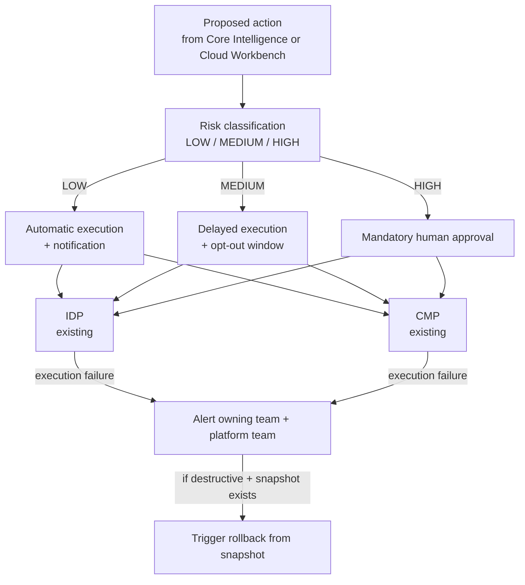

# Solution Architecture: Governed Automation

Phase 3 of the platform sequenced in `FinOps Solution Overview.md`. Split out from what was originally a single combined "Internal Assistant" solution architecture document — see `Solution_Architecture_Data_Foundations.md` for why it was split.

Requirements, org details, and specific tool choices below are **inferred** from JD language and reasonable enterprise-FinOps practice, not confirmed the organization fact. Companion: `Platform_Build_Specification.md` §6.

---

## 1. Executive Summary

This is the layer that decides what happens to an optimization action proposed by Core Intelligence (a rightsizing/anomaly finding) or Self-Serve Foundations (a user or Cloud Workbench-initiated request): execute it automatically, execute it with a delay and opt-out, or hold it for mandatory human approval — classified by risk, enforced in code, never left to the proposing system's own judgment.

## 2. Business Context & Requirements

### 2.1 Problem statement (inferred)

Cloud Platform Services can already generate rightsizing and anomaly recommendations (Core Intelligence) and surface them conversationally (Self-Serve Foundations), but today those recommendations are advisory-only — a human has to act on every one manually, regardless of how low-risk it is. This layer lets a bounded, genuinely low-risk subset execute automatically, freeing human review for the cases that actually need it, without removing human judgment from anything higher-risk.

### 2.2 Functional requirements (inferred)

- FR1: Classify a proposed action into LOW/MEDIUM/HIGH risk based on action type, target-resource classification (e.g., production tag), and blast radius.
- FR2: Enforce routing by that classification in code — HIGH always requires human approval, regardless of any other factor (hard rule, not a scored threshold).
- FR3: Require an explicit, opt-in agreement between the owning application team and the platform team — keyed on the APM ID — before automation acts on that team's resources above the lowest risk tier.
- FR4: Provide a full audit trail (before/after state) for every automated action, linked to both the resource's APM ID and the agreement that authorized it.
- FR5: Detect and handle execution failures from IDP/CMP — alert the owning application team and the platform team, and where the action was destructive and a pre-action snapshot exists (per the Reversibility NFR below), trigger rollback from it rather than leaving the resource in an unknown intermediate state.

### 2.3 Non-functional requirements (inferred)

| Requirement | Target (inferred) | Rationale |
|---|---|---|
| Approval latency (MEDIUM/HIGH tier) | Queued for human review, no fixed SLA assumed | Human review time isn't the platform's to promise |
| Reversibility | A snapshot/backup step required before any destructive action where one is available | Bounds the cost of an incorrect automated action |
| Auditability | Every action logged with before/after state, risk tier, and authorizing agreement | Same HITRUST/SOC2-equivalent posture as the rest of the platform |
| Failure alerting | Every IDP/CMP execution failure surfaced to the owning team and platform team, no fixed response-time SLA assumed | Silent failure on an approved action is worse than the action never having been approved — someone has to know |

### 2.4 Non-goals (inferred)

- Not a general-purpose infrastructure automation platform; scope is cost-optimization actions surfaced by Core Intelligence or Self-Serve Foundations.
- Not a replacement for IDP/CMP's own provisioning logic — this layer decides *whether* an action proceeds, IDP/CMP still execute it.

---

## 3. Architecture

IDP and CMP are the organization's real, existing provisioning and container-management platforms — this layer decides whether an action proceeds and calls them to execute it, it doesn't replace or rebuild either one. A failed execution is not a silent dead end: it alerts both parties and, where reversible, triggers rollback rather than leaving the resource in an unknown state (FR5).

When a proposal warrants an action, this layer calls IDP (provisioning-related actions) or CMP (container-related actions) via the same MCP tool-calling mechanism used elsewhere in the platform, gated by **risk-tiered autonomy**: low-risk, reversible actions can proceed with notification only; higher-blast-radius actions require human approval, enforced in code, not in the proposing system's own judgment (see ADR-001).

### The horizontal/vertical "contract" — not yet designed

For anything above LOW risk, an explicit, opt-in agreement between the owning application team and the platform team is needed before automation acts on their resources — an SLA-like contract, keyed on the APM ID, covering what's pre-approved, notification requirements, change windows, rollback guarantees, and escalation paths. **This entity is not yet designed here** — it's scoped in `FinOps Opportunities.md` §2c and flagged in the Solution Overview's Sub-Document Index as still needed. `classify_action_risk` and the approval queue (Build Specification §6) would consult it once it exists, extending rather than replacing what's already specified.

### Assumptions adopted

Educated assumptions carried over from `FinOps Opportunities.md`'s open items, stated here because they specifically shape this layer's design:

- **No automated remediation exists today.** Adopted as the baseline this entire layer is designed against — Section 2.1's problem statement assumes a clean slate, not a migration from some existing automation.
- **APM classification coverage is partial, not complete.** The contract entity's risk-tier field assumes the APM tool already carries *some* classification data (GRC's own compliance work likely requires it), but not a blast-radius-specific field — that's a FinOps/infra concept GRC wouldn't need. The schema extension this contract needs is one net-new field layered onto existing classification, not a from-scratch effort.
- **A change-management/CAB process exists.** At this organizational scale, assume one does. MEDIUM-tier's "change-window constraints" are designed to consult an existing CAB calendar/freeze schedule, not invent a parallel one — worth confirming which system of record that calendar actually lives in before building against it.
- **What-if-originated proposals get no special trust.** Whether a proposed action originates from Core Intelligence, Cloud Workbench, or Cloud Workbench Expansion's what-if capability, it is classified and routed through the identical LOW/MEDIUM/HIGH pipeline above — no bypass, no elevated autonomy for a simulation just because a human ran it interactively. This resolves the "would verticals trust a what-if result feeding into automation" question architecturally: nothing exceptional is granted, so there's nothing exceptional to trust.

---

## 4. Architecture Decision Records

**ADR-001: Enforce action guardrails in code (blast-radius limits, approval gates) rather than relying on the proposing system's own risk judgment**
- *Context*: Proposed actions can originate from a classical ML model (Core Intelligence) or an LLM agent (Cloud Workbench), and both can take real actions against infrastructure via IDP/CMP.
- *Decision*: Risk-tiered autonomy with hard, code-level enforcement — blast-radius limits, reversibility checks, and approval gates that sit outside the proposing system's own reasoning.
- *Alternatives considered*: Trust the proposing system's own self-assessed confidence/risk classification as the sole gate, rejected — a probabilistic judgment (from either a model or an LLM) is not a safe sole enforcement mechanism for destructive actions.
- *Consequences*: Some legitimate low-risk actions may occasionally require unnecessary approval (a false positive on risk tiering), an acceptable tradeoff against the cost of an unreviewed destructive action.

---

## 5. Glossary

**Blast radius** — A hard limit on how much an autonomous action can affect, enforced in code.

**Risk-tiered autonomy** — Scaling an action's allowed independence to its assessed risk/impact, enforced in code rather than by the proposing system's own judgment.
