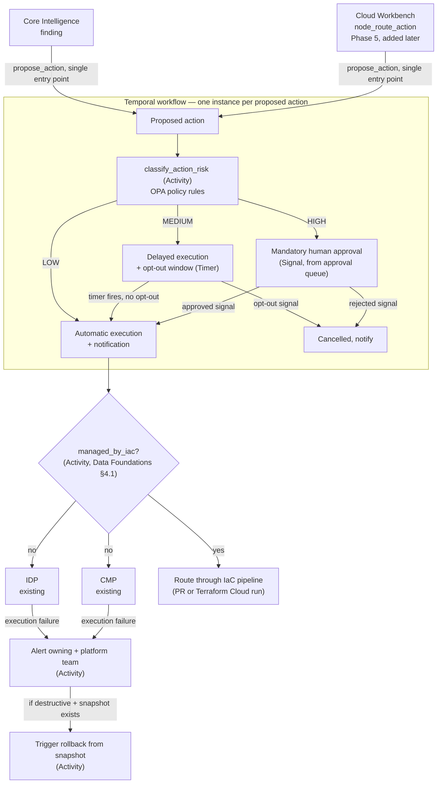

# Solution Architecture: Governed Automation

Phase 3 of the platform sequenced in [FinOps Solution Overview.md](FinOps%20Solution%20Overview.md). Split out from what was originally a single combined "Internal Assistant" solution architecture document — see [Solution_Architecture_Data_Foundations.md](Solution_Architecture_Data_Foundations.md) for why it was split.

Requirements, org details, and specific tool choices below are **inferred** from JD language and reasonable enterprise-FinOps practice, not confirmed the organization fact. Companion: [Platform_Build_Specification.md](Platform_Build_Specification.md) §6.

---

## 1. Executive Summary

This is the layer that decides what happens to an optimization action proposed by Core Intelligence (a rightsizing/anomaly finding) or, later, Cloud Workbench (a user-initiated request): execute it automatically, execute it with a delay and opt-out, or hold it for mandatory human approval — classified by risk, enforced in code, never left to the proposing system's own judgment. At this phase, Core Intelligence and the Self-Serve Foundations API (`propose_action`'s `origin: "core_intelligence"` and internal-team API calls) are this layer's only proposal sources — Cloud Workbench doesn't exist yet (it's Phase 5, sequenced *after* this layer, per [FinOps Solution Overview.md](FinOps%20Solution%20Overview.md#master-level-architecture-decisions)'s ADR-M1) and becomes a third source once it ships, through the same `propose_action` entry point, no design change required here.

## 2. Business Context & Requirements

### 2.1 Problem statement (inferred)

Cloud Platform Services can already generate rightsizing and anomaly recommendations (Core Intelligence, Phase 2) and expose them via a governed API and dashboards (Self-Serve Foundations, Phase 2), but today those recommendations are advisory-only — a human has to act on every one manually, regardless of how low-risk it is. This layer lets a bounded, genuinely low-risk subset execute automatically, freeing human review for the cases that actually need it, without removing human judgment from anything higher-risk. It's deliberately built and proven against Core Intelligence's proposals first, before Cloud Workbench (Phase 5) adds a second, user-initiated proposal source on top of an already-mature layer.

### 2.2 Functional requirements (inferred)

- FR1: Classify a proposed action into LOW/MEDIUM/HIGH risk based on action type, target-resource classification (e.g., production tag), and blast radius.
- FR2: Enforce routing by that classification in code — HIGH always requires human approval, regardless of any other factor (hard rule, not a scored threshold).
- FR3: Require an explicit, opt-in agreement between the owning application team and the platform team — keyed on the APM ID — before automation acts on that team's resources above the lowest risk tier.
- FR4: Provide a full audit trail (before/after state) for every automated action, linked to both the resource's APM ID and the agreement that authorized it.
- FR5: Detect and handle execution failures from IDP/CMP — alert the owning application team and the platform team, and where the action was destructive and a pre-action snapshot exists (per the Reversibility NFR below), trigger rollback from it rather than leaving the resource in an unknown intermediate state.
- FR6: Before calling IDP/CMP directly, check whether the target resource is IaC-managed (Terraform, Data Foundations §4.1). If it is, route execution through the IaC pipeline (a PR against the Terraform module, or a triggered Terraform Cloud/Enterprise run) instead of a direct API call — a direct call to a Terraform-managed resource risks being silently reverted, or conflicting, on the next `terraform apply`.

### 2.3 Non-functional requirements (inferred)

| Requirement | Target (inferred) | Rationale |
|---|---|---|
| Approval latency (MEDIUM/HIGH tier) | Queued for human review, no fixed SLA assumed | Human review time isn't the platform's to promise |
| Reversibility | A snapshot/backup step required before any destructive action where one is available | Bounds the cost of an incorrect automated action |
| Auditability | Every action logged with before/after state, risk tier, and authorizing agreement | Same HITRUST/SOC2-equivalent posture as the rest of the platform |
| Failure alerting | Every IDP/CMP execution failure surfaced to the owning team and platform team, no fixed response-time SLA assumed | Silent failure on an approved action is worse than the action never having been approved — someone has to know |

### 2.4 Non-goals (inferred)

- Not a general-purpose infrastructure automation platform; scope is cost-optimization actions surfaced by Core Intelligence or Self-Serve Foundations.
- Not a replacement for IDP/CMP's own provisioning logic — this layer decides *whether* an action proceeds, IDP/CMP still execute it.

---

## 3. Architecture

IDP and CMP are the organization's real, existing provisioning and container-management platforms — this layer decides whether an action proceeds and calls them to execute it, it doesn't replace or rebuild either one. A failed execution is not a silent dead end: it alerts both parties and, where reversible, triggers rollback rather than leaving the resource in an unknown state (FR5). §3.1–3.3 below explain the stack, the determinism guarantee, and what actually runs this workflow — the diagram shows the shape, not the mechanics.

### 3.1 Technology stack

| Component | Choice | Rationale |
|---|---|---|
| Orchestration | **Temporal** (self-hosted on AKS) | Durable execution for multi-hour/day opt-out windows, indefinite human-approval waits, and reliable retry/compensation on IDP/CMP failure — a plain request/response service can't express this without reinventing a workflow engine. See ADR-002 and §3.3. |
| Risk classification | Deterministic code, policy rules evaluated via **Open Policy Agent (OPA)** | Pure rule evaluation (action type, target classification, blast radius) — no ML model or LLM anywhere in this path. See ADR-001. |
| Approval queue / workflow operational state | **Postgres** | A transactional read-modify-write workload (create, list-pending, approve/reject) that Snowflake's analytical compute isn't built for. See ADR-003. |
| Audit trail (reporting copy) | Snowflake gold (`gold.fact_action_audit`) | Finalized records synced from Postgres/Temporal history, queryable alongside every other fact table for cross-platform reporting. |
| Execution targets | IDP, CMP (existing, called via MCP tools) | This layer decides whether to call them; they still do the actual provisioning/container work. |
| Infrastructure | AKS, Terraform/Bicep | Same shared platform infrastructure as every other phase (Data Foundations §4.5). |

### 3.2 Determinism boundary: what the agent decides vs. what this layer decides

This layer is deterministic end to end — no ML model or LLM has any influence on classification, routing, or execution. Core Intelligence and Cloud Workbench share exactly one entry point into it: the MCP tool `propose_action(action_type, target, params, origin) -> ProposalResult`. Neither ever calls IDP or CMP directly, computes a risk tier, or touches the approval queue — `idp_provision_request` and `cmp_container_action` (Build Specification §6) are internal execution tools, invoked only by this layer's own workflow (§3.3), never exposed to either proposing system.

Concretely, for Cloud Workbench: a user's natural-language request ("resize this instance") isn't itself an action — it becomes one only when the pydantic-graph agent's `node_route_action` (Build Specification §5) calls `propose_action`. However the LLM reasoned about the request, the resulting proposal is classified and routed exactly like a Core Intelligence finding — §3.3's classification logic has no branch that reads "who proposed this" as anything but an audit field. This is ADR-001's "enforced in code... outside the proposing system's own reasoning" made concrete as a call-flow rather than a stated principle. The agent's role ends at proposing and later relaying the outcome (`ProposalResult`: queued, executed, denied) back to the user — it has no path to influence the tier or bypass the workflow.

### 3.3 Orchestration: a durable workflow per proposed action

Three things about this layer's job don't fit a plain request/response service: MEDIUM tier's opt-out window can span hours to days; HIGH tier's approval wait is indefinite and asynchronous; and a failed IDP/CMP call (FR5) needs reliable retry and a conditional compensating rollback — all while keeping a complete state history for FR4's audit trail. That's a durable-workflow problem; reassembling it from a status column and a polling cron job tends to quietly become an ad hoc workflow engine anyway, minus the guarantees a real one provides.

**Each proposed action is one Temporal workflow instance**, running the following as durable steps:

1. `classify_action_risk` (an Activity — pure, deterministic code) evaluates the proposal against OPA policy rules and any contract-entity constraints once that entity exists (§3.4), returning a `RiskTier`.
2. Branch on tier: **LOW** proceeds straight to execution. **MEDIUM** starts a durable Timer for the opt-out window; an owning-team opt-out arrives as a Signal that cancels the workflow before execution, otherwise the timer firing triggers it. **HIGH** blocks on a Signal from the Postgres-backed approval queue (§3.1) — no timeout, since human review time isn't this platform's to promise (§2.3's Approval latency NFR).
3. Before executing, `check_iac_managed` (an Activity) checks whether the target resource is Terraform-managed (Data Foundations §4.1, FR6). If yes, execution routes through the IaC pipeline (`open_terraform_pr` or `trigger_terraform_run`, Build Specification §6) instead of IDP/CMP — a direct call would just be reverted or conflict on the next `terraform apply`. If no, `execute_action` calls IDP or CMP via their MCP tools as before. Temporal's built-in retry policy attempts a bounded number of retries before treating either path's failure as genuine (FR5): an `alert_teams` Activity notifies the owning and platform teams, and, where the action was destructive and a pre-action snapshot exists, a `rollback` Activity runs.
4. Every state transition (classified, queued, approved/denied, executing, succeeded, failed, rolled back) is part of Temporal's own workflow history, a natural fit for FR4 — though a queryable copy is still written to Snowflake gold (§3.1, ADR-003) since workflow history isn't meant to be queried like a reporting table.

This is what actually backs the diagram above: each arrow is a state transition inside one durable workflow, not a sequence of independent service calls reassembling its own state on every retry.

### 3.4 The horizontal/vertical "contract" — not yet designed

For anything above LOW risk, an explicit, opt-in agreement between the owning application team and the platform team is needed before automation acts on their resources — an SLA-like contract, keyed on the APM ID, covering what's pre-approved, notification requirements, change windows, rollback guarantees, and escalation paths. **This entity is not yet designed here** — it's scoped in `FinOps Opportunities.md` §2c and flagged in the Solution Overview's Sub-Document Index as still needed. `classify_action_risk` and the approval queue (Build Specification §6) would consult it once it exists, extending rather than replacing what's already specified.

### 3.5 Assumptions adopted

Educated assumptions carried over from `FinOps Opportunities.md`'s open items, stated here because they specifically shape this layer's design:

- **No automated remediation exists today.** Adopted as the baseline this entire layer is designed against — Section 2.1's problem statement assumes a clean slate, not a migration from some existing automation.
- **APM classification coverage is partial, not complete.** The contract entity's risk-tier field assumes the APM tool already carries *some* classification data (GRC's own compliance work likely requires it), but not a blast-radius-specific field — that's a FinOps/infra concept GRC wouldn't need. The schema extension this contract needs is one net-new field layered onto existing classification, not a from-scratch effort.
- **A change-management/CAB process exists.** At this organizational scale, assume one does. MEDIUM-tier's "change-window constraints" are designed to consult an existing CAB calendar/freeze schedule, not invent a parallel one — worth confirming which system of record that calendar actually lives in before building against it.
- **What-if-originated proposals get no special trust.** Whether a proposed action originates from Core Intelligence, Cloud Workbench, or Cloud Workbench Expansion's what-if capability, it is classified and routed through the identical LOW/MEDIUM/HIGH pipeline above — no bypass, no elevated autonomy for a simulation just because a human ran it interactively. This resolves the "would verticals trust a what-if result feeding into automation" question architecturally: nothing exceptional is granted, so there's nothing exceptional to trust.

---

## 4. Architecture Decision Records

**ADR-001: Enforce action guardrails in code (blast-radius limits, approval gates) rather than relying on the proposing system's own risk judgment**
- *Context*: Proposed actions can originate from a classical ML model (Core Intelligence) or an LLM agent (Cloud Workbench), and both can take real actions against infrastructure via IDP/CMP.
- *Decision*: Risk-tiered autonomy with hard, code-level enforcement — blast-radius limits, reversibility checks, and approval gates that sit outside the proposing system's own reasoning.
- *Alternatives considered*: Trust the proposing system's own self-assessed confidence/risk classification as the sole gate, rejected — a probabilistic judgment (from either a model or an LLM) is not a safe sole enforcement mechanism for destructive actions.
- *Consequences*: Some legitimate low-risk actions may occasionally require unnecessary approval (a false positive on risk tiering), an acceptable tradeoff against the cost of an unreviewed destructive action.

**ADR-002: Orchestrate proposed actions as durable Temporal workflows rather than a stateless request/response service**
- *Context*: This layer's job spans synchronous classification, potentially multi-day delays (MEDIUM tier), indefinite waits for human approval (HIGH tier), and failure handling with conditional rollback (FR5) — state that has to survive process restarts and be auditable end to end.
- *Decision*: Model each proposed action as one Temporal workflow (§3.3), with classification, execution, alerting, and rollback as Activities, and the opt-out window/approval wait expressed as Temporal Timers and Signals rather than polling loops or cron-scheduled status checks.
- *Alternatives considered*: A stateless API plus a status column and a polling cron job to advance it, rejected — this is effectively an ad hoc workflow engine minus the durability, retry, and history guarantees a purpose-built one already provides, and tends to accumulate edge cases (a missed poll cycle, a crash mid-transition) a real engine handles by construction. A cloud-native equivalent (AWS Step Functions, Azure Durable Functions), rejected as the default — viable, but single-cloud-coupled in a way that cuts against this platform's general preference for tools that run the same regardless of which hyperscaler a given workload touches (the same reasoning behind Snowpark ML over a hyperscaler-native ML platform, MLOps Pipeline ADR-004).
- *Consequences*: One more piece of infrastructure to operate (a Temporal cluster on AKS), in exchange for not hand-building retry, timer, and audit-history logic this layer's requirements already demand.

**ADR-003: Store approval-queue and workflow operational state in Postgres, sync finalized records to Snowflake gold for reporting**
- *Context*: `action_approval_requests` and related workflow state are a transactional read-modify-write workload — create a request, list pending ones, record a decision, update status — the pattern an OLTP database is built for. Snowflake, used everywhere else in this platform (Data Foundations ADR-003), is an analytical/OLAP warehouse, not designed for this access pattern.
- *Decision*: Keep operational workflow/approval state in Postgres — a standard, well-understood OLTP fit for this read-modify-write pattern — and sync finalized action records into a `gold.fact_action_audit`-style Snowflake table once a workflow completes, for cross-platform reporting alongside every other fact table.
- *Alternatives considered*: Keep this state in Snowflake directly, rejected — forcing a high-frequency, low-latency, single-row read/write workload onto an analytical warehouse is a real cost-and-latency mismatch, not a hypothetical one.
- *Consequences*: Two data stores instead of one for this layer, and a sync step to keep them consistent — accepted because it puts each workload on the store actually built for it, following the same "operational store plus a resynced analytical copy" pattern already established for Neo4j (Data Foundations ADR-004).

**ADR-004: Check IaC-managed status before direct execution; route Terraform-managed resources through the IaC pipeline instead of IDP/CMP**
- *Context*: `execute_action` calling IDP/CMP directly changes live infrastructure outside of Terraform. If the target resource is Terraform-managed, that live change is invisible to the IaC pipeline — the next `terraform apply` either silently reverts it or conflicts with an unrelated change to the same module. Neither is acceptable for an automated action.
- *Decision*: `check_iac_managed` runs before `execute_action` (FR6, §3.3). Terraform-managed resources route through the IaC pipeline (a PR against the module, or a triggered Terraform Cloud/Enterprise run); unmanaged resources proceed through IDP/CMP exactly as before.
- *Alternatives considered*: Always call IDP/CMP directly and rely on drift detection to eventually surface the conflict, rejected — "eventually surfaced" is not the same as "prevented," and this platform already treats a silent failure mode as worse than a blocked action everywhere else (FR5's failure alerting). Route every action through the IaC pipeline regardless of management status, rejected — a genuinely unmanaged resource has no Terraform module to open a PR against, so this would just fail for the majority of today's estate (Data Foundations' assumption that most of today's infrastructure predates any IaC practice).
- *Consequences*: One more Activity and one more branch per workflow, and the IaC-routed path has its own latency profile (a PR/CI cycle, not an immediate API call) — appropriate given the alternative is fighting the IaC pipeline, not a cost worth avoiding.

---

## 5. Glossary

**Blast radius** — A hard limit on how much an autonomous action can affect, enforced in code.

**Open Policy Agent (OPA)** — A policy-as-code engine used here to evaluate risk-classification rules (blast radius, production gate) as versioned, testable policy rather than inline conditional logic.

**Risk-tiered autonomy** — Scaling an action's allowed independence to its assessed risk/impact, enforced in code rather than by the proposing system's own judgment.

**Temporal (workflow orchestration)** — An open-source durable execution engine; each proposed action runs as one Temporal workflow here, with Activities (classification, execution, alerting, rollback), Timers (the MEDIUM-tier opt-out window), and Signals (opt-outs, approvals) as its building blocks. See §3.3.
