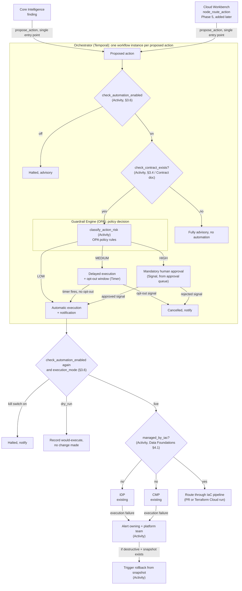

# Solution Architecture: Governed Automation

Phase 3 of the platform sequenced in [FinOps Solution Overview.md](FinOps%20Solution%20Overview.md).

Requirements, org details, and tool choices below are **inferred** from the job description and common enterprise FinOps practice. They are not confirmed the organization facts. Companion: [Platform_Build_Specification.md](Platform_Build_Specification.md) §6.

**A naming note.** "Governed Automation" is the phase name. It designs two separate components, each with its own name:

1. **Orchestrator** (Temporal): runs the durable workflow each proposed action becomes (sequencing, timers, signals, retries, rollback). It decides nothing about risk.
2. **Guardrail Engine** (OPA): the policy-decision point the Orchestrator asks for a LOW/MEDIUM/HIGH classification, and the enforcer of the operational guardrails in §3.6. The name comes from the "Guardrails" in `FinOps Opportunities.md` §2c, which this component implements.

Off-the-shelf products (Temporal, OPA, Postgres) keep their product names. Only the workflow and policy design produced here gets a custom name.

---

## 1. Executive Summary

The Orchestrator and Guardrail Engine together decide what happens to an optimization action proposed by Core Intelligence (a rightsizing or anomaly finding) or, later, by Cloud Workbench (a user request). The action is executed automatically, executed after a delay with an opt-out, or held for mandatory human approval. That decision is based on risk, enforced in code, and never left to the proposing system.

This layer sits over every proposal source; it isn't a step inside any one of them. Core Intelligence, the Self-Serve API, Cloud Workbench, and the what-if workbench all call the Orchestrator through one entry point, `propose_action`. They never call each other or the Guardrail Engine directly. When this phase ships, the only proposal sources are Core Intelligence (`origin: "core_intelligence"`) and the Self-Serve API (`origin: "self_serve_api"`). Cloud Workbench arrives in Phase 5 (ADR-M1 in [FinOps Solution Overview.md](FinOps%20Solution%20Overview.md#master-level-architecture-decisions)) and uses the same entry point with no design change here.

## 2. Business Context & Requirements

### 2.1 Problem statement (inferred)

Core Intelligence (Phase 2) produces rightsizing and anomaly recommendations, and Self-Serve Foundations (Phase 2) exposes them through an API and dashboards. They are advisory: someone has to act on each one by hand, however low the risk. This layer lets a bounded, low-risk subset execute automatically, so human review goes to the cases that need it, and keeps human judgment on everything higher-risk. It is proven against Core Intelligence's proposals first, before Cloud Workbench (Phase 5) adds user-initiated proposals.

### 2.2 Functional requirements (inferred)

- FR1: Classify a proposed action as LOW, MEDIUM, or HIGH risk based on action type, target classification (for example, a production tag), and blast radius.
- FR2: Enforce routing by that classification in code. HIGH always requires human approval, whatever else is true. This is a fixed rule, not a scored threshold.
- FR3: Require an explicit, opt-in agreement between the owning application team and the platform team, keyed on the APM ID, before automation acts on that team's resources **at any tier, including LOW**. Without a signed agreement, every proposed action for that team is advisory, whatever its risk tier.
- FR4: Keep a full audit trail (before and after state) for every automated action, linked to the resource's APM ID and the agreement that authorized it.
- FR5: Detect execution failures from IDP and CMP. Alert the owning team and the platform team (Teams channel plus ITSM ticket or page, Data Foundations §4.5). If the action was destructive and a pre-action snapshot exists (the Reversibility NFR below), roll back from it instead of leaving the resource in an unknown state.
- FR6: Before calling IDP or CMP, check whether the target resource is managed by Terraform (Data Foundations §4.1). If it is, execute through the IaC pipeline (a PR against the Terraform module, or a Terraform Cloud/Enterprise run) instead. A direct change to a Terraform-managed resource can be reverted, or conflict, on the next `terraform apply`.
- FR7: Enforce operational guardrails regardless of risk tier: a dry-run mode every contract starts in, a kill switch at global, vertical, and application scope, per-scope daily caps, a circuit breaker that turns on the kill switch after repeated failures or rollbacks, and resource-level exclusions (§3.6).

### 2.3 Non-functional requirements (inferred)

| Requirement | Target (inferred) | Rationale |
|---|---|---|
| Approval latency (MEDIUM/HIGH tier) | Queued for human review, no fixed SLA assumed | Human review time isn't the platform's to promise |
| Reversibility | A snapshot or backup step before any destructive action where one is available | Limits the cost of a wrong automated action |
| Auditability | Every action logged with before/after state, risk tier, and authorizing agreement | Same HITRUST/SOC2-equivalent posture as the rest of the platform |
| Failure alerting | Every IDP/CMP execution failure reported to the owning team and platform team, no fixed response-time SLA assumed | A silent failure on an approved action is worse than no action; someone has to know |

### 2.4 Non-goals (inferred)

- Not a general infrastructure automation platform. Scope is cost-optimization actions.
- Not a replacement for IDP's or CMP's provisioning logic. This layer decides *whether* an action proceeds; IDP and CMP still execute it.

---

## 3. Architecture

IDP and CMP are the organization's existing provisioning and container-management platforms. This layer decides whether an action proceeds and calls them to execute it; it doesn't replace either. A failed execution alerts both teams and, where possible, rolls back (FR5). §3.1–3.3 explain the stack, the determinism boundary, and how the workflow runs.

### 3.1 Technology stack

| Component | Choice | Rationale |
|---|---|---|
| Orchestration | **Temporal Cloud** (managed), with workflow workers running as one container on CMP | Durable execution for opt-out windows lasting hours or days, open-ended approval waits, and reliable retry and compensation when IDP or CMP fail. A request/response service would have to reinvent a workflow engine to do this. See ADR-002 and §3.3 |
| Risk classification | Deterministic code, with policy rules evaluated by **Open Policy Agent (OPA)** | Rule evaluation only (action type, target classification, blast radius); no ML model or LLM in this path. OPA runs as a sidecar next to the workflow workers, its only caller. Policies are a versioned bundle with their own unit tests. See ADR-001 and ADR-005 |
| Approval queue / workflow operational state | **Postgres** (managed: Azure Database for PostgreSQL, shared by the whole platform) | A transactional read-modify-write workload (create, list pending, approve or reject) that Snowflake isn't built for. See ADR-003 |
| Audit trail (reporting copy) | Snowflake gold (`gold.fact_action_audit`) | Final records synced from Postgres and Temporal history, queryable with every other fact table |
| Execution targets | IDP, CMP (existing, called through MCP tools) | This layer decides whether to call them; they do the provisioning and container work |
| Infrastructure | CMP, Terraform | the organization's existing container platform, run by its platform team; no platform-owned cluster (Build Specification §8) |

### 3.2 Determinism boundary: what the agent decides vs. what this layer decides

This layer is deterministic end to end. No ML model or LLM influences classification, routing, or execution. Every proposal source uses one entry point: the MCP tool `propose_action(action_type, target, params, origin) -> ProposalResult`. No source calls IDP or CMP, computes a risk tier, or touches the approval queue. `idp_provision_request` and `cmp_container_action` (Build Specification §6) are internal tools that only this layer's workflow calls (§3.3).

For Cloud Workbench, a user's request ("resize this instance") isn't an action. It becomes one only when the pydantic-graph agent's `node_route_action` (Build Specification §5) calls `propose_action`. However the LLM reasoned, the proposal is classified and routed like a Core Intelligence finding; classification never branches on who proposed it, which is recorded for audit only. This is how ADR-001's principle is enforced in the call flow. The agent proposes and then reports the outcome (`ProposalResult`: queued, executed, denied) back to the user. It has no way to change the tier or skip the workflow.

### 3.3 Orchestration: a durable workflow per proposed action

Three parts of this job don't fit a request/response service. MEDIUM tier's opt-out window can last hours or days. HIGH tier's approval wait has no end date. A failed IDP or CMP call (FR5) needs reliable retry and a conditional rollback. All of it needs a complete state history for FR4's audit trail. That is a durable-workflow problem. Building it from a status column and a polling cron job produces an informal workflow engine without the guarantees of a real one.

**Each proposed action is one Temporal workflow instance**, with these durable steps:

1. `check_automation_enabled` (an Activity, §3.6) checks the kill switch at global, vertical, and application scope. If any is off, the proposal is recorded as halted and handled as advisory. Otherwise `check_contract_exists` (an Activity, [Solution_Architecture_Governed_Automation_Contract.md](Solution_Architecture_Governed_Automation_Contract.md)) looks up an active contract for the proposal's APM ID. If there is none, the action is advisory and the workflow ends; a person handles it. If there is one, the workflow continues.
2. `classify_action_risk` (an Activity, deterministic code) evaluates the proposal against the OPA policies and any stricter handling the contract requests (Contract doc §2.2 FR3; a contract can ask for stricter handling, never looser) and returns a `RiskTier`.
3. Branch on tier. **LOW** goes straight to execution. **MEDIUM** starts a durable Timer for the opt-out window; an opt-out from the owning team arrives as a Signal and cancels the workflow, otherwise the timer firing triggers execution. **HIGH** waits for a Signal from the Postgres approval queue (§3.1), with no timeout (§2.3, Approval latency).
4. Before executing, `check_automation_enabled` runs again, because the switch may have been turned off during an opt-out window or approval wait. Then the contract's `execution_mode` is read: in `dry_run`, the would-be action is recorded and the workflow ends without changing anything (§3.6). In `live`, `check_iac_managed` (an Activity) checks whether the target is Terraform-managed (Data Foundations §4.1, FR6). If it is, execution goes through the IaC pipeline (`open_terraform_pr` or `trigger_terraform_run`, Build Specification §6), because a direct change would be reverted or conflict on the next `terraform apply`. If not, `execute_action` calls IDP or CMP through their MCP tools. Temporal's retry policy makes a bounded number of attempts before treating a failure as real (FR5). Then `alert_teams` notifies the owning and platform teams, and if the action was destructive and a snapshot exists, a `rollback` Activity (`rollback_from_snapshot`, Build Specification §6) runs.
5. Every state transition (kill switch checked, contract checked, classified, queued, approved or denied, executing, succeeded, failed, rolled back) is in Temporal's workflow history, which serves FR4. A queryable copy is also written to Snowflake gold (§3.1, ADR-003), since workflow history isn't built for reporting queries.

**Blast radius today and later.** `policy_blast_radius` (Build Specification §6) counts the resources an action touches directly. It can't see what depends on those resources, because no service-dependency data is ingested yet. Once a dependency source exists (a CMDB or service map), dependency-aware blast radius ("what depends on this resource, at any depth") becomes a knowledge graph traversal and one of the triggers for adding a graph database (Data Foundations ADR-004). Until then, the production gate and HIGH tier's mandatory approval cover the risk the direct count misses.

**Risk tiers at a glance:**

| Tier | What triggers it | What happens (once a contract is signed) | Contract required (§3.4)? |
|---|---|---|---|
| **LOW** | Low blast radius on a non-sensitive target (action type, target classification, blast radius, FR1; the concrete rules live in the OPA policies) | Executes immediately, with no delay or approval | **Yes, even at LOW.** A lightweight version is enough, but without a signed agreement the team's actions are advisory (FR3) |
| **MEDIUM** | Higher blast radius or target sensitivity, short of mandatory approval | Delayed execution: a durable opt-out window (Timer, hours to days) the owning team can cancel with a Signal; otherwise executes when the timer expires | Yes, a fuller version, given the added risk |
| **HIGH** | Highest blast radius or most sensitive target. A fixed rule, not a scored threshold (FR2) | Never automatic: waits indefinitely for human approval (a Signal from the Postgres approval queue, no timeout, §2.3) | Yes, a fuller version, given the added risk |

Each arrow in the diagram is a state transition inside one durable workflow, not a chain of separate service calls that rebuild their state on every retry.

### 3.4 The horizontal/vertical "contract"

The owning application team and the platform team need an explicit, opt-in agreement before automation acts on that team's resources, **at any tier, including LOW**. Without one, every proposed action for that team is advisory: a person reviews and acts manually, whatever `classify_action_risk` would have returned. `check_contract_exists` enforces this before classification runs (step 1, §3.3). The contract turns automation on; the risk tier then sets how much autonomy it gets (LOW: immediate, MEDIUM: delayed with opt-out, HIGH: approval required even with a contract). The contract is SLA-like and keyed on the APM ID. It covers what is pre-approved, notification, change windows, rollback guarantees, and escalation paths, and it comes in two levels: a lightweight version for LOW-only automation, and a fuller version before MEDIUM or HIGH autonomy is granted. **Designed in full in [Solution_Architecture_Governed_Automation_Contract.md](Solution_Architecture_Governed_Automation_Contract.md)**: schema, lifecycle, signing, and the `check_contract_exists` enforcement point.

### 3.5 Assumptions adopted

Assumptions from the open items in `FinOps Opportunities.md` that shape this layer's design:

- **No automated remediation exists today.** This whole layer is designed against that baseline; §2.1 assumes a clean start, not a migration from existing automation.
- **APM classification coverage is partial.** The contract's risk-tier field assumes the APM tool carries *some* classification data (GRC's compliance work likely needs it), but not a blast-radius field, which is an infrastructure concept GRC wouldn't need. The contract needs one new field added to existing classification, not a new classification effort.
- **A change-management/CAB process exists.** At this organization's scale, one almost certainly does. MEDIUM tier's change-window constraints are designed to read an existing CAB calendar or freeze schedule. Confirm which system of record holds it before building against it.
- **What-if proposals get no special trust.** Whether a proposal comes from Core Intelligence, Cloud Workbench, or Cloud Workbench Expansion's what-if workbench, it goes through the same LOW/MEDIUM/HIGH pipeline. A simulation a person ran interactively gets no bypass and no extra autonomy, so there is no special trust to decide on.

### 3.6 Guardrails: dry-run, kill switch, caps, circuit breaker, exclusions

Risk tiers decide *how much autonomy* a single action gets. These guardrails limit *what automation can do overall* and let a person stop it at once. They implement the guardrails listed in `FinOps Opportunities.md` §2c, and the Orchestrator and Guardrail Engine enforce all of them, never the proposing system.

1. **Dry-run mode.** Every contract has an `execution_mode` of `dry_run` or `live`, and every new contract starts in `dry_run`. In dry-run, the workflow runs every step (contract check, classification, opt-out timer, approval wait), but `execute_action` records what it *would* have done instead of calling IDP, CMP, or the IaC pipeline. A contract moves to `live` only after the owning team and the FinOps team review its dry-run record (default: at least 20 proposals over at least 30 days, with no classification the reviewers disagree with).
2. **Kill switch.** An `automation_controls` record at global, vertical, or application (APM ID) scope turns automation off for that scope. `check_automation_enabled` runs twice per workflow, at the start and again just before `execute_action`, so a MEDIUM-tier action waiting out its opt-out window still stops if the switch is turned off mid-wait. The FinOps team can change any scope; an application's Owner or Secondary Approver can change their own application. Turning it off stops new executions; it doesn't undo completed ones.
3. **Caps.** `policy_run_caps` (OPA) denies execution once a scope reaches its rolling 24-hour limit on executed actions or total estimated monthly spend change (illustrative defaults: 10 actions per application, 50 platform-wide). A capped action falls back to advisory; it doesn't fail. Caps are configuration owned by the FinOps team.
4. **Circuit breaker.** After each execution outcome, `evaluate_circuit_breaker` checks recent failures and rollbacks. If an application has two failed or rolled-back actions in 24 hours, or the platform-wide rollback rate is above 5% over 7 days (illustrative defaults), it turns on the kill switch for that scope with `set_by = 'circuit_breaker'` and alerts the owning team and the FinOps team. Only a person can turn automation back on.
5. **Exclusions.** An owning team can exclude specific resources (by resource ID or tag) from automation without leaving the program, with a reason and an expiry date, in `automation_exclusions`. Excluded resources are passed to OPA and always classified advisory. Expired exclusions are listed for review.

Every guardrail decision (halted by kill switch, capped, excluded, dry-run) is written to the audit trail with the workflow ID, like any other state transition (FR4).

---

## 4. Architecture Decision Records

**ADR-001: Enforce action guardrails in code, not through the proposing system's own risk judgment**
- *Context*: Proposals can come from a classical ML model (Core Intelligence) or an LLM agent (Cloud Workbench), and either could lead to real changes through IDP or CMP.
- *Decision*: Risk-tiered autonomy with hard enforcement in code: blast-radius limits, reversibility checks, and approval gates outside the proposing system's reasoning.
- *Alternatives considered*: Using the proposing system's own confidence or risk assessment as the only gate, rejected. A probabilistic judgment, from a model or an LLM, isn't a safe sole control for destructive actions.
- *Consequences*: Some low-risk actions will occasionally need approval they didn't need (a false positive on tiering). That is an acceptable cost compared with an unreviewed destructive action.

**ADR-002: Orchestrate proposed actions as durable Temporal workflows**
- *Context*: The job spans classification, multi-day delays (MEDIUM), open-ended approval waits (HIGH), and failure handling with rollback (FR5). That state has to survive restarts and be auditable end to end.
- *Decision*: Model each proposed action as one Temporal workflow (§3.3), with classification, execution, alerting, and rollback as Activities, and the opt-out window and approval wait as Timers and Signals.
- *Alternatives considered*: A stateless API with a status column and a polling cron job, rejected. It is an informal workflow engine without durability, retry, or history guarantees, and it collects edge cases (a missed poll, a crash mid-transition) that a real engine already handles. A cloud-native equivalent (AWS Step Functions, Azure Durable Functions), rejected as the default. It would work, but it ties the workflow to one cloud, against the platform's preference for tools that behave the same across providers (the same reasoning as MLOps Pipeline ADR-004).
- *Consequences*: Use **Temporal Cloud**, not a self-hosted cluster. Self-hosting means running the Temporal server services and their persistence database, a large operating load for a platform expected to be run largely by one engineer (Solution Overview, Operating Model). With Temporal Cloud, the platform runs only its workers. The trade-off is a paid external service holding workflow history (action payloads, approval decisions), which needs the same security review as any SaaS handling operational data. Retry, timers, and audit history don't have to be hand-built.

**ADR-003: Keep approval-queue and workflow state in Postgres, and sync final records to Snowflake gold**
- *Context*: `action_approval_requests` and related workflow state are a transactional read-modify-write workload (create a request, list pending, record a decision, update status), which is what an OLTP database is for. Snowflake (Data Foundations ADR-003) is an analytical warehouse.
- *Decision*: Keep operational workflow and approval state in Postgres, and sync each completed workflow's record into `gold.fact_action_audit` in Snowflake for reporting.
- *Alternatives considered*: Keeping this state in Snowflake, rejected. Frequent, low-latency single-row reads and writes on an analytical warehouse cost more and run slower.
- *Consequences*: Two stores for this layer and a sync step between them, the same operational-store-plus-analytical-copy pattern the platform uses elsewhere. One managed Postgres instance serves every phase's operational state, so this is one database for the platform, not one per phase.

**ADR-004: Check for Terraform management before executing, and route Terraform-managed resources through the IaC pipeline**
- *Context*: When `execute_action` calls IDP or CMP, it changes live infrastructure outside Terraform. If Terraform manages the target, the next `terraform apply` either reverts the change or conflicts with another change to the same module. Neither is acceptable for automation.
- *Decision*: `check_iac_managed` runs before `execute_action` (FR6, §3.3). Terraform-managed resources go through the IaC pipeline (a PR against the module, or a Terraform Cloud/Enterprise run); unmanaged resources go through IDP or CMP.
- *Alternatives considered*: Always calling IDP or CMP and relying on drift detection to catch conflicts later, rejected. Catching a conflict later doesn't prevent it, and the platform treats silent failure as worse than a blocked action (FR5). Routing every action through the IaC pipeline, rejected. An unmanaged resource has no module to open a PR against, and much of today's estate is assumed to predate IaC.
- *Consequences*: One more Activity and branch per workflow. The IaC path is slower (a PR and CI cycle instead of an API call), which is better than fighting the IaC pipeline.

**ADR-005: Run OPA as a sidecar to the workflow workers, not as a separate service**
- *Context*: The Guardrail Engine is kept separate from the Orchestrator: policy decides risk, and the workflow acts on the decision (§3.2, ADR-001). That separation is about ownership and testability of the rules, not network topology. The workflow workers are the Guardrail Engine's only caller.
- *Decision*: Deploy OPA as a sidecar container in the same pod as the Temporal workers (Build Specification §8), loading a versioned policy bundle from the platform repository. `classify_action_risk` calls it over localhost.
- *Alternatives considered*: A standalone OPA service with its own deployment and scaling, rejected; one more service to deploy, secure, and monitor for a single caller. Writing the rules directly into workflow code, rejected; it would merge policy and orchestration, the separation this layer depends on.
- *Consequences*: Policy and orchestration still change independently (separate bundle, tests, and review) but deploy together. If another caller needs the same policies, OPA can move to its own service without changing them.

---

## 5. Glossary

**Blast radius**: How much an automated action can affect, limited by rules enforced in code.

**Guardrail Engine**: The policy-decision component (OPA) designed here. It classifies proposed actions as LOW, MEDIUM, or HIGH risk (action type, target classification, blast radius) and enforces the §3.6 guardrails. The Orchestrator calls it; proposing systems never do.

**Orchestrator**: The durable-workflow component (Temporal) designed here. It handles sequencing, the MEDIUM-tier opt-out timer, the HIGH-tier approval wait, retries, execution, and rollback for every proposed action. Every proposal source reaches it through `propose_action`. It decides nothing about risk; it asks the Guardrail Engine. "Governed Automation" is the phase name for the two together.

**Open Policy Agent (OPA)**: A policy-as-code engine, used here to evaluate risk classification and guardrail rules as versioned, testable policy instead of inline code.

**Risk-tiered autonomy**: Matching how independently an action can run to its assessed risk, enforced in code instead of by the proposing system.

**Temporal (workflow orchestration)**: A durable execution engine. Each proposed action runs as one Temporal workflow here, built from Activities (checks, classification, execution, alerting, rollback), Timers (the MEDIUM-tier opt-out window), and Signals (opt-outs, approvals). See §3.3.
