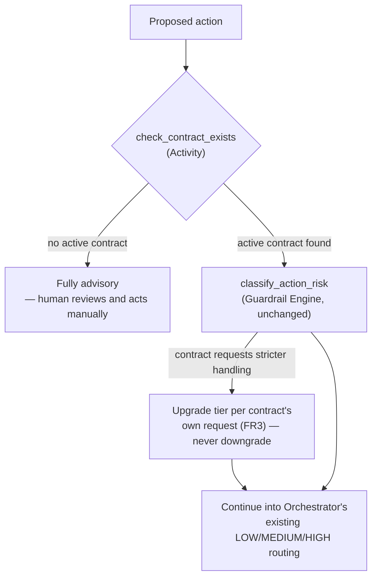

# Solution Architecture: Governed Automation — The Horizontal/Vertical Contract

Phase 3 extension of the platform sequenced in [FinOps Solution Overview.md](FinOps%20Solution%20Overview.md). This document extends [Solution_Architecture_Governed_Automation.md](Solution_Architecture_Governed_Automation.md) — it does not restate that document's Orchestrator/Guardrail Engine design, only what's genuinely new: the contract entity §3.4 there flagged as not yet designed. Originated in `FinOps Opportunities.md` §2c.

Requirements and specifics below are **inferred** from `FinOps Opportunities.md` §2c and reasonable enterprise-FinOps practice, not confirmed the organization fact. Companion: [Platform_Build_Specification.md](Platform_Build_Specification.md) §6 (the illustrative `contracts` table, now finalized against this document).

---

## 1. Executive Summary

Governed Automation's FR3 requires an explicit, opt-in agreement between an owning application team and the platform team before automation acts on that team's resources **at any tier, including LOW** — absent one, every proposed action for that team defaults to fully advisory. This document designs that agreement: its schema, lifecycle, how it's actually signed, and how the Orchestrator checks for it before a proposed action is ever classified. It does not redesign risk classification itself (Governed Automation §3.1's OPA policy rules) or the Orchestrator's execution mechanics — those are unchanged; this document adds one gate in front of them.

## 2. Business Context & Requirements

### 2.1 Problem statement (inferred)

Without this entity, Governed Automation's own FR3 is unenforceable — there is no contract to check for, so "absent a signed agreement, defaults to advisory" has nothing to consult. `FinOps Opportunities.md` §2c already enumerates what the agreement needs to define (pre-approved actions, notification requirements, change windows, rollback guarantee, escalation path, a review/renewal cadence) and notes that because it's keyed on the APM ID — the same key already used for tagging, security, and GRC — the identity/ownership plumbing likely already exists; what's missing is the schema and a mechanism to capture consent, not the underlying identity model.

### 2.2 Functional requirements (inferred)

- FR1: Store one contract per application team (keyed on APM ID) defining: pre-approved action scope, tier scope (LOW-only vs. full MEDIUM/HIGH), notification requirements, change-window constraints, rollback guarantee, escalation path, and a review/renewal cadence.
- FR2: Before `classify_action_risk` runs, check whether an active contract exists for the proposed action's APM ID. If none exists, the action is fully advisory regardless of what classification would have produced (Governed Automation FR3) — the check happens first, not as a side effect of classification.
- FR3: A contract can opt into *stricter* handling than the platform's default risk classification would otherwise apply (e.g., an application team can require human approval even for actions the platform-wide policy would classify LOW) — but cannot loosen it. A team can ask for more caution than OPA's rules provide; it cannot ask for less.
- FR4: Support a contract lifecycle — draft, active, amended, revoked, expired — with every transition audited (who, when, why).
- FR5: An in-flight proposed action that started under an active contract completes under the terms that were active when it started; a revocation or amendment takes effect for actions proposed after it, not ones already running.
- FR6: Where the contract's change-window constraint applies (MEDIUM-tier timing), consult the change-management/CAB calendar it references — system of record not yet confirmed with the organization (see §3.4 and ADR-4).

### 2.3 Non-functional requirements (inferred)

| Requirement | Target (inferred) | Rationale |
|---|---|---|
| Auditability | Every contract creation, amendment, and revocation logged with who acted and when | Same HITRUST/SOC2-equivalent posture as the rest of the platform; a contract is what authorizes automation, so its own history has to be as auditable as the actions it authorizes |
| Check latency | The contract-existence check adds negligible latency to `propose_action` — a single indexed lookup, not a network call to an external system | It runs on every single proposed action, including LOW tier; it can't become the workflow's bottleneck |
| Staleness prevention | A contract without a renewal within its review cadence (FR1) is flagged, not silently left active indefinitely | Opportunities §2c's own concern — an agreement that doesn't get revisited goes stale |

### 2.4 Non-goals (inferred)

- **Not a general contract-management or e-signature platform.** This document assumes a ticket-based approval process (see ADR-3), not a dedicated signing tool — reconsider only if the organization already has one in active use elsewhere.
- **Not a change to risk classification itself.** OPA's policy rules (Governed Automation §3.1) are unchanged; a contract can request stricter handling (FR3) but never overrides the platform's own classification downward.
- **Not the CAB/change-management process itself.** This document consults an existing change calendar (FR6); it doesn't design change management as a discipline.

---

## 3. Architecture

This inserts one Activity, `check_contract_exists`, at the front of Governed Automation's existing workflow (§3.3 there) — everything after it (risk classification, the LOW/MEDIUM/HIGH branch, execution, rollback) is unchanged.

### 3.1 Contract lifecycle

| State | Meaning | Transitions in |
|---|---|---|
| `draft` | Proposed, not yet approved by both parties | Initial state |
| `active` | Signed (§3.2), automation for this APM ID checks it | From `draft` (approval), or from `amended` |
| `amended` | An active contract's terms are being changed | From `active`; becomes `active` again once re-approved |
| `revoked` | Explicitly withdrawn by either party | From `active` or `amended`; in-flight actions unaffected (FR5) |
| `expired` | Past its review/renewal cadence (FR1) without renewal | From `active`, automatic on cadence lapse; treated the same as `revoked` for gating purposes |

### 3.2 Signing mechanism

A ticket-based approval, not a dedicated e-signature tool (ADR-3): the owning application team's lead and the platform team both approve a request, recorded as `signed_by`/`signed_at` on the contract record. This reuses the same Teams + ITSM channels every other cross-team notification in this platform already uses (Data Foundations §4.5) rather than introducing new tooling for a low-volume, infrequent workflow (a contract per application team, not a per-action approval).

### 3.3 Enforcement: `check_contract_exists`

Runs as the first Activity in the Orchestrator's workflow (Governed Automation §3.3), before `classify_action_risk`: looks up an `active` contract for the proposed action's APM ID in Postgres (same store as the approval queue, ADR-003 there — a transactional lookup, not an analytical one). No active contract found → the workflow short-circuits to fully advisory and ends; a human is notified via the standard alerting channels that this application team has no automation contract in place. Contract found → proceeds into `classify_action_risk` exactly as Governed Automation §3.3 already describes, with FR3's tier-upgrade check applied if the contract requests stricter handling than the platform default.

### 3.4 Change-window / CAB integration

FR6's change-window constraint needs a real system of record to check against. **Not yet confirmed with the organization** — Governed Automation §3.5 already flagged that a CAB/change-management process is assumed to exist at this organizational scale, but which system holds it (ServiceNow's Change Management module, given ServiceNow is believed to be the ITSM tool elsewhere in this platform, or something else) is unconfirmed. This document doesn't resolve that; it's carried forward as the same open item, not a new one.

### 3.5 Revocation and amendment handling

Per FR5: revocation or amendment updates the contract's state for any *future* `check_contract_exists` lookup, but doesn't reach into an already-running Temporal workflow. This avoids a real failure mode — interrupting a partially-executed infrastructure action mid-flight because a contract changed a moment ago is a worse outcome than letting it finish under the terms it validly started under.

---

## 4. Architecture Decision Records

**ADR-1: Check contract existence as its own Activity, before risk classification, not folded into it**
- *Context*: FR2 requires every proposed action, including LOW tier, to check for an active contract before anything else happens.
- *Decision*: `check_contract_exists` runs first, as its own Activity — mirrors Governed Automation's own pattern of `check_iac_managed` being a distinct Activity rather than logic buried inside `execute_action`.
- *Alternatives considered*: Folding the check into `classify_action_risk` itself, rejected — conflates "is automation even authorized" with "what tier is this," two different questions that shouldn't share one Activity's failure modes.
- *Consequences*: One more Activity per workflow instance; negligible latency cost for a single indexed lookup, per §2.3's NFR.

**ADR-2: In-flight actions complete under the contract terms active when they started (FR5)**
- *Context*: A contract can be revoked or amended while actions proposed under it are still executing.
- *Decision*: Revocation/amendment affects future `check_contract_exists` lookups only; a running workflow isn't interrupted.
- *Alternatives considered*: Real-time interruption of in-flight workflows on revocation, rejected — introduces a new failure mode (a partially-executed infrastructure action abandoned mid-way) that's worse than letting an already-authorized action finish.
- *Consequences*: A brief window where a revoked team's already-in-flight action still completes — acceptable given the alternative, and consistent with how this platform treats every other in-progress state (Governed Automation's own audit trail, §3.3).

**ADR-3: Ticket-based approval for signing, not a dedicated e-signature/contract-management tool**
- *Context*: Contracts are signed infrequently (once per application team, occasionally amended) — a fundamentally different volume/frequency profile than the per-action approvals Governed Automation's own approval queue handles.
- *Decision*: Reuse the platform's existing Teams + ITSM channels (Data Foundations §4.5) for a request/approval workflow, rather than introducing a new tool.
- *Alternatives considered*: A dedicated e-signature platform, rejected as unnecessary for this volume — reconsider only if the organization already operates one for other purposes and reuse is cheaper than the ticket-based default.
- *Consequences*: `signed_by`/`signed_at` on the contract record are populated from the approval ticket's resolution, not a cryptographic signature — appropriate for an internal, low-volume agreement.

**ADR-4: Carry the CAB/change-management system-of-record gap forward rather than inventing an integration**
- *Context*: FR6 needs a real calendar to check against; none is confirmed.
- *Decision*: Leave this as an explicit open item (§3.4) rather than assume a specific tool.
- *Alternatives considered*: Assuming ServiceNow's Change Management module by default, rejected for now — ServiceNow itself is only "believed to be" the ITSM tool elsewhere in this platform, not confirmed; stacking an unconfirmed assumption on an unconfirmed assumption compounds the risk of building against the wrong system.
- *Consequences*: FR6 is designed but not yet wired to a real system; this is the one piece of this document that can't be finished without the organization input.

---

## 5. Glossary

**Contract (automation consent)** — The per-application, per-vertical agreement, keyed on the APM ID, that Governed Automation's `check_contract_exists` consults before any automation acts on that team's resources, at any tier. Distinct from Data Foundations/Bill Verification's `RateCard` and unrelated to it — this "contract" is about automation consent, not vendor pricing.

**`check_contract_exists`** — The Activity, added by this document to Governed Automation's workflow (§3.3 there), that gates every proposed action on an active contract existing for its APM ID before risk classification runs.

**Tier scope** — A contract's declared coverage: LOW-only automation, or full MEDIUM/HIGH-tier autonomy. Distinct from a tier *upgrade* request (FR3), which asks for stricter-than-default handling on top of whatever scope is granted.
