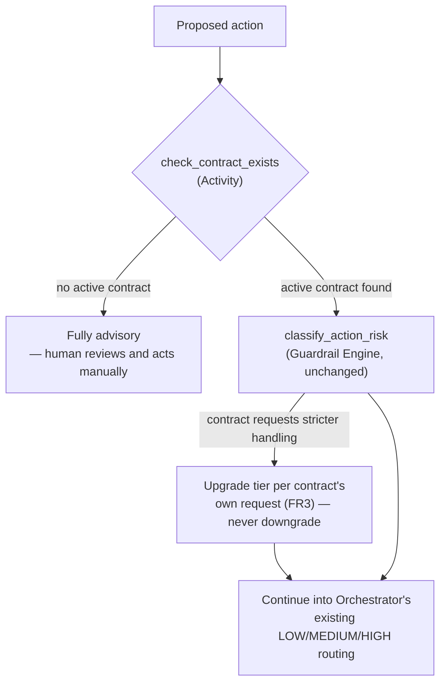

# Solution Architecture: Governed Automation — The Horizontal/Vertical Contract

Phase 3 extension of the platform sequenced in [FinOps Solution Overview.md](FinOps%20Solution%20Overview.md). This document extends [Solution_Architecture_Governed_Automation.md](Solution_Architecture_Governed_Automation.md) — it does not restate that document's Orchestrator/Guardrail Engine design, only what's genuinely new: the contract entity §3.4 there flagged as not yet designed. Originated in `FinOps Opportunities.md` §2c.

Requirements and specifics below are **inferred** from `FinOps Opportunities.md` §2c and reasonable enterprise-FinOps practice, not confirmed the organization fact. Companion: [Platform_Build_Specification.md](Platform_Build_Specification.md) §6 (the illustrative `contracts` table, now finalized against this document).

---

## 1. Executive Summary

Governed Automation's FR3 requires an explicit, opt-in agreement between an owning application team and the platform team before automation acts on that team's resources **at any tier, including LOW** — absent one, every proposed action for that team defaults to fully advisory. This document designs that agreement: its schema, lifecycle, how it's actually signed, and how the Orchestrator checks for it before a proposed action is ever classified. It does not redesign risk classification itself (Governed Automation §3.1's OPA policy rules) or the Orchestrator's execution mechanics — those are unchanged; this document adds one gate in front of them.

## 2. Business Context & Requirements

### 2.1 Problem statement (inferred)

Without this entity, Governed Automation's own FR3 is unenforceable — there is no contract to check for, so "absent a signed agreement, defaults to advisory" has nothing to consult. `FinOps Opportunities.md` §2c already enumerates what the agreement needs to define (pre-approved actions, notification requirements, change windows, rollback guarantee, escalation path, a review/renewal cadence) and notes that because it's keyed on the APM ID — the same key already used for tagging, security, and GRC — the identity/ownership plumbing likely already exists; what's missing is the schema and a mechanism to capture consent, not the underlying identity model.

### 2.2 Functional requirements (inferred)

- FR1: Store one contract per application team (keyed on APM ID) defining: pre-approved action scope, tier scope (LOW-only vs. full MEDIUM/HIGH), notification requirements, change-window constraints, rollback guarantee, escalation path, and a review/renewal cadence. Requires **dual sign-off** — both the APM Owner and the APM Secondary Approver (Data Foundations §4.4) — before a contract becomes active; neither signature alone is sufficient.
- FR2: Before `classify_action_risk` runs, check whether an active contract exists for the proposed action's APM ID. If none exists, the action is fully advisory regardless of what classification would have produced (Governed Automation FR3) — the check happens first, not as a side effect of classification.
- FR3: A contract can opt into *stricter* handling than the platform's default risk classification would otherwise apply (e.g., an application team can require human approval even for actions the platform-wide policy would classify LOW) — but cannot loosen it. A team can ask for more caution than OPA's rules provide; it cannot ask for less.
- FR4: Support a contract lifecycle — draft, active, amended, revoked, expired — with every transition audited (who, when, why).
- FR5: An in-flight proposed action that started under an active contract completes under the terms that were active when it started; a revocation or amendment takes effect for actions proposed after it, not ones already running.
- FR6: Where the contract's change-window constraint applies (MEDIUM-tier timing), consult the change-management/CAB calendar it references — system of record not yet confirmed with the organization (see §3.4 and ADR-4).
- FR7: Escalate a significant finding (a Core Intelligence recommendation, a Cloud Workbench Expansion push signal, or a self-initiated what-if proposal) that receives no explicit disposition — accepted, rejected, or actioned — within a defined SLA window, per a dollar-savings or risk/config-severity threshold (§3.6). Escalation always requires FinOps/platform team review and approval of the underlying suggestion **before** a Change Request is generated — a lapsed SLA never auto-generates a CR without a human confirming the suggestion is worth escalating first.

### 2.3 Non-functional requirements (inferred)

| Requirement | Target (inferred) | Rationale |
|---|---|---|
| Auditability | Every contract creation, amendment, and revocation logged with who acted and when | Same HITRUST/SOC2-equivalent posture as the rest of the platform; a contract is what authorizes automation, so its own history has to be as auditable as the actions it authorizes |
| Check latency | The contract-existence check adds negligible latency to `propose_action` — a single indexed lookup, not a network call to an external system | It runs on every single proposed action, including LOW tier; it can't become the workflow's bottleneck |
| Staleness prevention | A contract without a renewal within its review cadence (FR1) is flagged, not silently left active indefinitely | Opportunities §2c's own concern — an agreement that doesn't get revisited goes stale |

### 2.4 Non-goals (inferred)

- **Not a general contract-management or e-signature platform.** This document assumes a Teams-native approval card sent to the APM Owner and Secondary Approver (see ADR-3), not a dedicated signing tool — reconsider only if the organization already has one in active use elsewhere.
- **Not a change to risk classification itself.** OPA's policy rules (Governed Automation §3.1) are unchanged; a contract can request stricter handling (FR3) but never overrides the platform's own classification downward.
- **Not the CAB/change-management process itself.** This document consults an existing change calendar (FR6); it doesn't design change management as a discipline.

---

## 3. Architecture

This inserts one Activity, `check_contract_exists`, at the front of Governed Automation's existing workflow (§3.3 there) — everything after it (risk classification, the LOW/MEDIUM/HIGH branch, execution, rollback) is unchanged.

### 3.1 Contract lifecycle

| State | Meaning | Transitions in |
|---|---|---|
| `draft` | Proposed, awaiting dual sign-off | Initial state |
| `active` | Both the APM Owner and Secondary Approver have signed (§3.2); automation for this APM ID checks it | From `draft`, once **both** signatures are recorded — either alone leaves it in `draft` |
| `amended` | An active contract's terms are being changed | From `active`; becomes `active` again once re-approved by **both** signers |
| `revoked` | Explicitly withdrawn by either party | From `active` or `amended`; in-flight actions unaffected (FR5) |
| `expired` | Past its review/renewal cadence (FR1) without renewal | From `active`, automatic on cadence lapse; treated the same as `revoked` for gating purposes |

### 3.2 Signing mechanism

A Teams-native approval card, not a standalone web-form, generic ticket queue, or dedicated e-signature tool (ADR-3): the platform team drafts the contract's terms (pre-approved actions, tier scope, change window, etc.), and the system sends an Adaptive Card — Approve/Reject buttons, a summary of terms, and a link to the full contract for detailed review — to **both** the APM Owner and the APM Secondary Approver (`bronze.apm_application_metadata.owner_current`/`secondary_approver_current`, Data Foundations §4.4), independently. A click on either card carries that person's own Teams identity — there's no separate login or link-based access to build, and no risk of an unauthenticated party clicking an emailed link, since the card itself is scoped to the Teams user it was sent to. The contract moves to `active` only once **both** cards are approved (FR1); either alone leaves it in `draft`.

This has two real dependencies worth naming, not hiding:
- **The approval routes are only as good as the Owner/Secondary Approver fields they're sent to.** If `dq_check_owner_staleness` (Build Specification §2) has this APM ID flagged for either role, contract creation should surface that before sending either card, not silently send an approval request into a stale assignment.
- **Dual sign-off is genuine dual control, not redundancy.** The Owner and Secondary Approver are two independent, required signatures — this is what gives audit/security/GRC (rather than one person's unilateral judgment) confidence that granting automation authority over an application's resources was a considered decision, not a rubber stamp. It is not designed as a backup path for when one signer is unavailable; if that becomes a real operational problem, it should be solved explicitly (e.g., a designated delegate), not by quietly treating either signature as sufficient.

Notification that a contract is pending, and reminders for an unactioned `draft`, still ride the platform's shared Teams + ITSM channels (Data Foundations §4.5) — the approval card is the specific mechanism within that channel that this action uses, not a separate notification path.

### 3.3 Enforcement: `check_contract_exists`

Runs as the first Activity in the Orchestrator's workflow (Governed Automation §3.3), before `classify_action_risk`: looks up an `active` contract for the proposed action's APM ID in Postgres (same store as the approval queue, ADR-003 there — a transactional lookup, not an analytical one). No active contract found → the workflow short-circuits to fully advisory and ends; a human is notified via the standard alerting channels that this application team has no automation contract in place. Contract found → proceeds into `classify_action_risk` exactly as Governed Automation §3.3 already describes, with FR3's tier-upgrade check applied if the contract requests stricter handling than the platform default.

### 3.4 Change-window / CAB integration

FR6's change-window constraint needs a real system of record to check against. **Assumed**: a CAB/change-management process exists (Governed Automation §3.5 already adopted this at the organization's organizational scale), backed by a **CAB/ITSM system** — the same platform this document set already assumes handles ticketing/paging elsewhere (Data Foundations §4.5). `change_window` on the contract record (Build Specification §6) references that system's change-request/blackout-calendar lookup, queried at proposal time by the same Orchestrator step that already consults the contract (§3.3). Which specific product sits behind "CAB/ITSM system" is an implementation detail for whoever builds this, not a design dependency this document carries.

### 3.5 Revocation and amendment handling

Per FR5: revocation or amendment updates the contract's state for any *future* `check_contract_exists` lookup, but doesn't reach into an already-running Temporal workflow. This avoids a real failure mode — interrupting a partially-executed infrastructure action mid-flight because a contract changed a moment ago is a worse outcome than letting it finish under the terms it validly started under.

### 3.6 Disposition SLA and escalation

The gap this closes: today, a significant finding that isn't auto-executed (HIGH tier, or a vertical declines to act) is logged and relevant parties are notified — and then nothing necessarily happens. FR7 turns silence into a forcing function without removing human judgment from the decision.

**Lifecycle** (tracked per finding, independent of the contract's own lifecycle in §3.1):

| State | Meaning | Transitions in |
|---|---|---|
| `pending_disposition` | Finding surfaced (recommendation, push signal, or what-if proposal), notified via the standard Teams + ITSM channels (Data Foundations §4.5) | Initial state, on surfacing |
| `escalation_review` | The SLA window lapsed with no explicit accept/reject/action decision; queued for FinOps/platform team review | From `pending_disposition`, automatic on SLA lapse |
| `escalation_approved` | The platform team confirmed the finding is worth escalating | From `escalation_review` |
| `escalation_declined` | The platform team reviewed and decided not to escalate (e.g., stale, already superseded, not actually actionable) | From `escalation_review`; this **is** a disposition — the SLA's purpose is forcing a decision, not forcing action |
| `cr_generated` | A Change Request has been submitted into the CAB/ITSM system (§3.4) for CAB's own approval process | From `escalation_approved` |
| `dispositioned` | Terminal state — finding was actioned, explicitly rejected, or declined at escalation review | From any state once a decision is recorded |

**The threshold** (what counts as "significant," per FR7): a dollar-savings amount or a risk/config-severity flag, defined per contract where a specific application team has agreed to different terms (§2.2 FR1), falling back to a platform-wide default otherwise — the same "contract can request stricter, never looser" principle FR3 already establishes for risk tiering, applied here to escalation sensitivity.

**The human gate is deliberate, not incidental.** A lapsed SLA alone doesn't generate a CR — it routes the finding to the FinOps/platform team via the same Teams approval-card mechanism §3.2 already uses, and only their approval generates one. This prevents a stale or low-quality finding from automatically consuming CAB's own review capacity; it mirrors Governed Automation's own HIGH-tier principle (mandatory human approval, no exception) applied to a different kind of consequential action — submitting something into an external governance process, not executing infrastructure change directly.

---

## 4. Architecture Decision Records

**ADR-1: Check contract existence as its own Activity, before risk classification, not folded into it**
- *Context*: FR2 requires every proposed action, including LOW tier, to check for an active contract before anything else happens.
- *Decision*: `check_contract_exists` runs first, as its own Activity — mirrors Governed Automation's own pattern of `check_iac_managed` being a distinct Activity rather than logic buried inside `execute_action`.
- *Alternatives considered*: Folding the check into `classify_action_risk` itself, rejected — conflates "is automation even authorized" with "what tier is this," two different questions that shouldn't share one Activity's failure modes.
- *Consequences*: One more Activity per workflow instance; negligible latency cost for a single indexed lookup, per §2.3's NFR.

**ADR-2: In-flight actions complete under the contract terms active when they started (FR5)**
- *Context*: A contract can be revoked or amended while actions proposed under it are still executing.
- *Decision*: Revocation/amendment affects future `check_contract_exists` lookups only; a running workflow isn't interrupted.
- *Alternatives considered*: Real-time interruption of in-flight workflows on revocation, rejected — introduces a new failure mode (a partially-executed infrastructure action abandoned mid-way) that's worse than letting an already-authorized action finish.
- *Consequences*: A brief window where a revoked team's already-in-flight action still completes — acceptable given the alternative, and consistent with how this platform treats every other in-progress state (Governed Automation's own audit trail, §3.3).

**ADR-3: A Teams-native dual-approval card (Owner + Secondary Approver), not a web-form, ticket queue, or e-signature tool**
- *Context*: Contracts are signed infrequently (once per application team, occasionally amended); this platform already has authoritative answers to "who can speak for this application" — the APM Owner and Secondary Approver (Data Foundations §4.4) — and Teams is already the platform's shared notification channel (Data Foundations §4.5), with its own identity model already solving authentication.
- *Decision*: Send an Adaptive Card with Approve/Reject actions to both the Owner and Secondary Approver via Teams; each click carries that Teams user's own identity, populating `owner_signed_by`/`owner_signed_at` or `secondary_approver_signed_by`/`secondary_approver_signed_at` respectively (Build Specification §6). Both required before the contract moves to `active`.
- *Alternatives considered*: A standalone web-form (an earlier version of this decision), rejected on reconsideration — it would need its own login/auth build, where a Teams card inherits identity from the platform already in use. A single-signer approval, rejected once dual control was identified as a real audit/security/GRC need, not just a nice-to-have. A generic ticket queue, rejected — doesn't name who specifically approves. A dedicated e-signature platform, rejected as unnecessary for this volume.
- *Consequences*: Still needs a Teams bot/app registration to send and process Adaptive Card actions (a build item, just a different one than a standalone web-form) — no new deployable in the sense of a hosted webpage, but not zero-cost either. Reliability now depends on two fields' freshness (`dq_check_owner_staleness` for both roles) instead of one. An unactioned `draft` needs a reminder cadence through the same Teams channel, or it can sit indefinitely — a safe failure mode (stays advisory) but a real adoption-friction risk if nothing nudges a stalled approval.

**ADR-4: Assume a CAB/ITSM system of record for the change-window check, rather than naming a specific product**
- *Context*: FR6 needs a real calendar to check against. Governed Automation §3.5 already assumes a CAB/change-management process exists at the organization's scale, backed by the same CAB/ITSM system this platform assumes elsewhere (Data Foundations §4.5).
- *Decision*: Design §3.4's integration against a generic CAB/ITSM system, referenced by that role rather than a specific product name — the integration point matters more than which vendor sits behind it.
- *Alternatives considered*: Naming a specific real product by guess, rejected — no evidence points to any one product, and guessing wrong is worse than staying generic. Leaving this fully open with no system named at all, rejected — the integration point (a change-request/blackout-calendar lookup) is still worth designing even generically.
- *Consequences*: §3.4's design holds regardless of which specific product the organization actually runs; only the concrete lookup call changes once that's known, not the architecture around it.

**ADR-5: Require human review and approval before a lapsed finding generates a Change Request — never auto-generate on SLA lapse alone**
- *Context*: FR7's disposition SLA exists to turn silent inaction into a forcing function, but a purely automatic escalation (SLA lapses → CR auto-submitted) risks flooding CAB's own review queue with stale, superseded, or low-quality findings nobody has actually looked at.
- *Decision*: An SLA lapse routes the finding to the FinOps/platform team for review (`escalation_review`, §3.6); only their explicit approval generates a CR. A decline is itself a valid, terminal disposition — the mechanism's purpose is forcing a decision, not forcing action.
- *Alternatives considered*: Auto-generating a CR directly on SLA lapse, rejected — treats CAB's queue as a dumping ground for unreviewed findings and removes the one thing that made escalation credible: a human confirmed it's actually worth CAB's time. Skipping escalation entirely and relying on the original notification alone, rejected — that's the status quo this ADR exists to fix.
- *Consequences*: One more human touchpoint per escalated finding, on top of the original notification — an intentional cost, since the alternative is either noise in CAB's queue or the original "advisement and nothing happens" problem persisting unchanged.

---

## 5. Glossary

**Contract (automation consent)** — The per-application, per-vertical agreement, keyed on the APM ID, that Governed Automation's `check_contract_exists` consults before any automation acts on that team's resources, at any tier. Distinct from Data Foundations/Bill Verification's `RateCard` and unrelated to it — this "contract" is about automation consent, not vendor pricing.

**`check_contract_exists`** — The Activity, added by this document to Governed Automation's workflow (§3.3 there), that gates every proposed action on an active contract existing for its APM ID before risk classification runs.

**Tier scope** — A contract's declared coverage: LOW-only automation, or full MEDIUM/HIGH-tier autonomy. Distinct from a tier *upgrade* request (FR3), which asks for stricter-than-default handling on top of whatever scope is granted.

**Dual control (Owner + Secondary Approver)** — This document's requirement that both the APM Owner and APM Secondary Approver (Data Foundations §4.4) independently approve a contract before it activates. Deliberately not a backup/redundancy pattern (either signing is not sufficient) — the point is two independent sign-offs, for the same audit/security/GRC reasons this platform requires human approval at all for HIGH-tier actions.

**Disposition SLA** — FR7's mechanism: a significant finding with no explicit accept/reject/action decision within a defined window escalates to FinOps/platform team review, and only their approval generates a Change Request. Turns silent inaction into a forced decision, without forcing action itself — a decline is a valid outcome.
