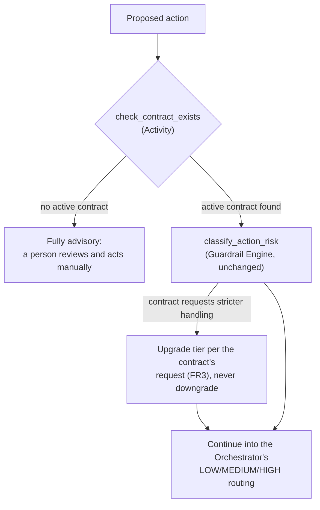

# Solution Architecture: The Horizontal/Vertical Contract (Governed Automation)

Phase 3 extension of the platform sequenced in [FinOps Solution Overview.md](FinOps%20Solution%20Overview.md). This document extends [Solution_Architecture_Governed_Automation.md](Solution_Architecture_Governed_Automation.md) with the contract entity that document's §3.4 relies on. It doesn't restate the Orchestrator or Guardrail Engine design. The contract concept comes from `FinOps Opportunities.md` §2c.

Requirements below are **inferred** from `FinOps Opportunities.md` §2c and common enterprise FinOps practice. They are not confirmed the organization facts. Companion: [Platform_Build_Specification.md](Platform_Build_Specification.md) §6 (the `contracts` table).

---

## 1. Executive Summary

Governed Automation's FR3 requires an explicit, opt-in agreement between an owning application team and the platform team before automation acts on that team's resources, **at any tier, including LOW**. Without one, every proposed action for that team is advisory. This document designs that agreement: its schema, lifecycle, how it is signed, and how the Orchestrator checks for it before a proposed action is classified. Risk classification (Governed Automation §3.1's OPA policies) and the Orchestrator's execution steps don't change; this document adds one gate in front of them.

## 2. Business Context & Requirements

### 2.1 Problem statement (inferred)

Without a contract entity, Governed Automation's FR3 can't be enforced: "no signed agreement means advisory" needs something to look up. `FinOps Opportunities.md` §2c lists what the agreement must define (pre-approved actions, notification requirements, change windows, rollback guarantee, escalation path, review cadence). Because it is keyed on the APM ID, which tagging, security, and GRC already use, the identity and ownership data likely exists. What's missing is the schema and a way to capture consent.

### 2.2 Functional requirements (inferred)

- FR1: Store one contract per application team, keyed on APM ID, defining the pre-approved action scope, tier scope (LOW-only or full MEDIUM/HIGH), notification requirements, change-window constraints, rollback guarantee, escalation path, review cadence, and execution mode (`dry_run` or `live`; every contract starts in `dry_run`, Governed Automation §3.6). A contract needs **two signatures**, the APM Owner's and the APM Secondary Approver's (Data Foundations §4.4), before it becomes active. Either alone isn't enough.
- FR2: Before `classify_action_risk` runs, check for an active contract for the proposed action's APM ID. If there isn't one, the action is advisory whatever classification would have produced (Governed Automation FR3). The check happens first, not as a side effect of classification.
- FR3: A contract can ask for *stricter* handling than the platform's default classification (for example, human approval for actions the platform would classify LOW). It can never ask for looser handling.
- FR4: Support a contract lifecycle (draft, active, amended, revoked, expired), with every transition audited: who, when, and why.
- FR5: A proposed action that started under an active contract finishes under the terms in force when it started. A revocation or amendment applies to actions proposed afterward, not to running ones.
- FR6: Where the contract's change-window constraint applies (MEDIUM-tier timing), consult the change-management/CAB calendar it references. The system of record isn't confirmed (§3.4, ADR-4).
- FR7: Escalate a significant finding (a Core Intelligence recommendation, a Cloud Workbench Expansion push signal, or a what-if proposal) that gets no explicit disposition (accepted, rejected, or actioned) within an SLA window, using a dollar-savings or risk/config-severity threshold (§3.6). The FinOps/platform team must review and approve the suggestion **before** a Change Request is generated. A lapsed SLA never generates a CR on its own.

### 2.3 Non-functional requirements (inferred)

| Requirement | Target (inferred) | Rationale |
|---|---|---|
| Auditability | Every contract creation, amendment, and revocation logged with who acted and when | A contract authorizes automation, so its history needs the same audit trail as the actions it authorizes (HITRUST/SOC2-equivalent posture) |
| Check latency | The contract check adds negligible latency to `propose_action`: one indexed lookup, no external call | It runs on every proposed action, including LOW tier |
| Staleness prevention | A contract not renewed within its review cadence (FR1) is flagged and expires | Opportunities §2c's concern: an agreement nobody revisits goes stale |

### 2.4 Non-goals (inferred)

- **Not a contract-management or e-signature platform.** Signing uses a Teams approval card sent to the APM Owner and Secondary Approver (ADR-3). Revisit only if the organization already uses a signing tool for this kind of approval.
- **Not a change to risk classification.** OPA's policies (Governed Automation §3.1) don't change. A contract can request stricter handling (FR3) but never lowers the platform's classification.
- **Not the CAB/change-management process.** This document reads an existing change calendar (FR6); it doesn't design change management.

---

## 3. Architecture

This adds one Activity, `check_contract_exists`, to Governed Automation's workflow (§3.3 there), right after the kill-switch check. Everything after it (risk classification, tier routing, execution, rollback) is unchanged.

### 3.1 Contract lifecycle

| State | Meaning | Transitions in |
|---|---|---|
| `draft` | Proposed, waiting for both signatures | Initial state |
| `active` | The APM Owner and Secondary Approver have both signed (§3.2); automation for this APM ID uses it | From `draft`, once **both** signatures are recorded |
| `amended` | An active contract's terms are being changed | From `active`; returns to `active` once **both** signers re-approve |
| `revoked` | Withdrawn by either party | From `active` or `amended`; running actions are unaffected (FR5) |
| `expired` | Past its review cadence (FR1) without renewal | From `active`, automatically when the cadence lapses; gated the same as `revoked` |

### 3.2 Signing mechanism

Contracts are signed with a Teams approval card (ADR-3). The platform team drafts the terms (pre-approved actions, tier scope, change window, and so on), and the system sends an Adaptive Card to **both** the APM Owner and the APM Secondary Approver (`bronze.apm_application_metadata.owner_current` and `secondary_approver_current`, Data Foundations §4.4), separately. Each card has Approve and Reject buttons, a summary of the terms, and a link to the full contract. A click carries that person's Teams identity, so there is no separate login to build, and nobody outside the intended recipient can act on the card. The contract becomes `active` only when **both** cards are approved (FR1).

Two dependencies:
- **Approvals are only as good as the Owner and Secondary Approver fields.** If `dq_check_owner_staleness` (Build Specification §4) flags either role for this APM ID, contract creation shows that before any card is sent.
- **The two signatures are dual control, not a backup.** Two independent, required approvals give audit, security, and GRC confidence that granting automation authority over an application was a considered decision, not one person's call. If an unavailable signer becomes a real operational problem, solve it explicitly (for example, a named delegate), not by accepting one signature.

Notifications that a contract is pending, and reminders for a stalled `draft`, use the platform's shared Teams and ITSM channels (Data Foundations §4.5). The approval card is the specific mechanism this action uses within that channel.

### 3.3 Enforcement: `check_contract_exists`

Runs in the Orchestrator's workflow (Governed Automation §3.3) after `check_automation_enabled` and before `classify_action_risk`. It looks up an `active` contract for the proposed action's APM ID in Postgres, the same store as the approval queue (Governed Automation ADR-003). If none is found, the workflow ends as advisory, and the team is notified through the standard channels that this application has no automation contract. If one is found, the workflow continues into `classify_action_risk` as described in Governed Automation §3.3, applying FR3's tier upgrade if the contract requests stricter handling.

### 3.4 Change-window / CAB integration

FR6's change-window constraint needs a system of record. **Assumed**: a CAB/change-management process exists at the organization's scale (Governed Automation §3.5), backed by the same **CAB/ITSM system** the platform assumes for ticketing and paging (Data Foundations §4.5). `change_window` on the contract record (Build Specification §6) references that system's change-request or blackout-calendar lookup, which the Orchestrator queries when it checks the contract (§3.3). Which product sits behind "CAB/ITSM system" is an implementation detail.

### 3.5 Revocation and amendment handling

Per FR5, a revocation or amendment changes what future `check_contract_exists` lookups return. It doesn't reach into a Temporal workflow that is already running. Interrupting a half-executed infrastructure change because a contract changed a moment ago is a worse outcome than letting an authorized action finish. To stop running actions immediately, use the kill switch (Governed Automation §3.6), which is checked again right before execution.

### 3.6 Disposition SLA and escalation

Today, a significant finding that isn't executed automatically (HIGH tier, or a vertical declines to act) is logged and people are notified, and then nothing necessarily happens. FR7 forces a decision without taking human judgment out of it.

**Lifecycle**, tracked per finding and separate from the contract lifecycle in §3.1:

| State | Meaning | Transitions in |
|---|---|---|
| `pending_disposition` | Finding surfaced (recommendation, push signal, or what-if proposal) and notified through the standard Teams and ITSM channels (Data Foundations §4.5) | Initial state |
| `escalation_review` | The SLA window lapsed with no accept, reject, or action decision; queued for FinOps/platform team review | From `pending_disposition`, automatically on SLA lapse |
| `escalation_approved` | The platform team confirmed the finding is worth escalating | From `escalation_review` |
| `escalation_declined` | The platform team decided not to escalate (stale, superseded, or not actionable) | From `escalation_review`. This **is** a disposition: the SLA forces a decision, not an action |
| `cr_generated` | A Change Request was submitted to the CAB/ITSM system (§3.4) for CAB's own approval | From `escalation_approved` |
| `dispositioned` | Terminal: the finding was actioned, explicitly rejected, or declined at escalation review | From any state once a decision is recorded |

**Threshold** for "significant" (FR7): a dollar-savings amount or a risk/config-severity flag. A contract can set stricter terms for its application (§2.2 FR1); otherwise a platform-wide default applies. As with risk tiers (FR3), a contract can ask for more sensitivity, never less.

**Human gate.** A lapsed SLA doesn't generate a CR. It sends the finding to the FinOps/platform team through the same Teams approval card as §3.2, and only their approval generates one. That keeps stale or low-quality findings out of CAB's queue. It is the same principle as Governed Automation's HIGH tier (mandatory human approval), applied to submitting something into an external governance process.

---

## 4. Architecture Decision Records

**ADR-1: Check for a contract in its own Activity, before risk classification**
- *Context*: FR2 requires every proposed action, including LOW tier, to have an active contract before classification.
- *Decision*: `check_contract_exists` is its own Activity that runs before `classify_action_risk`, the same way `check_iac_managed` is separate from `execute_action`.
- *Alternatives considered*: Checking inside `classify_action_risk`, rejected. "Is automation authorized at all" and "what tier is this" are different questions and shouldn't share failure modes.
- *Consequences*: One more Activity per workflow, costing one indexed lookup (§2.3).

**ADR-2: Running actions finish under the contract terms in force when they started (FR5)**
- *Context*: A contract can be revoked or amended while actions proposed under it are running.
- *Decision*: Revocations and amendments affect future `check_contract_exists` lookups only. Running workflows aren't interrupted.
- *Alternatives considered*: Interrupting running workflows on revocation, rejected. Abandoning a half-executed infrastructure action is worse than letting an authorized one finish.
- *Consequences*: A revoked team's in-flight action can still complete. The kill switch (Governed Automation §3.6) covers the case where something must stop immediately.

**ADR-3: A Teams approval card with two signers (Owner and Secondary Approver)**
- *Context*: Contracts are signed rarely (once per application team, with occasional amendments). The APM Owner and Secondary Approver (Data Foundations §4.4) already answer "who can speak for this application," and Teams is already the platform's notification channel, with its own identity handling.
- *Decision*: Send an Adaptive Card with Approve and Reject actions to both the Owner and the Secondary Approver. Each click records that Teams user's identity in `owner_signed_by`/`owner_signed_at` or `secondary_approver_signed_by`/`secondary_approver_signed_at` (Build Specification §6). Both are required before the contract becomes `active`.
- *Alternatives considered*: A standalone web form, rejected; it would need its own login and authentication, while a Teams card inherits identity. A single signer, rejected; audit, security, and GRC need dual control for granting automation authority. A generic ticket queue, rejected; it doesn't name who must approve. A dedicated e-signature platform, rejected as unnecessary at this volume.
- *Consequences*: Needs a Teams bot/app registration to send cards and process clicks, which is a build item even without a hosted web page. Reliability depends on both the Owner and Secondary Approver fields staying current (`dq_check_owner_staleness`). A `draft` nobody acts on needs reminders through Teams; left alone it stays advisory, which is safe but slows adoption.

**ADR-4: Design the change-window check against a generic CAB/ITSM system**
- *Context*: FR6 needs a calendar to check. Governed Automation §3.5 assumes a CAB/change-management process at the organization's scale, backed by the same CAB/ITSM system assumed elsewhere (Data Foundations §4.5).
- *Decision*: Design §3.4's integration against a generic CAB/ITSM system, named by role rather than product.
- *Alternatives considered*: Guessing a specific product, rejected, since nothing points to one. Leaving it undesigned, rejected, since the integration point (a change-request or blackout-calendar lookup) can be designed generically.
- *Consequences*: The design holds whichever product the organization runs. Only the concrete lookup call changes once it is known.

**ADR-5: Require human approval before a lapsed finding generates a Change Request**
- *Context*: FR7's SLA is meant to end silent inaction, but fully automatic escalation (SLA lapses, CR submitted) would fill CAB's queue with findings nobody has looked at.
- *Decision*: An SLA lapse sends the finding to the FinOps/platform team (`escalation_review`, §3.6). Only their explicit approval generates a CR. A decline is a valid terminal disposition.
- *Alternatives considered*: Generating a CR automatically on SLA lapse, rejected; it treats CAB's queue as a dumping ground and removes the human confirmation that makes escalation credible. No escalation, relying on the original notification, rejected; that is the current problem.
- *Consequences*: One more human step per escalated finding, accepted as the cost of keeping CAB's queue meaningful.

---

## 5. Glossary

**Contract (automation consent)**: The per-application agreement, keyed on the APM ID, that `check_contract_exists` looks up before automation acts on that team's resources at any tier. Unrelated to the `RateCard` in Data Foundations and Bill Verification, which is about vendor pricing.

**`check_contract_exists`**: The Activity in Governed Automation's workflow (§3.3 there) that requires an active contract for the action's APM ID before risk classification runs.

**Tier scope**: A contract's coverage: LOW-only automation, or MEDIUM/HIGH as well. Different from a tier *upgrade* request (FR3), which asks for stricter-than-default handling within that scope.

**Dual control (Owner + Secondary Approver)**: The requirement that both the APM Owner and the APM Secondary Approver (Data Foundations §4.4) approve a contract before it activates. Neither signature alone is sufficient.

**Disposition SLA**: FR7's mechanism. A significant finding with no accept, reject, or action decision within the window goes to FinOps/platform team review, and only their approval generates a Change Request. It forces a decision, not an action; declining is a valid outcome.
