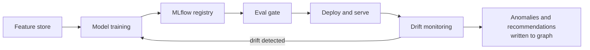

# Solution Architecture: Cost Anomaly Detection, Rightsizing & RI/SP Modeling — MLOps Pipeline

Phase 2 of the platform sequenced in `FinOps Solution Overview.md` — **Core Intelligence**, alongside Self-Serve Foundations (`Solution_Architecture_Self_Serve_Foundations.md`). This is a distinct discipline from the RAG/agentic self-serve work and was otherwise under-exercised across the prep material so far, so it gets its own dedicated document rather than a subsection of another one. Requirements and specifics below are **inferred** from JD language, not confirmed the organization fact.

---

## 1. Problem Statement & Requirements

### 1.1 Problem statement (inferred)

Cloud spend across AWS, Azure, and GCP grows unpredictably; manual review of usage and billing data cannot catch anomalies or rightsizing opportunities at enterprise scale or speed. The platform needs models that proactively surface: (a) **cost anomalies** (unexpected spend spikes, deviation from historical patterns), (b) **rightsizing recommendations** (over-provisioned resources based on actual utilization), (c) **RI/savings-plan modeling** (whether reserved capacity commitments make financial sense given usage patterns), and (d) **bill verification** (reconciling invoiced line items against contracted rates and expected usage, reportedly a fully manual process today).

> **Bill verification as exception-based review, not automation replacing the human.** The goal isn't removing the human from bill verification, it's shifting from 100% manual line-by-line review to automated reconciliation checks that produce a confidence score and attached evidence (matching contract clause, historical rate comparison, delta explanation) for each line item, so the human reviewer spends their time on genuinely ambiguous or high-value discrepancies instead of routine confirmation. Routing should combine confidence score with dollar-impact: high-confidence, low-impact items can auto-approve; low-confidence or high-dollar-impact items always route to a human, regardless of model confidence, the same hard-rule pattern already used for HIGH-risk infrastructure actions in Governed Automation.
>
> **Assumption adopted:** Current State describes this step as manual review, not scored logic, so today's check is assumed to be a true pass/fail (or fully manual) with no existing confidence-scoring behavior. This model is therefore genuinely net-new — not a productionization of something the stored procedures already approximate.

> **Scope boundary.** This document provides full requirements, architecture, and ADRs for (a), (b), and (c) above — anomaly detection, rightsizing, and RI/savings-plan modeling. Bill verification (d) is scoped only as a problem statement here; it shares the same confidence-scored, hard-rule-routed pattern (see the callout above, and ADR-M4 in `FinOps Solution Overview.md`) but gets its own dedicated architecture once written, per the Solution Overview's Sub-Document Index — folding it fully into this document would stretch its title and scope past what's actually designed here.

### 1.2 Functional requirements (inferred)

- FR1: Detect cost anomalies within a bounded window of occurrence (inferred target: within 24h, matching typical billing data freshness), scoped correctly per vertical/account.
- FR2: Generate rightsizing recommendations with a clear, explainable rationale (current utilization vs. provisioned capacity).
- FR3: Model outputs must be consumable by Cloud Workbench (the Self-Serve Foundations doc's AI consumption layer, §4.1) so users can ask about and act on findings conversationally.
- FR4: Support model retraining without service interruption to the detection/recommendation pipeline.
- FR5: Evaluate RI/savings-plan recommendations against a specific target — cost-savings accuracy against realized outcomes over time, not just projected savings at recommendation time (see §2.2's model selection for RI/SP modeling, which otherwise had no functional requirement of its own).

### 1.3 Non-functional requirements (inferred)

| Requirement | Target (inferred) | Rationale |
|---|---|---|
| False positive rate (anomaly detection) | Low enough to sustain user trust; specific threshold tuned against business tolerance, not a fixed industry number | Alert fatigue destroys adoption faster than missed anomalies |
| Model explainability | Every flagged anomaly/recommendation must show its contributing factors | Governance requirement; also a trust/adoption requirement |
| Retraining cadence | Event-triggered (drift detected) and scheduled (e.g., monthly) | Usage patterns shift with business seasonality and cloud pricing changes |
| Auditability | Every prediction logged with model version, inputs, and output | Same HITRUST/SOC2-equivalent posture as the rest of the platform |

---

## 2. Architecture

### 2.1 Feature engineering

Features are computed from the gold-layer lakehouse tables (the Data Foundations doc's Section 4.3), not from raw (bronze) or silver-layer (mediation) data, ensuring the ML layer consumes the same governed, conformed data as every other consumer. Feature categories: time-series spend patterns (rolling averages, seasonality), utilization ratios (allocated vs. consumed compute/memory/storage), tagging/account context (vertical, environment, resource type), and historical anomaly/recommendation outcomes (did a past flagged item get acted on, was it a true or false positive), feeding back into future model quality.

A **feature store** sits between the lakehouse and model training/serving, ensuring the same feature definitions and values are used consistently in training and in production inference, avoiding train/serve skew.

### 2.2 Model selection and training

- **Anomaly detection**: statistical/ML approaches appropriate to time-series spend data (e.g., seasonal decomposition plus threshold-based or isolation-forest-style detection), chosen for explainability over black-box deep learning approaches, given the governance requirement that every flag show its contributing factors (see ADR-002).
- **Rightsizing recommendations**: regression/classification models predicting appropriate resource sizing from utilization history, trained per resource type/workload pattern rather than one undifferentiated model, since a database workload and a batch job have very different utilization signatures.
- **RI/savings-plan modeling**: forecasting models projecting future usage against commitment options, evaluated on cost-savings accuracy against realized outcomes over time.

### 2.3 MLOps lifecycle (MLflow-based)

- **Versioning**: every model version, its training data snapshot, feature set version, and hyperparameters logged in MLflow's model registry.
- **CI/CD integration**: a model change (retrain, new feature, hyperparameter update) runs through an **eval gate** before promotion, performance against a held-out validation set must meet or exceed the currently deployed model before replacing it.
- **Drift monitoring**: both **data drift** (are incoming usage patterns diverging from training data) and **model drift** (is prediction quality degrading over time) tracked continuously; either crossing a threshold triggers a retraining cycle.
- **A/B testing**: a new model version is shadow-tested against a sample of real traffic, compared against the current production model's outputs, before full rollout.
- **Retraining triggers**: scheduled (monthly baseline) and event-triggered (drift threshold crossed, or a step-change in cloud provider pricing/services that likely invalidates prior patterns).

### 2.4 Serving and integration

Models are served via a versioned internal API (consistent with the Self-Serve Foundations doc's API/service layer), containerized (Docker) and deployed on the same **AKS** infrastructure as the rest of the platform, with resource governance limits appropriate to the batch/near-real-time nature of scoring workloads (distinct from the more latency-sensitive Cloud Workbench query path). Model outputs (anomalies, recommendations) are written back to the lakehouse/graph layer as facts, where Cloud Workbench's retrieval layer can surface and explain them conversationally.

### 2.5 Explainability and governance

Every model prediction is logged with its contributing factors (feature values and their relative weight in the decision), model version, and timestamp, satisfying both the audit requirement and the trust/adoption requirement, a rightsizing recommendation a user can't understand or verify is one they won't act on. Bias evaluation, in this domain, means checking the model doesn't systematically under- or over-flag certain verticals/account types due to data volume imbalances rather than genuine risk differences.

---

## 3. Architecture Decision Records

**ADR-001: Compute features from gold-layer lakehouse data only, never from silver (mediation) or raw (bronze) source data**
- *Context*: Multiple layers of the platform touch this data at different levels of conformance.
- *Decision*: The ML layer consumes only governed, gold-layer data, same as every other downstream consumer.
- *Alternatives considered*: Feature engineering directly from silver-layer (mediation) data for freshness, rejected, would bypass the lakehouse's governance/lineage guarantees for model inputs, undermining auditability.
- *Consequences*: Feature freshness is bounded by the lakehouse's refresh cadence, an acceptable tradeoff given cost data's inherent billing-lag freshness ceiling anyway.

**ADR-002: Favor explainable models (statistical/tree-based) over black-box deep learning for anomaly detection**
- *Context*: Every flagged anomaly must show its contributing factors, both for governance and for user trust/adoption.
- *Decision*: Use explainable model families where they meet accuracy requirements; reserve more complex approaches only where explainability can be preserved through a separate technique (e.g., feature attribution).
- *Alternatives considered*: A higher-capacity deep learning model for potentially better raw accuracy, rejected as the default, the explainability cost outweighs a marginal accuracy gain in a domain where user trust in the recommendation matters as much as the recommendation's precision.
- *Consequences*: Some ceiling on raw model accuracy versus a more complex alternative, in exchange for auditable, explainable output.

**ADR-003: Separate rightsizing models per resource/workload type rather than one general model**
- *Context*: Utilization signatures differ substantially across workload types (database vs. batch job vs. web service).
- *Decision*: Train and version separate models per workload category.
- *Alternatives considered*: One general model with workload type as a feature, rejected, risks the model learning workload-type-driven patterns as noise rather than the model architecture reflecting genuinely different underlying behavior.
- *Consequences*: More models to version, monitor, and retrain, but materially better recommendation quality per workload type.

---

## 4. Glossary

**A/B testing (model)** — Shadow-testing a new model version against real traffic, comparing outputs to the current production model before full rollout.

**Data drift** — Incoming real-world data diverging from what a model was trained on.

**Eval gate** — A required evaluation check a model/prompt change must pass before promotion to production.

**Feature store** — A governed repository ensuring consistent feature definitions and values across training and serving.

**Model drift** — Degradation in a deployed model's prediction quality over time.

**Model registry (MLflow)** — A versioned catalog of model artifacts, training data snapshots, and hyperparameters.

**Train/serve skew** — A mismatch between how features are computed at training time versus at inference/serving time, a common source of silent production model quality issues.
