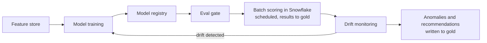

# Solution Architecture: Cost Anomaly Detection, Rightsizing & RI/SP Modeling (MLOps Pipeline)

Phase 2 of the platform sequenced in `FinOps Solution Overview.md`: **Core Intelligence**, built alongside Self-Serve Foundations' non-agentic API and dashboards (`Solution_Architecture_Self_Serve_Foundations.md`). Classical ML is a separate discipline from the agentic self-serve work in `Solution_Architecture_Cloud_Workbench.md` (Phase 5, see ADR-M1 in `FinOps Solution Overview.md`), so it has its own document. Requirements below are **inferred** from the job description and are not confirmed the organization facts.

---

## 1. Problem Statement & Requirements

### 1.1 Problem statement (inferred)

Cloud spend across AWS, Azure, and GCP changes unpredictably, and manual review of usage and billing data can't catch anomalies or rightsizing opportunities at enterprise scale or speed. The platform needs to surface: (a) **cost anomalies** (unexpected spikes, departures from historical patterns), (b) **rightsizing recommendations** (over-provisioned resources, based on actual utilization), (c) **RI/savings-plan planning** (what commitments to buy given usage), and (d) **bill verification** (reconciling invoice lines against billing data, contract terms, and expected usage; reportedly manual today).

> **Bill verification as exception-based review.** The goal is not to remove the person from bill verification. It is to move from checking every line by hand to automated reconciliation that gives each line a confidence score and evidence, so the reviewer spends time on ambiguous or high-value discrepancies. Routing combines confidence with dollar impact: high-confidence, low-impact lines can clear automatically, and low-confidence or high-dollar lines always go to a person. That is the same fixed-rule pattern Governed Automation uses for HIGH-risk actions.
>
> **Assumption adopted:** Current State describes this step as manual review, so today's check is assumed to be manual or pass/fail, with no scoring. The capability is new, not a rebuild of something the stored procedures already approximate.

> **Scope.** This document covers requirements, architecture, and ADRs for (a), (b), and (c): anomaly detection, rightsizing, and RI/savings-plan planning. Bill verification (d) shares the scored, rule-routed pattern (see the callout above and ADR-M4 in `FinOps Solution Overview.md`) and is designed in `Solution_Architecture_Bill_Verification.md`.

### 1.2 Functional requirements (inferred)

- FR1: Detect cost anomalies within a bounded time of occurrence (inferred target: within 24h, matching billing data freshness), scoped correctly to each vertical and account.
- FR2: Generate rightsizing recommendations with a clear, explainable rationale (utilization compared with provisioned capacity).
- FR3: Make outputs available to Cloud Workbench (`Solution_Architecture_Cloud_Workbench.md` §4.1, Phase 5), so users can ask about findings and act on them conversationally, and, before Cloud Workbench ships, through Self-Serve Foundations' REST API (§4.1).
- FR4: Support retraining without interrupting detection or recommendations.
- FR5: Evaluate RI/savings-plan recommendations by realized savings over time, not only projected savings at recommendation time (§2.3).

### 1.3 Non-functional requirements (inferred)

| Requirement | Target (inferred) | Rationale |
|---|---|---|
| False positive rate (anomaly detection) | Low enough to keep user trust; the threshold is tuned to business tolerance, not an industry number | Alert fatigue kills adoption faster than missed anomalies |
| Model explainability | Every anomaly and recommendation shows its contributing factors | Required for governance, trust, and adoption |
| Retraining cadence | Event-triggered (drift detected) and scheduled (e.g., monthly) | Usage patterns shift with business seasonality and cloud pricing changes |
| Auditability | Every prediction logged with model version, inputs, and output | Same HITRUST/SOC2-equivalent posture as the rest of the platform |

---

## 2. Architecture

### 2.1 Technology stack

The job description names the ML platforms and MLOps tools the organization evaluates (Azure ML, SageMaker, Vertex AI, MLflow). The choices below follow from Snowflake being the organization's data platform standard (Data Foundations ADR-003; see ADR-004).

| Component | Choice | Rationale |
|---|---|---|
| Training/experimentation compute | Snowpark ML | Runs next to the gold-layer tables (Data Foundations §4.3), with no data egress and no separate ML platform to operate. See ADR-004 |
| Feature store | Snowflake Feature Store (Snowpark ML) | Uses Snowflake's existing access control and lineage |
| Experiment tracking & model registry | Snowflake Model Registry (Snowpark ML) | The versioning model MLflow popularized (and the job description names), built into Snowflake, so there is no MLflow tracking server to run |
| Hyperparameter tuning | Bayesian search (Optuna or Hyperopt), run as Snowpark jobs | Either is a standard choice |
| Model inference | Batch inference inside Snowflake: Model Registry warehouse inference, or Snowpark stored procedures for rules and the RI/SP optimizer, scheduled by Snowflake Tasks (Data Foundations ADR-005) | Every workload here is batch. Billing data arrives about 24 hours late, and scoring runs daily or less often, so nothing needs a low-latency endpoint. Scoring next to gold avoids moving data, keeps Snowflake's row access and masking policies in force, and leaves no cluster to run. See §2.5 and ADR-008 |
| Container fallback | Snowpark Container Services, only if needed | For a future model that needs GPUs or packages the warehouse runtime can't provide. It stays inside Snowflake's governance boundary, so it is preferred over an external container platform for model compute. See ADR-008 |
| Drift detection | Evidently AI (or an equivalent open-source library), run as a scheduled Snowpark job | Drift reports are written back to Snowflake alongside the registry's run history, with no separate monitoring service |

### 2.2 Feature engineering

Features are computed from Snowflake's gold-layer tables (Data Foundations §4.3), never from bronze or silver, so the ML layer uses the same governed, conformed data as every other consumer. Feature categories: time-series spend patterns (rolling averages, seasonality), utilization ratios (allocated vs. consumed compute, memory, storage), tag and account context (vertical, environment, resource type), and past outcomes (whether a flagged item was acted on, and whether it was a true or false positive).

**Features that match a semantic-layer metric read the metric.** If a feature is, or directly uses, a defined metric (for example, a rolling-spend feature built on `metric_monthly_burn_rate`, or a utilization feature that is `metric_utilization_rate` at a finer grain), the feature pipeline reads it from the Semantic View instead of re-aggregating gold. This is the same rule Data Foundations applies to BI (ADR-002) and the knowledge graph (ADR-004): a second calculation of a named metric can drift from the first. Features with no semantic-layer equivalent (lags, seasonal decomposition, z-scores, and other ML-specific transforms) compute directly from gold. The table below shows which is which.

A **feature store** (Snowflake Feature Store, §2.1) sits between gold and model training and scoring, so training and production use the same feature definitions and values.

**Illustrative features by model family.** A starting set, expected to grow:

| Feature | Captures | Source | Used by |
|---|---|---|---|
| `spend_7d_rolling_avg`, `spend_7d_rolling_std` | Recent spend baseline and volatility per resource and account | Gold (ML-specific transform, no semantic-layer equivalent) | Anomaly detection |
| `spend_zscore_vs_28d_baseline` | How many standard deviations current spend is from its rolling baseline | Gold (ML-specific transform) | Anomaly detection |
| `resource_count_delta` | New or terminated resources in the period, to tell a volume-driven change from a price-driven one | Gold (ML-specific transform) | Anomaly detection |
| `day_of_week_seasonality_index` | Weekday and weekend patterns, so a normal Monday spike isn't flagged every week | Gold (ML-specific transform) | Anomaly detection |
| `utilization_rate` (allocated vs. consumed, CPU/memory/storage) | Whether a resource is over-provisioned | **Reused from `metric_utilization_rate`** (Data Foundations §4.4), not recomputed | Rightsizing |
| `peak_to_average_ratio` | Bursty vs. steady workload, to tell "needs headroom" from "idle" | Gold (ML-specific transform) | Rightsizing |
| `instance_family_generation_lag` | Whether a resource is on an older generation with a newer, cheaper equivalent | Gold (ML-specific transform, joined to a provider SKU reference) | Rightsizing |
| `workload_type_category` | Workload type (database, batch, web), which selects the headroom policy (ADR-003) | Gold, tag and account context | Rightsizing |
| `cpu_p95_utilization`, `memory_p99_utilization` | Peak utilization over the lookback window (default 30 days). Memory uses a higher percentile because running out of memory breaks a workload, while CPU saturation only slows it | Gold (ML-specific transform over utilization telemetry) | Rightsizing |
| `existing_ri_sp_utilization` | Whether commitments already bought are being used | **Reused from `metric_ri_sp_utilization`** (Data Foundations §4.4), not recomputed | RI/SP modeling |
| `usage_trailing_90d_mean_and_variance` | Usage stability; a steady workload is a better commitment candidate than a volatile one | Gold (ML-specific transform) | RI/SP modeling |
| `commitment_term_horizon_fit` | Whether the usage trend supports a 1-year or 3-year commitment | Gold (ML-specific transform) | RI/SP modeling |
| `existing_commitment_expiry_schedule` | Hourly committed capacity already owned, by commitment scope, for each future hour until each commitment expires | Gold (`gold.dim_commitment`, Build Specification §3) | RI/SP modeling (optimizer input, not a model feature) |
| `apm_resolution_confidence` | Whether a resource was matched to its application by APM ID or by fuzzy tag match (Data Foundations §4.4). A weaker match should lower the recommendation's confidence | Gold (`resolve_resource_identity()` output, Build Specification §4) | All three |
| `historical_recommendation_outcome` | Whether a past recommendation of this type was accepted, rejected, or reversed for this resource or workload type | Gold (`fact_recommendation` history) | All three (feedback loop) |
| `managed_by_iac`, `iac_config_drift_flag` | Whether Terraform declares the resource, and whether its live config still matches what Terraform last applied (Data Foundations §4.1) | Gold (Terraform state table, Build Specification §4) | Rightsizing (context, not something to optimize; see below) |

**Terraform context changes what a rightsizing recommendation means.** `managed_by_iac` and `iac_config_drift_flag` are context, not ordinary inputs. A low-utilization resource that exactly matches its Terraform-declared size is a different case from one that has drifted. The utilization signal is the same either way; the recommendation shown to people differs (ADR-005).

### 2.3 Model selection and training

- **Anomaly detection**: statistical and ML methods suited to time-series spend (for example, seasonal decomposition with threshold-based or isolation-forest detection), chosen for explainability over deep learning, because every flag must show its contributing factors (ADR-002).
- **Rightsizing recommendations**: deterministic sizing rules, not a supervised model. No label exists for "the correct size" of a resource, so there is nothing to train a regression or classifier on. A recommendation is computed in four steps:
  1. **Measure peak demand.** Take `cpu_p95_utilization` and `memory_p99_utilization` over the lookback window (default 30 days, long enough to include a month-end cycle).
  2. **Apply a headroom policy.** The target is the smallest size where projected peak utilization stays under the workload's ceiling, set by `workload_type_category` (illustrative defaults: web/stateless CPU p95 at or below 70%, database memory p99 at or below 80%, batch CPU p95 at or below 85%). Ceilings are configuration owned by the FinOps/platform team with cloud engineering, not learned values.
  3. **Pick a compatible SKU.** From the provider SKU catalog, choose the cheapest SKU that meets the target and keeps the resource's hard constraints: CPU architecture, local storage, network performance, and any licensing tied to core count. Prefer a newer generation where `instance_family_generation_lag` shows one exists.
  4. **Price and explain.** Estimated savings are the price difference at the resource's current pricing (on-demand or covered by a commitment). Contributing factors are the measured percentiles, the ceiling applied, and the SKU chosen.

  Where the provider has its own recommendation for the same resource (AWS Compute Optimizer through Cost Optimization Hub, Azure Advisor, GCP machine type recommender), it is attached as context. Agreement raises confidence. Disagreement is shown to the reviewer with both reasons, since the provider may see metrics the platform doesn't collect (for example, memory on AWS where the CloudWatch agent is installed), and the platform sees context the provider doesn't (headroom policy, Terraform management, APM ownership).

  Resources with fewer than 14 days of telemetry, or whose `peak_to_average_ratio` shows peaks too short for percentiles to capture, are skipped. ML is used only where rules can't do the job: classifying `workload_type_category` when tags don't declare it. Quality is measured after the fact: realized savings, and the **regret rate** (the share of applied recommendations that were reversed, or followed by CPU throttling or out-of-memory events, within 30 days).
- **RI/savings-plan modeling**: an optimization problem, solved in two steps, because a forecast alone doesn't say what to buy.
  1. **Forecast.** A probabilistic forecast of hourly commitment-eligible usage per commitment scope (for example, AWS Compute Savings Plan normalized spend, an Azure reservation's VM family and region, or a GCP committed-use resource type) over the candidate terms. It produces quantiles (P10, P50, P90), because the purchase decision depends on how low usage could plausibly go.
  2. **Optimize.** Choose purchase quantities per commitment type and term (1-year or 3-year, and payment option where offered) to maximize expected net savings over on-demand, subject to:
     1. Committed capacity, including existing commitments still in force (`existing_commitment_expiry_schedule`), stays at or below a low forecast quantile (default P20), so utilization of what's owned stays at or above a target (default 95%).
     2. Purchases are split into tranches across the year so expiries stay staggered, matching the laddering the team already does (`FinOps Current State.md`).
     3. Upfront payment stays within any cash limit Finance sets.

     This is a small linear program per commitment scope, solved in Snowpark with an open-source solver (such as OR-Tools or PuLP). The output is a dated purchase plan with expected savings, expected utilization, and the downside if usage falls to P10.

  Plans are evaluated by backtest, not only by forecast accuracy: each past plan is replayed against the usage that followed, and its realized savings, utilization, and coverage are compared with the purchases the team actually made (FR5).

### 2.4 MLOps lifecycle (Snowflake Model Registry-based)

- **Versioning**: every model version, its training data snapshot, feature set version, and hyperparameters are logged in the Snowflake Model Registry.
- **CI/CD integration**: any model or rule change (retrain, new feature, hyperparameter update, headroom ceiling change) goes through an **eval gate** before promotion and must meet or beat the current version. None of these models starts with labeled data, so each gate uses what can actually be measured:

  | Model | Labels at launch | Eval gate |
  |---|---|---|
  | Anomaly detection | None | 0. **Provider baseline**: on AWS, match or beat Cost Anomaly Detection (`gold.fact_provider_anomaly`) on recall of injected anomalies at the same or lower alert volume (ADR-007). 1. **Recall on injected anomalies**: synthetic spikes, step changes, and slow ramps of known size added to a held-back slice of real spend history. 2. **Alert volume**: flags per vertical per week stay within a budget the FinOps team sets, since alert fatigue is the main adoption risk (§1.3). 3. **Precision against dispositions**, added once enough exist (default: 300 dispositioned anomalies): the share of flags the FinOps team marked `true_anomaly` or `expected_change` instead of `false_positive` |
  | Rightsizing | None, and none needed (rules, ADR-003) | 0. **Provider baseline**: every disagreement with the provider's recommendation for the same resource (`gold.fact_provider_recommendation`) is reported, and regret rates are compared where the two differ (ADR-007). 1. **Snapshot regression test**: a fixed input snapshot must produce the same recommendations unless the change is a reviewed rule change. 2. **Regret rate** and realized savings for recommendations applied in the previous period (§2.3) |
  | RI/SP planning | Not applicable (optimization) | **Backtest**: realized savings and utilization of the candidate's past plans against actual usage, compared with the current version, the purchases the team actually made, and the provider's purchase recommendations for the same period (§2.3, ADR-006, ADR-007) |
  | Bill verification | None | Rules first, model only once labels exist (Bill Verification §3.3) |

- **Label capture**: every anomaly shown to the FinOps team gets a disposition (`true_anomaly`, `expected_change`, `false_positive`), recorded through the Self-Serve API (Build Specification §7) during the team's existing anomaly review. Dispositions feed the precision gate above and `historical_recommendation_outcome` (§2.2). During the A/B period (Solution Overview, migration steps 16-18), flags where the new detector and today's stored-procedure logic disagree are dispositioned first, building the first labels from work the team already does.
- **Drift monitoring**: both **data drift** (incoming usage patterns moving away from training data) and **model drift** (prediction quality declining) are tracked continuously. Either crossing a threshold triggers retraining. Tooling is in §2.6.
- **A/B testing**: a new model version runs in shadow against real data and is compared with the current production version before full rollout.
- **Retraining triggers**: scheduled (monthly) and event-driven (a drift threshold crossed, or a change in provider pricing or services that likely invalidates past patterns).

### 2.5 Serving and integration

**All model compute runs as batch jobs inside Snowflake, not as long-running container services** (ADR-008). The reason is the shape of the work:

1. **Nothing here needs online serving.** Provider billing data lands about 24 hours late (Data Foundations §2.3), so anomaly scoring, rightsizing, RI/SP planning, and bill verification run on a schedule, daily or less often. A low-latency endpoint would sit idle almost all the time.
2. **The data stays put.** Scoring reads the Feature Store and gold tables where they live, instead of copying them to a cluster. Row access policies, masking, and lineage (Data Foundations §4.3) stay in force, and there is no second copy of cost data to secure.
3. **Nothing extra to operate.** No scoring service to patch, scale, or put on call. Warehouses suspend when idle and bill per second.
4. **Same feature definitions for training and scoring.** Both read the same Feature Store on the same platform, which removes a common cause of train/serve skew.

How each workload runs:

| Workload | Runs as | Schedule |
|---|---|---|
| Anomaly detection | Model Registry warehouse inference over the day's features | Daily, after `job_gold_aggregate_cost` |
| Rightsizing | Snowpark stored procedure applying the sizing rules (ADR-003) | Daily |
| RI/SP planning | Snowpark stored procedure: forecast, then linear program (ADR-006) | Weekly, and on demand before a purchase decision |
| Bill verification | Snowpark stored procedure (rules) or Model Registry inference (once a model is promoted) | On new invoice lines or a restated billing period (Build Specification §10) |
| What-if projections | The same procedures, called on demand from the pull workbench (Streamlit-in-Snowflake, Cloud Workbench Expansion ADR-3) | Interactive; a few seconds is acceptable |

Each workload has its own warehouse, so its credit use shows up separately, in line with tracking the platform's own cost (Solution Overview NFRs). Outputs (anomalies, recommendations, verification results) are written to Snowflake's gold layer as facts. The Self-Serve API (Self-Serve Foundations §4.1) and Cloud Workbench read those facts; neither calls a model directly.

CMP, the organization's container platform, hosts the platform's long-running services, where an always-on process with a latency target is the actual requirement: `cost-intelligence-api` (REST API, MCP tools, and the Cloud Workbench agent) and the Temporal workers with their OPA sidecar (Build Specification §8).

### 2.6 Observability, monitoring, and alerting

§2.4's drift monitoring decides when to retrain. This section is the tooling that makes model health visible day to day:

- **Job metrics**: scoring job success or failure, duration, and rows scored from Snowflake task and query history, plus per-warehouse credit use, sent to Datadog through its Snowflake integration. This is the same Datadog backend every phase uses (Data Foundations §4.5). There is no scoring service, so there are no latency or throughput metrics.
- **Model-quality metrics**: scheduled Evidently AI drift and quality reports (§2.1), written to a `gold.model_quality_metrics`-style table, so Cloud Workbench and BI can query them like other facts (Data Foundations ADR-003).
- **Alerting**: Datadog Monitors for job and infrastructure thresholds. Model-quality alerts (drift past a threshold, a rising false-positive rate) use the same monitors, posting to a Teams channel and opening a ticket or page in ITSM (believed to be ServiceNow, not confirmed). These are the same two channels every phase uses (Data Foundations §4.5).
- **Tracing**: job-level OpenTelemetry spans for the pipeline from feature computation to scoring, emitted by the scheduled jobs and exported to Datadog APM, with Snowpark procedure logs captured in a Snowflake event table. This is the same tracing backbone as Cloud Workbench (§4.2) and Data Foundations (§4.5).
- **Review cadence**: scoring job failures handled by on-call; data-quality checks daily; model performance weekly; drift and the §3.2 subgroup review monthly; a strategic review of all models quarterly. These are review rhythms, not SLAs, because none of this is a customer-facing uptime commitment.

### 2.7 Explainability and governance

Every prediction is logged with its contributing factors (feature values and their weight in the result), model version, and timestamp. That serves both audit and adoption: nobody acts on a rightsizing recommendation they can't understand or check. Bias evaluation here means checking that a model doesn't over- or under-flag certain verticals or account types because of differences in data volume rather than real risk. Broader AI governance (impact screening, human oversight, standards alignment) is covered in §3.

---

## 3. AI Governance

These models train and score on cloud cost, usage, and utilization data at the resource, account, and vertical level. None of it is about individual people, and none of it feeds a consequential decision about a person (hiring, credit, benefits, and similar). That lowers the stakes compared with, say, an HR or lending model, and nothing below claims a legal requirement applies (on current understanding, no AI-specific law or GDPR-style automated-decision rule is triggered). The practices are adopted anyway, because the job description asks for "model explainability, bias evaluation, prediction logging" and documentation that keeps systems "transparent and responsible," and because a future use of this pipeline might carry higher stakes.

### 3.1 Data protection impact screening

Screening question: does the model process personal data, or make an automated decision with legal or similarly significant effect on a person? Answer, on current understanding: no. Model inputs are resource, account, and vertical aggregates (§2.2). The one place personal data plausibly appears is the Owner and Technical Contact fields on the APPLICATION entity (Data Foundations §4.3), which are used for routing and notification, never as model features.

**Assumption adopted**: a full DPIA isn't triggered by this design. This is recorded as an explicit screening decision. If an Owner, Technical Contact, or any other personal field ever becomes a model feature, the screening must be redone.

### 3.2 Ethical / algorithmic impact assessment

The affected parties for fairness purposes are business verticals and application teams, not demographic groups, so this is organizational fairness. §2.7 names the concern (data-volume differences showing up as apparent risk differences); this section makes it a repeatable check. Per-vertical performance is reviewed at every retraining cycle (§2.6, monthly) with a documented result: either a clean pass, or a flagged imbalance with an owner and a mitigation plan.

A second-order effect: a false-positive rate that is too high erodes trust faster than it shows up in any metric, which is why the NFR table has a false-positive row. The risk of *over-automating* on a finding belongs to Governed Automation's risk tiers, not this document. This document is responsible for the quality of a finding, not for what happens to it next.

### 3.3 Human oversight model

Every output of this pipeline is a proposal, never a decision. A finding appears in Core Intelligence's outputs and Cloud Workbench as a recommendation (human-on-the-loop: people monitor and can act, but don't review each one before it is visible). If a finding becomes a candidate for automated action, it goes through Governed Automation's LOW/MEDIUM/HIGH routing (§2.2 there), where HIGH always requires human approval. These models are never the last decision-maker.

### 3.4 Model documentation & audit artifacts

- **Model card** per deployed version: intended use, per-vertical performance (§3.2), the training data snapshot (versioned in the Snowflake Model Registry, §2.1), and known limitations. Regenerated at every promotion through the eval gate (§2.4).
- **Decision log**: this document's Architecture Decision Records (§4) record the alternatives considered and why they were rejected. No separate decision log is kept.

### 3.5 Standards alignment

No AI-specific law is understood to apply (§3.1), so nothing here is framed as a compliance obligation. The practices above are shaped to match two widely used voluntary frameworks that are closest to the job description's governance language: the **NIST AI Risk Management Framework** (Govern, Map, Measure, Manage) as the general shape of §2.6's monitoring and §3.2's assessments, and **ISO/IEC 42001**-style documentation (model cards, decision logs, versioning, §3.4) as the audit-readiness bar. Neither is a certification target; both are reference points for a reviewer.

**Assumption flagged**: if this pipeline is reused for a use case that touches decisions about individuals (an HR-adjacent or vendor-risk scoring model, for example), none of these conclusions carry over. That use case needs its own DPIA and impact screening.

---

## 4. Architecture Decision Records

**ADR-001: Compute features from gold only, and reuse semantic-layer metrics where a feature matches one**
- *Context*: Several platform layers hold this data at different levels of conformance. Some feature categories (§2.2's time-series spend patterns and utilization ratios) overlap with metrics the semantic layer already defines (`metric_monthly_burn_rate`, `metric_utilization_rate`).
- *Decision*: The ML layer reads only governed gold data, like every other consumer. A feature that matches a named metric reads that metric; only features with no semantic-layer equivalent compute directly from gold.
- *Alternatives considered*: Engineering features from silver for freshness, rejected; it bypasses Snowflake's governance and lineage for model inputs and weakens auditability. Computing every feature from gold regardless of overlap, rejected; for features that mirror a named metric, it brings back the drift risk Data Foundations ADR-002 exists to prevent.
- *Consequences*: Feature freshness is bounded by gold's refresh cadence, which is acceptable given billing lag. A feature that reuses a metric also inherits the metric's change history: redefining `metric_utilization_rate` changes a rightsizing feature too. The semantic layer's change management (Data Foundations §4.5) must therefore treat metric changes as affecting ML consumers, not only BI and Cloud Workbench.

**ADR-002: Prefer explainable models (statistical or tree-based) over deep learning for anomaly detection**
- *Context*: Every anomaly must show its contributing factors, for governance and for user trust.
- *Decision*: Use explainable model families where they are accurate enough. Use more complex approaches only where explainability can be kept through a separate technique (for example, feature attribution).
- *Alternatives considered*: A higher-capacity deep learning model for possibly better accuracy, rejected as the default. In a domain where trust matters as much as precision, losing explainability costs more than a small accuracy gain.
- *Consequences*: Some ceiling on accuracy compared with a more complex model, in exchange for auditable, explainable output.

**ADR-003: Compute rightsizing with deterministic sizing rules and per-workload headroom policies, not a supervised model**
- *Context*: Utilization patterns differ a lot across workload types (database, batch, web service), which might suggest a separately trained model per type. But a rightsizing model needs a label (the correct size for a resource), and none exists: past sizes reflect what was provisioned, not what was right.
- *Decision*: Compute recommendations from utilization percentiles, a headroom ceiling selected by `workload_type_category`, and the provider SKU catalog (§2.3). Workload differences are configuration (different ceilings and percentiles), not separate models. ML is limited to classifying workload type where tags don't declare it.
- *Alternatives considered*: Per-workload regression or classification models, rejected. There is no ground truth to train on, and a model trained on current sizes would learn to reproduce today's over-provisioning. One general supervised model, rejected for the same reason.
- *Consequences*: Recommendations are fully explainable (a percentile, a ceiling, a SKU) and reviewable by cloud engineers without ML knowledge. Quality depends on the ceilings being right, so they are tuned against the regret rate (§2.3). If applied-recommendation outcomes build up into a real label set, a learned ceiling per workload type can be reconsidered.

**ADR-004: Train and register models on Snowpark ML, not Databricks or one hyperscaler's ML platform**
- *Context*: the organization's estate spans AWS, Azure, and GCP, and the job description names Azure ML, SageMaker, Vertex AI, and MLflow as tools the team evaluates. Data Foundations builds on Snowflake because it is the organization's data platform standard (its ADR-003), so the gold data models train on already lives there.
- *Decision*: Keep training, the feature store, and the model registry next to the gold data in Snowflake: Snowpark ML for training and feature engineering, and the Snowflake Model Registry instead of an MLflow tracking server.
- *Alternatives considered*: Azure ML, SageMaker, or Vertex AI as the main training platform, rejected as the default; each would export gold data out of Snowflake into one cloud's ML platform, breaking the "one governed copy of the data" principle. Training each cloud's data on that cloud's ML service, rejected; needless complexity for data already unified in one place. A self-hosted MLflow server as the registry, rejected as the default; it works but adds a service to operate for something Snowflake's registry already covers.
- *Consequences*: Snowpark ML's training tooling is younger and narrower than Databricks' or a hyperscaler's. Heavy deep learning, distributed multi-GPU training, or dependence on a specific pretrained-model ecosystem would be a real gap. That is acceptable because ADR-002 scopes these models as explainable and statistical. If that scope changes, revisit this decision instead of stretching it.

**ADR-005: Show Terraform management and config drift as recommendation context**
- *Context*: Rightsizing sees only utilization. It can't tell a resource over-provisioned by accident from one sized on purpose in an approved Terraform module, and it can't know that resizing a Terraform-managed resource directly (instead of through its IaC pipeline) may be reverted or conflict on the next `terraform apply` (Governed Automation §3.3).
- *Decision*: Attach `managed_by_iac` and `iac_config_drift_flag` (Data Foundations §4.1) to every rightsizing recommendation, and change the wording based on them. A low-utilization, Terraform-managed, non-drifted resource is shown as "matches its approved Terraform config; change the module, not the live resource." An unmanaged or already-drifted resource is shown as an ordinary rightsizing recommendation.
- *Alternatives considered*: Ignoring Terraform status and leaving the check to Governed Automation's execution step, rejected. By then the recommendation has already been presented to a person as a plain resize, which is the wrong framing for an approved configuration. The context is more useful before the reviewer decides.
- *Consequences*: Recommendations depend on a fresh Terraform state sync (Data Foundations §4.1). A stale sync could frame a recommendation wrongly, so this table's freshness matters more than a typical dimension's.

**ADR-006: Treat RI/SP planning as forecast-then-optimize**
- *Context*: Commitment planning is a purchase decision under uncertainty. A point forecast of usage doesn't say how much to commit, for which term, or how to stagger purchases against commitments expiring through the year.
- *Decision*: Produce a probabilistic usage forecast per commitment scope, then solve a small linear program that maximizes expected net savings subject to a utilization floor, staggered expiries, and any upfront-cash limit (§2.3). Evaluate by backtesting purchase plans against realized usage.
- *Alternatives considered*: A forecast with a person choosing quantities, rejected as the default; it leaves the actual decision, and the laddering arithmetic that takes much of the team lead's time today, manual. Committing a fixed share of recent average usage, rejected; it ignores volatility and existing expiries, which is where over-commitment happens.
- *Consequences*: Needs an inventory of owned commitments with expiry dates (`gold.dim_commitment`), which billing exports don't include. Every plan is a recommendation the FinOps team approves and executes; nothing is bought automatically, because a commitment is a multi-year financial obligation, not a reversible infrastructure change.

**ADR-007: Use provider-native recommendations and anomaly detection as baselines and inputs, and build only where they fall short**
- *Context*: Every provider runs free recommendation and anomaly services, and most can be retrieved by API or scheduled export (Data Foundations §4.1). Building custom versions without comparing against them risks paying to rebuild something that already exists.
- *Decision*: Per capability:
  1. **Anomaly detection**: build, with AWS Cost Anomaly Detection as the baseline to beat. The custom detector is justified by what native tools can't provide: Azure's detected anomalies can't be read by API, GCP's programmatic access is unconfirmed, and none of them score anomalies against the organization's verticals and APM ownership with one method.
  2. **Rightsizing**: combine. The platform's sizing rules (ADR-003) run for every resource, with the provider's recommendation attached as a cross-check. The rules add what providers don't know: per-workload headroom policy, Terraform management (ADR-005), and APM ownership.
  3. **RI/SP planning**: combine. Provider purchase recommendations are an input to, and a baseline for, the optimizer (ADR-006). They don't account for staggered expiries across the organization's whole commitment portfolio, cash limits, or planned changes a vertical knows about.
- *Alternatives considered*: Provider tools alone, rejected; three consoles with three methods and no vertical or APM attribution is roughly today's situation. Building everything and ignoring provider tools, rejected; there would be no baseline to prove the custom work is better, and a real risk of being worse than something free.
- *Consequences*: One more daily ingestion (`task_provider_recommendations_ingest`, Build Specification §1) and two gold tables. If a custom model can't beat the provider baseline in its eval gate, the provider's output is what users see for that capability and cloud.
- *Sources*: [References.md](References.md) R7–R13 (provider recommendation and anomaly access).

**ADR-008: Run model inference as batch jobs inside Snowflake, not as container services on Kubernetes**
- *Context*: Training, the Feature Store, and the registry run in Snowflake for data locality (ADR-004). Inference could run there too, or as container services on Kubernetes next to the platform's other services. Every workload is batch: billing data is about 24 hours late, and each model runs daily, weekly, or on a new invoice.
- *Decision*: Run inference in Snowflake (Model Registry warehouse inference for trained models, Snowpark stored procedures for rules and the RI/SP optimizer), scheduled by Snowflake Tasks and writing results to gold (§2.5). Use Snowpark Container Services only if a future model needs GPUs or packages the warehouse runtime can't provide. Keep container hosting (CMP) for long-running services: the REST API with MCP tools, and the Temporal workers with OPA.
- *Alternatives considered*:
  1. **Containers on Kubernetes (CMP or AKS)**, rejected. Their strengths (low-latency online serving, full runtime control, portability) aren't requirements here. Their costs are: copying cost data out of Snowflake's row access and masking policies, compute that sits idle between daily runs, and a cluster workload to patch and support.
  2. **A hyperscaler managed endpoint** (Azure ML, SageMaker, Vertex AI), rejected for the same data-movement reason, and because it ties a multi-cloud platform to one provider's ML service.
- *Consequences*: Inference is limited to Snowflake's supported Python packages and warehouse memory (Snowpark-optimized warehouses cover large in-memory jobs). Model compute is more tied to Snowflake, consistent with Data Foundations ADR-003. If a real low-latency, per-request scoring need appears (for example, scoring every action proposal synchronously), revisit this decision for that workload only.

---

## 5. Glossary

**A/B testing (model)**: Running a new model version in shadow against real data and comparing its outputs with the current production version before full rollout.

**Batch inference**: Scoring a model on a schedule over a table of inputs and writing results to a table, instead of answering individual requests through a live endpoint. How every model in this document runs (§2.5, ADR-008).

**Data drift**: Incoming data moving away from what a model was trained on.

**DPIA (Data Protection Impact Assessment)**: A structured assessment of privacy risk for a use of data. §3.1 explains why this design doesn't trigger a full one.

**Eval gate**: A required evaluation a model, rule, or prompt change must pass before it is promoted to production.

**Feature store**: A governed repository that keeps feature definitions and values consistent between training and scoring.

**Human-on-the-loop**: Oversight where people monitor and can intervene but don't review each output before it takes effect. Human-in-the-loop, by contrast, requires review of each one.

**ISO/IEC 42001**: A voluntary, certifiable standard for AI management systems covering governance, risk, roles, and audit. Used here (§3.5) as a documentation bar, not a certification target.

**Model card**: A document per model version recording intended use, subgroup performance, training data lineage, and known limitations (§3.4).

**Model drift**: A decline in a deployed model's prediction quality over time.

**Model registry (Snowflake Model Registry)**: A versioned catalog of model artifacts, training data snapshots, and hyperparameters, built into Snowflake so no separate MLflow server is needed.

**NIST AI Risk Management Framework**: A voluntary US framework organized around four functions (Govern, Map, Measure, Manage). Used here (§3.5) as the general shape of this document's monitoring and assessment practice.

**Train/serve skew**: A mismatch between how features are computed for training and for scoring, a common cause of silent model quality problems.
