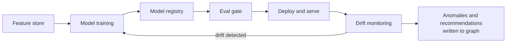

# Solution Architecture: Cost Anomaly Detection, Rightsizing & RI/SP Modeling — MLOps Pipeline

Phase 2 of the platform sequenced in `FinOps Solution Overview.md` — **Core Intelligence**, alongside Self-Serve Foundations' non-agentic API/dashboards (`Solution_Architecture_Self_Serve_Foundations.md`). This is a distinct discipline from the RAG/agentic self-serve work, which lives separately in `Solution_Architecture_Cloud_Workbench.md` (Phase 5, not Phase 2 — see `FinOps Solution Overview.md` ADR-M1), and was otherwise under-exercised across the prep material so far, so it gets its own dedicated document rather than a subsection of another one. Requirements and specifics below are **inferred** from JD language, not confirmed the organization fact.

---

## 1. Problem Statement & Requirements

### 1.1 Problem statement (inferred)

Cloud spend across AWS, Azure, and GCP grows unpredictably; manual review of usage and billing data cannot catch anomalies or rightsizing opportunities at enterprise scale or speed. The platform needs models that proactively surface: (a) **cost anomalies** (unexpected spend spikes, deviation from historical patterns), (b) **rightsizing recommendations** (over-provisioned resources based on actual utilization), (c) **RI/savings-plan modeling** (whether reserved capacity commitments make financial sense given usage patterns), and (d) **bill verification** (reconciling invoiced line items against contracted rates and expected usage, reportedly a fully manual process today).

> **Bill verification as exception-based review, not automation replacing the human.** The goal isn't removing the human from bill verification, it's shifting from 100% manual line-by-line review to automated reconciliation checks that produce a confidence score and attached evidence (matching contract clause, historical rate comparison, delta explanation) for each line item, so the human reviewer spends their time on genuinely ambiguous or high-value discrepancies instead of routine confirmation. Routing should combine confidence score with dollar-impact: high-confidence, low-impact items can auto-approve; low-confidence or high-dollar-impact items always route to a human, regardless of model confidence, the same hard-rule pattern already used for HIGH-risk infrastructure actions in Governed Automation.
>
> **Assumption adopted:** Current State describes this step as manual review, not scored logic, so today's check is assumed to be a true pass/fail (or fully manual) with no existing confidence-scoring behavior. This model is therefore genuinely net-new — not a productionization of something the stored procedures already approximate.

> **Scope boundary.** This document provides full requirements, architecture, and ADRs for (a), (b), and (c) above — anomaly detection, rightsizing, and RI/savings-plan modeling. Bill verification (d) is scoped only as a problem statement here; it shares the same confidence-scored, hard-rule-routed pattern (see the callout above, and ADR-M4 in `FinOps Solution Overview.md`) but gets its own dedicated architecture once written, per the Solution Overview's Sub-Document Index — folding it fully into this document would stretch its title and scope past what's actually designed here.

### 1.2 Functional requirements (inferred)

- FR1: Detect cost anomalies within a bounded window of occurrence (inferred target: within 24h, matching typical billing data freshness), scoped correctly per vertical/account.
- FR2: Generate rightsizing recommendations with a clear, explainable rationale (current utilization vs. provisioned capacity).
- FR3: Model outputs must be consumable by Cloud Workbench (`Solution_Architecture_Cloud_Workbench.md` §4.1, Phase 5) so users can ask about and act on findings conversationally, and — before Cloud Workbench ships — via Self-Serve Foundations' REST API (§4.1) for programmatic consumers.
- FR4: Support model retraining without service interruption to the detection/recommendation pipeline.
- FR5: Evaluate RI/savings-plan recommendations against a specific target — cost-savings accuracy against realized outcomes over time, not just projected savings at recommendation time (see §2.2's model selection for RI/SP modeling, which otherwise had no functional requirement of its own).

### 1.3 Non-functional requirements (inferred)

| Requirement | Target (inferred) | Rationale |
|---|---|---|
| False positive rate (anomaly detection) | Low enough to sustain user trust; specific threshold tuned against business tolerance, not a fixed industry number | Alert fatigue destroys adoption faster than missed anomalies |
| Model explainability | Every flagged anomaly/recommendation must show its contributing factors | Governance requirement; also a trust/adoption requirement |
| Retraining cadence | Event-triggered (drift detected) and scheduled (e.g., monthly) | Usage patterns shift with business seasonality and cloud pricing changes |
| Auditability | Every prediction logged with model version, inputs, and output | Same HITRUST/SOC2-equivalent posture as the rest of the platform |

---

## 2. Architecture

### 2.1 Technology stack

The JD names a specific set of hyperscaler ML platforms and MLOps tools the organization evaluates (Azure ML, SageMaker, Vertex AI, MLflow). The choices below pick among them, subject to one constraint: no Databricks anywhere in this solution (see ADR-004).

| Component | Choice | Rationale |
|---|---|---|
| Training/experimentation compute | Snowpark ML | Co-located with the gold-layer tables (Data Foundations §4.3) — no cross-cloud data egress, no separate ML platform to operate. See ADR-004. |
| Feature store | Snowflake Feature Store (Snowpark ML) | Reuses Snowflake's existing RBAC/lineage rather than standing up a parallel governed store. |
| Experiment tracking & model registry | Snowflake Model Registry (Snowpark ML) | Same versioning concepts MLflow popularized (and the JD names) — implemented natively in Snowflake rather than via a self-hosted MLflow tracking server on a separate compute platform. |
| Hyperparameter tuning | Bayesian search (Optuna or Hyperopt), run as Snowpark jobs | Named generically in §2.3 below; either is a standard choice, not a distinguishing decision on its own. |
| Model serving | Docker containers on AKS | Same runtime as the rest of the platform (see §2.5), rather than a hyperscaler-managed endpoint (SageMaker/Vertex endpoints) that would sit outside that shared operational surface. |
| Drift detection | Evidently AI (or equivalent open-source drift-testing library), run as a scheduled Snowpark job | Statistical drift reports integrate with the model registry's run history and write results back to Snowflake, avoiding a bespoke monitoring service. |

### 2.2 Feature engineering

Features are computed from Snowflake's gold-layer tables (the Data Foundations doc's Section 4.3), not from raw (bronze) or silver-layer (mediation) data, ensuring the ML layer consumes the same governed, conformed data as every other consumer. Feature categories: time-series spend patterns (rolling averages, seasonality), utilization ratios (allocated vs. consumed compute/memory/storage), tagging/account context (vertical, environment, resource type), and historical anomaly/recommendation outcomes (did a past flagged item get acted on, was it a true or false positive), feeding back into future model quality.

**Not every feature is computed the same way.** Where a feature corresponds to — or is a direct input to — a defined semantic-layer metric (e.g., a rolling-spend feature built on `metric_monthly_burn_rate`, or a utilization-ratio feature that's just `metric_utilization_rate` at a finer grain), the feature pipeline reads that metric from its Semantic View rather than re-aggregating gold independently. This is the same discipline just applied to the knowledge graph (Data Foundations ADR-004) and to BI (Data Foundations ADR-002), extended to feature engineering: a feature that duplicates a named metric's calculation is a second, driftable copy of it, regardless of which layer computes the duplicate. Features with no semantic-layer equivalent — lagged values, seasonality decomposition, z-scores, and other genuinely ML-specific transformations — have no governed definition to reuse, so they compute directly from gold, same as before. See §2.2's illustrative feature table below for which is which.

A **feature store** (Snowflake Feature Store, §2.1) sits between the gold tables and model training/serving, ensuring the same feature definitions and values are used consistently in training and in production inference, avoiding train/serve skew.

**Illustrative feature constructs, by model family** — a starting set, not exhaustive; new features are expected as each model matures:

| Feature | Captures | Source | Used by |
|---|---|---|---|
| `spend_7d_rolling_avg`, `spend_7d_rolling_std` | Recent spend baseline and volatility per resource/account | Gold (ML-specific transform, no semantic-layer equivalent) | Anomaly detection |
| `spend_zscore_vs_28d_baseline` | How many standard deviations current spend sits from its rolling baseline | Gold (ML-specific transform) | Anomaly detection |
| `resource_count_delta` | New/terminated resources in the period — distinguishes a volume-driven spend change from a price-driven one | Gold (ML-specific transform) | Anomaly detection |
| `day_of_week_seasonality_index` | Weekday/weekend usage pattern, so a Monday spike isn't flagged as anomalous every week | Gold (ML-specific transform) | Anomaly detection |
| `utilization_rate` (allocated vs. consumed, CPU/memory/storage) | Whether a resource is over-provisioned | **Reused from `metric_utilization_rate`** (Data Foundations §4.4) — not recomputed | Rightsizing |
| `peak_to_average_ratio` | Bursty vs. steady workload signature, distinguishes "needs headroom" from "genuinely idle" | Gold (ML-specific transform) | Rightsizing |
| `instance_family_generation_lag` | Whether a resource is on an older generation with a newer, cheaper equivalent available | Gold (ML-specific transform, joined against a provider SKU reference) | Rightsizing |
| `workload_type_category` | Categorical workload signature (database, batch, web) driving which per-workload-type model applies (ADR-003) | Gold, tag/account context | Rightsizing |
| `existing_ri_sp_utilization` | Whether already-purchased commitments are being used | **Reused from `metric_ri_sp_utilization`** (Data Foundations §4.4) — not recomputed | RI/SP modeling |
| `usage_trailing_90d_mean_and_variance` | Usage stability — a steady workload is a better commitment candidate than a volatile one | Gold (ML-specific transform) | RI/SP modeling |
| `commitment_term_horizon_fit` | Whether observed usage trend justifies a 1-year vs. 3-year commitment | Gold (ML-specific transform) | RI/SP modeling |
| `apm_resolution_confidence` | Whether a resource's identity was resolved via authoritative APM ID or fuzzy tag match (Data Foundations §4.4) — lower-confidence resolution should temper a recommendation's own confidence | Gold (`resolve_resource_identity()` output, Build Specification §4) | All three |
| `historical_recommendation_outcome` | Was a past recommendation of this type accepted, rejected, or reversed for this resource/workload type | Gold (`fact_recommendation` history) | All three (feedback loop) |
| `managed_by_iac`, `iac_config_drift_flag` | Whether the resource is declared in Terraform, and whether its live config still matches what Terraform last applied (Data Foundations §4.1) | Gold (Terraform state reference table, Build Specification §4) | Rightsizing (context, not a model input to optimize against — see below) |

**IaC context changes what a rightsizing recommendation means, not just what it computes.** `managed_by_iac` and `iac_config_drift_flag` are deliberately listed as *context* rather than an ordinary model input: a low-utilization resource that exactly matches its Terraform-declared size is a different situation from one that's drifted from it. The model's own utilization-based signal doesn't change either way, but the recommendation surfaced downstream does — see ADR-005.

### 2.3 Model selection and training

- **Anomaly detection**: statistical/ML approaches appropriate to time-series spend data (e.g., seasonal decomposition plus threshold-based or isolation-forest-style detection), chosen for explainability over black-box deep learning approaches, given the governance requirement that every flag show its contributing factors (see ADR-002).
- **Rightsizing recommendations**: regression/classification models predicting appropriate resource sizing from utilization history, trained per resource type/workload pattern rather than one undifferentiated model, since a database workload and a batch job have very different utilization signatures.
- **RI/savings-plan modeling**: forecasting models projecting future usage against commitment options, evaluated on cost-savings accuracy against realized outcomes over time.

### 2.4 MLOps lifecycle (Snowflake Model Registry-based)

- **Versioning**: every model version, its training data snapshot, feature set version, and hyperparameters logged in the Snowflake Model Registry.
- **CI/CD integration**: a model change (retrain, new feature, hyperparameter update) runs through an **eval gate** before promotion, performance against a held-out validation set must meet or exceed the currently deployed model before replacing it.
- **Drift monitoring**: both **data drift** (are incoming usage patterns diverging from training data) and **model drift** (is prediction quality degrading over time) tracked continuously; either crossing a threshold triggers a retraining cycle. Tooling for this is detailed in §2.6 below.
- **A/B testing**: a new model version is shadow-tested against a sample of real traffic, compared against the current production model's outputs, before full rollout.
- **Retraining triggers**: scheduled (monthly baseline) and event-triggered (drift threshold crossed, or a step-change in cloud provider pricing/services that likely invalidates prior patterns).

### 2.5 Serving and integration

Models are served via a versioned internal API (consistent with the Self-Serve Foundations doc's API/service layer), containerized (Docker) and deployed on the same **AKS** infrastructure as the rest of the platform, with resource governance limits appropriate to the batch/near-real-time nature of scoring workloads (distinct from the more latency-sensitive Cloud Workbench query path). Model outputs (anomalies, recommendations) are written back to Snowflake's gold layer as facts, where Cloud Workbench's retrieval layer can surface and explain them conversationally.

### 2.6 Observability, monitoring, and alerting

Distinct from §2.4's drift-monitoring *triggers* (the "when to retrain" logic), this is the tooling that makes model health visible day to day:

- **Infrastructure metrics**: Datadog Infrastructure Monitoring on the AKS-hosted scoring services (latency, throughput, error rate) — the same pattern used for any other AKS workload on the platform (Data Foundations §4.5), not a bespoke ML monitoring stack.
- **Model-quality metrics**: scheduled Evidently AI drift/quality reports (§2.1) written back to a `gold.model_quality_metrics`-style table, following the same "write facts back to Snowflake" pattern §2.5 already uses for predictions — queryable by Cloud Workbench and reportable through the same BI path as everything else (Data Foundations ADR-003).
- **Alerting**: Datadog Monitors for infrastructure thresholds; model-quality alerts (drift crossing a threshold, false-positive rate climbing) route through the same Datadog Monitors, posting to a Teams channel and opening a ticket/paging via ITSM (believed to be ServiceNow, not confirmed, per `FinOps Opportunities.md` §2b) — the same two channels every phase's alerting routes through (Data Foundations §4.5), rather than a second, ML-specific alerting system.
- **Tracing**: OpenTelemetry spans across the feature-computation-to-scoring pipeline, exported to Datadog APM — consistent with the per-stage tracing Cloud Workbench (§4.2) and Data Foundations (§4.5) use for their own stages — one tracing backbone for the platform, not two.
- **Review cadence**: real-time infra metrics reviewed by on-call as part of normal ops; data-quality checks daily; model performance weekly; fairness/drift and the §3.2 subgroup review monthly; a full strategic review of the model portfolio quarterly. Cadence, not a fixed SLA, because none of this is a customer-facing uptime commitment.

### 2.7 Explainability and governance

Every model prediction is logged with its contributing factors (feature values and their relative weight in the decision), model version, and timestamp, satisfying both the audit requirement and the trust/adoption requirement, a rightsizing recommendation a user can't understand or verify is one they won't act on. Bias evaluation, in this domain, means checking the model doesn't systematically under- or over-flag certain verticals/account types due to data volume imbalances rather than genuine risk differences. Broader AI governance practice (impact screening, human oversight mapping, standards alignment) is treated as its own section below (§3), rather than folded into this one.

---

## 3. AI Governance

The data these models train and score on is cloud cost, usage, and utilization data at the resource/account/vertical level — it is not about individual people, and none of it feeds a consequential decision about a person (hiring, credit, benefits, and similar). That materially lowers the stakes relative to, say, an HR or lending model, and nothing below should be read as asserting a legal requirement applies here (none of the AI-specific laws or GDPR-style automated-decision provisions are triggered by this use case, on current understanding). The practices are adopted anyway, as governance discipline consistent with what the JD itself asks for — "model explainability, bias evaluation, prediction logging" and documentation that keeps the system "transparent and responsible" — and because a future use case built on this same pipeline might not be so low-stakes.

### 3.1 Data protection impact screening

Screening question: does the model process personal data, or drive an automated decision with legal or similarly significant effect on an individual? Answer, on current understanding: no. Model inputs are resource/account/vertical-level aggregates (§2.2); the one place personal data plausibly touches this system is the Owner/Technical Contact fields on the APPLICATION/APM entity (Data Foundations §4.3's gold model), and those are routing/notification metadata, never a model feature.

**Assumption adopted**: a full DPIA is not triggered under this design. That conclusion is recorded here as a screening decision, not left implicit — if the Owner/Technical Contact field, or any other personal-data field, is ever promoted from metadata to an actual model feature, this screening must be redone.

### 3.2 Ethical / algorithmic impact assessment

The "affected parties" for fairness purposes here are business verticals and application teams, not demographic groups — organizational fairness rather than individual fairness. §2.7 already names the concern (don't let data-volume imbalance masquerade as genuine risk difference); this subsection makes it a repeatable check rather than a stated intention: per-vertical subgroup performance is reviewed at every retraining cycle (§2.6's monthly cadence), with a documented outcome either way — a clean pass, or a flagged imbalance with an owner and a mitigation plan, never a silent "probably fine."

Second-order effect worth naming: a false-positive rate that's too high erodes trust and recommendation fatigue faster than it erodes any single metric (the NFR table's false-positive-rate row exists for this reason). The separate risk of *over-automating* on a finding is explicitly not this document's concern — Governed Automation's risk-tiered approval owns that boundary; this document only vouches for the finding's quality, not what happens to it next.

### 3.3 Human oversight model

Every output of this pipeline is a proposal, never a decision. A finding surfaces to Core Intelligence/Cloud Workbench as a recommendation (human-on-the-loop: humans monitor and can act, but aren't required to review each one before it's visible); if a finding becomes a candidate for automated action, it passes into Governed Automation's LOW/MEDIUM/HIGH routing (§2.2 there), where HIGH is a hard human-in-the-loop gate with no exception. This document's models are never the last decision-maker in that chain.

### 3.4 Model documentation & audit artifacts

- **Model card** per deployed model version: intended use, per-vertical subgroup performance (§3.2), the training data snapshot it was built from (versioned in the Snowflake Model Registry, §2.1), and known limitations. Regenerated at every promotion through the eval gate (§2.4) — a living artifact, not a one-time writeup.
- **Decision log**: this document's own Architecture Decision Records (§4) already serve this purpose — alternatives considered and why they were rejected, timestamped by document revision. No separate decision log is maintained.

### 3.5 Standards alignment

No AI-specific law is understood to apply (§3.1's screening is why), so nothing here is framed as a compliance obligation. The structure above is deliberately shaped to align with two widely used voluntary frameworks, chosen because they're the closest match to the JD's own governance language: the **NIST AI Risk Management Framework**'s Govern/Map/Measure/Manage functions as the general shape of §2.6's monitoring and §3.2's assessment cadence, and **ISO/IEC 42001**-style documentation habits (model cards, decision logs, versioned everything, §3.4) as the audit-readiness bar. Neither is asserted as a certification target here, only as a recognizable reference point for any future reviewer.

**Assumption flagged**: if this MLOps pipeline is ever reused for a use case that does touch individual-level decisions (an HR-adjacent or vendor-risk-scoring model, for instance), none of this section's conclusions carry over automatically — that use case needs its own DPIA/impact-assessment screening from scratch, not an inherited "already covered" assumption.

---

## 4. Architecture Decision Records

**ADR-001: Compute features from gold-layer data only, never from silver (mediation) or raw (bronze) source data — and reuse semantic-layer metrics where a feature overlaps one**
- *Context*: Multiple layers of the platform touch this data at different levels of conformance. Separately, some feature categories (§2.2's "time-series spend patterns," "utilization ratios") overlap conceptually with metrics already defined in the semantic layer (`metric_monthly_burn_rate`, `metric_utilization_rate`).
- *Decision*: The ML layer consumes only governed, gold-layer data, same as every other downstream consumer. Where a feature corresponds to a named semantic-layer metric, the feature pipeline reads that metric rather than re-aggregating gold independently; only features with no semantic-layer equivalent compute directly from gold.
- *Alternatives considered*: Feature engineering directly from silver-layer (mediation) data for freshness, rejected, would bypass Snowflake's governance/lineage guarantees for model inputs, undermining auditability. Computing every feature independently from gold regardless of semantic-layer overlap, rejected — for the subset of features that mirror a named metric, this reintroduces the same drift risk Data Foundations ADR-002 exists to close, just inside the ML pipeline instead of BI.
- *Consequences*: Feature freshness is bounded by the gold layer's refresh cadence, an acceptable tradeoff given cost data's inherent billing-lag freshness ceiling anyway. A feature that reuses a semantic-layer metric also inherits that metric's own change history — a redefinition of `metric_utilization_rate` silently changes a rightsizing feature's meaning too, which argues for the semantic layer's own change management (Data Foundations §4.5) treating metric changes as impacting ML consumers, not just BI/Cloud Workbench ones.

**ADR-002: Favor explainable models (statistical/tree-based) over black-box deep learning for anomaly detection**
- *Context*: Every flagged anomaly must show its contributing factors, both for governance and for user trust/adoption.
- *Decision*: Use explainable model families where they meet accuracy requirements; reserve more complex approaches only where explainability can be preserved through a separate technique (e.g., feature attribution).
- *Alternatives considered*: A higher-capacity deep learning model for potentially better raw accuracy, rejected as the default, the explainability cost outweighs a marginal accuracy gain in a domain where user trust in the recommendation matters as much as the recommendation's precision.
- *Consequences*: Some ceiling on raw model accuracy versus a more complex alternative, in exchange for auditable, explainable output.

**ADR-003: Separate rightsizing models per resource/workload type rather than one general model**
- *Context*: Utilization signatures differ substantially across workload types (database vs. batch job vs. web service).
- *Decision*: Train and version separate models per workload category.
- *Alternatives considered*: One general model with workload type as a feature, rejected, risks the model learning workload-type-driven patterns as noise rather than the model architecture reflecting genuinely different underlying behavior.
- *Consequences*: More models to version, monitor, and retrain, but materially better recommendation quality per workload type.

**ADR-004: Train and register models on Snowpark ML rather than Databricks or a single hyperscaler's native ML platform**
- *Context*: the organization's cloud estate spans AWS, Azure, and GCP, and the JD explicitly names Azure ML, SageMaker, Vertex AI, and MLflow as tooling the team evaluates. Data Foundations already consolidated storage and transformation onto Snowflake (its ADR-003) per explicit direction that Databricks is not used anywhere in this solution — so an earlier version of this ADR, which put training on Databricks ML because it was co-located with a Databricks lakehouse, no longer applies once that lakehouse doesn't exist.
- *Decision*: Keep training, the feature store, and the model registry co-located with the gold-layer data on Snowflake — via Snowpark ML for training/feature engineering and the native Snowflake Model Registry in place of a self-hosted MLflow tracking server — rather than a hyperscaler-specific ML platform as the default training path.
- *Alternatives considered*: Azure ML, SageMaker, or Vertex AI as the primary training platform, rejected as the default — each would require exporting gold data out of Snowflake into a single cloud's ML plane, undermining Data Foundations' "one governed copy of the data" principle. A per-cloud split (train AWS-sourced data on SageMaker, Azure-sourced on Azure ML, and so on), rejected as unnecessary complexity for data that's already unified in one platform. Self-hosted MLflow on AKS as the registry, rejected as the default — it would work, but adds an operated service for something Snowflake's native registry already covers without one, given Snowflake is already the platform of record.
- *Consequences*: Snowpark ML's training-side tooling and ecosystem is younger and narrower than Databricks' or a hyperscaler-native ML platform's — heavier custom deep-learning work, distributed multi-GPU training, or a specific pretrained-model ecosystem some team already depends on would be a real gap here, not a hypothetical one. Accepted given MLOps Pipeline ADR-002 already scopes these specific models as explainable/statistical rather than deep learning; if that scope changes, this decision should be revisited rather than stretched to cover a workload it wasn't evaluated against.

**ADR-005: Surface IaC-managed status and config drift as recommendation context, not silently ignore it**
- *Context*: The rightsizing model only observes utilization data — it can't distinguish a resource that's over-provisioned by accident from one that's deliberately sized per an approved Terraform module, and has no way to know that resizing a Terraform-managed resource directly (rather than through its IaC pipeline) risks the change being reverted or conflicting on the next `terraform apply` (Governed Automation §3.3).
- *Decision*: Attach `managed_by_iac` and `iac_config_drift_flag` (Data Foundations §4.1) to every rightsizing recommendation as context, and change the recommendation's own framing based on it: a low-utilization, IaC-managed, non-drifted resource surfaces as "matches its approved Terraform config — change the module, not the live resource," while a genuinely unmanaged or already-drifted resource surfaces as an ordinary rightsizing recommendation.
- *Alternatives considered*: Ignore IaC status and let Governed Automation's execution layer be the only place this is checked, rejected — by the time a proposal reaches Governed Automation, the recommendation has already been framed to a human (or the model) as a plain resize, which is the wrong framing for an approved, intentional configuration; the context is more useful earlier, where a reviewer sees it before deciding.
- *Consequences*: The feature store depends on a currently-fresh Terraform state sync (Data Foundations §4.1) — a stale sync could mis-frame a recommendation, so this reference table's freshness matters more than a typical dimension table would.

---

## 5. Glossary

**A/B testing (model)** — Shadow-testing a new model version against real traffic, comparing outputs to the current production model before full rollout.

**Data drift** — Incoming real-world data diverging from what a model was trained on.

**DPIA (Data Protection Impact Assessment)** — A structured screening/assessment of privacy risk for a data use; see §3.1 for why this design doesn't trigger a full one.

**Eval gate** — A required evaluation check a model/prompt change must pass before promotion to production.

**Feature store** — A governed repository ensuring consistent feature definitions and values across training and serving.

**Human-on-the-loop** — An oversight model where humans monitor and can intervene, but aren't required to review every individual output before it takes effect (contrast: human-in-the-loop, which requires review of each one).

**ISO/IEC 42001** — A voluntary, certifiable AI management system standard covering governance, risk, roles, and audit — referenced here (§3.5) as a documentation-practice bar, not a certification target.

**Model card** — A living document per model version recording intended use, subgroup performance, training data lineage, and known limitations (§3.4).

**Model drift** — Degradation in a deployed model's prediction quality over time.

**Model registry (Snowflake Model Registry)** — A versioned catalog of model artifacts, training data snapshots, and hyperparameters; native to Snowflake here rather than a separately operated MLflow tracking server.

**NIST AI Risk Management Framework** — A voluntary US framework organized around four functions (Govern, Map, Measure, Manage); referenced here (§3.5) as the general shape of this document's monitoring and assessment practice.

**Train/serve skew** — A mismatch between how features are computed at training time versus at inference/serving time, a common source of silent production model quality issues.
