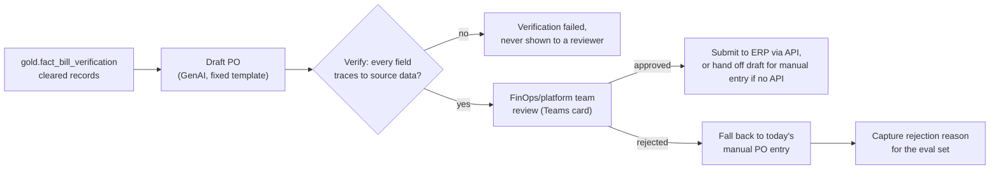

# Solution Architecture: PO Auto-Draft (GenAI-Assisted Purchase Order Generation)

Phase 5 extension of the platform sequenced in [FinOps Solution Overview.md](FinOps%20Solution%20Overview.md). It runs downstream of [Solution_Architecture_Bill_Verification.md](Solution_Architecture_Bill_Verification.md) (Phase 4) as a separate capability. Bill Verification's evidenced reconciliation is what makes drafting a PO from that data defensible; this document covers the drafting. It is built as a Cloud Workbench-adjacent tool on that phase's agentic stack, not on Governed Automation's Orchestrator, because drafting a document is a GenAI task and not a risk-tiered infrastructure action.

Requirements below are **inferred** from `FinOps Current State.md`'s description of today's PO process and from conversation. They are not confirmed the organization facts. Companion: [Platform_Build_Specification.md](Platform_Build_Specification.md) §11 (pydantic-graph nodes, function signatures, the `po_drafts` table, `po_draft_approval_service`).

---

## 1. Executive Summary

Today, "following bill verification and contract association, POs are entered into the relevant system" (`FinOps Current State.md`). That is manual re-keying, even after the reconciliation work is done. This document drafts the PO directly from Bill Verification's cleared invoice lines:

1. A GenAI step fills a structured PO draft.
2. A deterministic verifier confirms every field traces to a gold-layer record before a person sees the draft.
3. The FinOps/platform team approves or rejects every draft. There is no auto-post path at any confidence or dollar amount.

On approval, the PO is submitted to the organization's procurement/ERP system through its API (§2.4, ADR-4). If that system has no API, the verified draft is handed off for manual entry instead, and the drafting and verification still save the re-keying effort.

## 2. Business Context & Requirements

### 2.1 Problem statement (inferred)

Bill Verification (Phase 4) produces cleared, evidenced invoice lines (`gold.fact_bill_verification`, `status = 'auto_cleared'` or `'reviewed_cleared'`), but someone still enters the PO by hand from that data. This document removes that step without adding a second reconciliation: it drafts from lines Bill Verification has already verified and never re-checks the bill itself.

### 2.2 Functional requirements (inferred)

- FR1: Use Bill Verification's cleared records for a vendor and period as the only drafting input. Never draft from unverified or pending lines.
- FR2: Generate a structured PO draft (vendor, billing period, line items, total, cost-center/account allocation) from a fixed template. The model fills a defined schema; it doesn't compose a document.
- FR3: Verify the draft deterministically before any person sees it. Every field must trace to a specific `gold.fact_bill_verification`, `gold.dim_rate_card`, or `gold.dim_account` record. A field that doesn't trace fails verification.
- FR4: Require FinOps/platform team approval on **every** draft that passes verification, at any confidence or dollar level. This is intentionally stricter than Governed Automation's LOW tier and Bill Verification's auto-clear (§2.4).
- FR5: On approval, submit the PO to the organization's procurement/ERP system through its API, assuming one exists (§2.4, ADR-4), or hand off the verified draft for manual entry if not. On rejection, fall back to today's manual PO entry and record the reviewer's reason as feedback (§3.4).
- FR6: Store every draft, verification result, and decision for audit, with a queryable copy synced to gold for reporting.

### 2.3 Non-functional requirements (inferred)

| Requirement | Target (inferred) | Rationale |
|---|---|---|
| Explainability | Every verified field cites the source record it traces to | A reviewer approving a document that commits spend has to be able to check the model's work |
| Auditability | Draft, verification, and approval/rejection history retained per record | Same HITRUST/SOC2-equivalent posture as the rest of the platform |
| Alerting | Pending drafts and verification failures route through the platform's shared Teams and ITSM channels | Data Foundations §4.5; no capability-specific alerting path |

### 2.4 Non-goals (inferred)

- **Not Bill Verification.** This document consumes Bill Verification's cleared output and never reconciles an invoice line itself.
- **Not autonomous.** No draft is posted without FinOps/platform team approval, whatever the verifier's result or the dollar amount. A PO commits vendor payment, which is a bigger step than Governed Automation's LOW tier or Bill Verification's auto-clear of an internal record.
- **Not an ERP or procurement platform.** This document integrates with the organization's system through its API and doesn't replace or redesign it.

---

## 3. Architecture

### 3.1 Technology stack

Reuses Cloud Workbench's agentic stack (ADR-1).

| Component | Choice | Rationale |
|---|---|---|
| Orchestration | pydantic-graph (Cloud Workbench ADR-002) | Same typed node/edge orchestration as Cloud Workbench, running a fixed drafting sequence |
| Generation | Azure OpenAI initially (Cloud Workbench ADR-004) | Same provider interface as Cloud Workbench. `node_draft_po` is one of the tasks in Cloud Workbench's provider bake-off, scored on the share of drafts that pass `verify_po_draft()` without edits. It may end up on a different model than chat generation |
| Tool access | MCP, querying gold-layer tables | Same pattern as every other MCP tool in the platform |
| Draft/approval state | Postgres | A transactional read-modify-write workload, the same reasoning as Governed Automation's approval queue (ADR-003 there) |
| Approval notification | Teams (Adaptive Card) | Reuses the Governed Automation Contract document's approval-card pattern and its identity handling |
| Audit copy | Snowflake gold | Queryable alongside every other fact table, following the platform's operational-store-plus-gold-copy pattern |

### 3.2 Drafting

A fixed pydantic-graph sequence: gather a vendor's cleared `fact_bill_verification` records for the period, have the model fill the PO schema (vendor, period, line items, total, cost-center/account allocation) from that data, then pass the draft to verification. The template limits what the model can produce to that structure.

### 3.3 Verification

Every field on the draft must resolve to a specific source record: a `fact_bill_verification` line, a `dim_rate_card` term, or a `dim_account` cost center. This is a deterministic structural check, the same idea as Cloud Workbench's grounding check (`node_grounding_check`, Cloud Workbench §3.2) applied to a document. A field that doesn't resolve fails verification, and the draft never reaches a reviewer. It follows the same preference for explainable checks that MLOps Pipeline §2.3 sets for Core Intelligence's models.

### 3.4 Approval and rejection handling

Every verified draft goes to the **FinOps/platform team** as a Teams Adaptive Card, using the same mechanism as the Governed Automation Contract document (§3.2 there). It needs one approval, not the Contract document's two signatures, because one accountable team is reviewing its own drafted output. Approval submits the PO to the ERP system (§3.5). Rejection falls back to today's manual PO entry and records the reviewer's reason. Those reasons feed the drafting template's eval set, the same feedback pattern Cloud Workbench uses (Cloud Workbench §4.2).

### 3.5 Posting integration

**Assumed**: an ERP/procurement system with an API (ADR-4). Current State says only that POs are "entered into the relevant system," without naming the system or saying whether it has an API. If it doesn't, this step becomes a structured draft handed off for manual entry. Drafting and verification (§3.2–3.3) work the same either way.

---

## 4. AI Governance

The reasoning in Cloud Workbench §4.3 and MLOps Pipeline §3 applies here and isn't repeated: this system processes cost, usage, and vendor billing data, not personal data, and makes no consequential decision about a person. One point specific to this capability: every output is a draft that a person must approve before it has any effect (FR4). There is no automated decision path at all, which is stricter oversight than Governed Automation's LOW tier or Bill Verification's auto-clear, both of which act without a person for the lowest-risk cases.

---

## 5. Architecture Decision Records

**ADR-1: Reuse Cloud Workbench's agentic stack, not Governed Automation's Orchestrator**
- *Context*: This capability drafts a document with GenAI. It doesn't execute a risk-tiered action against live infrastructure.
- *Decision*: Build on pydantic-graph, MCP, and Cloud Workbench's provider interface (Azure OpenAI initially, Cloud Workbench ADR-004), not on Temporal and OPA.
- *Alternatives considered*: Routing PO drafting through `propose_action` and the Orchestrator, rejected. That path is built for infrastructure actions with a LOW/MEDIUM/HIGH tier, and a draft that always needs approval (ADR-3) would need an artificial tier.
- *Consequences*: No new orchestration technology. PO drafting is one more capability on the Cloud Workbench stack.

**ADR-2: A deterministic verifier, not a second LLM judging the first**
- *Context*: A GenAI draft needs a check before a person reviews it, consistent with the platform's preference for explainable checks (MLOps Pipeline §2.3, Cloud Workbench's grounding check).
- *Decision*: Verify structurally: every field must resolve to a specific source record.
- *Alternatives considered*: An LLM-as-judge step, rejected. It swaps one model's possible error for another's and gives the reviewer no traceable evidence.
- *Consequences*: The verifier catches only what it checks, which is field-level grounding. It can't catch a structurally valid draft built from the wrong vendor's data. FR4's mandatory review covers that.

**ADR-3: No auto-post path at any confidence or dollar amount**
- *Context*: Bill Verification's auto-clear changes an internal record, and Governed Automation's LOW tier makes bounded, reversible infrastructure changes. A posted PO moves toward paying a vendor.
- *Decision*: Every draft requires FinOps/platform team approval.
- *Alternatives considered*: A confidence-and-impact rule like Bill Verification's (ADR-2 there), rejected for now. A PO is a financial commitment, not an internal record. Revisit once this capability has a track record.
- *Consequences*: Every draft still needs a review. The saving is the re-keying, not the review.

**ADR-4: Design against a generic ERP/procurement API, with a manual-entry fallback**
- *Context*: Nothing in this document set names the system POs are entered into, or says whether it has an API.
- *Decision*: Design the posting step (§3.5) against a generic ERP/procurement API. If the real system has none, the step becomes a manual-entry hand-off. Drafting and verification (§3.2–3.3) don't depend on it.
- *Alternatives considered*: Naming a product (SAP, Oracle, Coupa) by guess, rejected, since nothing points to one. Leaving posting undesigned, rejected, since a stated fallback is more useful than a gap.
- *Consequences*: Only the §3.5 integration call changes once the real system is known.

---

## 6. Glossary

**PO Auto-Draft**: This document's capability. It drafts a purchase order from Bill Verification's cleared invoice lines with GenAI, verifies it deterministically, and always requires approval. It never posts automatically.

**Verification (this document)**: A deterministic check that every field on a drafted PO traces to a specific gold-layer record. Different from Bill Verification's confidence-scored reconciliation, which this document consumes.
