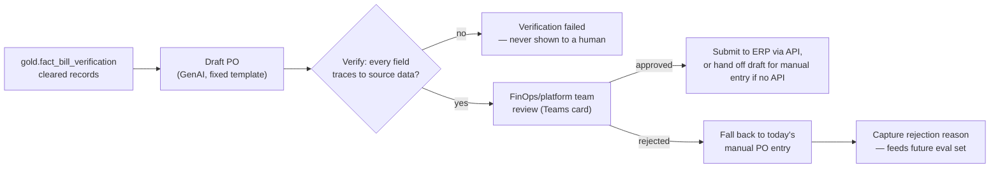

# Solution Architecture: PO Auto-Draft — GenAI-Assisted Purchase Order Generation

Phase 5 extension of the platform sequenced in [FinOps Solution Overview.md](FinOps%20Solution%20Overview.md), downstream of [Solution_Architecture_Bill_Verification.md](Solution_Architecture_Bill_Verification.md) (Phase 4) — a distinct capability, not part of it. Bill Verification's confidence-scored, evidence-attached reconciliation is what makes drafting a PO from that data defensible; this document is the drafting itself. Most naturally built as a Cloud Workbench-adjacent tool, reusing that phase's agentic stack rather than Governed Automation's deterministic Orchestrator, since this is a GenAI drafting task, not a risk-tiered infrastructure action.

Requirements and specifics below are **inferred** from `FinOps Current State.md`'s description of today's PO process and conversation with the document's author, not confirmed the organization fact. Companion: [Platform_Build_Specification.md](Platform_Build_Specification.md) §11 (pydantic-graph nodes, function signatures, `po_drafts` operational table, `po_draft_approval_service`).

---

## 1. Executive Summary

Today, "following bill verification and contract association, POs are entered into the relevant system" (`FinOps Current State.md`) — a manual re-keying step even after Bill Verification has already done the hard reconciliation work. This document drafts that PO directly from Bill Verification's already-cleared line items: a GenAI step produces a structured draft, a deterministic verifier checks every field traces back to a real gold-layer record before a human ever sees it, and the FinOps/platform team approves or rejects every single draft — there is no auto-post path, regardless of confidence or dollar amount. On approval, the PO is submitted to the organization's procurement/ERP system via API (§2.4, ADR-4); if that system doesn't expose one, this last step becomes a structured draft handed off for manual entry instead — the drafting and verification value holds either way.

## 2. Business Context & Requirements

### 2.1 Problem statement (inferred)

Bill Verification (Phase 4) produces cleared, evidenced line items (`gold.fact_bill_verification`, `status = 'auto_cleared'` or `'reviewed_cleared'`), but today's process still requires someone to manually enter a PO from that reconciled data. This document closes that gap without adding a second reconciliation step — it drafts from data Bill Verification has already verified, never re-verifies the underlying bill itself.

### 2.2 Functional requirements (inferred)

- FR1: Consume Bill Verification's cleared records for a vendor/period as the drafting input — never draft from unverified or pending-review line items.
- FR2: Generate a structured PO draft (vendor, billing period, line items, total, cost-center/account allocation) via a fixed drafting template, not free-form generation — the model fills a defined schema, it doesn't compose a document from scratch.
- FR3: Verify the draft deterministically before any human sees it — every field must trace back to a specific `gold.fact_bill_verification`/`gold.dim_rate_card`/`gold.dim_account` record. A field that doesn't trace to source data fails verification, it isn't silently passed through on model confidence.
- FR4: Require FinOps/platform team approval on **every** draft that passes verification — no auto-post path exists at any confidence or dollar level. This is a deliberate difference from Governed Automation's LOW-tier autonomy and Bill Verification's auto-clear path (§2.4).
- FR5: On approval, submit the PO to the organization's procurement/ERP system via API, assuming one exists (§2.4/ADR-4); if it doesn't, hand off the verified draft for manual entry instead. On rejection, fall back to today's existing manual PO-entry process and capture the reviewer's stated reason as feedback (§3.4).
- FR6: Every draft, verification result, and approval/rejection decision is stored and auditable, with a queryable copy synced to gold for reporting — same discipline as every other phase's audit trail.

### 2.3 Non-functional requirements (inferred)

| Requirement | Target (inferred) | Rationale |
|---|---|---|
| Explainability | Every verified field cites the specific source record it traces to, not just a pass/fail | A reviewer approving a document that commits real spend has to be able to check the model's work, not trust it |
| Auditability | Draft, verification, and approval/rejection history retained per record | Same HITRUST/SOC2-equivalent posture as the rest of the platform |
| Alerting | Pending drafts and verification failures route through the platform's shared Teams + ITSM channels | Data Foundations §4.5 — no capability-specific alerting path |

### 2.4 Non-goals (inferred)

- **Not Bill Verification.** This document consumes Bill Verification's cleared output; it never re-reconciles a line item against contracted rates itself.
- **Not autonomous.** No draft is ever posted without FinOps/platform team approval, regardless of verifier confidence or dollar amount — deliberately more conservative than Governed Automation's LOW tier or Bill Verification's auto-clear, because this action commits actual vendor payment, not just an internal reconciliation record.
- **Not a general ERP/procurement platform.** This document integrates with one via API; it doesn't replace or redesign the organization's procurement system.

---

## 3. Architecture

### 3.1 Technology stack

Reuses Cloud Workbench's agentic stack directly (ADR-1) rather than standing up a second one.

| Component | Choice | Rationale |
|---|---|---|
| Orchestration | pydantic-graph (Cloud Workbench ADR-002) | Same explicit, typed node/edge orchestration already used for Cloud Workbench — a fixed drafting sequence, not a looser autonomous agent |
| Generation | Azure OpenAI (Cloud Workbench ADR-004) | Same provider/tenant boundary as Cloud Workbench, no second LLM integration to operate |
| Tool access | MCP, querying gold-layer tables directly | Same pattern as every other MCP tool in this platform — no new integration protocol |
| Draft/approval state | Postgres | Same OLTP reasoning as Governed Automation's approval queue and the Contract entity (ADR-003 there) — a transactional read-modify-write workload, not analytical |
| Approval notification | Teams (Adaptive Card) | Reuses the Governed Automation Contract document's approval-card pattern, same identity/authentication benefit |
| Audit copy | Snowflake gold | Queryable alongside every other fact table, same "operational store + resynced gold copy" pattern used throughout this platform |

### 3.2 Drafting

A fixed pydantic-graph sequence, not open-ended generation: gather the period's cleared `fact_bill_verification` records for a vendor → the model fills a defined PO schema (vendor, period, line items, total, cost-center/account allocation) from that data → hand off to verification. The template constrains what the model can produce structurally; it doesn't compose free text.

### 3.3 Verification

Mirrors Cloud Workbench's own grounding/faithfulness check (`node_grounding_check`, Cloud Workbench §3.2) applied to a different artifact: every field on the draft must resolve to a specific source record (a `fact_bill_verification` line item, a `dim_rate_card` rate, a `dim_account` cost center) — not a second LLM pass judging the first one's output, a deterministic structural check. A field that doesn't resolve fails verification and the draft never reaches a human; this is the same "explainability over black-box" discipline MLOps Pipeline §2.3 already established for Core Intelligence's models, applied here to a generative rather than a predictive step.

### 3.4 Approval and rejection handling

Every verified draft goes to the **FinOps/platform team** via a Teams Adaptive Card (same mechanism as the Governed Automation Contract document, §3.2 there) — a single approval, not the Contract document's dual-signature pattern, since this is one accountable team reviewing its own drafted output, not two independent parties consenting to grant automation authority. Approval submits the PO to the ERP system (§3.5); rejection falls back to today's existing manual PO-entry process, with the reviewer's stated reason captured — feeding a future eval set for the drafting template, the same "user feedback capture feeding back into the eval set" pattern Cloud Workbench already uses (Cloud Workbench §4.2).

### 3.5 Posting integration

**Assumed**: a generic ERP/procurement system with an API (ADR-4). Current State only says POs are "entered into the relevant system," naming neither the system nor whether it exposes an API. If the actual system doesn't expose one, this step simply changes — a structured draft handed off for manual entry rather than a direct API submission — rather than eliminating the capability; the drafting and verification value (§3.2–3.3) is unaffected either way.

---

## 4. AI Governance

Same reasoning as Cloud Workbench §4.3 and MLOps Pipeline §3 applies in full and isn't restated here: this system processes cost, usage, and vendor billing data, not personal data, and drives no consequential decision about a person. The one point worth naming explicitly given this document's own subject matter: every output is a draft a human must approve before it has any real-world effect (FR4) — there is no automated-decision path here at all, which is a stronger human-oversight posture than either Governed Automation's LOW tier or Bill Verification's auto-clear, both of which do act without a human in the loop for the lowest-risk cases.

---

## 5. Architecture Decision Records

**ADR-1: Reuse Cloud Workbench's agentic stack rather than Governed Automation's Orchestrator**
- *Context*: This capability drafts a document via GenAI; it doesn't execute a risk-tiered action against live infrastructure.
- *Decision*: Build on pydantic-graph/MCP/Azure OpenAI (Cloud Workbench's stack), not Temporal/OPA (Governed Automation's).
- *Alternatives considered*: Routing PO drafting through Governed Automation's `propose_action`/Orchestrator, rejected — that path is built for infrastructure actions with a LOW/MEDIUM/HIGH risk tier; a document draft that always requires human approval (ADR-3) doesn't fit that shape and would force an artificial risk-tier assignment onto something that isn't a tiered action at all.
- *Consequences*: No new orchestration technology introduced; this is one more Cloud-Workbench-adjacent capability, not a second automation paradigm.

**ADR-2: A deterministic verifier, not a second LLM-judge pass**
- *Context*: A GenAI-drafted document needs some check before a human reviews it, given the platform's consistent preference for explainable, non-black-box checks (MLOps Pipeline §2.3, Cloud Workbench's grounding check).
- *Decision*: Verify structurally — every field must resolve to a specific source record — rather than asking a second model call to judge the first's output.
- *Alternatives considered*: An LLM-as-judge verification step, rejected — trades one model's potential error for a second model's potential error, without the explainability a structural check gives a human reviewer for free.
- *Consequences*: The verifier can only catch what it's specified to check (field-level grounding); it can't catch a structurally-valid but contextually-wrong draft (e.g., an entirely correct PO drafted against the wrong vendor's data). FR4's mandatory human review is the backstop for that, not this step.

**ADR-3: No auto-post path, at any confidence or dollar amount**
- *Context*: Unlike Bill Verification's reconciliation (an internal record) or Governed Automation's LOW-tier actions (bounded, reversible infrastructure changes), a posted PO is a step toward actual vendor payment.
- *Decision*: Every draft requires FinOps/platform team approval, full stop — no hard-rule routing to auto-post the way Bill Verification auto-clears high-confidence/low-impact items.
- *Alternatives considered*: A confidence-and-impact hard rule mirroring Bill Verification's (ADR-2 there), rejected for now — the two capabilities differ in kind, not just degree: Bill Verification's auto-clear affects an internal reconciliation record, this affects a real financial commitment. Revisit only after this capability has a real track record.
- *Consequences*: Every drafted PO adds a review step to the FinOps/platform team's workload, deliberately, rather than reducing it to zero for the lowest-risk cases — the point of this capability is eliminating re-keying, not eliminating review.

**ADR-4: Assume a generic API-exposing ERP/procurement system, with an explicit manual-entry fallback if it doesn't expose one**
- *Context*: No system is named anywhere in this document set for where POs are actually entered, or whether it has an API.
- *Decision*: Design §3.5's posting step against a generic API-exposing ERP/procurement system. If the real system turns out not to support API interaction, the posting step changes to a manual-entry hand-off (§3.5) rather than the capability being eliminated — drafting and verification (§3.2–3.3) don't depend on how the last step is fulfilled.
- *Alternatives considered*: Naming a specific real product (SAP, Oracle, Coupa) by guess, rejected — no evidence points to any specific one, and guessing wrong is worse than staying generic. Leaving posting entirely undesigned, rejected — the drafting and verification value stands on its own regardless of the posting mechanism, so it's worth designing with a stated fallback rather than leaving a gap.
- *Consequences*: §3.5's specific integration call is the one piece that changes once the real system is known; the rest of this document's design is unaffected either way.

---

## 6. Glossary

**PO Auto-Draft** — This document's capability: drafting a purchase order from Bill Verification's cleared line items via GenAI, verified deterministically, always human-approved, never auto-posted.

**Verification (this document)** — A deterministic, structural check that every field on a drafted PO traces to a specific gold-layer record — distinct from Bill Verification's confidence-scored reconciliation, which this document consumes rather than repeats.
