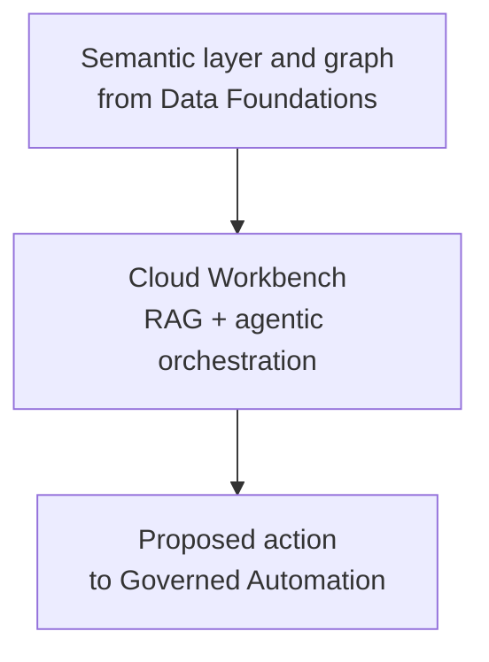
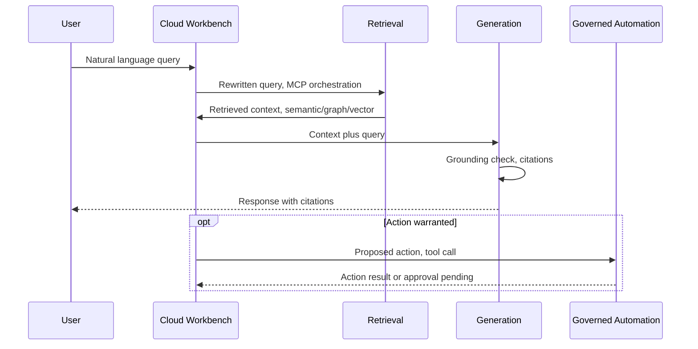

# Solution Architecture: Self-Serve Foundations — Cloud Workbench

Phase 2 of the platform sequenced in `FinOps Solution Overview.md`, alongside Core Intelligence (`Solution_Architecture_MLOps_Pipeline.md`). Split out from what was originally a single combined "Internal Assistant" solution architecture document — see `Solution_Architecture_Data_Foundations.md` for why it was split.

**A naming note.** The job description this work is grounded in references the organization's actual, existing **Internal Assistant** tool and asks for GenAI capability to be integrated into it. This document deliberately uses a different name, **Cloud Workbench**, for the self-serve product designed here — not because the two are unrelated, but because this document has no real visibility into the existing tool's actual implementation, and naming a hypothetical design "Internal Assistant" would risk reading as a claim to know how the real one works. Read Cloud Workbench as a credible design for what that integration could look like, not a description of the real thing. Elsewhere in this document set (the Opportunities document's push/pull self-serve channels), "Internal Assistant" still refers to the real, existing tool — the two names are deliberately kept distinct.

Requirements, org details, and specific tool choices below are **inferred** from JD language and reasonable enterprise-FinOps practice, not confirmed the organization fact. Companion: `Platform_Build_Specification.md` §5, §7.

---

## 1. Executive Summary

**Cloud Workbench** is a natural-language, agentic interface over the Data Foundations layer's conformed cost, usage, and APM data. It lets engineers and FinOps stakeholders ask questions in plain English ("what's our EC2 spend this month for the retail vertical") and, where appropriate, propose governed actions (resize, flag, recommend) that route through Governed Automation. Every capability is also exposed as a versioned REST API, not only through the chat interface.

This is fundamentally a **horizontal-platform-serving-verticals** problem: Cloud Platform Services builds and operates the system; the organization's business verticals are its consumers, treated with the same reliability expectations as an external API's customers would demand.

## 2. Business Context & Requirements

### 2.1 Problem statement (inferred)

Business verticals need self-service, natural-language access to accurate, current cost insight — and, eventually, governed automated remediation — without needing to learn each cloud's native tooling or file a ticket with the platform team for every question.

### 2.2 Functional requirements (inferred)

- FR1: Natural-language query over current and historical multi-cloud cost/usage data, scoped correctly per requesting vertical/account.
- FR2: Query answers must cite their source data and be explainable on demand.
- FR3: Support both simple lookups (single metric) and multi-hop questions (cost trend correlated with a specific deployment event).
- FR4: Support agent-initiated action proposals (e.g., flagging a rightsizing opportunity, opening a ticket), routed through Governed Automation's risk-tiered approval — this document raises the proposal, it does not decide whether it executes.
- FR5: Self-service integration for other internal teams to consume platform capabilities via API, not just the chat interface.
- FR6: Surface Core Intelligence's anomaly/rightsizing findings proactively, not only on-demand.

### 2.3 Non-functional requirements (inferred)

| Requirement | Target (inferred, reasonable for this domain) | Rationale |
|---|---|---|
| Availability | 99.9% for the query path | Internal verticals are treated as real customers |
| Query latency | p95 under ~4s for a simple query | Conversational UX expectation |
| Data segregation | Hard isolation between verticals' data at query time | Multi-tenant horizontal platform, compliance-sensitive |
| Auditability | Full reconstructable request lifecycle, retained per policy | HITRUST/SOC2-equivalent governance posture |
| Cost of the platform itself | Token/infra cost tracked per request | A FinOps team building a FinOps tool must practice what it preaches |

### 2.4 Non-goals (inferred)

- Not a general-purpose enterprise chatbot; scope is cloud cost/usage/ops data.
- Not replacing human approval for high-blast-radius infrastructure changes — that authority lives in Governed Automation, not here.
- Not attempting real-time (sub-minute) billing reconciliation; inherited from Data Foundations' provider-billing-lag ceiling.

---

## 3. Architecture Overview

---

## 4. Layer-by-Layer Design

### 4.1 AI consumption layer (Cloud Workbench: RAG + agentic orchestration)

- **Retrieval**: hybrid — combined dense (vector/embedding) and sparse (keyword/BM25) search over the semantic layer's definitions and documentation, merged by the cross-encoder rerank step below; graph traversal over the knowledge graph for relational questions; and direct structured query (via MCP tool calls) against the gold lakehouse tables for precise numeric aggregation. The dense+sparse combination specifically covers what pure embeddings tend to miss — exact resource/APM IDs, ticket numbers, and rare or organization-specific terminology that embeds ambiguously. Deliberately not "one retrieval method" for any of these — cost-querying data is numerical, relational, and prose-adjacent all at once (see ADR-001).
- **Orchestration**: **LangGraph**-style explicit state machine, not a looser framework, chosen for the debuggability and audit-trail requirements this domain demands (see ADR-002). **MCP** exposes the Data Foundations query tools, the graph traversal tool, and the Governed Automation action-proposal tools to the agent in a standardized, discoverable way.
- **Generation & guardrails**: grounding/faithfulness check before any answer reaches a user, citations back to the specific gold-table rows or graph nodes that support each claim, confidence-threshold abstention when retrieval is weak.

### 4.2 API/service layer

Every capability above (query, retrieve, propose) is also exposed as a versioned, documented REST API (FastAPI-style), not only through the chat interface, satisfying FR5. This is what lets other internal teams consume platform capabilities programmatically.

### 4.3 Observability, evaluation, and governance (specific to this phase)

- **Observability**: per-stage distributed tracing (retrieval, generation, action-proposal), token/cost tracking, retrieval quality metrics, user feedback capture feeding back into the eval set.
- **Evaluation**: a curated eval set specific to this domain (real cost-querying scenarios, not generic benchmarks), faithfulness/relevance/correctness scoring, required to pass before any prompt, retrieval config, or model change ships.
- **Governance**: full audit logging of every query and proposed action (what was asked, retrieved, sent to the model, returned, and any action proposed), RBAC enforced at the graph/query layer matching vertical/account boundaries — builds on Data Foundations' shared infrastructure and lineage baseline rather than duplicating it.

---

## 5. Architecture Decision Records

**ADR-001: Use hybrid retrieval (dense vector, sparse keyword, graph, structured query) rather than a single retrieval method**
- *Context*: Cost-querying data is simultaneously numerical/precise (aggregation), relational (resource-to-account-to-vertical hierarchies), and prose-adjacent (documentation, definitions) — and within that prose-adjacent surface, pure embedding search alone tends to miss exact-match needs: specific resource/APM IDs, ticket numbers, or organization-specific terminology that's rare or ambiguous in embedding space.
- *Decision*: Route queries to the appropriate retrieval method — structured query for precise aggregation, graph traversal for relational questions, and a combined dense (vector) + sparse (keyword/BM25) search, fused via the existing cross-encoder rerank step (Build Specification §5's `node_rerank`), for definitional/documentation questions — combined as needed for multi-hop questions.
- *Alternatives considered*: Vector-only retrieval for the documentation leg, rejected — a purely dense approach reliably underperforms on exact-match/rare-term queries this domain will see often, and the existing rerank node is already positioned to merge more than one candidate set with no new orchestration node required. A separate keyword-only search tool exposed to the agent, rejected as unnecessary complexity — hybrid search is implemented inside `search_semantic_docs` (Build Specification §5) rather than adding a tool the agent has to learn to choose between.
- *Consequences*: Slightly more retrieval-side implementation complexity (two indexes — dense and sparse — feeding one reranker) but no new orchestration nodes or agent-facing complexity, and materially better recall on exact-match queries, especially once free-text sources like ITSM ticket history (a plausible Cloud Workbench Expansion reference data source per `FinOps Opportunities.md`) get indexed.

**ADR-002: Use LangGraph-style explicit orchestration rather than a higher-level agent framework (e.g., CrewAI)**
- *Context*: This domain requires debuggable, auditable agent behavior, especially where action proposals reach Governed Automation.
- *Decision*: Model the agent's workflow as an explicit graph (state, nodes, edges) rather than a more autonomous, less traceable framework.
- *Alternatives considered*: CrewAI-style role-based orchestration, rejected for this specific system — faster to prototype but harder to audit and debug in production, better suited to less regulated use cases.
- *Consequences*: More upfront design work per workflow, but every decision path is traceable for audit and troubleshooting.

**ADR-003: Cache at the resolved-query-parameter level, not the raw question text**
- *Context*: The platform is horizontal, serving multiple verticals with structurally similar but data-scoped-differently questions.
- *Decision*: Cache keys include resolved parameters (vertical, account, time range), never the raw natural-language question alone.
- *Alternatives considered*: Cache on raw query text for simplicity, rejected — risks a cache hit serving one vertical's data to another.
- *Consequences*: Slightly more complex caching logic, eliminates a real cross-tenant data leakage risk.

---

## 6. Glossary

**GraphRAG** — Retrieval-augmented generation that queries a knowledge graph instead of, or alongside, vector similarity search.

**MCP** — The tool-calling protocol exposing Data Foundations' query tools and Governed Automation's action-proposal tools to the Cloud Workbench agent in a standardized, discoverable way.
