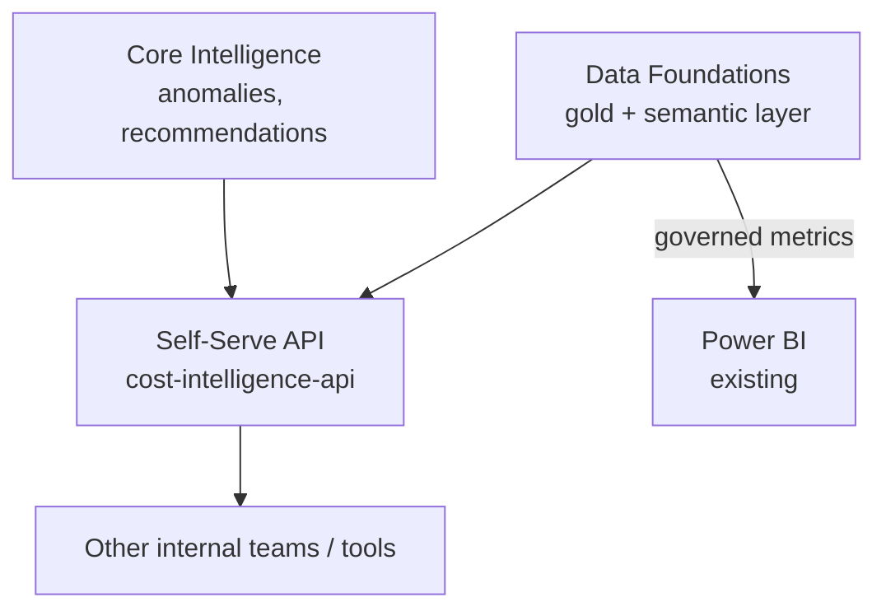

# Solution Architecture: Self-Serve Foundations

Phase 2 of the platform sequenced in `FinOps Solution Overview.md`, alongside Core Intelligence (`Solution_Architecture_MLOps_Pipeline.md`). This document covers non-agentic self-serve: a governed REST API that lets other internal teams and tools use Core Intelligence's findings and Data Foundations' cost data, plus a pointer to BI dashboard access. The agentic, natural-language interface, **Cloud Workbench**, comes later as Phase 5. See `Solution_Architecture_Cloud_Workbench.md` and ADR-M1 in `FinOps Solution Overview.md` for the reasoning.

Requirements, org details, and tool choices below are **inferred** from the job description and common enterprise FinOps practice. They are not confirmed the organization facts. Companion: `Platform_Build_Specification.md` §7.

---

## 1. Executive Summary

Self-Serve Foundations gives internal teams and existing BI tools governed access to Core Intelligence's findings and Data Foundations' conformed cost data, through a versioned REST API and Power BI dashboards. There is no chat interface in this phase. It is the platform's first outward-facing capability and is kept simple and deterministic, so the data foundation and ML pipeline are proven through an API and dashboards before Cloud Workbench (Phase 5) adds a conversational layer over the same data.

## 2. Business Context & Requirements

### 2.1 Problem statement (inferred)

Other internal teams and tools need Core Intelligence's findings (anomalies, recommendations) and Data Foundations' cost data without asking the platform team by hand, and without waiting for a conversational interface. A governed API covers that need in Phase 2. The FinOps team keeps delivering reports and recommendations to business verticals through the tools it already uses (Power BI, direct data access). This document doesn't change who does that work; it gives programmatic consumers a faster path to the same data. Verticals get self-serve in this phase through Power BI dashboards (FR3), not through the API.

### 2.2 Functional requirements (inferred)

- FR1: Publish a versioned, documented REST API for cost lookups, anomaly listings, and open recommendations, for use by other internal teams and tools.
- FR2: Support accepting or rejecting a recommendation through the API. Accepting routes through Governed Automation's risk and approval logic like any other proposed action; there is no separate, lighter approval path.
- FR3: Provide BI dashboard access for both personas, the FinOps team and business verticals. Power BI connects to Snowflake Semantic Views for governed metrics, and each vertical sees only its own data through the row access policy (Data Foundations §4.3). This document points to that design instead of repeating it.

### 2.3 Non-functional requirements (inferred)

| Requirement | Target (inferred) | Rationale |
|---|---|---|
| Availability | 99.9% for the API path | Other internal teams depend on it programmatically |
| API latency | p95 under ~500ms for a simple lookup | A request/response API with a latency budget |
| Data segregation | Hard isolation between verticals' data at query time | Same multi-tenant requirement as every other consumer-facing surface |
| Auditability | Full reconstructable request lifecycle, retained per policy | HITRUST/SOC2-equivalent governance posture |
| Fair use | Request rate limits per persona and per API key (`policy_request_rate`, Build Specification §7) | One client shouldn't be able to exhaust a shared service, or a vertical's generation budget, in a minute (Cloud Workbench ADR-010) |

### 2.4 Non-goals (inferred)

- Not a conversational or agentic interface. That is Cloud Workbench, Phase 5 (`Solution_Architecture_Cloud_Workbench.md`).
- Not a new BI or reporting product. Dashboards are Power BI, connected as described in Data Foundations §4.3.
- The REST API is not vertical-facing. FR1's consumers are internal teams and tools. **Power BI dashboards are vertical-facing**: verticals already receive reports from the FinOps team, and the repointed reports plus the per-vertical variance report (Solution Overview, migration step 4) give each vertical its own data under the same row access policy as every other consumer (Data Foundations §4.3). The conversational surface for verticals is Cloud Workbench, Phase 5.

---

## 3. Architecture Overview

---

## 4. Layer-by-Layer Design

### 4.1 API/service layer

`cost-intelligence-api` (Build Specification §7) is a versioned, documented REST API (FastAPI-style) for cost lookups, anomaly listings, and recommendation accept/reject. Accept/reject goes through Governed Automation's `propose_action` entry point (Governed Automation §3.2), the same as every other proposal source. This makes the API the first non-agentic consumer of Governed Automation, in place before Cloud Workbench (Phase 5) adds a conversational one.

### 4.2 Dashboards

Power BI connects to Snowflake Semantic Views for governed metrics. It queries gold-schema tables directly only for ad hoc questions not yet modeled as a metric (Data Foundations §4.3, ADR-002, ADR-003). The full design lives in Data Foundations.

---

## 5. Notes

No architecture decisions specific to this phase are recorded here. The REST API is a versioned wrapper over data and logic governed elsewhere (Data Foundations' semantic layer, Governed Automation's `propose_action`), and the dashboard path is Data Foundations' design. The decisions are recorded in those documents.

## 6. Glossary

Terms used here, such as Semantic Views, gold layer, governed metrics, and `propose_action`, are defined in the Data Foundations and Governed Automation glossaries and are not repeated.

**`cost-intelligence-api`**: This phase's REST API (Build Specification §7), which later also serves the MCP tools and the Cloud Workbench agent.
