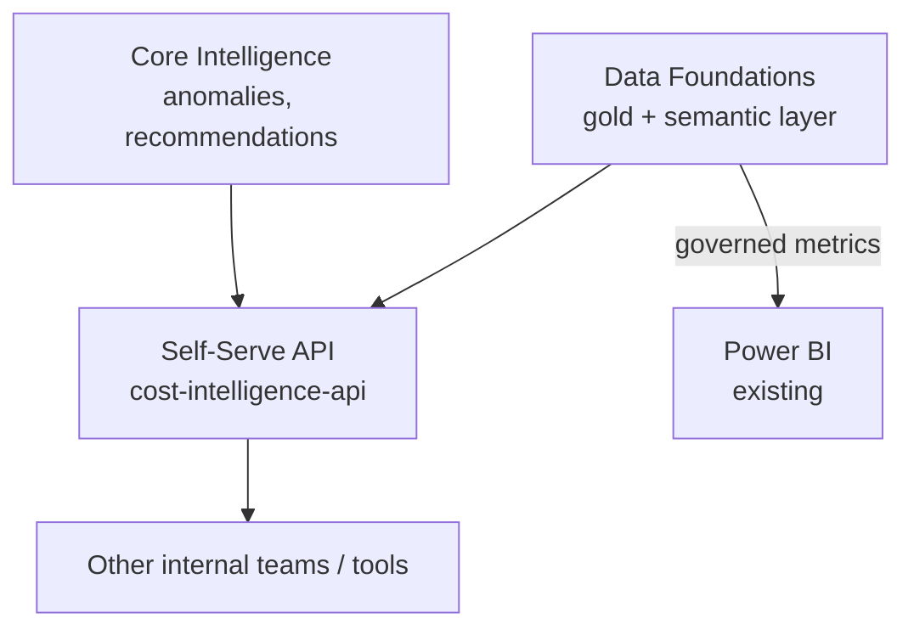

# Solution Architecture: Self-Serve Foundations

Phase 2 of the platform sequenced in `FinOps Solution Overview.md`, alongside Core Intelligence (`Solution_Architecture_MLOps_Pipeline.md`). This document covers non-agentic self-serve only: a governed REST API for other internal teams and tools to consume Core Intelligence's findings and Data Foundations' cost data programmatically, plus a pointer to native BI dashboard access. The agentic, natural-language interface — **Cloud Workbench** — is a separate, later capability, deliberately sequenced as Phase 5 rather than part of this phase; see `Solution_Architecture_Cloud_Workbench.md` and `FinOps Solution Overview.md`'s ADR-M1 for why.

Requirements, org details, and specific tool choices below are **inferred** from JD language and reasonable enterprise-FinOps practice, not confirmed the organization fact. Companion: `Platform_Build_Specification.md` §7.

---

## 1. Executive Summary

Self-Serve Foundations gives other internal teams and existing BI tooling governed, programmatic access to Core Intelligence's findings and Data Foundations' conformed cost data — a versioned REST API and native BI dashboards, not a chat interface. This is the platform's first outward-facing capability, deliberately simple and deterministic: it proves the data foundation and ML pipeline are trustworthy through an API and a dashboard before Cloud Workbench (Phase 5) adds a conversational, agentic layer on top of the same underlying data.

## 2. Business Context & Requirements

### 2.1 Problem statement (inferred)

Other internal teams and tools need to consume Core Intelligence's findings (anomalies, recommendations) and Data Foundations' cost data without going through the platform team by hand, and without waiting for a more complex conversational interface to be built. A governed API, published once, covers this need at Phase 2. The FinOps team's own reporting and recommendation delivery to business verticals continues via the tools and reports it already uses (Power BI, direct data access) in the meantime — this document doesn't change who does that job, only gives programmatic consumers (not verticals) a faster path to the same underlying data.

### 2.2 Functional requirements (inferred)

- FR1: Publish a versioned, documented REST API exposing cost lookups, anomaly listings, and open recommendations, for consumption by other internal teams and tools.
- FR2: Support accepting or rejecting a recommendation via the API, routed through Governed Automation's risk/approval logic exactly like any other proposed action — not a separate, lighter-weight approval path.
- FR3: Native BI dashboard access — Power BI connects to Snowflake Semantic Views for governed metrics (Data Foundations §4.3); this document doesn't re-specify that path, only points to it.

### 2.3 Non-functional requirements (inferred)

| Requirement | Target (inferred) | Rationale |
|---|---|---|
| Availability | 99.9% for the API path | Other internal teams depend on it programmatically |
| API latency | p95 under ~500ms for a simple lookup | A REST API with a request/response budget, not a conversational UX |
| Data segregation | Hard isolation between verticals' data at query time | Same multi-tenant requirement as every other consumer-facing surface |
| Auditability | Full reconstructable request lifecycle, retained per policy | HITRUST/SOC2-equivalent governance posture |

### 2.4 Non-goals (inferred)

- Not a conversational or agentic interface — that's Cloud Workbench, Phase 5 (`Solution_Architecture_Cloud_Workbench.md`), not this document.
- Not a new BI/reporting product — dashboards are Power BI, connected per Data Foundations §4.3; this document doesn't add a second reporting surface.
- Not vertical-facing. FR1's consumers are other internal teams and tools, not business verticals directly — the vertical-facing self-serve surface is Cloud Workbench, deferred to Phase 5.

---

## 3. Architecture Overview

---

## 4. Layer-by-Layer Design

### 4.1 API/service layer

`cost-intelligence-api` (Build Specification §7): a versioned, documented REST API (FastAPI-style) exposing cost lookups, anomaly listings, and recommendation accept/reject — the last of these routing through Governed Automation's `propose_action` entry point (Governed Automation §3.2) exactly like any other proposed action, not a separate approval path. This is the platform's first non-agentic consumer of Governed Automation, live before Cloud Workbench (Phase 5) adds a conversational one alongside it.

### 4.2 Dashboards

Power BI connects natively to Snowflake Semantic Views for governed metrics, falling back to gold-schema tables directly only for ad hoc queries not yet modeled as a metric (Data Foundations §4.3, ADR-002, ADR-003) — fully specified there; this document only points to it rather than repeating the design.

---

## 5. Notes

No architecture decisions specific to this phase are recorded here — the REST API is a straightforward, versioned wrapper over data and logic already governed elsewhere (Data Foundations' semantic layer, Governed Automation's `propose_action`), and the dashboard path is entirely Data Foundations' design. The decisions worth recording live in those documents, not duplicated here.
